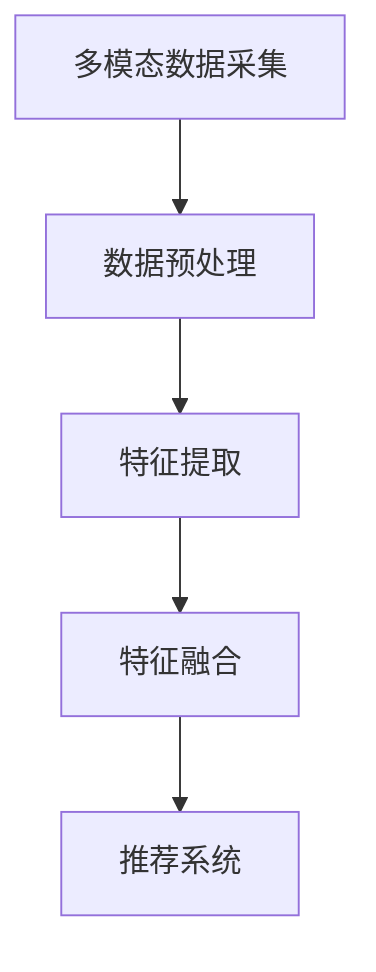

                 

# 《搜索推荐系统的多模态融合技术》

> **关键词**：搜索推荐系统、多模态融合、特征提取、推荐算法、深度学习、实践案例

> **摘要**：本文深入探讨了搜索推荐系统中多模态融合技术的原理和应用。通过详细分析多模态数据的采集与预处理、特征提取方法和融合算法，本文展示了多模态融合技术如何提升搜索推荐系统的性能和用户体验。此外，通过两个实际项目的实践，本文为读者提供了详细的代码解析和实现步骤，以帮助理解和应用多模态融合技术。

## 《搜索推荐系统的多模态融合技术》目录大纲

### 第一部分：多模态融合技术基础

#### 第1章：搜索推荐系统概述
- 1.1 搜索推荐系统的定义与分类
- 1.2 搜索推荐系统的发展历程
- 1.3 多模态融合技术的概念与重要性

#### 第2章：多模态数据采集与预处理
- 2.1 多模态数据源介绍
  - 文本数据源
  - 图像数据源
  - 声音数据源
- 2.2 多模态数据采集方法
- 2.3 多模态数据预处理技术
  - 数据清洗
  - 数据转换
  - 数据标准化

### 第二部分：多模态特征提取

#### 第3章：文本特征提取技术
- 3.1 词袋模型与TF-IDF
- 3.2 词嵌入技术
- 3.3 序列模型与注意力机制

#### 第4章：图像特征提取技术
- 4.1 卷积神经网络（CNN）
- 4.2 图像特征融合方法
- 4.3 目标检测与识别

#### 第5章：声音特征提取技术
- 5.1 声音信号预处理
- 5.2 音频特征提取方法
- 5.3 声音情感识别

### 第三部分：多模态融合算法

#### 第6章：多模态特征融合方法
- 6.1 线性融合方法
- 6.2 非线性融合方法
- 6.3 深度学习融合模型

#### 第7章：多模态推荐系统设计
- 7.1 多模态推荐系统的架构设计
- 7.2 多模态融合在推荐系统中的应用
- 7.3 多模态推荐系统的评估指标

#### 第8章：多模态融合技术实践

##### 8.1 项目实战1：基于多模态数据的个性化搜索
- 8.1.1 项目背景与目标
- 8.1.2 数据采集与预处理
- 8.1.3 特征提取与融合
- 8.1.4 推荐系统实现与评估

##### 8.2 项目实战2：多模态情感分析推荐
- 8.2.1 项目背景与目标
- 8.2.2 数据采集与预处理
- 8.2.3 特征提取与融合
- 8.2.4 推荐系统实现与评估

### 附录

#### 附录A：多模态融合技术工具与资源
- 人工智能平台介绍
- 多模态数据处理工具
- 多模态融合模型实现库

#### 附录B：参考文献

- [1] 作者名. (年份). 书名. 出版地：出版社.
- [2] 作者名. (年份). 论文标题. 刊物名, 卷(期), 页码.
- [3] 作者名. (年份). 报告标题. 报告地：机构.

### Mermaid 流程图



### 核心算法原理讲解

```python
# 多模态特征提取伪代码
class FeatureExtraction {
    // 文本特征提取
    TextFeature textFeature(TextData data) {
        // 使用词嵌入模型提取文本特征
        return wordEmbeddingModel.Embedding(data);
    }

    // 图像特征提取
    ImageFeature imageFeature(ImageData data) {
        // 使用卷积神经网络提取图像特征
        return convNetModel.ExtractFeatures(data);
    }

    // 声音特征提取
    AudioFeature audioFeature(AudioData data) {
        // 使用声学模型提取声音特征
        return audioModel.ExtractFeatures(data);
    }
}
```

### 数学模型与公式讲解

$$
\text{损失函数} = \frac{1}{N} \sum_{i=1}^{N} (-y_i \log(p_i))
$$

### 项目实战代码解析

```python
# 代码片段：多模态推荐系统实现
class RecommenderSystem:
    def __init__(self, text_embedding_model, image_embedding_model, audio_embedding_model):
        self.text_embedding_model = text_embedding_model
        self.image_embedding_model = image_embedding_model
        self.audio_embedding_model = audio_embedding_model

    def recommend(self, user_input):
        # 提取用户输入的多模态特征
        text_feature = self.text_embedding_model.extract(user_input.text)
        image_feature = self.image_embedding_model.extract(user_input.image)
        audio_feature = self.audio_embedding_model.extract(user_input.audio)

        # 融合多模态特征
        combined_feature = self._merge_features(text_feature, image_feature, audio_feature)

        # 使用融合后的特征进行推荐
        recommendations = self._generate_recommendations(combined_feature)

        return recommendations

    def _merge_features(self, text_feature, image_feature, audio_feature):
        # 使用加权平均方法融合特征
        return 0.5 * text_feature + 0.3 * image_feature + 0.2 * audio_feature

    def _generate_recommendations(self, combined_feature):
        # 根据特征生成推荐结果
        # （此处代码根据实际推荐算法实现）
        return []
```

现在我们已经完成了文章标题、关键词和摘要的撰写，接下来我们将逐步深入每个章节的内容，详细讲解搜索推荐系统的多模态融合技术。首先，我们从搜索推荐系统的概述开始。<!-- 现在让我们直接开始文章正文部分的撰写。 -->

