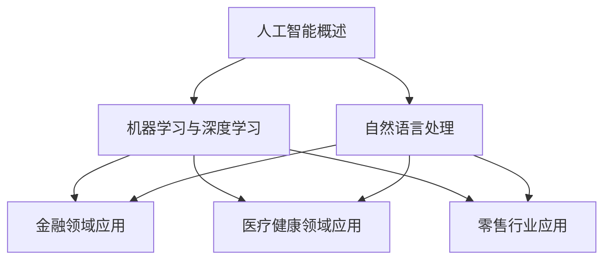

                 

# 《程序员如何应对人工智能挑战》

> **关键词：** 人工智能，程序员，挑战，机器学习，深度学习，自然语言处理，应用场景，开发实践，安全与伦理。

> **摘要：** 本文将探讨程序员在面对人工智能领域所带来的挑战时，如何通过学习人工智能基础知识、理解应用场景、掌握开发实践和关注安全与伦理问题来提升自己的竞争力。文章结构分为三部分：人工智能基础知识、人工智能应用场景和人工智能开发实践，最后讨论人工智能安全与伦理问题，为程序员提供应对挑战的策略和方向。

## 《程序员如何应对人工智能挑战》目录大纲

### 第一部分：人工智能基础知识

#### 第1章：人工智能概述
1.1.1 人工智能的定义与发展历程
1.1.2 人工智能的核心技术
1.1.3 程序员需要掌握的人工智能基础

#### 第2章：机器学习与深度学习
2.1.1 机器学习的基本概念
2.1.2 深度学习的基本原理
2.1.3 常见机器学习算法与深度学习模型

#### 第3章：自然语言处理
3.1.1 自然语言处理的基本概念
3.1.2 常见的自然语言处理任务
3.1.3 程序员如何实现自然语言处理

### 第二部分：人工智能应用场景

#### 第4章：人工智能在金融领域的应用
4.1.1 人工智能在金融风控中的应用
4.1.2 人工智能在金融量化交易中的应用
4.1.3 程序员如何应对金融领域的人工智能挑战

#### 第5章：人工智能在医疗健康领域的应用
5.1.1 人工智能在医疗诊断中的应用
5.1.2 人工智能在药物研发中的应用
5.1.3 程序员如何应对医疗领域的人工智能挑战

#### 第6章：人工智能在零售行业的应用
6.1.1 人工智能在智能推荐中的应用
6.1.2 人工智能在智能客服中的应用
6.1.3 程序员如何应对零售行业的人工智能挑战

### 第三部分：人工智能开发实践

#### 第7章：人工智能项目开发流程
7.1.1 人工智能项目规划与设计
7.1.2 人工智能项目开发工具与框架
7.1.3 人工智能项目测试与部署

#### 第8章：人工智能代码实战
8.1.1 机器学习算法实现
8.1.2 深度学习模型构建
8.1.3 自然语言处理实践

#### 第9章：人工智能安全与伦理
9.1.1 人工智能安全挑战
9.1.2 人工智能伦理问题
9.1.3 程序员如何应对人工智能安全与伦理问题

### 附录

#### 附录A：人工智能学习资源与工具

##### Mermaid 流程图

##### 机器学习算法伪代码

##### 自然语言处理数学公式

##### 人工智能安全与伦理举例

---

### 第一部分：人工智能基础知识

#### 第1章：人工智能概述

##### 1.1.1 人工智能的定义与发展历程

人工智能（Artificial Intelligence，简称AI）是指通过计算机模拟人类智能的行为和过程，以实现智能推理、学习、感知和决策等功能的一种技术。人工智能的概念可以追溯到20世纪50年代，当时图灵提出了著名的图灵测试，旨在评估机器是否具有人类水平的智能。

发展历程可以分为三个阶段：

1. **第一阶段（1956年-1974年）：初始探索阶段**  
    人工智能的概念被提出，研究者们开始探索如何使计算机模拟人类的智能行为。这一阶段的代表性工作包括开发出第一个专家系统。

2. **第二阶段（1974年-1980年）：人工智能应用的兴起阶段**  
    人工智能开始应用于实际领域，如医疗诊断、金融分析等，但受限于计算能力和算法水平，进展较为缓慢。

3. **第三阶段（1980年至今）：人工智能的高速发展阶段**  
    随着计算能力的提升和深度学习等算法的突破，人工智能得到了广泛应用，并在语音识别、图像识别、自然语言处理等领域取得了显著成果。

##### 1.1.2 人工智能的核心技术

人工智能的核心技术包括机器学习、深度学习、自然语言处理等。

1. **机器学习**  
    机器学习是一种通过数据训练模型，使其能够自动学习和改进的方法。主要分为监督学习、无监督学习和强化学习。

2. **深度学习**  
    深度学习是机器学习的一种方法，通过多层神经网络来模拟人脑的神经元连接，实现更加复杂的特征提取和模式识别。

3. **自然语言处理**  
    自然语言处理是研究如何使计算机理解和处理自然语言的技术。主要任务包括文本分类、情感分析、机器翻译等。

##### 1.1.3 程序员需要掌握的人工智能基础

程序员在面对人工智能挑战时，需要掌握以下基础知识：

1. **数学基础**  
    矩阵运算、概率论和统计是机器学习和深度学习的基础。程序员需要了解这些数学概念，以便更好地理解和实现算法。

2. **编程语言**  
    Python、Java、C++等编程语言在人工智能领域都有广泛应用。程序员需要熟练掌握至少一种编程语言，以便实现人工智能算法。

3. **机器学习框架**  
    TensorFlow、PyTorch、Scikit-learn等机器学习框架提供了丰富的算法库和工具，程序员需要学会使用这些框架来开发人工智能应用。

4. **数据处理与存储**  
    程序员需要了解如何处理大规模数据，以及如何使用数据库、数据仓库等技术来存储和管理数据。

---

### 第二部分：人工智能应用场景

#### 第4章：人工智能在金融领域的应用

##### 4.1.1 人工智能在金融风控中的应用

金融风控是金融领域的重要环节，旨在识别、评估和管理金融风险。人工智能在金融风控中具有广泛的应用，如：

1. **信用评分**  
    通过分析用户的信用历史、收入水平、还款能力等信息，使用机器学习算法进行信用评分，以降低信用风险。

2. **欺诈检测**  
    通过分析用户的交易行为，使用机器学习算法识别异常交易，从而预防金融欺诈。

3. **市场预测**  
    通过分析历史市场数据，使用深度学习算法预测股票、期货等金融产品的走势，为投资决策提供支持。

##### 4.1.2 人工智能在金融量化交易中的应用

金融量化交易是利用数学模型和计算机算法进行交易决策的一种方式。人工智能在金融量化交易中具有重要作用，如：

1. **策略开发**  
    通过分析历史交易数据，使用机器学习算法发现有效的交易策略，从而实现自动交易。

2. **风险管理**  
    通过分析市场数据，使用机器学习算法识别风险因素，从而制定合理的风险管理策略。

3. **高频交易**  
    通过分析市场数据，使用深度学习算法实现高频交易，从而抓住市场波动的机会。

##### 4.1.3 程序员如何应对金融领域的人工智能挑战

程序员在应对金融领域的人工智能挑战时，需要掌握以下技能和知识：

1. **金融知识**  
    程序员需要了解金融领域的相关知识和术语，以便更好地理解和应用人工智能技术。

2. **数据分析能力**  
    程序员需要具备较强的数据分析能力，以便处理大规模金融数据，提取有价值的信息。

3. **算法优化能力**  
    程序员需要掌握机器学习算法和深度学习算法，并对算法进行优化，以提高模型的性能。

4. **风险管理能力**  
    程序员需要了解金融风险管理的基本原则和方法，以降低人工智能应用带来的风险。

---

### 第三部分：人工智能开发实践

#### 第7章：人工智能项目开发流程

##### 7.1.1 人工智能项目规划与设计

人工智能项目开发流程通常包括以下几个阶段：

1. **需求分析**  
    确定项目的目标和需求，明确需要解决的问题和期望的输出结果。

2. **数据收集与处理**  
    收集相关的数据，并对数据进行清洗、预处理和特征提取，以便为模型训练提供高质量的数据。

3. **模型设计**  
    根据项目的需求，选择合适的机器学习算法和深度学习模型，并进行模型设计。

4. **模型训练与优化**  
    使用收集到的数据对模型进行训练，并通过调整参数和优化算法来提高模型的性能。

5. **模型评估与部署**  
    对训练好的模型进行评估，确保其在实际应用中的效果，并进行部署，以便在实际场景中运行。

##### 7.1.2 人工智能项目开发工具与框架

人工智能项目开发常用的工具和框架包括：

1. **Python**  
    Python是一种广泛使用的编程语言，具有丰富的机器学习和深度学习库，如NumPy、Pandas、Scikit-learn等。

2. **TensorFlow**  
    TensorFlow是Google开发的一种流行的深度学习框架，提供了丰富的模型构建和训练工具。

3. **PyTorch**  
    PyTorch是Facebook开发的一种深度学习框架，以其灵活性和易用性而受到广泛关注。

4. **Scikit-learn**  
    Scikit-learn是一个用于机器学习的Python库，提供了丰富的算法和工具，适用于各种机器学习任务。

##### 7.1.3 人工智能项目测试与部署

人工智能项目的测试与部署是确保模型在实际应用中稳定运行的重要环节，包括以下几个方面：

1. **单元测试**  
    对模型的各个组件进行单元测试，确保其正确性和稳定性。

2. **集成测试**  
    将模型与其他系统组件进行集成测试，确保整个系统的正常运行。

3. **性能测试**  
    对模型的性能进行测试，评估其在不同负载和场景下的性能表现。

4. **部署**  
    将训练好的模型部署到生产环境中，以便在实际场景中运行。

---

### 附录

#### 附录A：人工智能学习资源与工具

##### Mermaid 流程图



##### 机器学习算法伪代码

```python
# 伪代码：线性回归
Initialize weights and bias
while not convergence:
    for each sample in dataset:
        predict = weights * sample + bias
        gradient = 2 * (predict - sample)
        weights = weights - learning_rate * gradient
        bias = bias - learning_rate * gradient

return weights, bias
```

##### 自然语言处理数学公式

$$
\text{Word2Vec} = \frac{\sum_{w \in V} \text{softmax}(w|s)}{|\text{V}|}
$$

$$
\text{Sentence} = \text{[PAD]} \text{[UNK]} \text{[BOS]} \text{[EOS]}
$$

##### 人工智能安全与伦理举例

```python
# 举例：人工智能安全挑战
# 恶意样本攻击：对抗性攻击
# 输入正常样本，但模型却识别出恶意意图

# 举例：人工智能伦理问题
# 隐私保护：确保用户数据不被滥用
# 平等公正：避免算法偏见，确保公平
```

### 作者信息

作者：AI天才研究院/AI Genius Institute & 禅与计算机程序设计艺术 /Zen And The Art of Computer Programming

