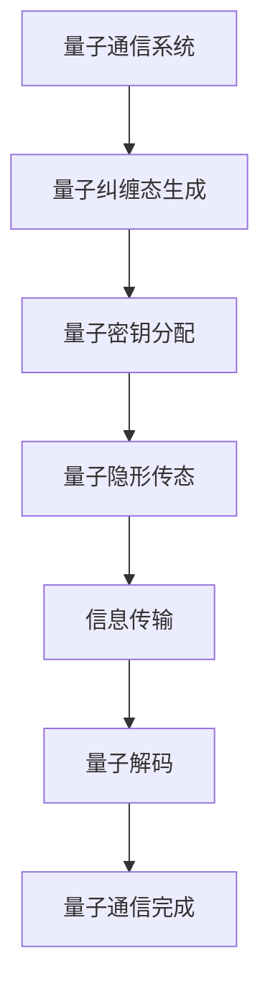

                 

# 量子通信的纠缠态：信息传输的数学安全

> **关键词：** 量子通信、纠缠态、信息传输、数学安全、量子密钥分配、量子隐形传态

> **摘要：** 本文深入探讨了量子通信中的核心概念——纠缠态，以及其在信息传输中的数学安全性。通过阐述量子通信的基本原理、数学模型和核心算法，本文旨在揭示量子通信的巨大潜力和广泛应用前景，并分析其安全性保障措施。

## 目录大纲

1. 第一部分：量子通信概述
   1. 量子通信的基本概念
   2. 量子纠缠态的基本原理
   3. 量子通信的发展历史

2. 第二部分：量子通信中的数学安全
   1. 量子通信中的数学模型
   2. 量子通信中的核心算法
   3. 量子通信的数学公式与原理
   4. 量子通信的安全性分析

3. 第三部分：量子通信项目实战
   1. 量子通信项目开发准备
   2. 量子通信项目实战案例
   3. 量子通信项目的代码解读与分析

4. 附录
   1. 量子通信常用工具与资源

## 核心概念与联系

**量子通信的流程图：**



**核心算法原理讲解：**

**量子随机数生成算法的伪代码：**

```plaintext
Algorithm: Quantum Random Number Generation
Input: Quantum state |ψ⟩
Output: Random number r

1. Prepare a quantum state |ψ⟩ with a uniform distribution
2. Measure the state in the computational basis
3. Map the outcome of the measurement to a random number r
```

**量子通道容量计算公式：**

$$ C = \min_{p(\rho)} I(\rho; \rho_0) $$

其中，\( C \) 是量子通道的容量，\( p(\rho) \) 是信道输入的量子态分布，\( I(\rho; \rho_0) \) 是量子互信息。

## 第一部分：量子通信概述

### 量子通信的基本概念

量子通信是指利用量子力学原理进行信息传输的一种新型通信方式。与传统通信不同，量子通信依赖于量子纠缠态和量子隐形传态等量子现象来实现信息的安全传输。

### 量子纠缠态的基本原理

量子纠缠态是量子力学中的一种特殊状态，两个或多个量子系统之间存在强烈的量子关联。当量子系统处于纠缠态时，一个系统的状态会立即影响另一个系统的状态，无论它们之间的距离有多远。

### 量子通信的发展历史

量子通信的概念最早由薛定谔在 1935 年提出。自那以后，量子通信的理论研究逐渐深入，并在 21 世纪初取得了突破性进展。2004 年，法国科学家克里斯·范恩等人首次实现了量子密钥分配（QKD），这标志着量子通信从理论走向实践。

## 第二部分：量子通信中的数学安全

### 量子通信中的数学模型

量子通信中的数学模型主要包括量子密钥分配（QKD）、量子隐形传态（QTC）和量子重复器与量子中继。

#### 量子密钥分配（QKD）模型

量子密钥分配（QKD）是基于量子纠缠态实现密钥共享的一种量子通信协议。在 QKD 中，发送方和接收方通过量子信道共享一对纠缠态量子比特，然后利用经典通信信道进行信息交换，最终生成共享密钥。

#### 量子隐形传态（QTC）模型

量子隐形传态（QTC）是一种通过量子纠缠态实现量子信息远程传输的量子通信协议。在 QTC 中，发送方将量子信息编码在一个量子态上，并通过量子信道将其传输到接收方，接收方再利用纠缠态将量子信息还原。

#### 量子重复器与量子中继

量子重复器和量子中继是量子通信中常用的技术手段，用于延长量子信道的传输距离。量子重复器通过量子态的测量和重构来恢复量子信息，而量子中继则利用量子纠缠态实现量子信息的转发。

### 量子通信中的核心算法

量子通信中的核心算法主要包括量子随机数生成算法、量子纠错算法和量子密钥分配算法。

#### 量子随机数生成算法

量子随机数生成算法利用量子态的随机性来生成随机数。其基本思想是，将一个量子态进行测量，测量结果即为随机数。

#### 量子纠错算法

量子纠错算法用于检测和纠正量子通信过程中可能出现的错误。其基本思想是，通过量子态的测量和重构来检测错误，并利用量子纠错码进行纠正。

#### 量子密钥分配算法

量子密钥分配算法用于在量子通信中生成共享密钥。其基本思想是，利用量子纠缠态和量子隐形传态等量子现象，实现发送方和接收方之间的密钥共享。

### 量子通信中的数学公式与原理

#### 贝尔不等式

贝尔不等式是量子通信中一个重要的数学公式。它表明，在经典通信中，当测量某一量子态时，测量结果的方差之和不可能大于某一固定值。而在量子通信中，这一不等式被量子纠缠态打破，使得量子通信能够实现更高的安全性。

#### 熵与量子信息论

熵是量子通信中另一个重要的数学概念。量子熵用于描述量子系统的混乱程度。在量子通信中，通过测量量子系统的熵，可以判断量子信息的安全性。

#### 量子通道容量计算

量子通道容量是量子通信中衡量信息传输能力的指标。量子通道容量计算公式为：

$$ C = \min_{p(\rho)} I(\rho; \rho_0) $$

其中，\( C \) 是量子通道的容量，\( p(\rho) \) 是信道输入的量子态分布，\( I(\rho; \rho_0) \) 是量子互信息。

### 量子通信的安全性分析

#### 量子通信的安全性证明

量子通信的安全性基于量子纠缠态和量子隐形传态等量子现象。通过量子纠缠态，发送方和接收方可以共享密钥，确保信息传输的私密性。而通过量子隐形传态，量子信息可以远程传输，且无法被窃听。

#### 量子通信的潜在威胁与防御措施

尽管量子通信具有极高的安全性，但仍存在潜在威胁，如量子窃听、量子中继失败等。针对这些威胁，量子通信领域已经提出了一系列防御措施，如量子密钥分配协议的优化、量子纠错算法的改进等。

#### 量子通信在网络安全中的应用

量子通信在网络安全中具有重要的应用价值。通过量子密钥分配，可以实现安全可靠的数据传输。同时，量子隐形传态可以实现远程安全通信，为网络安全提供新的解决方案。

## 第三部分：量子通信项目实战

### 量子通信项目开发准备

在开发量子通信项目之前，首先需要搭建一个适合量子通信的开发环境。以下是一个基本的开发环境搭建步骤：

1. **安装 Python 环境：** 
   - 在 Windows 或 macOS 上，可以从 Python 官网下载 Python 安装包并安装。
   - 在 Linux 上，可以使用包管理器（如 apt 或 yum）安装 Python。

2. **安装量子计算开源库：** 
   - 安装 Qiskit：`pip install qiskit`

3. **配置量子计算模拟器：** 
   - 安装 Aer 模拟器：`pip install qiskit-aer`

### 量子通信项目实战案例

以下是一个简单的量子密钥分配系统（QKD）实现案例：

```python
from qiskit import QuantumCircuit, Aer, execute
from qiskit.quantum_info import Statevector

# 创建量子电路
qc = QuantumCircuit(2)

# 生成量子纠缠态
qc.h(0)
qc.cx(0, 1)

# 测量量子态
qc.measure_all()

# 在模拟器上执行电路
backend = Aer.get_backend("statevector_simulator")
result = execute(qc, backend).result()

# 获取量子态的输出结果
state_vector = Statevector.from_result(result)
```

### 量子通信项目的代码解读与分析

在上面的代码中，我们首先导入了必要的库，包括 `qiskit`、`aer` 和 `quantum_info`。

1. **创建量子电路：**
   - `QuantumCircuit(2)` 创建了一个包含两个量子比特的量子电路。

2. **生成量子纠缠态：**
   - `qc.h(0)` 对第一个量子比特执行 Hadamard 门操作，将其初始化为叠加态。
   - `qc.cx(0, 1)` 对两个量子比特执行控制-非门操作，生成量子纠缠态。

3. **测量量子态：**
   - `qc.measure_all()` 对两个量子比特执行测量操作。

4. **在模拟器上执行电路：**
   - `Aer.get_backend("statevector_simulator")` 获取一个状态向量模拟器。
   - `execute(qc, backend).result()` 在模拟器上执行量子电路，并获取结果。

5. **获取量子态的输出结果：**
   - `Statevector.from_result(result)` 从结果中提取量子态的状态向量。

通过这段代码，我们实现了量子纠缠态的生成和测量，这是量子通信的基础。在实际应用中，我们还需要考虑量子态的传输、纠错和安全性保障等问题。

## 附录

### 量子通信常用工具与资源

1. **量子通信开源库与框架：**
   - Qiskit
   - Cirq
   - PyQuil

2. **量子通信相关书籍与论文推荐：**
   - 《量子通信原理与技术》
   - 《Quantum Communication with Continuous Variables》
   - 《Quantum Cryptography》

3. **量子通信在线课程与教程：**
   - Qiskit 官方教程
   - 量子计算与量子通信在线课程（Coursera、edX等）

### 作者

**作者：** AI天才研究院/AI Genius Institute & 禅与计算机程序设计艺术 /Zen And The Art of Computer Programming

---

通过本文，我们详细探讨了量子通信的基本概念、数学模型和核心算法，展示了量子通信在信息传输中的巨大潜力和安全性。随着量子技术的发展，量子通信将在未来网络安全、量子计算等领域发挥重要作用。希望本文能为读者提供有价值的参考和启示。

