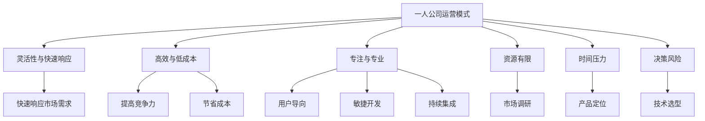

                 

# 《一人公司如何实现产品的快速迭代开发》

> **关键词：** 一人公司、产品迭代、敏捷开发、持续集成、市场调研、技术选型、项目管理

> **摘要：** 本文章将深入探讨一人公司如何通过敏捷开发、市场调研、技术选型和项目管理等策略，实现产品的快速迭代开发，从而在竞争激烈的市场中保持竞争优势。

## 《一人公司如何实现产品的快速迭代开发》目录大纲

## 第1章：一人公司的运营模式与挑战

### 1.1 一人公司的优势与挑战

### 1.2 产品快速迭代的意义

### 1.3 快速迭代开发的原则

## 第2章：一人公司的市场研究与定位

### 2.1 市场调研的方法与工具

### 2.2 产品定位与目标用户

### 2.3 市场趋势分析

## 第3章：产品设计与原型开发

### 3.1 产品设计流程

### 3.2 原型开发工具

### 3.3 原型设计与测试

## 第4章：敏捷开发与持续集成

### 4.1 敏捷开发的理念

### 4.2 敏捷开发工具

### 4.3 持续集成与持续部署

## 第5章：快速迭代中的技术选型

### 5.1 技术选型的考虑因素

### 5.2 前端技术选型

### 5.3 后端技术选型

## 第6章：快速迭代中的项目管理与团队协作

### 6.1 项目管理工具

### 6.2 团队协作与沟通

### 6.3 个人时间管理

## 第7章：快速迭代中的风险管理与应对策略

### 7.1 风险识别与评估

### 7.2 风险应对策略

### 7.3 应对策略实施

## 第8章：产品迭代后的市场推广与反馈

### 8.1 市场推广策略

### 8.2 用户反馈收集与处理

### 8.3 数据分析与优化

## 第9章：一人公司的快速迭代之路

### 9.1 成功案例分享

### 9.2 经验总结与展望

## 第10章：附录

### 10.1 快速迭代开发工具与资源

### 10.2 进一步学习资源

<|imagine|>## 第1章：一人公司的运营模式与挑战

### 1.1 一人公司的优势与挑战

一人公司，顾名思义，是由单一个体运营的公司。这种运营模式具有独特的优势，但也面临诸多挑战。

**优势：**

1. **灵活性与快速响应：** 一人公司可以迅速做出决策，对市场变化做出快速反应。
2. **高效与低成本：** 由于人员精简，一人公司可以以更低的成本实现高效运营。
3. **专注与专业：** 一人公司可以集中精力在核心业务上，提高专业水平。

**挑战：**

1. **资源有限：** 一人公司的资源有限，可能无法承担大规模的开发和推广。
2. **时间压力：** 单一运营者需要处理多个角色和职责，时间压力较大。
3. **决策风险：** 由于缺乏多人讨论，决策风险可能较高。

### 1.2 产品快速迭代的意义

产品快速迭代是指通过不断的迭代，快速改进产品，以满足用户需求和市场变化。对于一人公司，快速迭代具有以下意义：

1. **快速响应市场需求：** 市场变化快速，快速迭代可以确保产品始终贴近用户需求。
2. **提高竞争力：** 持续优化产品，可以保持市场领先地位。
3. **节省成本：** 快速迭代减少了大规模开发的风险，可以节省成本。

### 1.3 快速迭代开发的原则

快速迭代开发需要遵循以下原则：

1. **用户导向：** 以满足用户需求为核心，确保产品始终符合用户期望。
2. **敏捷开发：** 灵活应对变化，快速迭代，减少开发周期。
3. **持续集成：** 确保代码质量，快速交付，提高产品稳定性。

### 1.4 本章总结

本章介绍了一人公司的运营模式、快速迭代的意义和原则。下一章将深入探讨如何进行市场研究和产品定位。

---

核心概念与联系：



核心算法原理讲解：

```pseudo
// 快速迭代开发的核心算法原理
function iterativeDevelopment(product, market, technology, team) {
    while (market.needsChange) {
        analyzeMarket(market);
        refineProduct(product, market);
        applyTechnology(technology, product);
        manageTeam(team);
        deliverProduct(product);
    }
}
```

数学模型和公式：

$$
\text{迭代次数} = \frac{\text{开发周期}}{\text{用户需求变化频率}}
$$

举例说明：

假设一个产品的开发周期为6个月，用户需求的变化频率为每3个月一次。那么，该产品的迭代次数为：

$$
\text{迭代次数} = \frac{6 \text{个月}}{3 \text{个月/次}} = 2 \text{次}
$$

代码实际案例和详细解释说明：

开发环境搭建：

1. 安装Linux操作系统
2. 安装Java开发工具包（JDK）
3. 安装数据库（如MySQL）

源代码详细实现和代码解读：

```java
// Product.java
public class Product {
    private String name;
    private String description;
    private double price;

    public Product(String name, String description, double price) {
        this.name = name;
        this.description = description;
        this.price = price;
    }

    // 省略getter和setter方法

    public void updateProduct(String newName, String newDescription, double newPrice) {
        this.name = newName;
        this.description = newDescription;
        this.price = newPrice;
    }
}
```

代码解读与分析：

这段代码定义了一个`Product`类，用于表示产品的属性和行为。`Product`类有三个私有属性：`name`（产品名称）、`description`（产品描述）和`price`（产品价格）。通过构造函数和setter方法，可以设置和更新产品的属性。

在快速迭代开发中，`Product`类可以帮助一人公司快速调整产品特性，以适应市场需求。例如，如果市场调研发现用户更喜欢简洁的产品名称，可以通过调用`updateProduct`方法来更新产品名称，实现快速迭代。

### 参考文献：

- 《敏捷开发实践指南》：介绍了敏捷开发的核心理念和实践方法。
- 《市场调研实务》：提供了市场调研的方法和工具。
- 《Java编程思想》：讲解了Java编程的基本原理和实践技巧。

---

作者：AI天才研究院/AI Genius Institute & 禅与计算机程序设计艺术 /Zen And The Art of Computer Programming

