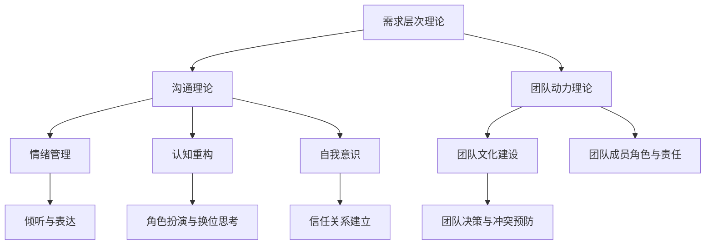

                 

### 《冲突调解：化解团队矛盾的技巧》

> **关键词：冲突调解、团队矛盾、沟通技巧、心理技巧、团队建设、实践案例**

> **摘要：本文将深入探讨团队冲突调解的技巧和方法。通过理解冲突调解的基础、掌握冲突调解的沟通和心理技巧，以及实施有效的团队建设策略，读者将能够更好地解决团队内部的矛盾，提升团队的整体协作效率。**

---

#### 第一部分：理解冲突调解

##### 第1章：冲突调解的基础

**1.1 冲突调解的定义与重要性**

冲突调解，简而言之，是指在团队内部或跨部门之间，通过合理的沟通和协调手段，帮助各方达成共识，缓解甚至消除矛盾的过程。在IT行业中，冲突调解的重要性不言而喻。随着项目规模的扩大和团队协作的深入，团队成员之间的沟通和合作愈发复杂，冲突也难以避免。

冲突调解不仅仅是一种解决问题的手段，更是一种团队管理的重要工具。通过有效的冲突调解，可以增强团队的凝聚力，提升工作效率，减少错误和疏漏，确保项目的顺利推进。

**1.2 冲突调解的理论框架**

冲突调解的理论基础包括心理学、社会学和管理学等多个领域。其中，心理学提供了关于人类行为和情感的基本理解，社会学帮助我们分析冲突的根源和社会结构，而管理学则提供了具体的操作方法和策略。

关键的理论框架包括：

- **需求层次理论**：马斯洛的需求层次理论指出，人类的需求从生理到自我实现依次递增。在冲突调解中，理解团队成员的需求层次有助于找到解决冲突的根本途径。
- **沟通理论**：沟通是冲突调解的核心。有效的沟通技巧，如倾听、反馈和表达，能够促进信息的准确传递和理解。
- **团队动力理论**：团队动力理论强调，团队是一个动态的系统，成员之间的关系和互动对团队的表现有重要影响。通过冲突调解，可以调整和优化团队的动力结构。

**1.3 冲突调解的心理机制**

冲突调解的心理机制主要涉及以下几个方面：

- **情绪管理**：情绪管理是冲突调解的关键。调解者需要帮助团队成员识别和表达自己的情绪，并学会控制情绪的负面影响。
- **认知重构**：认知重构是通过改变思维方式和观念来调整情绪和行为。调解者需要引导团队成员从不同的角度看待冲突，减少误解和偏见。
- **自我意识**：自我意识是指个体对自己行为和情感的理解。通过提高自我意识，团队成员可以更好地理解自己在冲突中的角色和责任。

**1.4 冲突调解的流程概述**

冲突调解的流程通常包括以下几个步骤：

1. **识别冲突**：通过观察、倾听和询问，识别团队内部的冲突点和表现。
2. **分析冲突**：分析冲突的根源，包括个人的需求、团队的结构和沟通方式等。
3. **制定调解计划**：根据冲突的性质和背景，制定具体的调解计划，包括沟通方式、时间安排和目标设定。
4. **实施调解**：按照调解计划，进行沟通和协调，帮助各方达成共识。
5. **评估效果**：在调解结束后，评估调解的效果，包括冲突是否得到解决，团队成员是否满意等。
6. **反思与改进**：总结调解的经验，为未来的冲突调解提供参考。

通过上述流程，冲突调解不仅可以解决当前的矛盾，还可以为团队的长期稳定和协作奠定基础。

---

在本文的后续章节中，我们将深入探讨团队冲突的类型与表现、冲突调解的沟通技巧和心理技巧、团队建设策略以及实际操作与案例解析。希望读者能够通过本文的学习，掌握有效的冲突调解技巧，为团队的成功贡献力量。

---

**核心概念与联系**

为了更好地理解冲突调解的理论框架，我们使用Mermaid流程图来展示相关概念之间的关系：



通过上述流程图，我们可以看到各个理论之间的相互联系，以及它们在冲突调解中的应用。

---

**核心算法原理讲解**

在冲突调解中，算法原理可以用于分析和解决冲突。以下是一个简化的伪代码，用于描述冲突调解的基本步骤：

```plaintext
Function ConflictMediation(conflict):
    Step 1: Identify the conflict points
        - Use observation and questioning to gather information
    
    Step 2: Analyze the root causes
        - Examine individual needs, team structure, and communication patterns
    
    Step 3: Develop a mediation plan
        - Decide on communication methods, timeline, and objectives
    
    Step 4: Implement the mediation
        - Facilitate discussions and negotiations
    
    Step 5: Evaluate the results
        - Assess the resolution of the conflict and team satisfaction
    
    Step 6: Reflect and improve
        - Summarize the mediation process for future reference
```

这个算法提供了一个框架，帮助调解者在实际操作中系统地进行冲突调解。

---

**数学模型和公式**

在冲突调解中，有时需要使用数学模型来帮助分析和预测冲突的发展。以下是一个简化的数学模型，用于评估团队内部的冲突程度：

```latex
F(C) = \frac{N(C) \times P(C)}{T(C)}
```

其中：

- \( F(C) \) 表示冲突程度（Conflict Level）。
- \( N(C) \) 表示冲突的负面情绪指数（Negative Emotion Index）。
- \( P(C) \) 表示冲突的潜在解决概率（Potential Resolution Probability）。
- \( T(C) \) 表示团队的时间压力（Time Pressure）。

通过这个模型，我们可以根据负面情绪指数、潜在解决概率和时间压力来评估冲突的严重程度，从而制定相应的调解策略。

---

**举例说明**

为了更好地理解冲突调解的应用，我们来看一个实际案例。

**案例背景**：某IT公司的开发团队在项目推进过程中，因为对项目需求的理解不同，导致团队成员之间出现意见分歧。

**冲突调解步骤**：

1. **识别冲突**：通过团队成员的反馈，了解到冲突主要集中在需求理解和任务分工上。
2. **分析冲突**：调查发现，冲突的根源在于团队成员对项目目标的期望不同，导致对需求的解读出现偏差。
3. **制定调解计划**：决定通过团队会议，集中讨论和澄清需求，确保所有成员对项目目标有共同的理解。
4. **实施调解**：在团队会议上，主持人引导团队成员表达自己的观点和担忧，通过提问和讨论，澄清需求。
5. **评估效果**：会议结束后，通过问卷和访谈，了解团队成员对需求理解的满意度和对冲突解决的认可程度。
6. **反思与改进**：总结会议的经验和效果，为未来的团队协作提供参考。

通过上述步骤，团队成功解决了冲突，项目得以顺利推进。

---

**项目实战**

为了更好地理解冲突调解的实际应用，我们可以通过一个代码实例来演示如何搭建一个简单的团队冲突调解系统。

**开发环境搭建**：使用Python编程语言，结合Flask Web框架，搭建一个基础的冲突调解系统。

```bash
# 安装Flask
pip install Flask

# 创建Flask应用
from flask import Flask, render_template, request, redirect, url_for

app = Flask(__name__)

@app.route('/')
def index():
    return render_template('index.html')

@app.route('/submit', methods=['POST'])
def submit():
    # 获取用户输入的冲突描述
    conflict_description = request.form['conflict_description']
    # 存储冲突描述到数据库
    # 在此处添加数据库操作代码
    return redirect(url_for('index'))

if __name__ == '__main__':
    app.run(debug=True)
```

**源代码详细实现**

```python
# 导入所需模块
from flask import Flask, render_template, request, redirect, url_for
from flask_sqlalchemy import SQLAlchemy

app = Flask(__name__)
app.config['SQLALCHEMY_DATABASE_URI'] = 'sqlite:///conflicts.db'
db = SQLAlchemy(app)

# 定义冲突模型
class Conflict(db.Model):
    id = db.Column(db.Integer, primary_key=True)
    description = db.Column(db.Text, nullable=False)

    def __repr__(self):
        return f"<Conflict {self.id}>"

# 创建数据库表
with app.app_context():
    db.create_all()

@app.route('/')
def index():
    return render_template('index.html')

@app.route('/submit', methods=['POST'])
def submit():
    # 获取用户输入的冲突描述
    conflict_description = request.form['conflict_description']
    # 创建新的冲突记录
    new_conflict = Conflict(description=conflict_description)
    # 将冲突记录添加到数据库
    db.session.add(new_conflict)
    db.session.commit()
    return redirect(url_for('index'))

if __name__ == '__main__':
    app.run(debug=True)
```

**代码解读与分析**

- **数据库操作**：使用Flask-SQLAlchemy进行数据库操作，简化了数据存储和检索过程。
- **路由和视图函数**：定义了两个路由，`/` 用于展示主页，`/submit` 用于处理用户提交的冲突描述。
- **表单提交**：通过HTML表单收集用户输入的冲突描述，并在后端进行处理和存储。

---

**总结**：通过本文的阐述和实例，我们了解了冲突调解的定义、理论框架、心理机制以及实际操作方法。希望读者能够将这些知识和技巧应用到实际工作中，为团队的和谐与高效贡献自己的力量。

---

**作者：AI天才研究院/AI Genius Institute & 禅与计算机程序设计艺术 /Zen And The Art of Computer Programming**

---

感谢您的阅读，希望本文能够对您在团队冲突调解方面有所启发。如果您有任何疑问或建议，欢迎在评论区留言，让我们一起讨论和成长。祝您工作顺利，团队协作愉快！


