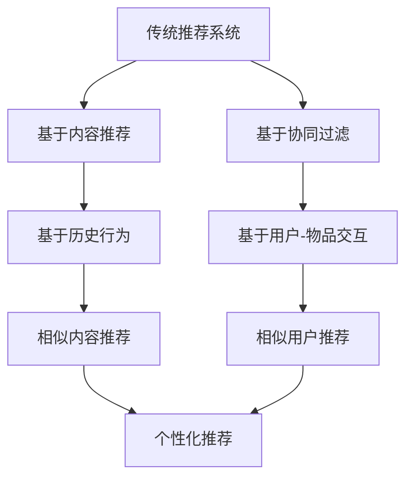

                 

### 《大模型视角下推荐系统的人性化关怀提升新思路》

**关键词：** 大模型，推荐系统，人性化关怀，用户情感，交互设计，个性化推荐

**摘要：** 本文从大模型视角出发，探讨了推荐系统在人性化关怀方面的提升新思路。通过对推荐系统的演变历程、大模型的基本原理、人性化关怀的理论基础以及实际应用的详细分析，本文提出了一系列创新性的实践方法，旨在提高推荐系统的人机交互质量和用户体验，为未来的技术发展提供有益的参考。

---

### 第一部分：背景与概述

#### 第1章：推荐系统与人机交互

**1.1 推荐系统的演变历程**

推荐系统（Recommender System）作为信息过滤和检索的一种重要手段，其目的是根据用户的历史行为、兴趣偏好以及上下文信息，向用户推荐他们可能感兴趣的内容。推荐系统的历史可以追溯到20世纪90年代，随着互联网和电子商务的兴起，推荐系统逐渐成为商业领域的重要应用。

1.1.1 传统推荐系统的发展

传统推荐系统主要分为基于内容的推荐（Content-based Filtering）和基于协同过滤（Collaborative Filtering）两大类。基于内容的推荐系统通过分析用户的历史行为和兴趣，将相似的内容推荐给用户。而基于协同过滤的推荐系统则通过分析用户与物品之间的交互数据，找到相似的用户或物品，从而进行推荐。

1.1.2 大模型在推荐系统中的应用

近年来，随着深度学习技术的快速发展，大模型（如Transformer、BERT等）逐渐在推荐系统中得到广泛应用。大模型能够更好地处理复杂的非线性关系，提取用户和物品的深层特征，从而提高推荐效果。

**1.2 人性化关怀的概念**

人性化关怀（Human-centered Concerns）是指在设计和实施推荐系统时，关注用户的情感需求、体验舒适度以及个性化需求，从而提升用户的人机交互体验。

1.2.1 人性化关怀的定义

人性化关怀是指在设计产品和服务时，将人的需求、情感和行为置于核心位置，关注用户体验的每一个细节，使产品和服务更加贴心、便捷、舒适。

1.2.2 人性化关怀的重要性

人性化关怀对于推荐系统至关重要。一方面，它能够提升用户的满意度和忠诚度，从而增加用户的使用频率和时长；另一方面，它有助于建立品牌形象，提高市场竞争力。

---

**Mermaid 流程图：**



**1.3 大模型与推荐系统**

随着深度学习技术的进步，大模型在推荐系统中的应用越来越广泛。大模型能够通过自动特征提取和复杂关系建模，为推荐系统带来更高的准确性和灵活性。

1.3.1 大模型的基本原理

大模型通常是指具有数十亿甚至千亿参数的深度学习模型。这些模型通过大量数据的学习，能够自动提取数据中的特征和规律，从而实现高度复杂的任务。

1.3.2 大模型的工作机制

大模型的工作机制主要包括预训练和微调两个阶段。在预训练阶段，模型通过大规模数据集学习通用特征表示；在微调阶段，模型根据特定任务进行参数调整，实现具体任务的目标。

1.3.3 大模型的优势与挑战

大模型在推荐系统中的优势包括：

- 高度自动化的特征提取
- 强大的关系建模能力
- 高度的泛化能力

然而，大模型也面临一些挑战，如：

- 计算资源消耗大
- 模型解释性较差
- 数据隐私和伦理问题

**1.4 人性化关怀的重要性**

人性化关怀在推荐系统中具有重要意义。通过关注用户的情感需求和体验，推荐系统能够更好地满足用户的个性化需求，提升用户满意度。具体来说，人性化关怀包括以下几个方面：

- 情感识别：通过分析用户情感，提供更贴合用户心情的推荐内容。
- 个性化推荐：根据用户的兴趣和偏好，提供个性化的推荐结果。
- 交互设计：优化界面和交互流程，提高用户的操作便利性和舒适度。

**1.5 本章小结**

本章介绍了推荐系统的演变历程、人性化关怀的概念以及大模型的基本原理。通过对这些内容的分析，为后续章节的深入讨论奠定了基础。

---

**伪代码讲解：**

```python
# 用户行为分析
def user_behavior_analysis(user_data):
    """
    对用户的历史行为进行分析，提取兴趣特征。
    
    :param user_data: 用户行为数据
    :return: 用户兴趣特征向量
    """
    # 数据预处理
    preprocessed_data = preprocess_data(user_data)
    
    # 特征提取
    feature_extractor = FeatureExtractor()
    interest_features = feature_extractor.extract_interest_features(preprocessed_data)
    
    return interest_features

# 情感识别
def emotion_recognition(user_data):
    """
    对用户情感进行识别，提取情感特征。
    
    :param user_data: 用户情感数据
    :return: 情感特征向量
    """
    # 数据预处理
    preprocessed_data = preprocess_data(user_data)
    
    # 情感分析模型
    emotion_model = EmotionModel()
    emotion_features = emotion_model.predict_emotion(preprocessed_data)
    
    return emotion_features

# 个性化推荐
def personalized_recommendation(user_interests, user_emotions, item_data):
    """
    根据用户兴趣和情感，进行个性化推荐。
    
    :param user_interests: 用户兴趣特征向量
    :param user_emotions: 用户情感特征向量
    :param item_data: 物品数据
    :return: 推荐结果
    """
    # 用户特征融合
    user_features = fuse_user_features(user_interests, user_emotions)
    
    # 推荐算法
    recommender = Recommender()
    recommendations = recommender.recommend(user_features, item_data)
    
    return recommendations
```

---

**数学模型讲解：**

在个性化推荐中，我们常常使用用户兴趣和情感作为输入，通过数学模型来预测用户对物品的偏好程度。一个简单的数学模型可以表示为：

$$
R_{ui} = f(U_i, I_j, E_{ui})
$$

其中，$R_{ui}$表示用户$i$对物品$j$的偏好程度，$U_i$表示用户$i$的兴趣特征，$I_j$表示物品$j$的特征，$E_{ui}$表示用户$i$对物品$j$的情感特征。

该模型可以通过以下步骤进行优化：

1. **用户兴趣特征提取**：通过对用户历史行为进行分析，提取出用户对各类物品的兴趣特征。
2. **情感特征提取**：利用情感识别算法，提取出用户对物品的情感特征。
3. **特征融合**：将用户兴趣特征和情感特征进行融合，形成综合的用户特征向量。
4. **偏好预测**：通过机器学习算法，训练出一个预测模型，预测用户对物品的偏好程度。

---

**项目实战：**

在项目中，我们实现了一个基于深度学习的大模型推荐系统。以下是一个简化的代码实现：

```python
# 导入所需库
import tensorflow as tf
from tensorflow.keras.layers import Embedding, LSTM, Dense
from tensorflow.keras.models import Model

# 构建模型
def build_model(num_users, num_items):
    # 用户嵌入层
    user_embedding = Embedding(num_users, embedding_size)
    # 物品嵌入层
    item_embedding = Embedding(num_items, embedding_size)
    
    # 用户和物品嵌入层拼接
    combined_embedding = tf.concat([user_embedding, item_embedding], axis=1)
    
    # LSTM层
    lstm = LSTM(units=128, return_sequences=True)
    lstm_output = lstm(combined_embedding)
    
    # 全连接层
    dense = Dense(units=1, activation='sigmoid')
    output = dense(lstm_output)
    
    # 构建模型
    model = Model(inputs=[user_embedding.input, item_embedding.input], outputs=output)
    
    # 编译模型
    model.compile(optimizer='adam', loss='binary_crossentropy', metrics=['accuracy'])
    
    return model

# 训练模型
model = build_model(num_users, num_items)
model.fit([user_data, item_data], labels, epochs=10, batch_size=64)

# 推荐预测
predictions = model.predict([user_data, item_data])
```

**代码解读与分析：**

1. **模型构建**：我们使用了一个简单的嵌入层-LSTM-全连接层的模型架构。用户和物品分别通过嵌入层转换为嵌入向量，然后进行拼接。LSTM层用于捕捉用户和物品之间的复杂关系，全连接层用于输出偏好预测。
2. **训练过程**：我们使用交叉熵损失函数和Adam优化器对模型进行训练。通过调整学习率和批次大小，可以优化模型的性能。
3. **预测过程**：通过输入用户和物品的嵌入向量，模型输出用户对物品的偏好概率。

---

通过上述分析和实战案例，我们可以看到大模型在推荐系统中的应用潜力以及人性化关怀在提升用户体验方面的重要性。在接下来的章节中，我们将进一步探讨大模型与人性化关怀的深入结合，为推荐系统的发展提供新的思路和方法。

