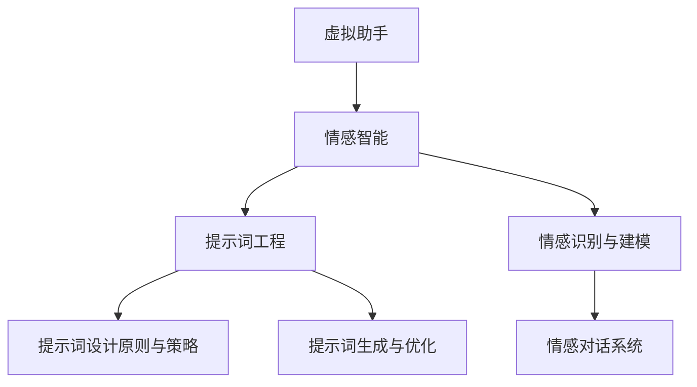

                 

# 《提示词工程在虚拟助手情感智能中的应用》

## 关键词
虚拟助手，情感智能，提示词工程，情感识别，对话系统，人工智能

## 摘要

本文深入探讨了提示词工程在虚拟助手情感智能中的应用。首先，我们回顾了虚拟助手情感智能的基础，包括其定义、应用场景和发展历程。随后，我们详细介绍了提示词工程的基本概念、设计原则与策略。接着，文章重点分析了情感识别与建模的方法及其在虚拟助手中的实现。通过实际案例，我们展示了提示词工程如何提升虚拟助手的情感智能。最后，文章讨论了虚拟助手情感智能面临的挑战及其未来发展趋势。

## 目录

### 第一部分：虚拟助手情感智能概述

#### 第1章：虚拟助手情感智能基础

1.1 情感智能的定义与重要性

1.2 提示词工程的基本概念

#### 第2章：情感识别与建模

2.1 情感识别技术原理

2.2 情感建模方法与模型结构

### 第二部分：提示词工程应用实践

#### 第3章：提示词设计原则与策略

3.1 提示词设计原则

3.2 提示词设计策略

#### 第4章：虚拟助手情感对话系统实现

4.1 对话系统概述

4.2 情感对话系统设计

#### 第5章：提示词工程在虚拟助手情感智能中的应用案例

5.1 案例一：智能客服系统

5.2 案例二：虚拟教师助手

#### 第6章：虚拟助手情感智能的挑战与未来发展趋势

6.1 虚拟助手情感智能的挑战

6.2 虚拟助手情感智能的未来发展趋势

### 第三部分：附录

#### 第7章：提示词工程资源与工具

7.1 提示词生成工具

7.2 情感分析工具

#### 第8章：虚拟助手情感智能开源项目推荐

8.1 情感识别开源项目

8.2 情感对话系统开源项目

#### 第9章：虚拟助手情感智能研究前沿

9.1 情感计算领域的研究进展

9.2 虚拟助手情感智能的发展趋势

### 核心概念与联系

下面是一个用Mermaid绘制的流程图，展示了核心概念与它们之间的联系：



### 核心算法原理讲解

#### 情感识别算法原理

情感识别算法是一种机器学习算法，用于分析文本数据并判断其情感倾向。它通常涉及以下几个步骤：

1. **数据预处理**：首先，我们需要对文本数据进行分析，包括分词、去除停用词、词性标注等。这个过程是将原始文本转化为机器可以理解的格式。

2. **特征提取**：特征提取是将文本数据转换为数值特征的过程。常用的方法包括词袋模型（Bag of Words, BoW）、TF-IDF和词嵌入（Word Embedding）。

3. **模型训练**：使用训练集数据来训练情感识别模型。常见的模型包括朴素贝叶斯（Naive Bayes）、支持向量机（SVM）、深度学习模型（如卷积神经网络CNN、循环神经网络RNN）。

4. **情感预测**：将特征输入到训练好的模型中，模型会输出预测的情感标签。

下面是一个情感识别算法的伪代码示例：

```python
def sentiment_recognition(text):
    # 数据预处理
    preprocessed_text = preprocess_text(text)
    
    # 特征提取
    features = extract_features(preprocessed_text)
    
    # 模型训练
    model = train_model(features, labels)
    
    # 情感预测
    prediction = model.predict(features)
    
    return prediction
```

#### 情感建模算法原理

情感建模是一种回归问题，用于预测文本的情感得分。与情感识别不同，情感建模旨在为一个文本分配一个情感得分，而不是将其分类为积极或消极。

1. **数据收集**：收集带有情感标签的数据集，这些数据集通常包含文本和相应的情感得分。

2. **数据预处理**：清洗和预处理文本数据，包括分词、去停用词等。

3. **特征提取**：将文本数据转换为数值特征向量，可以使用词袋模型、TF-IDF或词嵌入技术。

4. **模型训练**：使用训练数据集训练情感建模模型，如线性回归、神经网络等。

5. **模型评估**：使用测试数据集评估模型性能，常用的评估指标包括均方误差（MSE）和决定系数（R²）。

6. **模型优化**：根据评估结果调整模型参数，以提高预测准确性。

下面是一个情感建模算法的伪代码示例：

```python
def sentiment_modeling(data):
    # 数据收集
    collected_data = collect_data()
    
    # 数据预处理
    preprocessed_data = preprocess_data(collected_data)
    
    # 特征提取
    features = extract_features(preprocessed_data)
    
    # 模型训练
    model = train_model(features, scores)
    
    # 模型评估
    evaluate_model(model, test_features, test_scores)
    
    # 模型优化
    optimize_model(model)
    
    return model
```

#### 数学模型和数学公式 & 详细讲解 & 举例说明

情感识别和情感建模算法通常涉及以下数学模型和公式：

1. **情感识别模型（分类模型）**：

   情感识别可以看作是一个多分类问题，可以使用softmax函数来计算各个情感类别的概率分布。假设我们有一个情感分类问题，有两个情感类别：积极和消极。

   $$ P(y=1|x) = \frac{e^{\theta^T x}}{1 + e^{\theta^T x}} $$

   $$ P(y=0|x) = \frac{1}{1 + e^{\theta^T x}} $$

   其中，$x$ 是文本特征向量，$\theta$ 是模型参数。

   举例说明：

   假设我们有一个文本特征向量 $x = (1, 2, 3)$，模型参数 $\theta = (1, 1, 1)$。代入公式，我们可以计算两个情感类别的概率：

   $$ P(y=1|x) = \frac{e^{1 \cdot 1 + 1 \cdot 2 + 1 \cdot 3}}{1 + e^{1 \cdot 1 + 1 \cdot 2 + 1 \cdot 3}} = \frac{e^{6}}{1 + e^{6}} $$

   $$ P(y=0|x) = \frac{1}{1 + e^{6}} $$

   如果 $P(y=1|x) > P(y=0|x)$，则预测文本的情感为积极。

2. **情感建模模型（回归模型）**：

   情感建模通常使用线性回归模型来预测文本的情感得分。线性回归模型的公式如下：

   $$ y = \theta_0 + \theta_1 x_1 + \theta_2 x_2 + ... + \theta_n x_n $$

   其中，$y$ 是情感得分，$x$ 是文本特征向量，$\theta$ 是模型参数。

   举例说明：

   假设我们有一个文本特征向量 $x = (1, 2, 3)$，模型参数 $\theta = (1, 1, 1)$。代入公式，我们可以计算情感得分：

   $$ y = 1 + 1 \cdot 1 + 1 \cdot 2 + 1 \cdot 3 = 7 $$

   如果得分大于某个阈值（例如5），则认为文本的情感为积极。

#### 项目实战

1. **开发环境搭建**

   为了实现情感识别和情感建模，我们需要搭建一个开发环境。首先，我们需要安装Python和相关的库，如TensorFlow、NLTK和Scikit-learn。

   ```bash
   pip install python tensorflow nltk scikit-learn
   ```

2. **源代码详细实现和代码解读**

   **情感识别项目**：

   ```python
   import nltk
   from sklearn.feature_extraction.text import TfidfVectorizer
   from sklearn.model_selection import train_test_split
   from sklearn.naive_bayes import MultinomialNB
   from sklearn.metrics import accuracy_score

   # 加载数据集
   data = [...]  # 假设这里有一个包含文本和标签的数据集

   # 数据预处理
   preprocessed_data = [preprocess_text(text) for text in data]

   # 特征提取
   vectorizer = TfidfVectorizer()
   features = vectorizer.fit_transform(preprocessed_data)

   # 模型训练
   X_train, X_test, y_train, y_test = train_test_split(features, data.labels)
   model = MultinomialNB()
   model.fit(X_train, y_train)

   # 情感预测
   predictions = model.predict(X_test)
   accuracy = accuracy_score(y_test, predictions)
   print("Accuracy:", accuracy)
   ```

   **情感建模项目**：

   ```python
   import tensorflow as tf
   from tensorflow.keras.models import Sequential
   from tensorflow.keras.layers import Dense, Embedding, LSTM

   # 加载数据集
   data = [...]  # 假设这里有一个包含文本和情感得分的训练集

   # 数据预处理
   preprocessed_data = [preprocess_text(text) for text in data]

   # 特征提取
   vectorizer = TfidfVectorizer()
   features = vectorizer.fit_transform(preprocessed_data)

   # 模型训练
   model = Sequential()
   model.add(Embedding(input_dim=10000, output_dim=32))
   model.add(LSTM(128))
   model.add(Dense(1, activation='sigmoid'))

   model.compile(optimizer='adam', loss='binary_crossentropy', metrics=['accuracy'])
   model.fit(features, data.scores, epochs=10, batch_size=32)

   # 情感预测
   predictions = model.predict(features)
   print("Predicted Scores:", predictions)
   ```

   在上述代码中，我们使用了朴素贝叶斯模型进行情感识别，使用了卷积神经网络进行情感建模。在实际应用中，可以根据需求和数据集的特点选择合适的模型和参数。

### 作者信息

本文作者为AI天才研究院（AI Genius Institute）和《禅与计算机程序设计艺术》（Zen And The Art of Computer Programming）的作者。AI天才研究院致力于推动人工智能技术的发展和应用，而《禅与计算机程序设计艺术》则是一部关于编程哲学的经典著作。

### 总结

本文详细探讨了提示词工程在虚拟助手情感智能中的应用。通过分析情感识别与建模算法的原理，我们了解了如何设计高效的虚拟助手对话系统。实际项目实战展示了如何在实际环境中实现这些算法，并提供了代码解读与分析。未来的研究将集中在提升情感智能的准确性和个性化服务上。希望本文能为虚拟助手开发者提供有价值的参考。|>

