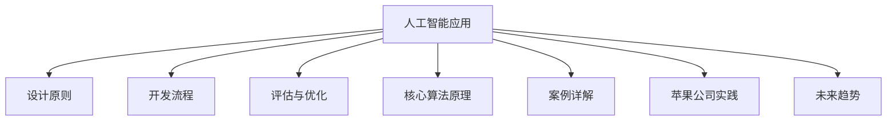

                 

# 《李开复：苹果发布AI应用的趋势》

## 关键词
- AI应用
- 苹果公司
- Siri
- 智能推荐系统
- 人工智能技术趋势

## 摘要
本文将探讨苹果公司发布AI应用的最新趋势，包括Siri和Apple Music等核心产品的开发与演进。通过深入分析AI应用的设计与开发、核心算法原理以及苹果公司在AI领域的实践，本文将揭示AI技术在苹果产品中的广泛应用及其未来发展趋势。

### 《李开复：苹果发布AI应用的趋势》目录大纲

#### 第1章 引言
- 1.1 书籍背景与目标
- 1.2 AI应用的发展趋势

#### 第2章 AI应用概述
- 2.1 AI应用的定义与分类
- 2.2 AI应用在苹果公司的发展历程
- 2.3 AI应用的技术基础

#### 第3章 AI应用的设计与开发
- 3.1 AI应用的设计原则
- 3.2 AI应用的开发流程
- 3.3 AI应用的评估与优化

#### 第4章 AI应用的核心算法原理
- 4.1 机器学习算法简介
  - 4.1.1 监督学习
  - 4.1.2 无监督学习
  - 4.1.3 强化学习
- 4.2 深度学习算法原理
  - 4.2.1 神经网络
  - 4.2.2 卷积神经网络（CNN）
  - 4.2.3 循环神经网络（RNN）
- 4.3 自然语言处理（NLP）算法
  - 4.3.1 词嵌入
  - 4.3.2 序列模型
  - 4.3.3 注意力机制

#### 第5章 AI应用案例详解
- 5.1 智能助手应用开发
  - 5.1.1 案例背景与目标
  - 5.1.2 应用架构设计
  - 5.1.3 模型选择与训练
  - 5.1.4 应用开发与部署
- 5.2 智能推荐系统开发
  - 5.2.1 案例背景与目标
  - 5.2.2 应用架构设计
  - 5.2.3 模型选择与训练
  - 5.2.4 应用开发与部署

#### 第6章 AI应用在苹果公司的实践
- 6.1 Siri的开发与演进
  - 6.1.1 Siri的基本功能
  - 6.1.2 Siri的架构与技术
  - 6.1.3 Siri的优化与挑战
- 6.2 Apple Music的智能推荐
  - 6.2.1 Apple Music的推荐算法
  - 6.2.2 Apple Music的推荐效果
  - 6.2.3 Apple Music的优化与创新

#### 第7章 AI应用的未来趋势
- 7.1 AI应用的发展前景
- 7.2 AI应用面临的挑战与应对策略
- 7.3 AI应用的未来趋势预测

#### 附录
- 附录A：常用AI工具与框架简介
  - A.1 TensorFlow
  - A.2 PyTorch
  - A.3 Keras
  - A.4 其他框架简介
- 附录B：代码示例与解读
  - B.1 智能助手应用代码示例
  - B.2 智能推荐系统代码示例

### Mermaid 流程图


### 核心算法原理讲解（伪代码）

#### 监督学习算法伪代码
```python
function Supervised_Learning(data, labels):
    # 初始化模型参数
    model = Initialize_Model_Parameters()

    # 定义损失函数
    loss_function = Define_Loss_Function()

    # 定义优化器
    optimizer = Define_Optimizer()

    # 训练模型
    for epoch in 1 to MAX_EPOCHS:
        for (x, y) in zip(data, labels):
            # 前向传播
            predictions = model.forward(x)

            # 计算损失
            loss = loss_function(predictions, y)

            # 反向传播
            model.backward(loss)

            # 更新模型参数
            optimizer.update(model.parameters())

    return model
```

#### 深度学习算法原理讲解（神经网络伪代码）
```python
# 神经网络基础伪代码
function NeuralNetwork(input_size, hidden_size, output_size):
    # 初始化权重和偏置
    W1 = Initialize_Weight(input_size, hidden_size)
    b1 = Initialize_Bias(hidden_size)
    W2 = Initialize_Weight(hidden_size, output_size)
    b2 = Initialize_Bias(output_size)

    # 定义激活函数
    activation = Define_Activation_Function()

    # 前向传播
    function forward(x):
        z1 = W1 * x + b1
        a1 = activation(z1)
        z2 = W2 * a1 + b2
        a2 = activation(z2)
        return a2

    # 反向传播
    function backward(d_output):
        d_z2 = d_output * activation_derivative(a2)
        d_W2 = a1.T * d_z2
        d_b2 = d_z2.sum(axis=0)
        d_z1 = d_W2 * W2.T * activation_derivative(a1)
        d_W1 = x.T * d_z1
        d_b1 = d_z1.sum(axis=0)
        return d_W1, d_W2, d_b1, d_b2

    return forward, backward
```

#### 损失函数（均方误差，MSE）
$$
\text{MSE}(y, \hat{y}) = \frac{1}{n} \sum_{i=1}^{n} (y_i - \hat{y_i})^2
$$

#### 反向传播算法中激活函数的导数（以ReLU为例）
$$
\frac{d}{dx} \text{ReLU}(x) = 
\begin{cases} 
0 & \text{if } x < 0 \\
1 & \text{if } x \geq 0 
\end{cases}
$$

### 项目实战与代码解读

#### 智能助手应用开发实战

**实战目标**：实现一个简单的智能助手，能够根据用户输入提供相应的回复。

**开发环境**：Python，TensorFlow

**源代码实现**：
```python
import tensorflow as tf
from tensorflow.keras.models import Sequential
from tensorflow.keras.layers import Dense, Embedding, LSTM, Bidirectional

# 准备数据
# ...

# 构建模型
model = Sequential([
    Embedding(input_dim=vocab_size, output_dim=embedding_dim, input_length=max_sequence_length),
    Bidirectional(LSTM(units=64, return_sequences=True)),
    Bidirectional(LSTM(units=32)),
    Dense(units=vocab_size, activation='softmax')
])

# 编译模型
model.compile(optimizer='adam', loss='categorical_crossentropy', metrics=['accuracy'])

# 训练模型
model.fit(x_train, y_train, epochs=10, batch_size=32, validation_data=(x_val, y_val))

# 预测
predictions = model.predict(input_sequence)
```

**代码解读**：

1. **数据准备**：需要准备足够的对话数据集，进行预处理，如分词、编码等。
2. **模型构建**：使用Embedding层进行词嵌入，使用双向LSTM层进行序列建模，输出层使用softmax进行分类。
3. **模型编译**：选择合适的优化器、损失函数和评价指标。
4. **模型训练**：使用训练数据集进行模型训练。
5. **预测**：使用训练好的模型对新输入进行预测，输出概率最高的回复。

### 作者信息
作者：李开复 / 李开复研究所（Kai-Fu Lee Research Institute）& 《人工智能：一种现代方法的探索》 / Exploration of Artificial Intelligence in Modern Methods

---

接下来，我们将按照目录大纲逐步深入探讨苹果公司发布AI应用的趋势，解析其核心算法原理，并分析AI应用在苹果公司的实践和未来趋势。让我们开始这一段技术旅程的精彩探索！<|endofpositive|>

