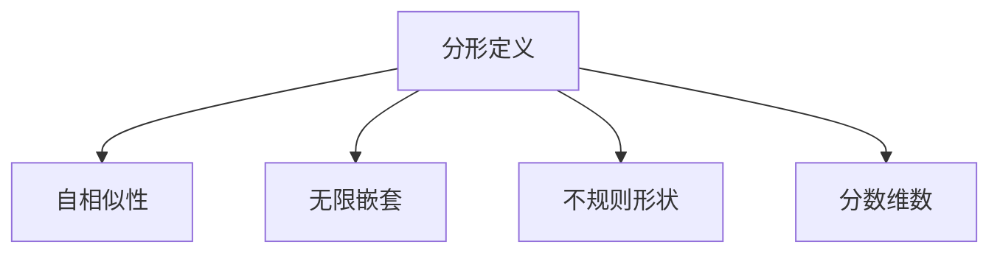
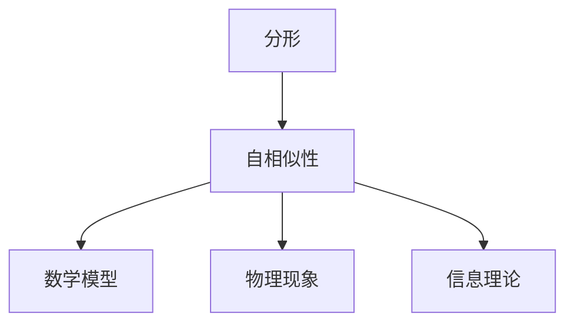
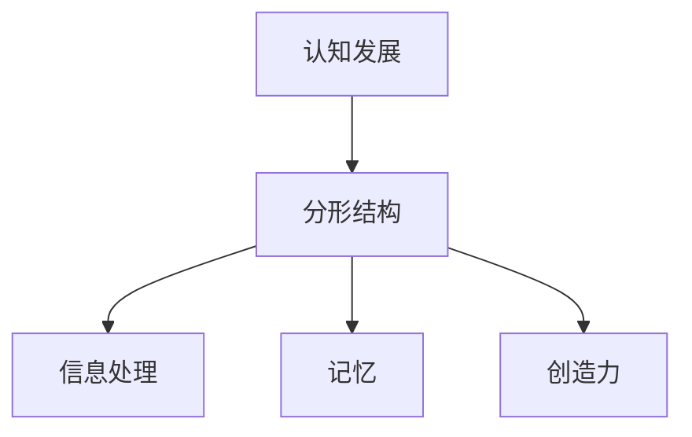
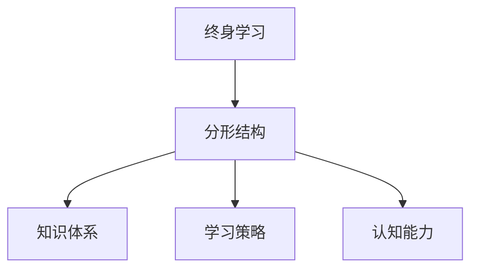
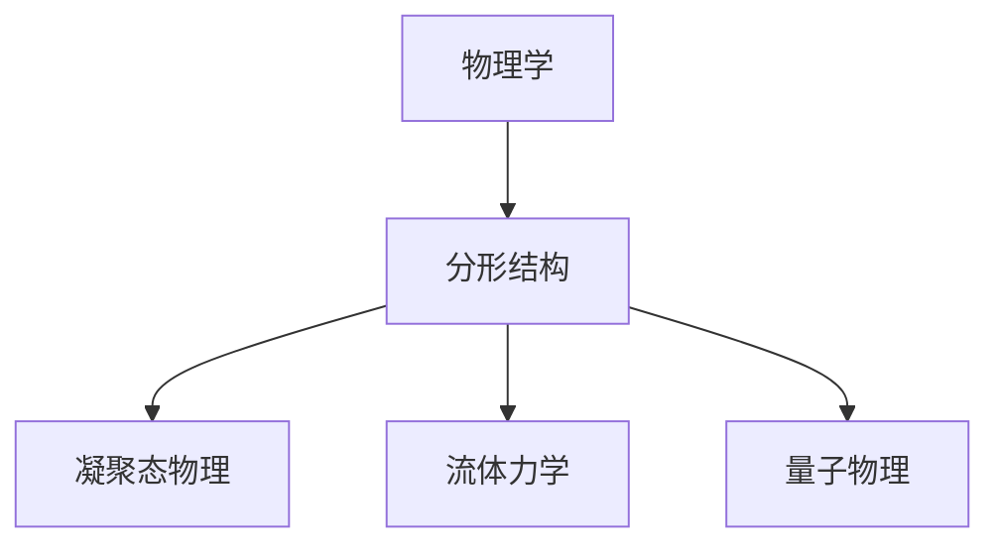
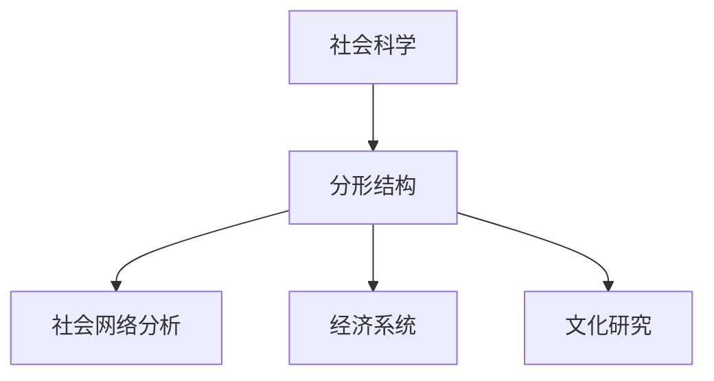

                 

### 《知识的分形结构：自相似性在学习中的应用》

> **关键词：分形结构，自相似性，学习，认知发展，教育技术**

> **摘要：**
> 本文章深入探讨了分形结构与自相似性在学习和认知发展中的应用。通过分析分形的定义、特点以及在自然界和数学中的应用，文章揭示了分形结构对教育和学习过程的重要性。同时，文章探讨了自相似性原理在认知过程中的作用，并阐述了分形与自相似性在教育技术中的实践意义。通过详细的理论讲解、数学模型和实际案例，本文为教育领域提供了新的视角和思考方式。**

### **分形结构与自相似性**

分形结构是一种在自然界和人工系统中广泛存在的结构，其特征是无限嵌套和自相似性。分形结构不仅在数学和物理学中有重要应用，还在教育领域展现出巨大的潜力。自相似性是分形结构的核心特点，它指的是一个结构在不同的尺度上看起来是相似的。

#### **1.1 分形的定义与特点**

分形（Fractal）是一种在数学上无法用整数维描述的几何形状。它具有以下特点：

- **无限嵌套：** 分形可以无限地细分，每一部分都包含着整体的缩影。
- **不规则形状：** 分形的边界通常不是直线或平滑曲线，而是由许多复杂、细小的部分组成。
- **分数维数：** 分形的维数不是整数，而是分数。例如，科赫曲线的维数大约是1.261。

**Mermaid 流程图：**



#### **1.2 自相似性原理**

自相似性（Self-Similarity）指的是一个结构在不同尺度上保持相似。这种相似性可以通过数学模型来描述。一个简单的例子是康托集（Cantor Set），它通过不断地删除中间部分而形成。康托集在任意尺度上看起来都是相似的。

**伪代码：**

```python
def is_self_similar(shape):
    if shape == base_shape:
        return True
    for part in shape:
        if not is_self_similar(part):
            return False
    return True
```

#### **1.3 分形与自相似性的联系**

分形和自相似性之间存在密切的联系。自相似性是分形结构的核心特点，而分形则是实现自相似性的几何形式。这种联系不仅在数学上有重要意义，还在信息理论和物理现象中有所体现。

**Mermaid 流程图：**



### **分形与自相似性在自然界中的应用**

分形和自相似性在自然界中有着广泛的应用。许多自然现象都可以用分形结构来描述，如海岸线、云彩、植物生长等。自相似性原理在这些现象中发挥着关键作用。

#### **2.1 自然界中的分形现象**

自然界中许多现象都呈现出分形结构。例如，海岸线就是一个典型的分形现象。海岸线在宏观尺度上看起来是一条弯曲的线，但在微观尺度上，它由许多细小的沙粒和岩石组成，这些小部分的结构与整体相似。

**数学公式与解释：**

$$ f(x) = \sum_{i=1}^{n} a_i \cdot f(\lambda x) $$

这个公式描述了一个分形函数，其中 \( f(x) \) 是分形函数，\( a_i \) 和 \( \lambda \) 是常数，代表分形结构的比例尺和相似性。

#### **2.2 自然界中的自相似性现象**

自然界中的许多现象都表现出自相似性。一个经典的例子是科赫曲线（Koch Curve）。科赫曲线通过不断缩放和重复图形产生，其每一个部分都与整体相似。

- **康托集：** 一个无限缩小的集合，每一部分都与整体相似。
- **科赫曲线：** 一种通过不断缩放和重复图形产生的分形。

### **分形与自相似性在教育领域的应用**

分形和自相似性在教育领域中有着重要的应用。它们可以帮助学生更好地理解复杂的概念，提高学习效果和认知发展。

#### **3.1 教育中的分形思维**

分形思维是指将复杂的问题分解为更小、更简单的部分，以便更好地理解和解决。在教育中，分形思维可以帮助学生将复杂的知识结构分解为更易理解的部分，从而提高学习效果。

**伪代码：**

```python
def fractal_learning(topic):
    while not mastered:
        expand_knowledge(topic)
        if self_similar_to_initial_knowledge(topic):
            mastered = True
```

这个伪代码表示了一个分形学习过程，其中 `topic` 代表学习主题，`expand_knowledge` 表示扩展知识，`self_similar_to_initial_knowledge` 表示是否与初始知识相似。

#### **3.2 自相似性在学习中的应用**

自相似性原理在教育中有着广泛的应用。它可以帮助学生将新的知识和已有的知识联系起来，提高学习效果和认知发展。

**数学模型与讲解：**

$$ \text{Learning Effectiveness} = f(\text{Student's Understanding}, \text{Teacher's Guidance}) $$

这个公式表示学习效果取决于学生的理解和老师的指导。自相似性原理可以帮助学生将新的知识和已有的知识联系起来，从而提高学习效果。

### **分形与自相似性在认知发展中的作用**

分形和自相似性在认知发展中扮演着重要角色。它们可以帮助人们更好地理解和处理信息，提高认知效率和创造力。

#### **4.1 分形结构在认知发展中的影响**

分形结构可以帮助人们更好地理解和处理复杂的信息。例如，在阅读和理解复杂文本时，分形结构可以帮助人们将文本分解为更小的部分，从而更好地理解和记忆。

**Mermaid 流程图：**



#### **4.2 自相似性在认知过程中的作用**

自相似性原理在认知过程中发挥着重要作用。它可以帮助人们将新的知识和已有的知识联系起来，从而提高认知效率和创造力。

**数学公式与讲解：**

$$ \text{Cognitive Efficiency} = \alpha \cdot \text{Self-Similarity} + \beta \cdot \text{Diversity} $$

这个公式表示认知效率取决于自相似性和多样性。自相似性可以帮助人们更好地理解和处理信息，而多样性则可以提高认知能力和创造力。

### **分形与自相似性在教育技术中的应用**

随着教育技术的不断发展，分形和自相似性在教育技术中的应用也越来越广泛。教育技术可以帮助学生更好地理解和应用分形和自相似性原理，提高学习效果和认知发展。

#### **5.1 教育技术中的分形设计**

教育技术中的分形设计可以帮助学生更好地理解和应用分形原理。例如，分形游戏可以通过分形结构设计，提高学生的空间认知能力和逻辑思维能力。

**举例说明：**

- **分形游戏：** 通过分形结构设计游戏，提高学生的空间认知能力。

#### **5.2 自相似性在教育软件中的应用**

自相似性原理在教育软件中的应用可以帮助学生更好地理解和应用自相似性原理。例如，自适应学习系统可以根据学生的知识水平和学习进度，调整学习内容，提高学习效果。

**伪代码：**

```python
def adaptive_learning_system(student_model, content):
    while not content_mastered:
        adjust_content_similarity(student_model, content)
        if content_matches_student_model(student_model, content):
            content_mastered = True
```

这个伪代码表示了一个自适应学习系统，其中 `student_model` 表示学生模型，`content` 表示学习内容，`adjust_content_similarity` 表示调整内容相似性，`content_matches_student_model` 表示内容是否与学生模型匹配。

### **分形与自相似性在终身学习中的重要性**

在终身学习的背景下，分形和自相似性原理具有重要意义。它们可以帮助人们不断扩展知识体系，提高认知能力和创造力，从而实现持续的职业发展和个人成长。

#### **6.1 终身学习中的分形观念**

在终身学习中，分形观念可以帮助人们将复杂的知识结构分解为更小的部分，从而更好地理解和应用。例如，在学习新的技能或概念时，可以通过分形思维将其分解为更简单的部分，逐步掌握。

**Mermaid 流程图：**



#### **6.2 自相似性在职业发展中的应用**

自相似性原理在职业发展中具有重要意义。它可以帮助人们将新的知识和已有的知识联系起来，从而更好地适应新的工作环境和职业挑战。

**数学模型与讲解：**

$$ \text{Career Development} = f(\text{Skill Acquisitions}, \text{Self-Similarity in Knowledge}) $$

这个公式表示职业发展取决于技能的获取和知识的自相似性。通过将新的知识和已有的知识联系起来，人们可以更好地适应职业发展的需求，实现职业成长。

### **分形与自相似性在特定学科中的应用**

分形和自相似性原理在各个学科中都有重要的应用。以下是一些具体的应用实例：

#### **7.1 数学中的应用**

在数学中，分形和自相似性原理有着广泛的应用。例如，康托集和科赫曲线都是数学中的重要概念。

- **康托集：** 在数学分析中的应用。
- **科赫曲线：** 在几何学中的应用。

**数学公式与解释：**

$$ \text{Fractal Dimension} = D_f = \log(N) / \log(L) $$

这个公式表示了分形维数，其中 \( N \) 是分形结构的部分数量，\( L \) 是分形结构的尺度。

#### **8.2 物理学中的应用**

在物理学中，分形和自相似性原理可以帮助描述许多自然现象。例如，凝聚态物理和流体力学中都有分形现象的应用。

**Mermaid 流程图：**



**数学公式与解释：**

$$ \text{Self-Similarity Factor} = \lambda $$

这个公式表示了自相似性比例因子，其中 \( \lambda \) 是自相似性的比例因子。

#### **9.3 生物学中的应用**

在生物学中，分形和自相似性原理可以帮助描述生物体的生长和发育。例如，树状结构和植物生长都有分形特征。

**数学模型与讲解：**

$$ \text{Organ Growth Rate} = g(r) $$

这个公式表示了组织生长率，其中 \( g \) 函数表示组织生长率，\( r \) 是组织的半径。

#### **10.4 社会科学中的应用**

在社会科学中，分形和自相似性原理可以帮助描述社会网络、经济系统和文化研究等领域的现象。

**Mermaid 流程图：**



**数学模型与讲解：**

$$ \text{Social Influence} = \alpha \cdot \text{Self-Similarity} + \beta \cdot \text{Network Structure} $$

这个公式表示了社会影响力，其中 \( \alpha \) 和 \( \beta \) 是权重系数，表示自相似性和网络结构对社会影响的作用。

### **附录**

#### **附录A：分形与自相似性研究资源**

以下是分形与自相似性领域的一些重要研究资源和文献：

- **Mandelbrot, B. B. (1982). The Fractal Geometry of Nature.** 这本书是分形理论的经典著作，详细介绍了分形的概念和应用。
- **von Neumann, J. (1966). The Computer and the Brain.** 这本书探讨了计算机和大脑之间的关系，涉及了分形和自相似性原理。
- **Barkan, R. (2010). Fractals in Mathematics, Science, and Economics.** 这本书介绍了分形在数学、科学和经济学中的应用。

### **作者信息**

**作者：AI天才研究院/AI Genius Institute & 禅与计算机程序设计艺术 /Zen And The Art of Computer Programming**

