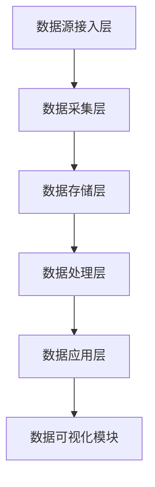

                 

# 《AI DMP 数据基建的技术评估》

## 概述

关键词：AI DMP、数据基建、技术评估、数据管理、数据挖掘、数据分析

摘要：
本文旨在深入探讨AI驱动的数据管理平台（AI DMP）的技术评估，分析其核心概念、架构设计、技术实现及评估方法。通过逐步分析，本文将帮助读者全面理解AI DMP在当前数据驱动时代的重要性和实用性。

## 目录大纲

### 第一部分: AI DMP 数据基建概述

#### 第1章: AI DMP 概念与架构

- 1.1 AI DMP 的定义与意义
- 1.2 AI DMP 的主要组成部分
- 1.3 AI DMP 的架构设计

#### 第2章: 数据采集与管理

- 2.1 数据源类型与选择
- 2.2 数据采集技术
- 2.3 数据质量管理与处理

#### 第3章: 数据建模与处理

- 3.1 数据建模基础
- 3.2 特征工程
- 3.3 数据预处理与格式化

#### 第4章: 数据分析与挖掘

- 4.1 数据分析方法
- 4.2 数据挖掘算法
- 4.3 数据可视化技术

#### 第5章: 数据安全与隐私保护

- 5.1 数据安全策略
- 5.2 数据隐私保护方法
- 5.3 GDPR与数据保护

#### 第6章: AI DMP 技术评估方法

- 6.1 评估指标体系
- 6.2 评估模型构建
- 6.3 实际案例评估分析

#### 第7章: AI DMP 实战案例

- 7.1 案例背景与目标
- 7.2 案例数据采集与管理
- 7.3 案例数据处理与分析
- 7.4 案例评估与优化

### 第二部分: AI DMP 技术深度解析

#### 第8章: AI DMP 核心技术详解

- 8.1 特征提取与选择
- 8.2 模型评估与优化
- 8.3 深度学习算法在DMP中的应用

#### 第9章: AI DMP 数学模型与公式解析

- 9.1 概率论基础
- 9.2 线性代数基础
- 9.3 最优化算法

#### 第10章: AI DMP 项目实战

- 10.1 实战项目规划
- 10.2 数据采集与处理
- 10.3 数据建模与优化
- 10.4 模型评估与优化
- 10.5 项目总结与反思

### 附录

#### 附录 A: AI DMP 开发工具与资源

- A.1 主流数据采集工具
- A.2 数据处理与建模工具
- A.3 深度学习框架
- A.4 数据可视化工具

---

随着大数据和人工智能的飞速发展，AI驱动的数据管理平台（Data Management Platform，简称DMP）已经成为企业和组织处理海量数据、挖掘数据价值的重要工具。本文将围绕AI DMP的数据基建进行技术评估，旨在为读者提供全面的AI DMP技术理解和实践指导。

### 第一部分: AI DMP 数据基建概述

#### 第1章: AI DMP 概念与架构

##### 1.1 AI DMP 的定义与意义

AI DMP（Artificial Intelligence Data Management Platform）是一种结合人工智能技术的数据管理平台，旨在通过自动化和智能化的方式，对企业内外部数据进行高效管理和分析。AI DMP不仅具备传统DMP的数据采集、管理和分析功能，还能利用机器学习和深度学习算法，实现数据的智能化处理和决策支持。

AI DMP的意义主要体现在以下几个方面：

1. **数据价值挖掘**：AI DMP能够通过算法模型，挖掘数据中的潜在价值，为企业和组织提供更加精准的市场洞察和决策支持。
2. **提高运营效率**：通过自动化处理数据，减少人工干预，提高数据处理的效率和准确性。
3. **提升用户体验**：AI DMP能够根据用户行为和偏好，提供个性化的推荐和服务，提升用户满意度和忠诚度。

##### 1.2 AI DMP 的主要组成部分

AI DMP主要由以下几个关键组成部分构成：

1. **数据采集模块**：负责收集企业内部和外部的数据，包括用户行为数据、交易数据、社交媒体数据等。
2. **数据存储模块**：用于存储和管理采集到的数据，通常采用分布式存储系统，如Hadoop、HBase等。
3. **数据清洗模块**：负责对采集到的数据进行清洗、去重、格式化等处理，确保数据的质量和一致性。
4. **数据建模模块**：利用机器学习和深度学习算法，对数据进行建模和特征提取，为后续的分析和挖掘提供支持。
5. **分析挖掘模块**：采用各种数据分析方法和数据挖掘算法，对数据进行深入挖掘，提取有用的信息和知识。
6. **数据可视化模块**：通过图形和报表等形式，将分析结果可视化，便于用户理解和决策。

##### 1.3 AI DMP 的架构设计

AI DMP的架构设计通常采用分布式和模块化设计，以适应大规模数据处理的复杂性。以下是AI DMP的一种常见架构设计：

1. **数据源接入层**：负责与各种数据源进行连接和接入，包括内部数据库、外部API、文件系统等。
2. **数据采集层**：负责将数据源接入层采集到的数据进行初步处理，如数据清洗、去重等。
3. **数据存储层**：采用分布式存储系统，如Hadoop、HBase等，对清洗后的数据进行存储和管理。
4. **数据处理层**：包括数据建模、特征提取、模型训练等模块，利用机器学习和深度学习算法，对数据进行处理和分析。
5. **数据应用层**：包括数据分析、数据挖掘、数据可视化等模块，将分析结果应用于实际业务场景，如用户画像、精准营销等。

图1展示了AI DMP的一种典型架构设计：

#### 第2章: 数据采集与管理

##### 2.1 数据源类型与选择

在AI DMP中，数据源的选择至关重要，它直接影响到数据的质量和可用性。常见的数据源类型包括：

1. **用户行为数据**：包括用户在网站、APP等平台上的点击、浏览、搜索、购买等行为数据。
2. **交易数据**：包括用户购买商品、订单、支付等交易数据。
3. **社交媒体数据**：包括用户在社交媒体平台上的发帖、点赞、评论等数据。
4. **第三方数据**：包括来自第三方数据提供商的地理位置、兴趣爱好、人口统计学等数据。

在选择数据源时，需要考虑以下几个因素：

1. **数据质量**：数据源的数据质量直接影响到后续的数据处理和分析效果。需要选择数据质量高、可靠性强的数据源。
2. **数据覆盖面**：数据源的覆盖面越广，能够收集到的数据类型和数量就越多，有助于更全面地了解用户行为和市场趋势。
3. **数据更新频率**：高频更新的数据更能反映当前的市场动态和用户行为，有助于实时做出决策。
4. **数据成本**：不同数据源的成本差异较大，需要根据预算和业务需求进行权衡。

##### 2.2 数据采集技术

数据采集是AI DMP的核心环节之一，其关键在于如何高效、准确地收集到所需的数据。常见的数据采集技术包括：

1. **API接入**：通过接口（API）直接从第三方数据源或平台获取数据。这种方式通常用于获取结构化数据，如用户行为数据、交易数据等。
2. **网络爬虫**：利用爬虫技术从互联网上获取非结构化数据，如社交媒体数据、新闻资讯等。网络爬虫可以模拟用户的浏览器行为，爬取网页内容。
3. **日志收集**：通过收集服务器日志、APP日志等，获取用户在平台上的行为数据。日志收集通常采用日志采集器，如Logstash、Flume等。
4. **数据库导出**：直接从数据库中导出数据，如MySQL、MongoDB等。这种方式适用于内部数据库数据的采集。

在实际应用中，可以根据数据源的类型和特点，选择合适的数据采集技术。例如，对于用户行为数据的采集，可以采用API接入和日志收集相结合的方式；对于社交媒体数据的采集，可以采用网络爬虫技术。

##### 2.3 数据质量管理与处理

数据质量管理是确保数据质量和数据一致性的关键环节。常见的数据质量管理与处理技术包括：

1. **数据清洗**：对采集到的数据进行清洗、去重、格式化等处理，去除数据中的噪声和错误。数据清洗技术包括缺失值处理、异常值处理、数据转换等。
2. **数据去重**：识别和去除重复的数据记录，确保数据的唯一性。
3. **数据整合**：将来自不同数据源的数据进行整合，形成统一的数据视图。数据整合技术包括数据合并、数据连接、数据融合等。
4. **数据转换**：将不同格式、类型的数据转换为统一的格式，便于后续的数据处理和分析。

数据质量管理与处理是AI DMP中不可或缺的一环，它直接影响到数据的价值和应用效果。通过有效的数据质量管理与处理，可以确保数据的准确性、一致性和完整性，为后续的数据分析提供可靠的数据基础。

### 第3章: 数据建模与处理

##### 3.1 数据建模基础

数据建模是AI DMP中的一项关键任务，其目的是通过对数据进行抽象和结构化，构建出能够反映数据关系和特征的模型。数据建模的基础包括以下几个关键概念：

1. **实体**：实体是数据建模中的基本单元，代表现实世界中的对象或概念，如用户、产品、订单等。
2. **属性**：属性是实体的特征或描述，如用户的年龄、性别、地理位置等。
3. **关系**：关系是实体之间的关联，如用户购买产品、产品属于某个类别等。

在数据建模过程中，需要遵循以下基本原则：

1. **最小化冗余**：避免数据重复存储，减少数据冗余。
2. **标准化**：对数据进行规范化处理，确保数据格式和命名的一致性。
3. **灵活性**：数据模型应具备一定的灵活性，能够适应数据变更和业务需求的变化。
4. **扩展性**：数据模型应具备良好的扩展性，便于新增实体、属性和关系的添加。

##### 3.2 特征工程

特征工程是数据建模的关键环节，其目的是通过对原始数据进行预处理和转换，提取出对预测任务有价值的特征。特征工程的主要任务包括：

1. **数据预处理**：包括数据清洗、缺失值处理、异常值处理等，确保数据质量。
2. **特征选择**：从原始数据中筛选出对预测任务有显著影响的特征，减少数据冗余和噪声。
3. **特征转换**：包括数据归一化、标准化、离散化等，将数据转换为适合模型输入的格式。

常见的特征工程方法包括：

1. **统计特征**：基于原始数据的统计指标，如均值、方差、熵等，提取具有统计意义的特征。
2. **交互特征**：通过组合多个原始特征，构建新的交互特征，以提高模型的预测能力。
3. **嵌入特征**：使用机器学习算法，如词嵌入、图嵌入等，将原始数据转换为低维度的特征向量。

特征工程是数据建模中至关重要的一环，它直接影响到模型的性能和预测效果。通过有效的特征工程，可以增强数据的特征表达能力，提高模型的预测准确性和泛化能力。

##### 3.3 数据预处理与格式化

数据预处理和格式化是确保数据质量和一致性的重要步骤，其目的是将原始数据转换为适合模型输入的格式。常见的数据预处理与格式化方法包括：

1. **数据清洗**：去除数据中的噪声和错误，如缺失值、异常值等。
2. **数据归一化**：将数据缩放到一个统一的范围，如[0, 1]或[-1, 1]，以消除不同特征之间的量纲差异。
3. **数据标准化**：将数据转换为具有相同均值和标准差的格式，以消除原始数据中不同特征的分布差异。
4. **数据离散化**：将连续特征转换为离散特征，如将年龄划分为多个年龄段。
5. **数据编码**：将类别特征转换为数值特征，如使用独热编码（One-Hot Encoding）或标签编码（Label Encoding）。

通过有效的数据预处理和格式化，可以提高模型的训练效果和预测准确性，减少过拟合现象。此外，良好的数据预处理和格式化还能提高模型的泛化能力，使其在不同数据集上表现更稳定。

### 第4章: 数据分析与挖掘

##### 4.1 数据分析方法

数据分析是AI DMP的核心任务之一，其目的是通过对数据进行分析和挖掘，提取出有价值的信息和知识。常见的数据分析方法包括：

1. **描述性分析**：对数据进行基本的统计分析，如计算均值、中位数、方差等，以了解数据的分布和趋势。
2. **探索性分析**：通过图表、可视化等方法，对数据进行分析和探索，以发现数据中的异常、关联和趋势。
3. **预测性分析**：利用统计学和机器学习算法，对数据进行分析和建模，预测未来的趋势和变化。
4. **决策支持**：基于数据分析结果，为决策者提供数据支持和建议，以辅助决策过程。

数据分析方法的选择取决于具体的业务需求和数据特点。例如，对于市场调研和竞争分析，可以采用描述性分析和探索性分析；对于风险管理，可以采用预测性分析。

##### 4.2 数据挖掘算法

数据挖掘算法是数据分析的核心工具，其目的是从大量数据中提取出有价值的信息和模式。常见的数据挖掘算法包括：

1. **分类算法**：将数据分为不同的类别，如决策树、随机森林、支持向量机等。
2. **聚类算法**：将数据分为不同的簇，如K-均值、层次聚类、DBSCAN等。
3. **关联规则算法**：发现数据之间的关联关系，如Apriori算法、FP-Growth算法等。
4. **异常检测算法**：识别数据中的异常和离群点，如孤立森林、局部异常因

