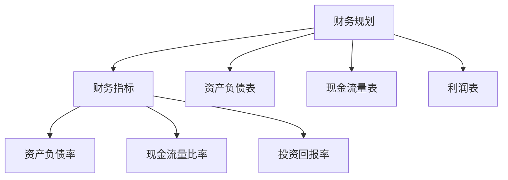

                 

## 《创业路上的财务规划：程序员如何管理资金》

关键词：财务规划、创业、资金管理、程序员、投资回报率、债务管理

摘要：在创业的道路上，财务规划是保证企业稳定发展的关键。作为创业团队的核心成员——程序员，合理管理资金、制定科学的财务规划至关重要。本文将系统地阐述财务规划的基础知识、个人财务规划、创业财务规划以及财务规划实践，为程序员提供全面的财务规划指导。

---

### 目录

#### 第一部分：财务规划基础

**第1章：财务规划概述**  

1.1 财务规划的重要性

1.2 财务规划的目标

1.3 财务规划的原则

**第2章：财务基础知识**

2.1 资产负债表

2.2 现金流量表

2.3 利润表

**第3章：财务核心概念**

3.1 财务指标

3.2 财务风险

3.3 投资回报率

#### 第二部分：个人财务规划

**第4章：个人财务分析**

4.1 个人财务报表

4.2 个人资产负债分析

4.3 个人财务状况评估

**第5章：个人财务规划**

5.1 节省开支

5.2 储蓄计划

5.3 投资规划

**第6章：债务管理**

6.1 债务类型

6.2 债务管理策略

6.3 债务偿还计划

#### 第三部分：创业财务规划

**第7章：创业初期财务规划**

7.1 创业资金来源

7.2 创业预算编制

7.3 创业成本控制

**第8章：创业收入和支出管理**

8.1 创业收入来源

8.2 创业支出管理

8.3 创业利润分析

**第9章：创业者税务规划**

9.1 税务基础

9.2 税务优惠政策

9.3 税务筹划

#### 第四部分：财务规划实践

**第10章：财务规划案例解析**

10.1 案例分析

10.2 案例实施步骤

10.3 案例效果评估

**第11章：财务规划工具与资源**

11.1 财务管理软件

11.2 财务规划参考资料

11.3 财务规划在线工具

#### 附录

**附录A：财务规划公式与计算方法**

A.1 资产负债率计算

A.2 现金流量比率计算

A.3 投资回报率计算

**附录B：财务规划常见问题解答**

B.1 财务规划的意义

B.2 财务规划的方法

B.3 财务规划的实施步骤

**附录C：创业财务规划案例分析**

C.1 案例背景

C.2 案例财务规划方案

C.3 案例实施效果分析

**附录D：财务规划参考书籍与资料**

D.1 财务规划经典书籍推荐

D.2 财务规划在线课程推荐

D.3 财务规划行业报告推荐

### 财务核心概念架构图

#### 财务核心概念架构图



### 财务核心算法原理讲解

#### 投资回报率（ROI）计算

投资回报率（ROI）是衡量投资收益与成本之间关系的重要指标。其计算公式如下：

$$
ROI = \frac{投资收益 - 投资成本}{投资成本} \times 100\%
$$

#### 伪代码实现

```python
def calculateROI(investmentGain, investmentCost):
    roi = (investmentGain - investmentCost) / investmentCost * 100
    return roi
```

#### 储蓄计划数学模型

储蓄计划的目标是在一定时间内积累到一定数额的资金。储蓄计划模型考虑了定期存款利率和定期存款期数。其公式如下：

$$
FV = PV \times (1 + r/n)^{nt}
$$

其中：

- FV 是未来的总金额
- PV 是当前的存款金额
- r 是年利率
- n 是每年计息次数
- t 是存款年限

#### 伪代码实现

```python
def calculateFutureValue(currentAmount, annualInterestRate, years, compoundingFrequency):
    interestRatePerPeriod = annualInterestRate / compoundingFrequency
    numberOfPeriods = years * compoundingFrequency
    futureValue = currentAmount * (1 + interestRatePerPeriod) ** numberOfPeriods
    return futureValue
```

### 附录A：财务规划公式与计算方法

#### A.1 资产负债率计算

资产负债率是衡量企业负债水平的重要指标，其计算公式如下：

$$
资产负债率 = \frac{负债总额}{资产总额} \times 100\%
$$

#### A.2 现金流量比率计算

现金流量比率是衡量企业短期偿债能力的重要指标，其计算公式如下：

$$
现金流量比率 = \frac{经营活动现金流量}{流动负债}
$$

#### A.3 投资回报率计算

投资回报率（ROI）是衡量投资收益与成本之间关系的重要指标。其计算公式如下：

$$
ROI = \frac{投资收益 - 投资成本}{投资成本} \times 100\%
$$

### 附录B：财务规划常见问题解答

#### B.1 财务规划的意义

财务规划对于个人和企业的稳定发展具有重要意义，它可以帮助我们：

- 合理安排资金，避免财务风险。
- 实现财务目标，提高生活质量。
- 提高投资效率，实现资产增值。

#### B.2 财务规划的方法

财务规划的方法主要包括：

- 收支管理：记录和规划日常收支，确保收支平衡。
- 储蓄计划：根据财务目标制定储蓄计划，定期存款。
- 投资规划：选择合适的投资方式，实现资产增值。
- 债务管理：合理管理债务，避免债务风险。

#### B.3 财务规划的实施步骤

财务规划的实施步骤包括：

- 确定财务目标：明确个人或企业的财务目标。
- 收集财务信息：收集和分析个人或企业的财务状况。
- 制定财务计划：根据财务目标制定具体的财务计划。
- 实施和监控：执行财务计划，并定期进行财务状况的监控和调整。

### 附录C：创业财务规划案例分析

#### C.1 案例背景

某创业公司成立初期，需要制定详细的财务规划，以应对市场风险和资金需求。

#### C.2 案例财务规划方案

- 确定财务目标：实现公司年度收入增长20%，控制成本，确保现金流稳定。
- 制定预算：根据公司业务规模和发展目标，制定详细的年度预算。
- 债务管理：合理利用债务融资，降低财务成本，同时确保债务偿还计划。
- 投资规划：根据公司发展需求，进行适当的股权投资和并购。

#### C.3 案例实施效果分析

通过有效的财务规划，公司在一年内实现了收入增长25%，成本控制得当，现金流稳定。同时，通过债务管理和投资规划，公司成功完成了几笔重要的并购，进一步扩大了市场份额。

### 附录D：财务规划参考书籍与资料

#### D.1 财务规划经典书籍推荐

- 《财务自由之路》：作者通过自己的经历，分享了如何实现财务自由的方法。
- 《投资最重要的事》：作者详细阐述了投资的基本原则和策略。
- 《穷爸爸富爸爸》：通过对比两个家庭的教育方式和价值观，揭示了财富积累的真相。

#### D.2 财务规划在线课程推荐

- Coursera上的《Financial Planning and Analysis》：由耶鲁大学教授开设，涵盖了财务规划的核心内容。
- Udemy上的《Investment Management and Financial Planning》：全面介绍了投资管理和财务规划的知识。

#### D.3 财务规划行业报告推荐

- 《中国财务规划行业发展报告》：详细分析了中国财务规划行业的发展趋势和前景。
- 《全球财务规划报告》：分析了全球财务规划行业的现状和未来发展趋势。

### 总结

在创业的道路上，财务规划是保证企业稳定发展的关键。作为程序员，了解并掌握财务规划的基本原理和方法，能够为企业的长远发展提供有力支持。本文系统地阐述了财务规划的基础知识、个人财务规划、创业财务规划以及财务规划实践，旨在为程序员提供全面的财务规划指导。

作者：AI天才研究院/AI Genius Institute & 禅与计算机程序设计艺术 /Zen And The Art of Computer Programming

---

至此，本文《创业路上的财务规划：程序员如何管理资金》已完成。本文通过详细的分析和讲解，帮助程序员理解财务规划的重要性，掌握财务规划的基础知识和实践方法。希望本文能为您的创业之路提供有益的参考。

