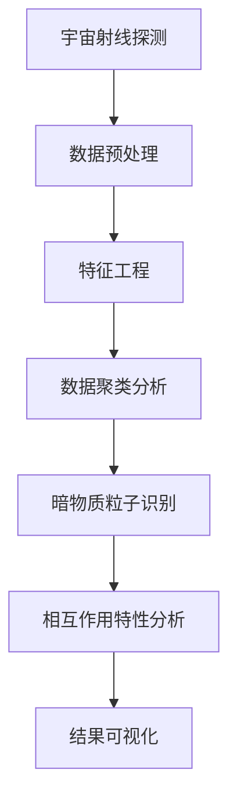
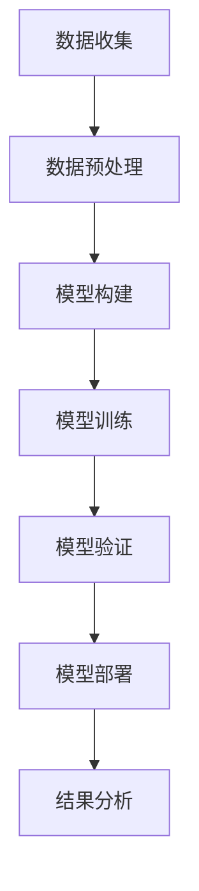

                 

## 文章标题

“数据挖掘在探索宇宙暗物质粒子相互作用特性中的作用”

### 关键词：

- 数据挖掘
- 暗物质
- 粒子物理学
- 相互作用特性
- 数据源
- 算法

### 摘要：

本文从数据挖掘的角度出发，探讨了宇宙暗物质粒子相互作用特性的研究。首先介绍了宇宙暗物质和粒子物理学的基础知识，然后详细阐述了数据挖掘在粒子物理学中的应用历史与发展趋势。接着，本文介绍了数据挖掘的基本流程、数据源、算法与模型，并深入分析了数据挖掘在暗物质粒子相互作用特性研究中的应用。最后，通过实际案例展示了数据挖掘在暗物质研究中的具体应用，并提出了未来研究的方向与展望。

## 第一部分：引言与背景知识

### 第1章：宇宙暗物质与粒子物理学基础

#### 1.1 宇宙暗物质的概念

宇宙暗物质是指一种无法直接观测，但通过引力作用影响宇宙结构的物质。它占据了宇宙总质量的大约85%，但至今仍未被直接探测到。根据粒子物理学理论，暗物质可能由未知的基本粒子组成，如弱相互作用大质量粒子（WIMPs）或轴子等。

#### 1.2 粒子物理学的基本原理

粒子物理学是研究基本粒子和它们相互作用的基础学科。基本粒子包括夸克、轻子、光子、胶子等。粒子之间的相互作用通过力的传递实现，这些力由规范玻色子传递，如光子传递电磁力，W和Z玻色子传递弱力。

#### 1.3 数据挖掘在粒子物理学中的应用历史与发展趋势

数据挖掘在粒子物理学中的应用始于上世纪末。最初，数据挖掘主要用于大型实验数据的管理和分析，如大型强子对撞机（LHC）实验。随着技术的进步，数据挖掘方法在粒子物理学中的应用逐渐扩展，包括特征工程、聚类分析、分类与预测等。

未来，随着粒子物理学的实验规模和数据量的不断增加，数据挖掘在粒子物理学中的应用将会更加深入和广泛。例如，深度学习算法将在高能物理数据分析中发挥重要作用，如图神经网络在粒子鉴别中的应用。

## 第二部分：数据挖掘方法与技术

### 第2章：数据挖掘基本流程

#### 2.1 数据预处理与清洗

数据预处理是数据挖掘流程的第一步，其目的是将原始数据转换为适合分析的形式。数据清洗是数据预处理的一部分，主要任务是处理数据中的缺失值、异常值和重复值。

#### 2.2 特征工程

特征工程是数据挖掘的核心步骤，其目的是从原始数据中提取出对分析任务有用的特征。特征工程包括特征选择、特征变换和特征构造等。

#### 2.3 数据聚类分析

数据聚类分析是一种无监督学习方法，其目的是将数据集分成若干个聚类，使得同一聚类内的数据点相似度较高，而不同聚类间的数据点相似度较低。

#### 2.4 数据分类与预测

数据分类与预测是一种有监督学习方法，其目的是根据已知的数据集，训练出一个模型，用于对新数据进行分类或预测。

#### 2.5 关联规则挖掘

关联规则挖掘是一种无监督学习方法，其目的是发现数据集中的关联关系，如购物篮分析中的商品关联。

### 第3章：宇宙暗物质相关数据源

#### 3.1 天文观测数据

天文观测数据包括宇宙射线、微波背景辐射、卫星观测等数据，是研究暗物质的重要数据来源。

#### 3.2 实验物理数据

实验物理数据包括粒子加速器实验、地下探测器实验等数据，是研究暗物质粒子相互作用的重要数据来源。

#### 3.3 数据共享平台与数据库

数据共享平台与数据库提供了便捷的数据获取和存储方式，如NASA的天文数据库、CERN的实验数据平台等。

### 第4章：数据挖掘算法与模型

#### 4.1 经典机器学习算法

经典机器学习算法包括线性回归、逻辑回归、支持向量机等，是数据挖掘的基础算法。

#### 4.2 深度学习模型在数据挖掘中的应用

深度学习模型包括卷积神经网络（CNN）、循环神经网络（RNN）、生成对抗网络（GAN）等，在数据挖掘中具有广泛应用。

#### 4.3 图神经网络在宇宙暗物质研究中的应用

图神经网络（GNN）是深度学习的一种形式，特别适用于处理图结构数据，如宇宙暗物质网络。

#### 4.4 强化学习在粒子相互作用特性分析中的应用

强化学习是一种通过试错学习策略来优化决策的机器学习方法，在粒子相互作用特性分析中具有潜在应用。

## 第三部分：暗物质粒子相互作用特性研究

### 第5章：暗物质粒子的特性与相互作用

#### 5.1 暗物质粒子的物理特性

暗物质粒子的物理特性包括质量、寿命、自旋等，这些特性决定了暗物质粒子的相互作用机制。

#### 5.2 暗物质粒子的相互作用机制

暗物质粒子的相互作用机制主要包括引力相互作用、弱相互作用等，这些相互作用决定了暗物质粒子在宇宙中的分布。

#### 5.3 暗物质粒子在宇宙中的分布

暗物质粒子在宇宙中的分布主要表现为均匀分布和非均匀分布，这影响了宇宙的结构和演化。

### 第6章：宇宙暗物质粒子的探测方法

#### 6.1 宇宙射线探测

宇宙射线探测是研究暗物质粒子的重要方法，通过探测宇宙射线与地球大气层相互作用产生的二次粒子来推断暗物质粒子的特性。

#### 6.2 微波背景辐射探测

微波背景辐射探测是通过测量宇宙早期的辐射信号来研究暗物质粒子在宇宙中的分布和演化。

#### 6.3 卫星观测与空间实验

卫星观测与空间实验提供了从宇宙空间直接探测暗物质粒子的方法，如中微子探测器、暗物质粒子探测卫星等。

### 第7章：数据挖掘在暗物质研究中的应用案例

#### 7.1 案例一：利用数据挖掘方法分析宇宙射线数据

本案例将介绍如何使用数据挖掘方法分析宇宙射线数据，包括数据预处理、特征工程、数据聚类等。

#### 7.2 案例二：基于深度学习模型的暗物质粒子相互作用特性预测

本案例将介绍如何使用深度学习模型预测暗物质粒子相互作用特性，包括模型构建、训练与验证等。

#### 7.3 案例三：应用图神经网络分析宇宙暗物质网络结构

本案例将介绍如何使用图神经网络分析宇宙暗物质网络结构，包括图神经网络模型构建、训练与解析等。

## 第四部分：展望与未来趋势

### 第8章：数据挖掘在暗物质研究中的挑战与机遇

#### 8.1 数据挖掘技术面临的挑战

随着暗物质研究的数据量不断增加，数据挖掘技术面临的挑战包括数据复杂性、算法效率、计算资源等。

#### 8.2 暗物质研究中的机遇

暗物质研究中的机遇包括发现新的暗物质粒子、理解宇宙的起源和演化、探索新的物理现象等。

#### 8.3 未来研究方向与展望

未来研究方向包括开发新的数据挖掘算法、结合多源数据、利用人工智能技术等，以提高暗物质研究的准确性和效率。

## 附录

### 附录A：常用数据挖掘工具与库

#### A.1 Python在数据挖掘中的应用

Python 是数据挖掘领域最常用的编程语言之一，拥有丰富的数据挖掘库，如Pandas、Scikit-learn、TensorFlow等。

#### A.2 常见机器学习库介绍

常见机器学习库包括Scikit-learn、TensorFlow、PyTorch等，提供了丰富的算法和工具。

#### A.3 宇宙暗物质相关数据源与数据库

宇宙暗物质相关数据源与数据库包括NASA的Exoplanet Archive、CERN的实验数据平台等。

### 附录B：暗物质粒子相互作用特性的Mermaid流程图

#### B.1 暗物质粒子相互作用特性分析流程

使用 Mermaid 画出的暗物质粒子相互作用特性分析流程图。



#### B.2 深度学习模型在暗物质研究中的应用流程

使用 Mermaid 画出的深度学习模型在暗物质研究中的应用流程图。



### 附录C：数据挖掘算法与模型的伪代码实现

#### C.1 数据预处理与清洗伪代码实现

```python
# 伪代码：数据预处理与清洗
def preprocess_data(data):
    # 数据清洗
    data = clean_data(data)
    # 数据标准化
    data = standardize_data(data)
    return data
```

#### C.2 数据聚类分析伪代码实现

```python
# 伪代码：数据聚类分析
def cluster_data(data, k):
    # 构建模型
    model = KMeans(n_clusters=k)
    # 模型训练
    model.fit(data)
    # 获取聚类结果
    clusters = model.predict(data)
    return clusters
```

#### C.3 数据分类与预测伪代码实现

```python
# 伪代码：数据分类与预测
def classify_data(data, model):
    # 模型预测
    predictions = model.predict(data)
    # 计算准确率
    accuracy = calculate_accuracy(predictions, labels)
    return accuracy
```

### 附录D：暗物质研究中的数学模型与公式

#### D.1 暗物质粒子相互作用模型

$$
\Delta\phi = \frac{G_{\text{DM}} m_{\chi}^2 \rho_{\text{DM}}}{c^2 r}
$$

#### D.2 微波背景辐射模型

$$
I(\theta, \phi) = I_0 \left[ 1 - \frac{3k_B T_0}{\pi c^2} \left( \frac{\theta}{\theta_0} \right)^3 \right]
$$

#### D.3 宇宙射线模型

$$
N(E) \propto E^{-\gamma} \exp\left(-\frac{E}{m_0 c^2}\right)
$$

### 附录E：数据挖掘在暗物质研究中的应用案例

#### E.1 案例一：宇宙射线数据分析

本案例将展示如何使用数据挖掘方法分析宇宙射线数据，包括数据读取、预处理、特征提取和聚类分析等。

#### E.2 案例二：深度学习模型预测

本案例将展示如何使用深度学习模型预测暗物质粒子的相互作用特性，包括数据预处理、模型构建、训练和验证等。

#### E.3 案例三：图神经网络分析

本案例将展示如何使用图神经网络分析宇宙暗物质网络结构，包括图构建、模型训练和结果分析等。

### 作者

作者：AI天才研究院/AI Genius Institute & 禅与计算机程序设计艺术 /Zen And The Art of Computer Programming

