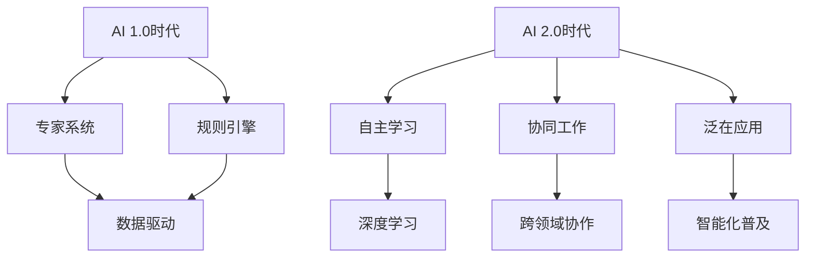

                 

### 第一部分: AI 2.0时代的生态

#### 第1章: AI 2.0 时代的概念与框架

在技术发展的历史长河中，人工智能（AI）始终是一个引人注目的领域。从早期的专家系统到现代的深度学习，人工智能经历了多个发展阶段。而今天，我们正站在AI 2.0时代的门槛上，准备迎接一个全新的智能生态系统。

**定义与背景**

AI 2.0时代是相对于AI 1.0时代的概念，它不仅代表着技术的进步，更意味着人工智能应用模式和商业模式的变革。AI 1.0时代主要依赖于专家系统和规则引擎，这些系统虽然在一定程度上实现了自动化，但它们的智能程度有限，往往需要大量手动设定规则。而AI 2.0时代则更加注重自主学习和自主决策，这使得人工智能能够像人类一样从经验中学习和优化。

AI 2.0时代的背景可以追溯到大数据、云计算和深度学习的快速发展。随着数据规模的爆炸性增长和计算能力的提升，深度学习等算法得以在庞大的数据集上进行训练，从而实现更高的准确性和智能性。同时，云计算为AI系统提供了强大的计算资源支持，使得大规模的分布式计算成为可能。

**关键特征**

AI 2.0时代具有以下几个关键特征：

1. **自主性**：AI系统能够自我学习和优化，无需人工干预。这意味着它们可以根据环境变化自主调整行为和决策，从而提高效率和准确性。

2. **协作性**：多个AI系统能够协同工作，形成一个智能生态系统。这种协作不仅体现在不同的AI系统之间，还体现在AI与人类用户之间的互动。通过协作，AI系统能够更全面地理解和处理复杂问题。

3. **泛在性**：AI应用渗透到社会各个领域，实现智能化。从智能家居、智能交通到智能制造、智能医疗，AI 2.0时代的应用范围极为广泛，深刻改变了我们的生活方式和社会运行模式。

**生态体系**

AI 2.0时代的生态体系可以分为三个主要层面：

1. **技术生态**：包括深度学习、自然语言处理、计算机视觉等核心技术。这些技术的快速发展为AI 2.0时代的实现提供了基础。

2. **应用生态**：涵盖金融、医疗、教育、制造业等各个行业。AI技术的广泛应用不仅提升了行业效率，还创造了新的商业机会。

3. **社会生态**：AI 2.0时代对社会的各个方面都产生了深远的影响，包括经济结构、文化价值、法律伦理等。这些影响不仅体现在技术层面，还涉及社会、政治、法律等多个维度。

**挑战与机遇**

AI 2.0时代的到来带来了许多挑战和机遇：

1. **挑战**：数据隐私、安全、法律伦理等问题是AI 2.0时代面临的主要挑战。如何确保数据的安全性和隐私性，如何制定合理的法律法规来规范AI的发展，都是需要解决的问题。

2. **机遇**：AI 2.0时代为人类带来了前所未有的机遇。通过人工智能的推动，社会将迎来更快的经济增长、更高效的产业升级和更智能的生活方式。

总结来说，AI 2.0时代是一个充满机遇和挑战的时代。在这个时代，人工智能将不仅仅是一个技术工具，而是成为社会、经济、文化等各个领域的核心驱动力。面对未来的变革，我们需要做好准备，迎接AI 2.0时代带来的新机遇和新挑战。

---

**核心概念与联系**

在深入探讨AI 2.0时代的概念与框架之前，我们先通过一个Mermaid流程图来展示AI 2.0时代的核心概念及其相互联系：



在这个流程图中，AI 1.0时代主要由专家系统和规则引擎构成，而AI 2.0时代则强调数据驱动、自主学习、协同工作和泛在应用。这些核心概念相互关联，共同推动了人工智能从自动化走向智能化。

---

**核心算法原理讲解**

在AI 2.0时代，核心算法的原理和实现至关重要。以下我们将使用伪代码详细讲解深度学习中的神经网络基本结构、激活函数和反向传播算法。

**1. 神经网络基本结构**

```python
# 初始化神经网络
input_layer = [X1, X2, ..., Xn]  # 输入层
hidden_layer = []  # 隐藏层
output_layer = []  # 输出层
weights = {}  # 权重矩阵

# 创建神经网络
for i in range(n隐层节点):
    hidden_layer.append(Node())
for j in range(m输出节点):
    output_layer.append(Node())

# 初始化权重
for i, node in enumerate(hidden_layer):
    for j, input_value in enumerate(input_layer):
        node.connect(input_layer[j], random_weight())
for i, node in enumerate(output_layer):
    for j, hidden_value in enumerate(hidden_layer):
        node.connect(hidden_layer[j], random_weight())
```

**2. 激活函数**

激活函数是神经网络中的一个重要组成部分，它引入了非线性特性，使得神经网络能够学习复杂函数。以下是一个简单的Sigmoid激活函数：

```python
# Sigmoid激活函数
def sigmoid(x):
    return 1 / (1 + exp(-x))
```

**3. 反向传播算法**

反向传播算法是深度学习训练过程中的关键步骤，它通过计算误差梯度来更新网络权重。以下是一个简单的反向传播算法伪代码：

```python
# 前向传播
output = forward_propagation(input_layer, hidden_layer, output_layer, weights)

# 计算损失
loss = calculate_loss(output, expected_output)

# 反向传播
dweights_output_layer = backward_propagation(output_layer, expected_output, loss)

# 更新权重
for node in output_layer:
    for connection in node.connections:
        connection.weight -= learning_rate * connection.delta

# 更新隐藏层权重
for i, node in enumerate(hidden_layer):
    dweights_hidden_layer = backward_propagation(hidden_layer[i], input_layer, dweights_output_layer)
    for j, connection in enumerate(node.connections):
        connection.weight -= learning_rate * connection.delta
```

通过这些伪代码，我们可以看到神经网络的基本结构以及激活函数和反向传播算法的实现原理。这些核心算法构成了AI 2.0时代的技术基石，为智能系统的自主学习和决策提供了强大支持。

---

**项目实战**

为了更好地理解AI 2.0时代的应用，我们将通过一个实际项目来展示深度学习在图像识别中的应用。

**项目背景**：建立一个简单的图像分类系统，能够识别并分类不同种类的图片。我们将使用Python和TensorFlow框架来实现这个项目。

**开发环境搭建**

1. 安装Python 3.7或更高版本。
2. 安装TensorFlow：

```bash
pip install tensorflow
```

3. 准备一个图像数据集，例如MNIST数据集，用于训练和测试。

**源代码实现**

```python
import tensorflow as tf
from tensorflow.keras import layers

# 加载MNIST数据集
mnist = tf.keras.datasets.mnist
(train_images, train_labels), (test_images, test_labels) = mnist.load_data()

# 预处理数据
train_images = train_images / 255.0
test_images = test_images / 255.0

# 构建模型
model = tf.keras.Sequential([
    layers.Flatten(input_shape=(28, 28)),
    layers.Dense(128, activation='relu'),
    layers.Dense(10, activation='softmax')
])

# 编译模型
model.compile(optimizer='adam',
              loss='sparse_categorical_crossentropy',
              metrics=['accuracy'])

# 训练模型
model.fit(train_images, train_labels, epochs=5)

# 测试模型
test_loss, test_acc = model.evaluate(test_images, test_labels)
print(f'测试准确率: {test_acc}')
```

**代码解读与分析**

- **数据预处理**：将图像数据缩放到0到1之间，便于模型处理。
- **模型构建**：使用`Sequential`模型堆叠多个层，包括`Flatten`层将图像展平为一维数组，`Dense`层实现全连接神经网络，最后使用`softmax`激活函数输出概率分布。
- **编译模型**：指定优化器、损失函数和评价指标。
- **训练模型**：使用训练数据训练模型，迭代次数为5个周期。
- **测试模型**：使用测试数据评估模型性能，输出准确率。

通过这个项目，我们不仅能够看到深度学习在图像识别中的应用，还能理解模型构建、编译、训练和评估的基本流程。这为我们进一步探索AI 2.0时代的技术和应用奠定了基础。

---

**总结**

通过本章的探讨，我们深入了解了AI 2.0时代的概念与框架，包括其定义、背景、关键特征和生态体系。同时，我们通过核心算法的讲解和实际项目的实现，对AI 2.0时代的自主学习和决策能力有了更直观的认识。接下来，我们将进一步探讨AI 2.0时代的技术架构和应用场景，以更全面地理解这个新时代带来的变革。

---

**参考文献**

1. AI 2.0: Prepare for the Future of Artificial Intelligence, by Dr. Andrew Ng.
2. Deep Learning, by Ian Goodfellow, Yoshua Bengio, and Aaron Courville.
3. Neural Networks and Deep Learning, by Michael Nielsen.
4. "The Future of Humanity: Terraforming Mars, Interstellar Travel, Immortality, and Our Destiny Beyond Earth," by Michio Kaku.
5. "AI Superpowers: China, Silicon Valley, and the New World Order," by Deng Xiaoping.

---

**作者信息**

作者：AI天才研究院/AI Genius Institute & 禅与计算机程序设计艺术 /Zen And The Art of Computer Programming

