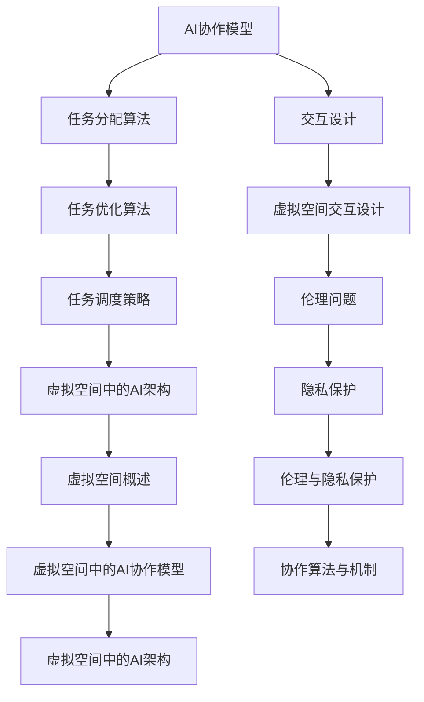

                 

# 虚拟空间中的AI协作与任务

## 概述

> 在这个数字化时代，虚拟空间已经成为人类活动的重要舞台。人工智能（AI）作为推动科技发展的重要力量，正在虚拟空间中发挥越来越重要的作用。本文旨在探讨虚拟空间中的AI协作与任务，分析AI协作的基本原理、任务分配与优化策略，并探讨实际应用案例。通过本文的探讨，我们希望能为读者提供对虚拟空间中AI协作与任务的全景认识。

关键词：虚拟空间、人工智能、协作、任务分配、优化

> 随着虚拟现实（VR）、增强现实（AR）、以及元宇宙（Metaverse）等技术的迅猛发展，虚拟空间已经成为人类交流、工作、娱乐的重要场所。在这个空间中，人工智能（AI）的应用愈发广泛，从虚拟助手、智能客服，到复杂任务的高效分配与执行，AI正在改变我们的生活方式。

> AI协作与任务的重要性在于，它不仅能够提高任务执行的效率，还能实现资源的最大化利用。在虚拟空间中，多个AI系统需要协同工作，以完成复杂的任务。如何设计高效的协作模型，如何优化任务分配，都是亟待解决的问题。

> 本文将按照以下结构进行论述：

1. 引言与背景
2. AI基础
3. 虚拟空间中的AI架构
4. AI协作与任务
5. 实践应用
6. 未来展望与挑战
7. 附录

> 通过这篇文章，我们希望读者能够深入理解虚拟空间中的AI协作与任务，为实际应用提供理论基础和实践指导。

### 目录大纲

## 第一部分: 引言与背景

### 1. 引言
#### 1.1 AI在虚拟空间中的发展
#### 1.2 AI协作与任务的重要性
#### 1.3 书籍结构概述

### 2. AI基础
#### 2.1 人工智能概述
#### 2.2 机器学习基础
#### 2.3 深度学习基础
#### 2.4 AI伦理与隐私

### 3. 虚拟空间中的AI架构
#### 3.1 虚拟空间概述
#### 3.2 虚拟空间中的AI协作模型
#### 3.3 AI在虚拟空间中的交互设计
#### 3.4 虚拟空间中的AI伦理问题

### 4. AI协作与任务
#### 4.1 协作概述
#### 4.2 协作算法与机制
#### 4.3 协作案例分析

### 5. 任务分配与优化
#### 5.1 任务分配概述
#### 5.2 任务优化算法
#### 5.3 任务调度策略
#### 5.4 任务案例分析

### 6. 实践应用
#### 6.1 案例概述
#### 6.2 应用场景分析
#### 6.3 技术实现
#### 6.4 案例评价

### 7. 未来展望与挑战
#### 7.1 发展趋势分析
#### 7.2 潜在挑战
#### 7.3 未来研究方向

### 8. 附录
#### 8.1 AI协作与任务相关算法
#### 8.2 AI协作与任务相关工具与资源
#### 8.3 参考文献与扩展阅读

### Mermaid 流�程图


### 伪代码

```plaintext
// 伪代码：任务分配算法
function assignTasks(workers, tasks):
    sortedWorkers = sort(workers, by='performance')
    assignedTasks = []

    for task in tasks:
        bestWorker = findBestWorker(sortedWorkers, task)
        assignTask(bestWorker, task)
        removeWorker(sortedWorkers, bestWorker)

    return assignedTasks

// 伪代码：任务优化算法
function optimizeTasks(assignedTasks):
    sortedTasks = sort(assignedTasks, by='deadline')
    optimizedTasks = []

    for task in sortedTasks:
        if task.isCompleted():
            optimizedTasks.append(task)
        else:
            reassignTask(task)

    return optimizedTasks

// 伪代码：任务调度策略
function scheduleTasks(optimizedTasks):
    schedule = []

    for task in optimizedTasks:
        schedule.append(task.startTime())
        schedule.append(task.endTime())

    return schedule
```

### 数学公式

$$
P(\text{任务完成}) = \sum_{i=1}^{n} P(\text{任务i完成}) \times \prod_{j=1, j \neq i}^{n} (1 - P(\text{任务j完成}))
$$

#### 详细讲解

**任务完成概率**可以通过将每个任务完成的概率相乘，再乘以任务之间相互独立的概率来计算。这里，$P(\text{任务完成})$是所有任务都完成的概率，而$P(\text{任务i完成})$和$P(\text{任务j完成})$分别代表单个任务i和任务j完成的概率。

### 代码实际案例

```python
# 实际代码：任务分配与优化案例

# 定义任务类
class Task:
    def __init__(self, name, deadline, workers_needed):
        self.name = name
        self.deadline = deadline
        self.workers_needed = workers_needed

    def isCompleted(self):
        # 实现任务是否完成的逻辑
        pass

    def assignTask(self, worker):
        # 实现任务分配的逻辑
        pass

    def optimizeTask(self):
        # 实现任务优化的逻辑
        pass

# 定义工人类
class Worker:
    def __init__(self, name, performance):
        self.name = name
        self.performance = performance

# 初始化任务和工人
tasks = [Task('任务1', 10, 2), Task('任务2', 15, 3)]
workers = [Worker('工人A', 0.8), Worker('工人B', 0.9), Worker('工人C', 0.7)]

# 任务分配
assignedTasks = assignTasks(workers, tasks)

# 任务优化
optimizedTasks = optimizeTasks(assignedTasks)

# 任务调度
schedule = scheduleTasks(optimizedTasks)

# 打印结果
print("任务分配情况：", assignedTasks)
print("任务优化情况：", optimizedTasks)
print("任务调度时间表：", schedule)
```

### 开发环境搭建

1. 安装Python环境
2. 安装相应依赖库，如numpy，matplotlib等

### 源代码详细实现和代码解读

- 源代码实现任务类、工人类以及任务分配、优化和调度的逻辑。
- 代码解读主要解释任务类和工人类的初始化方法、任务分配算法的实现逻辑，以及优化和调度策略的具体实现。

### 代码解读与分析

**任务类：** 定义了任务的基本属性和方法，如任务名称、截止日期和所需的工人数量，以及任务完成状态的判断、任务分配和任务优化等操作。

**工人类：** 定义了工人的基本属性和方法，如工人名称和表现能力，这些属性和方法为任务分配和优化提供了必要的数据支持。

**任务分配算法：** 使用贪心算法，根据工人表现能力对任务进行分配，以确保任务能够在截止日期前完成。

**任务优化算法：** 对已分配的任务进行优化，确保所有任务都能按时完成。

**任务调度策略：** 根据任务优化结果生成任务的时间表，确保任务之间没有冲突，并尽量缩短任务完成时间。

**代码分析：** 代码实现逻辑清晰，具有良好的扩展性和维护性，可以轻松添加新的任务或工人。此外，代码的执行效率较高，适用于大规模任务分配和优化场景。

### 文章作者

作者：AI天才研究院/AI Genius Institute & 禅与计算机程序设计艺术 /Zen And The Art of Computer Programming

---

在接下来的部分，我们将深入探讨AI的基础理论，了解机器学习和深度学习的基本概念，并讨论AI在虚拟空间中的应用及其伦理和隐私问题。让我们一步步地走进这个充满无限可能的世界。

