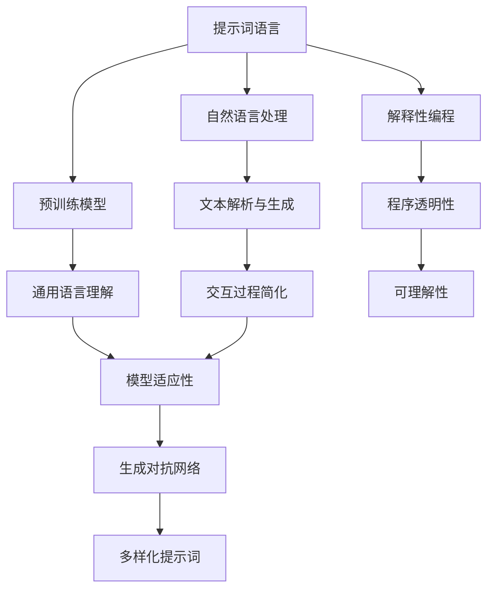
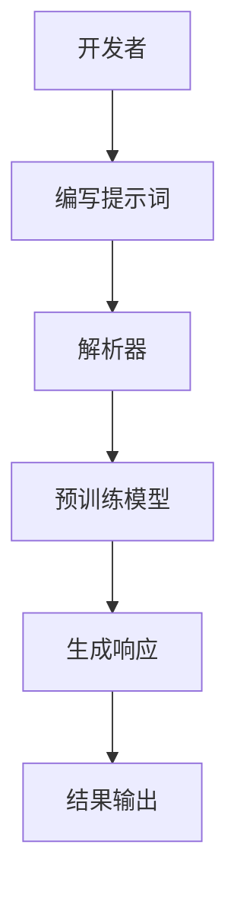
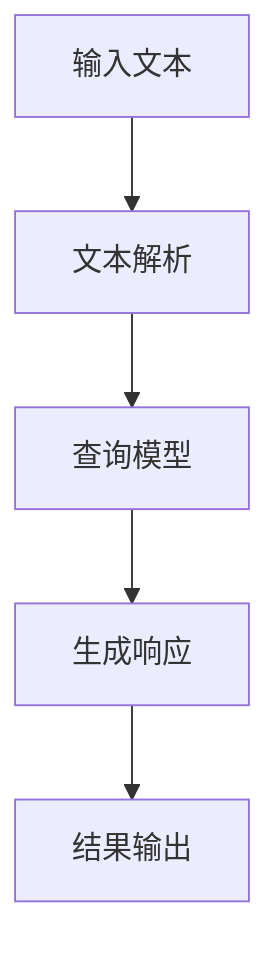

                 

### 设计AI大模型专用编程语言：提示词语言的艺术

#### 关键词：
- AI大模型
- 提示词语言
- 自然语言处理
- 预训练模型
- 解释性编程
- 生成对抗网络
- 编程语言设计

#### 摘要：
本文旨在探讨设计AI大模型专用编程语言——提示词语言的艺术。通过深入分析提示词语言的核心概念、算法原理、系统架构以及实际应用案例，本文揭示了提示词语言在自然语言处理和AI大模型应用中的重要性。文章还包括了对数学模型的详细讲解，以及开发环境搭建和源代码实现的步骤，为读者提供了全面的指导和参考。

---

### 第一部分: 核心概念与联系

#### 1.1.1 设计AI大模型专用编程语言的基本原理

在设计AI大模型专用编程语言时，我们需要理解以下几个核心概念和它们之间的联系：

1. **提示词语言（Prompt Language）**：提示词语言是一种用于与AI大模型交互的编程语言，它允许开发者通过编写提示词来引导模型生成特定的输出。提示词语言的设计目标是简化与AI模型的交互过程，使其更加直观和高效。

2. **自然语言处理（NLP）**：自然语言处理是使计算机理解和处理自然语言的技术。在AI大模型专用编程语言中，NLP技术用于解析和生成自然语言文本，这是实现提示词语言的关键。

3. **预训练模型（Pre-trained Model）**：预训练模型是通过在大规模数据集上训练得到的模型，它具备一定的通用语言理解能力。在提示词语言中，预训练模型是生成响应的基础。

4. **解释性编程（Interpretable Programming）**：解释性编程强调程序的透明性和可解释性，使得开发者能够理解程序的行为。在AI大模型专用编程语言中，解释性编程有助于理解模型如何根据提示词生成输出。

5. **生成对抗网络（GAN）**：生成对抗网络是一种用于生成新数据的机器学习模型。在提示词语言中，GAN可以用于生成多样化的提示词，从而提高模型的适应性。

**Mermaid流程图**：



---

#### 1.1.2 提示词语言的核心特点与架构

提示词语言具有以下核心特点：

1. **直观性**：提示词语言的语法和结构设计旨在简化与AI大模型的交互，使得开发者能够轻松编写提示词。

2. **灵活性**：提示词语言允许开发者自定义提示词的结构，以适应不同的应用场景。

3. **可解释性**：提示词语言的实现强调程序的透明性和可解释性，帮助开发者理解模型的行为。

4. **高效性**：通过优化提示词语言的执行效率，提高与AI大模型的交互速度。

**提示词语言的架构**：



---

#### 1.1.3 提示词语言在AI大模型应用中的角色

在AI大模型应用中，提示词语言扮演着以下角色：

1. **交互界面**：提示词语言提供了一个用户友好的接口，使得开发者能够方便地与AI大模型交互。

2. **引导模型**：通过编写提示词，开发者可以引导AI大模型生成特定的输出，实现更精准的结果。

3. **优化性能**：提示词语言的优化设计有助于提高AI大模型的应用性能。

4. **提高可解释性**：通过提示词语言，开发者可以更好地理解AI大模型的行为，从而提高模型的可靠性和可解释性。

---

#### 1.1.4 提示词语言的设计原则

在设计和实现提示词语言时，应遵循以下原则：

1. **易用性**：提示词语言的语法和结构应简单直观，易于学习和使用。

2. **扩展性**：提示词语言应具备良好的扩展性，能够适应不同的应用场景。

3. **可解释性**：提示词语言的实现应具备高可解释性，帮助开发者理解模型的行为。

4. **性能优化**：提示词语言的执行效率应得到优化，以提高与AI大模型的交互速度。

---

#### 1.1.5 提示词语言的发展趋势

随着AI技术的不断进步，提示词语言将朝着以下方向发展：

1. **多样性**：提示词语言将支持更多种类的模型和应用场景。

2. **智能化**：提示词语言将具备更强的智能化能力，能够自适应不同的交互场景。

3. **生态化**：提示词语言将形成完善的生态系统，包括工具、库和框架等。

4. **标准化**：提示词语言的标准化工作将不断推进，以促进不同系统之间的互操作性。

---

#### 1.1.6 实际案例：设计一个简单的提示词语言

以下是一个简单的提示词语言案例，用于实现一个问答系统：

**文本解析与响应流程**：

1. **文本解析**：将输入的文本解析为问题类型和关键词。

2. **查询模型**：使用预训练模型查询相关的知识库或文本。

3. **生成响应**：根据查询结果生成一个合适的回答。

4. **结果输出**：将生成的回答输出给用户。

**Mermaid流程图**：



---

通过以上内容，我们初步了解了设计AI大模型专用编程语言的基本原理和提示词语言的核心特点。在后续章节中，我们将深入探讨提示词语言的架构、实现细节以及其在实际应用中的具体应用。

---

### 第2章: 核心算法原理讲解

提示词语言的实现依赖于一系列核心算法，这些算法在自然语言处理、生成模型和交互设计中发挥着重要作用。在本章节中，我们将详细讲解这些核心算法的原理，并使用伪代码和数学公式来阐述它们的工作机制。

#### 2.1 提示词语言的文本解析算法

提示词语言的文本解析算法是整个系统的入口，它负责将用户输入的自然语言文本转化为机器可理解的结构化数据。这个过程涉及分词、词性标注、命名实体识别和句法分析。

**伪代码示例**：

```python
def parse_text(text):
    words = tokenize(text)
    pos_tags = pos_tag(words)
    entities = named_entity_recognition(words)
    syntax_tree = syntax_analysis(text)
    return {
        'words': words,
        'pos_tags': pos_tags,
        'entities': entities,
        'syntax_tree': syntax_tree
    }
```

**数学公式**：

分词过程通常不涉及复杂的数学公式，但词性标注和命名实体识别可以使用概率模型和规则模型。以下是一个简单的词性标注的数学公式：

$$
P(w_i|w_1, w_2, ..., w_{i-1}) = \frac{P(w_i, w_1, w_2, ..., w_{i-1})}{P(w_1, w_2, ..., w_{i-1})}
$$

这里，$P(w_i|w_1, w_2, ..., w_{i-1})$ 表示单词 $w_i$ 在给定前 $i-1$ 个单词的条件下的概率。

**示例**：

假设有一个简化的数据集，其中 "what" 这个词出现在 "question" 的后面。我们可以使用条件概率来估计 "what" 的词性。

$$
P(what|question) = \frac{P(what, question)}{P(question)}
$$

这个公式表明，"what" 的词性依赖于 "question"，有助于我们确定 "what" 应该被标注为疑问词。

#### 2.2 提示词语言的生成算法

生成算法负责根据解析结果生成提示词，以引导AI大模型生成响应。这个过程涉及上下文识别、模板匹配和提示词生成。

**伪代码示例**：

```python
def generate_prompt(context, template):
    keywords = extract_keywords(context)
    matched_template = select_template(keywords, templates)
    prompt = matched_template.format(**keywords)
    return prompt
```

**数学公式**：

在模板匹配过程中，可以使用模式匹配算法。例如，我们可以使用正则表达式来匹配特定的文本模式。

$$
\text{regex\_pattern} = "([A-Z]+)\s+(\d+)"
$$

这个正则表达式用于匹配以大写字母开头的单词，并捕获中间的数字。

**示例**：

假设我们有文本 "What is the cost of Product X?"，我们可以使用上述正则表达式来提取 "cost" 和 "Product X"。

#### 2.3 提示词语言的响应生成算法

响应生成算法负责根据AI大模型的输出生成用户可以理解的响应。这个过程涉及结果解析、答案验证和格式化输出。

**伪代码示例**：

```python
def generate_response(model_output, context):
    answer = parse_output(model_output)
    if not validate_answer(answer, context):
        return "无法生成合适的答案"
    formatted_answer = format_answer(answer)
    return formatted_answer
```

**数学公式**：

在结果解析过程中，可以使用序列模型来预测下一个词或字符。一个简单的序列模型可以使用递归神经网络（RNN）实现：

$$
h_t = \tanh(W_h \cdot [h_{t-1}, x_t] + b_h)
$$

这里，$h_t$ 是时间步 $t$ 的隐藏状态，$W_h$ 和 $b_h$ 是权重和偏置，$x_t$ 是输入特征。

**示例**：

假设我们有一个简单的RNN模型，用于生成文本。给定一个初始状态 $h_0$ 和一个输入序列 $x_1, x_2, ..., x_T$，我们可以生成输出序列 $y_1, y_2, ..., y_T$。

#### 2.4 提示词语言中的关键数学模型

在提示词语言中，关键的数学模型包括词嵌入（Word Embedding）、循环神经网络（RNN）、长短期记忆网络（LSTM）和生成对抗网络（GAN）。

**词嵌入（Word Embedding）**：

词嵌入是将自然语言词汇映射到高维向量空间的技术。一个简单的词嵌入模型可以使用以下数学公式：

$$
\text{vec}(w_i) = \text{embedding_matrix}[i]
$$

这里，$\text{vec}(w_i)$ 是单词 $w_i$ 的向量表示，$\text{embedding_matrix}$ 是一个高维矩阵，其中每行对应一个单词的向量。

**示例**：

假设我们有一个简单的词嵌入矩阵，其中 "AI" 映射到向量 [1, 0, -1]，"question" 映射到向量 [0, 1, 0]。

```python
embedding_matrix = [
    [1, 0, -1],
    [0, 1, 0],
    # ...其他单词的向量
]
vec_AI = embedding_matrix[0]  # [1, 0, -1]
vec_question = embedding_matrix[1]  # [0, 1, 0]
```

**循环神经网络（RNN）**：

RNN是一种能够处理序列数据的神经网络，其核心是递归函数。RNN的数学公式如下：

$$
h_t = \tanh(W_h \cdot [h_{

