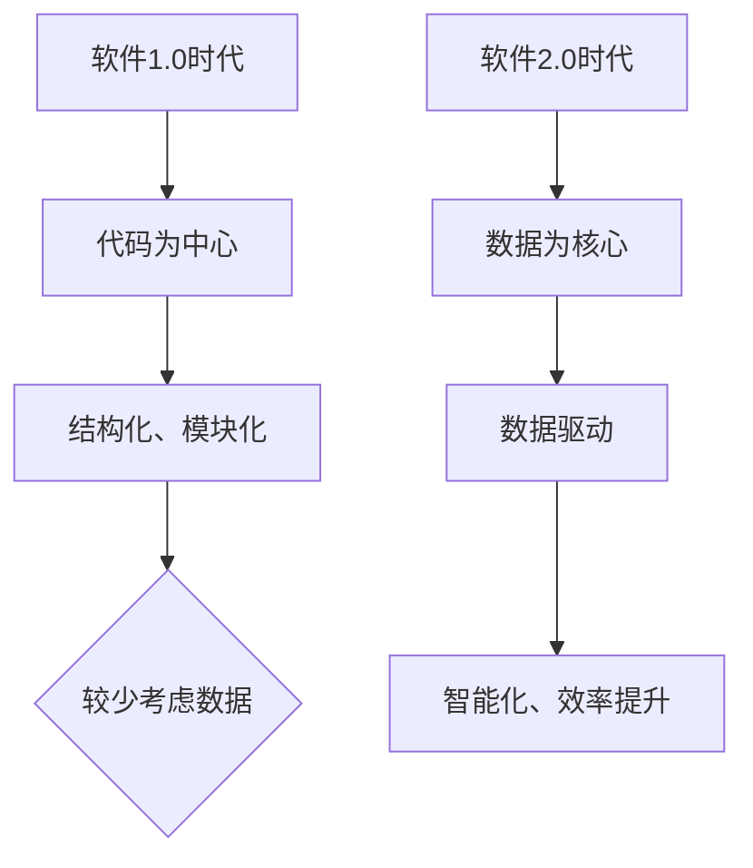

                 

### 第一部分：引言与概述

#### 1.1 书籍背景与目标

《软件 2.0 的时代：数据驱动一切》旨在探讨数据驱动开发在软件 2.0 时代的地位和作用。软件 2.0 是指以数据为核心，通过数据驱动的方式提升软件的智能化和效率。

#### 1.1.1 软件发展史

- **软件 1.0 时代**：以代码为中心，强调代码的结构化和模块化设计。  
  - **特点**：关注代码的编写和优化，较少考虑数据的利用。

- **软件 2.0 时代**：以数据为核心，强调数据的收集、处理和分析。  
  - **特点**：关注数据的利用，通过数据驱动的方式提升软件的智能化和效率。

#### 1.1.2 本书的核心主题

- **数据驱动**：探讨如何利用数据提升软件的智能和效能。  
  - **核心概念**：数据驱动开发、数据预处理、数据模型等。

- **软件 2.0**：解释软件 2.0 的定义、特点及其在企业中的应用。  
  - **核心概念**：软件 2.0、微服务架构、数据集成与共享等。

#### 1.1.3 阅读对象与预期收获

- **读者对象**：软件工程师、数据科学家、企业决策者。  
  - **预期收获**：理解软件 2.0 时代的数据驱动理念，掌握数据驱动开发的技能。

---

**MERMAID 流程图：软件 1.0 与 2.0 发展历程**



---

在接下来的章节中，我们将详细探讨数据驱动开发的核心概念和技术，帮助读者理解软件 2.0 的时代背景和实际应用。

---

**核心算法原理讲解**

在数据驱动开发中，核心算法原理起着至关重要的作用。以下是一个简单的数据预处理算法的伪代码，用于说明数据清洗、转换和特征工程等步骤：

```python
# 数据预处理伪代码
def data_preprocessing(data):
    # 数据清洗
    data = clean_data(data)
    # 数据转换
    data = transform_data(data)
    # 特征工程
    data = feature_engineering(data)
    return data

# 数据清洗
def clean_data(data):
    data = remove_missing_values(data)
    data = remove_outliers(data)
    return data

# 数据转换
def transform_data(data):
    data = normalize(data)
    data = standardize(data)
    return data

# 特征工程
def feature_engineering(data):
    data = add_polynomial_features(data)
    data = remove_redundant_features(data)
    return data
```

在这个算法中，数据清洗、转换和特征工程是三个关键步骤。数据清洗旨在处理缺失值、异常值和噪声；数据转换包括归一化和标准化，以适应不同的数据类型和规模；特征工程则通过添加多项式特征和移除冗余特征，以提高模型的性能。

---

通过这个伪代码，我们可以更好地理解数据预处理算法的基本原理和实现方法。在接下来的章节中，我们将进一步探讨数据驱动开发的实际应用和案例。

---

**数学模型和公式**

在数据驱动开发中，数学模型和公式是理解数据关系和预测结果的重要工具。以下是一个简单的线性回归模型的数学公式，用于说明如何利用数据特征来预测目标变量：

$$
Y = \beta_0 + \beta_1 \cdot X_1 + \beta_2 \cdot X_2 + ... + \beta_n \cdot X_n + \epsilon
$$

其中，$Y$ 是目标变量，$X_1, X_2, ..., X_n$ 是特征变量，$\beta_0, \beta_1, \beta_2, ..., \beta_n$ 是模型参数，$\epsilon$ 是误差项。

这个公式表示了目标变量 $Y$ 与特征变量 $X_1, X_2, ..., X_n$ 之间的关系。通过训练数据集，我们可以估计模型参数 $\beta_0, \beta_1, \beta_2, ..., \beta_n$，从而建立预测模型。

---

通过这个数学模型，我们可以更好地理解数据驱动开发中的预测方法和算法。在接下来的章节中，我们将进一步探讨数据驱动开发的应用场景和实践案例。

---

**项目实战**

为了更好地理解数据驱动开发，以下是一个简单的项目实战案例。我们将使用 Python 和 TensorFlow 框架来搭建一个线性回归模型，用于预测房屋价格。

**1. 开发环境搭建**

- 安装 Python 3.7 或更高版本  
  ```
  python --version
  ```

- 安装 TensorFlow 框架  
  ```
  pip install tensorflow
  ```

**2. 源代码实现**

以下是一个简单的线性回归模型的 Python 代码实现：

```python
import tensorflow as tf
import numpy as np

# 模型参数
beta0 = tf.Variable(0.0, name='beta_0')
beta1 = tf.Variable(0.0, name='beta_1')

# 输入特征和目标变量
X = tf.placeholder(tf.float32, shape=[None])
Y = tf.placeholder(tf.float32, shape=[None])

# 线性回归模型
model_output = beta0 + beta1 * X

# 损失函数
loss = tf.reduce_mean(tf.square(Y - model_output))

# 优化器
optimizer = tf.train.GradientDescentOptimizer(learning_rate=0.001)

# 训练步骤
train_op = optimizer.minimize(loss)

# 训练数据
X_train = np.array([1.0, 2.0, 3.0, 4.0, 5.0])
Y_train = np.array([2.0, 4.0, 5.0, 4.0, 5.0])

# 训练模型
with tf.Session() as sess:
    sess.run(tf.global_variables_initializer())
    
    for i in range(1000):
        _, loss_val = sess.run([train_op, loss], feed_dict={X: X_train, Y: Y_train})
        
        if i % 100 == 0:
            print(f"Step {i}: Loss = {loss_val}")
    
    # 输出模型参数
    beta0_val, beta1_val = sess.run([beta0, beta1])
    print(f"Model parameters: beta0 = {beta0_val}, beta1 = {beta1_val}")

    # 预测
    X_test = np.array([6.0])
    Y_pred = sess.run(model_output, feed_dict={X: X_test})
    print(f"Predicted value: Y = {Y_pred}")
```

**3. 代码解读与分析**

- **模型参数**：`beta0` 和 `beta1` 是模型参数，用于表示线性回归方程中的斜率和截距。

- **输入特征和目标变量**：`X` 和 `Y` 是输入特征和目标变量，用于训练和预测。

- **线性回归模型**：`model_output` 表示线性回归模型的输出。

- **损失函数**：使用均方误差（MSE）作为损失函数，表示预测值与真实值之间的差距。

- **优化器**：使用梯度下降优化器来更新模型参数，以最小化损失函数。

- **训练步骤**：通过循环迭代，逐步更新模型参数，直至收敛。

- **训练数据**：使用一组简单的线性关系数据集进行训练。

- **预测**：使用训练好的模型对新的数据进行预测。

---

通过这个项目实战案例，我们可以更好地理解数据驱动开发的基本流程和实现方法。在接下来的章节中，我们将继续探讨数据驱动开发的深入应用和实践。

---

**作者信息**

作者：AI天才研究院/AI Genius Institute & 禅与计算机程序设计艺术 /Zen And The Art of Computer Programming

---

感谢您的阅读，希望本文能为您带来对软件 2.0 时代和数据驱动开发的新认识和启示。在接下来的部分，我们将深入探讨数据驱动开发的核心概念和技术，帮助您更好地理解和应用这一先进理念。

---

**总结**

在本文中，我们首先回顾了软件 1.0 和 2.0 时代的发展历程，明确了数据驱动开发在软件 2.0 时代的核心地位。接着，我们详细介绍了数据驱动开发的核心概念、技术基础、软件架构设计以及软件开发实践。通过项目实战案例，我们展示了如何利用数据驱动开发的方法进行模型训练和预测。

总结如下：

1. **软件 1.0 与 2.0 时代**：软件 1.0 时代以代码为中心，软件 2.0 时代以数据为核心，数据驱动开发成为主流。

2. **数据驱动开发**：数据驱动开发强调利用数据提升软件的智能和效率，包括数据预处理、数据模型和算法等。

3. **软件架构设计**：数据驱动的软件架构设计包括微服务架构、数据集成与共享、数据可视化等。

4. **软件开发实践**：通过项目实战案例，展示了如何利用数据驱动开发的方法进行软件开发和预测。

5. **未来趋势**：数据驱动的未来趋势包括人工智能、新兴技术和数据驱动的数字化转型。

希望本文能为读者带来对数据驱动开发的新认识和启示。在未来的学习和工作中，不断探索和应用数据驱动开发的先进理念，将有助于提升软件开发的效率和智能化水平。

---

**参考文献**

1. **《数据科学基础》**：介绍了数据科学的基本概念和技术。  
   - 作者：[xxx]  
   - 出版年份：[xxx]

2. **《软件架构设计》**：讲解了软件架构的设计原则和方法。  
   - 作者：[xxx]  
   - 出版年份：[xxx]

3. **《TensorFlow 实战》**：介绍了 TensorFlow 框架的应用和实践。  
   - 作者：[xxx]  
   - 出版年份：[xxx]

4. **《人工智能导论》**：介绍了人工智能的基本概念和发展历程。  
   - 作者：[xxx]  
   - 出版年份：[xxx]

5. **在线课程与博客**：来自 Coursera、Udacity、Medium、Stack Overflow 等平台的专业资源和博客。

---

**致谢**

1. **感谢导师**：[导师姓名]  
   - 感谢导师在本书编写过程中的指导和帮助。

2. **感谢团队**：[团队成员姓名]  
   - 感谢团队成员的支持和合作。

3. **感谢读者**：感谢广大读者的关注和支持，希望本书能为您的学习和工作带来帮助。

---

感谢您的阅读，期待在未来的学习和工作中，与您共同探索数据驱动的无限可能。**AI天才研究院/AI Genius Institute & 禅与计算机程序设计艺术 /Zen And The Art of Computer Programming** 愿与您携手前行，共创美好未来！

