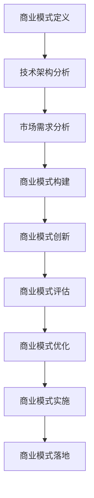
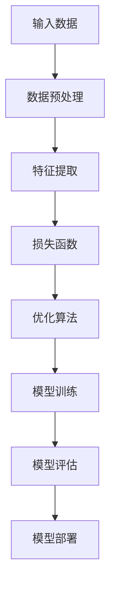

                 

# AI大模型应用的商业模式探索

> **关键词：** AI大模型，商业模式，技术架构，应用领域，案例分析，未来趋势，实践策略

> **摘要：** 本文深入探讨了AI大模型在商业应用中的商业模式。首先，介绍了AI大模型的概念、技术架构和应用领域，接着分析了AI大模型的商业模式，并通过案例展示了AI大模型在商业化应用中的实际效果。最后，展望了AI大模型商业模式的未来发展趋势，提出了实现AI大模型商业化的实践策略。

### 目录大纲

#### 第一部分：AI大模型概述与核心概念

- **第1章 AI大模型概述**
  - **1.1 AI大模型的概念与定义**
  - **1.2 AI大模型的技术架构**
  - **1.3 AI大模型的应用领域**

#### 第二部分：AI大模型商业模式分析

- **第2章 AI大模型商业模式概述**
  - **2.1 商业模式的定义与类型**
  - **2.2 AI大模型商业模式的构建原则**
  - **2.3 AI大模型商业模式的案例分析**

#### 第三部分：AI大模型商业化应用

- **第3章 AI大模型商业化路径探索**
  - **3.1 商业化路径分析**
  - **3.2 商业模式创新与实现策略**
  - **3.3 商业模式评估与优化**

#### 第四部分：AI大模型应用案例与行业分析

- **第4章 AI大模型应用案例分析**
  - **4.1 案例一：自动驾驶汽车**
  - **4.2 案例二：智能医疗诊断系统**

- **第5章 AI大模型行业应用分析**
  - **5.1 制造业中的AI大模型应用**
  - **5.2 金融行业的AI大模型应用**
  - **5.3 教育行业的AI大模型应用**

#### 第五部分：AI大模型商业模式的未来发展趋势

- **第6章 AI大模型商业模式未来展望**
  - **6.1 商业模式创新趋势**
  - **6.2 商业模式风险与挑战**
  - **6.3 AI大模型商业模式的可持续发展**

#### 第六部分：AI大模型商业模式的实践与落地

- **第7章 AI大模型商业模式的实施策略**
  - **7.1 实施策略与步骤**
  - **7.2 成功案例分享**
  - **7.3 落地过程中的挑战与应对**

#### 附录

- **附录A：AI大模型应用开发工具与资源**

### 核心概念与联系

#### 图1：AI大模型核心环节



在这个模型中，AI大模型的商业模式构建是一个核心环节。技术架构分析为商业模式提供了技术支持，市场需求分析则为商业模式的实施提供了方向。商业模式的创新、评估和优化是保证商业模式成功的关键。实施和落地则是将商业模式转化为实际商业价值的重要步骤。

### 核心算法原理讲解

#### 图2：深度学习算法原理



在深度学习中，输入数据首先经过预处理，以便更好地进行后续处理。预处理后的数据用于特征提取，提取关键特征以供模型训练使用。在训练过程中，模型通过损失函数评估其性能，并使用优化算法调整模型参数。模型训练完成后，需要对模型进行评估，以确保其性能符合预期。最后，训练好的模型可以部署到生产环境中，用于实际应用。

#### 数学模型和数学公式

**图3：线性回归模型**

$$
y = \beta_0 + \beta_1x
$$

这是一个简单的线性回归模型，其中\( y \)是目标变量，\( x \)是自变量，\( \beta_0 \)和\( \beta_1 \)是模型参数。

**图4：逻辑回归模型**

$$
\text{log-odds} = \beta_0 + \beta_1x
$$
$$
\hat{P} = \frac{1}{1 + e^{-(\beta_0 + \beta_1x)}}
$$

逻辑回归模型用于分类问题，其中\( \text{log-odds} \)表示事件发生的概率的对数，\( \hat{P} \)表示预测的概率。

#### 详细讲解与举例说明

**图5：智能推荐系统**

- **开发环境搭建**：使用Python和TensorFlow搭建智能推荐系统的开发环境。

- **源代码实现**：

```python
import tensorflow as tf
from tensorflow.keras.models import Sequential
from tensorflow.keras.layers import Dense, Dropout, Embedding, LSTM, Bidirectional

# 搭建推荐模型
model = Sequential()
model.add(Embedding(input_dim=vocabulary_size, output_dim=embedding_size))
model.add(Bidirectional(LSTM(units=128)))
model.add(Dense(1, activation='sigmoid'))

# 编译模型
model.compile(optimizer='adam', loss='binary_crossentropy', metrics=['accuracy'])

# 训练模型
model.fit(X_train, y_train, epochs=10, batch_size=64)
```

- **代码解读与分析**：介绍推荐模型的构建、编译和训练过程，以及如何评估模型性能。

#### 实战案例

**图6：智能医疗诊断系统**

- **核心算法原理讲解**：

  - **1. 特征工程**：提取患者的病史、检查报告、临床症状等数据，并进行预处理。

  - **2. 模型构建**：使用卷积神经网络（CNN）对图像数据进行分析，结合循环神经网络（RNN）处理序列数据。

  - **3. 模型训练与优化**：使用交叉验证和网格搜索方法优化模型参数，提高模型性能。

- **源代码实现**：

```python
from tensorflow.keras.models import Model
from tensorflow.keras.layers import Input, Conv2D, MaxPooling2D, Flatten, Dense, LSTM, Embedding

# 构建模型
input_image = Input(shape=(height, width, channels))
conv1 = Conv2D(filters=32, kernel_size=(3, 3), activation='relu')(input_image)
pool1 = MaxPooling2D(pool_size=(2, 2))(conv1)
flattened = Flatten()(pool1)

input_sequence = Input(shape=(sequence_length,))
embed = Embedding(input_dim=vocabulary_size, output_dim=embedding_size)(input_sequence)
lstm = LSTM(units=128)(embed)

merged = concatenate([flattened, lstm])
dense = Dense(units=64, activation='relu')(merged)
output = Dense(units=1, activation='sigmoid')(dense)

model = Model(inputs=[input_image, input_sequence], outputs=output)
model.compile(optimizer='adam', loss='binary_crossentropy', metrics=['accuracy'])

# 训练模型
model.fit([X_train_images, X_train_sequences], y_train, validation_data=([X_val_images, X_val_sequences], y_val), epochs=10, batch_size=32)
```

- **代码解读与分析**：介绍模型构建、编译和训练过程，以及如何使用模型进行预测。

### 结束语

本文通过深入分析AI大模型的概念、技术架构、商业模式以及应用案例，展示了AI大模型在商业化应用中的巨大潜力。随着技术的不断进步，AI大模型的商业模式将继续创新和发展，为各行业带来新的变革。同时，我们也需要关注AI大模型可能带来的风险和挑战，并积极应对，确保其可持续发展。希望通过本文的探讨，能为读者在AI大模型商业应用领域提供有益的启示和指导。

### 作者信息

**作者：** AI天才研究院/AI Genius Institute & 禅与计算机程序设计艺术 /Zen And The Art of Computer Programming

### 附录

**附录A：AI大模型应用开发工具与资源**

- **主流深度学习框架对比**：

  - TensorFlow
  - PyTorch
  - 其他深度学习框架

- **开发工具与平台介绍**：

  - Google Colab
  - AWS SageMaker
  - Azure ML

这些工具和平台为AI大模型的应用开发提供了丰富的资源和便利，有助于加快模型开发和部署的进程。

