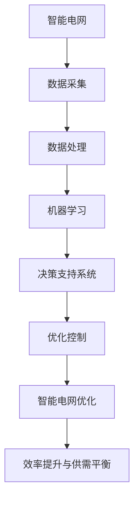

                 

# AI驱动的智能电网：平衡供需提高效率

> **关键词：** 智能电网，人工智能，供需平衡，效率提升，电力系统

> **摘要：** 本文深入探讨了AI驱动的智能电网在平衡供需和提高效率方面的应用。通过对智能电网的概述、AI在其中的作用、关键问题的分析以及具体应用案例的讨论，揭示了AI在电力系统中的巨大潜力，为未来电力系统的可持续发展提供了新思路。

## 目录大纲

### 第一部分：AI驱动的智能电网概述

#### 1.1 AI驱动的智能电网概述

##### 1.1.1 智能电网的概念与发展历程

##### 1.1.2 AI在智能电网中的作用

##### 1.1.3 AI驱动的智能电网技术发展趋势

#### 1.2 智能电网的核心问题

##### 1.2.1 供需不平衡问题

##### 1.2.2 效率提升问题

##### 1.2.3 可持续发展问题

#### 1.3 AI驱动的智能电网与未来电力系统

##### 1.3.1 AI驱动的智能电网对电力系统的影响

##### 1.3.2 未来电力系统的愿景与挑战

### 第二部分：AI在智能电网中的应用

#### 2.1 电力系统监测与诊断

##### 2.1.1 AI在电力系统监测中的应用

##### 2.1.2 AI在电力系统故障诊断中的应用

##### 2.1.3 AI在电力系统设备状态评估中的应用

#### 2.2 电力负荷预测与优化

##### 2.2.1 电力负荷预测方法

##### 2.2.2 电力负荷优化策略

##### 2.2.3 AI驱动的电力负荷预测与优化案例分析

#### 2.3 分布式能源管理

##### 2.3.1 分布式能源概述

##### 2.3.2 AI在分布式能源管理中的应用

##### 2.3.3 AI驱动的分布式能源优化案例分析

#### 2.4 能源市场与交易

##### 2.4.1 能源市场概述

##### 2.4.2 AI在能源市场交易中的应用

##### 2.4.3 AI驱动的能源市场交易案例分析

#### 2.5 能源效率与节能减排

##### 2.5.1 能源效率提升方法

##### 2.5.2 AI在节能减排中的应用

##### 2.5.3 AI驱动的节能减排案例分析

### 第三部分：AI驱动的智能电网项目实践

#### 3.1 AI驱动的智能电网项目规划与实施

##### 3.1.1 项目规划与需求分析

##### 3.1.2 项目实施流程与关键步骤

##### 3.1.3 项目风险评估与应对策略

#### 3.2 案例研究：AI驱动的智能电网项目案例

##### 3.2.1 项目背景与目标

##### 3.2.2 项目实施过程

##### 3.2.3 项目效果评估

#### 3.3 挑战与未来展望

##### 3.3.1 AI驱动的智能电网面临的挑战

##### 3.3.2 未来发展方向与趋势

##### 3.3.3 推动AI驱动的智能电网发展的策略与建议

### 附录

#### 附录A：AI驱动的智能电网常用技术

##### A.1 数据采集与处理技术

##### A.2 机器学习算法与应用

##### A.3 深度学习框架介绍

#### 附录B：智能电网AI项目资源

##### B.1 开源工具与框架

##### B.2 学术研究资源

##### B.3 行业标准与规范

#### 附录C：参考文献

##### C.1 专著

##### C.2 期刊论文

##### C.3 会议论文

##### C.4 报告与白皮书

### 核心概念与联系

#### 智能电网与AI的关系流程图



### 核心算法原理讲解

#### 电力负荷预测算法伪代码

```python
def predict_power_load(data):
    # 数据预处理
    processed_data = preprocess_data(data)

    # 特征工程
    features = extract_features(processed_data)

    # 训练模型
    model = train_model(features, processed_data)

    # 预测
    predicted_load = model.predict(features)

    return predicted_load
```

#### 能量平衡方程

$$E_{in} = E_{out} + \Delta E$$

**详细讲解：** 能量平衡方程表示系统输入能量等于输出能量加能量变化量。在智能电网中，这个方程体现了电力系统的基本原理，即输入的电能等于输出的电能加上系统内部的能量损失。

### 项目实战

#### AI驱动的智能电网案例实现

1. **开发环境搭建：**

   - 配置Python环境，安装必要的深度学习框架（如TensorFlow、PyTorch）。
   - 安装数据预处理工具（如Pandas、NumPy）。

2. **数据采集与处理：**

   - 采集电力系统数据，包括历史负荷数据、电网状态数据等。
   - 清洗数据，去除噪声和不完整的数据。
   - 对数据进行特征提取和工程，以提取有用的特征信息。

3. **模型训练与优化：**

   - 选择合适的模型结构，例如使用回归模型或深度神经网络。
   - 使用训练数据集训练模型，并根据验证数据集进行模型优化。

4. **预测与优化：**

   - 使用训练好的模型对未来的电力负荷进行预测。
   - 根据预测结果调整电网的运行策略，以优化电力系统的效率和供需平衡。

5. **代码解读与分析：**

   - **代码段一：数据预处理**
     ```python
     def preprocess_data(data):
         # 数据清洗
         data = clean_data(data)
         
         # 数据标准化
         data = standardize_data(data)
         
         return data
     ```
     **解释：** 此代码段实现了数据清洗和标准化的功能，为后续的特征提取和模型训练做好准备。

   - **代码段二：特征提取**
     ```python
     def extract_features(processed_data):
         # 提取时间序列特征
         time_series_features = extract_time_series_features(processed_data)
         
         # 提取统计特征
         statistical_features = extract_statistical_features(processed_data)
         
         return np.concatenate((time_series_features, statistical_features), axis=1)
     ```
     **解释：** 此代码段从预处理后的数据中提取时间序列特征和统计特征，用于模型的输入。

   - **代码段三：模型训练**
     ```python
     def train_model(features, labels):
         # 初始化模型
         model = create_model()
         
         # 训练模型
         model.fit(features, labels, epochs=100, batch_size=32, validation_split=0.2)
         
         return model
     ```
     **解释：** 此代码段定义了模型训练的过程，包括模型初始化、模型训练以及模型评估。

   - **代码段四：预测**
     ```python
     def predict_load(model, new_data):
         # 特征提取
         features = extract_features(new_data)
         
         # 预测
         predicted_load = model.predict(features)
         
         return predicted_load
     ```
     **解释：** 此代码段实现了对新数据的特征提取和负荷预测功能。

### 作者信息

**作者：AI天才研究院/AI Genius Institute & 禅与计算机程序设计艺术 /Zen And The Art of Computer Programming**

