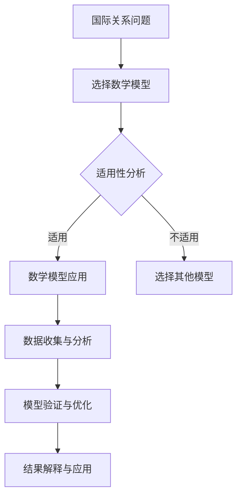

                 

## 《数学与国际关系：国际互动的数学分析》

> **关键词：** 数学方法、国际关系、博弈论、线性规划、风险分析、决策模型

**摘要：** 本文将探讨如何运用数学方法来分析国际关系中的互动与决策。通过引入动态系统理论、联邦理论与博弈论、以及社会网络分析等数学工具，我们将构建一系列国际互动的数学模型，从而揭示国家间互动的内在机制和策略选择。文章还将探讨数学方法在国际政治、国际经济、国际安全以及国际组织决策中的具体应用，并通过案例研究展示其实际效果。最后，我们将总结核心概念，提供相关的数学工具和应用资源，为读者提供进一步研究的方向。

### 《数学与国际关系：国际互动的数学分析》目录大纲

#### 第一部分：数学与国际关系基础

##### 第1章：数学工具与国际关系的初步了解
- **1.1 国际关系的定义与基本概念**
- **1.2 数学方法在国际关系研究中的应用**
- **1.3 国际关系中的常见数学模型**
- **1.4 数学方法在国际关系中的局限性**

##### 第2章：国际互动的数学模型
- **2.1 动态系统理论**
  - **2.1.1 离散时间动态系统**
  - **2.1.2 连续时间动态系统**
  - **2.1.3 主导方程与流图**
- **2.2 联邦理论与博弈论**
  - **2.2.1 联邦理论的基本概念**
  - **2.2.2 博弈论的基础**
  - **2.2.3 博弈策略与均衡分析**
- **2.3 社会网络分析**
  - **2.3.1 社会网络的定义与类型**
  - **2.3.2 社会网络的基本属性**
  - **2.3.3 社会网络分析的应用**

#### 第二部分：数学方法在国际关系中的应用

##### 第3章：国际政治中的博弈论分析
- **3.1 博弈论的基本概念**
  - **3.1.1 博弈的基本要素**
  - **3.1.2 博弈的分类**
- **3.2 完全信息静态博弈**
  - **3.2.1 纳什均衡**
  - **3.2.2 博弈策略分析**
- **3.3 不完全信息静态博弈**
  - **3.3.1 贝叶斯纳什均衡**
  - **3.3.2 隐性知识博弈**

##### 第4章：国际经济中的优化模型
- **4.1 优化模型的基本概念**
  - **4.1.1 优化问题的定义**
  - **4.1.2 优化问题的分类**
- **4.2 线性规划**
  - **4.2.1 线性规划问题**
  - **4.2.2 单纯形方法**
- **4.3 非线性规划**
  - **4.3.1 非线性规划问题**
  - **4.3.2 拉格朗日乘数法**
- **4.4 多目标优化**
  - **4.4.1 多目标优化问题**
  - **4.4.2 目标规划方法**

##### 第5章：国际安全中的风险分析
- **5.1 风险管理的基本概念**
  - **5.1.1 风险的定义与分类**
  - **5.1.2 风险管理策略**
- **5.2 概率论与数理统计**
  - **5.2.1 概率论的基本原理**
  - **5.2.2 数理统计的方法与应用**
- **5.3 风险评估模型**
  - **5.3.1 风险评估矩阵**
  - **5.3.2 风险评估报告**

##### 第6章：国际组织中的决策分析
- **6.1 决策分析的基本概念**
  - **6.1.1 决策过程**
  - **6.1.2 决策模型**
- **6.2 决策树分析**
  - **6.2.1 决策树的基本结构**
  - **6.2.2 决策树分析方法**
- **6.3 划分规则分析**
  - **6.3.1 划分规则的基本原理**
  - **6.3.2 划分规则的应用**

##### 第7章：案例研究：国际互动的数学分析应用
- **7.1 国际贸易中的优化策略**
  - **7.1.1 贸易模型的构建**
  - **7.1.2 贸易优化的案例分析**
- **7.2 国际安全中的风险防范**
  - **7.2.1 安全风险模型的建立**
  - **7.2.2 风险防范策略**
- **7.3 国际组织中的决策案例分析**
  - **7.3.1 决策分析的应用场景**
  - **7.3.2 决策效果评估**

#### 附录

##### 附录A：数学工具与应用资源
- **A.1 数学工具软件介绍**
- **A.2 国际关系数据库资源**
- **A.3 数学方法在国际关系研究中的应用案例汇总**

### 核心概念与联系

**国际互动的数学分析流程图：**



### 核心算法原理讲解

**博弈论算法原理：**

```plaintext
# 博弈论算法原理
# 纳什均衡（Nash Equilibrium）

# 定义：在博弈中，如果所有玩家都选择了最优策略，并且没有其他玩家可以单方面改变自己的策略来获得更好的结果，则该策略组合被称为纳什均衡。

# 伪代码：
function NashEquilibrium(players, strategies):
    for each player P in players:
        for each strategy S in strategies[P]:
            if there is no other strategy S' such that payoff(P, S') > payoff(P, S):
                return True
    return False
```

**线性规划模型：**

```latex
# 线性规划模型
\min_{x} c^T x \\
s.t. \\
Ax \leq b \\
x \geq 0
```

**举例说明：**

```plaintext
# 例：最小化成本
# 最小化 2x + 3y \\
# 约束条件： \\
# x + 2y \leq 10 \\
# x, y \geq 0 \\
```

### 数学模型和数学公式 & 详细讲解 & 举例说明

**线性规划模型：**

```latex
# 线性规划模型
\min_{x} c^T x \\
s.t. \\
Ax \leq b \\
x \geq 0
```

**举例说明：**

```plaintext
# 例：最小化成本
# 最小化 2x + 3y \\
# 约束条件： \\
# x + 2y \leq 10 \\
# x, y \geq 0 \\
```

### 项目实战

**国际贸易优化策略案例：**

```plaintext
# 项目背景
# 一家国际贸易公司需要在两个市场（市场A和市场B）中分配资源，以最大化利润。

# 环境变量
- 市场A的利润率为10美元/单位
- 市场B的利润率为15美元/单位
- 市场A的容量为100单位
- 市场B的容量为200单位
- 每单位产品的生产成本为5美元

# 目标函数
- 总利润 = 市场A利润 + 市场B利润
- 总利润 = 10x + 15y \\
其中，x为市场A的产量，y为市场B的产量

# 约束条件
- 市场A的产量不超过100单位： x \leq 100
- 市场B的产量不超过200单位： y \leq 200
- 产量不能为负： x, y \geq 0

# 解决方案
# 使用线性规划模型求解：
\min_{x, y} (10x + 15y) \\
s.t. \\
x + 2y \leq 10 \\
x, y \geq 0

# 结果解读
# 解得：x = 0, y = 5
# 即在市场A不生产，市场B生产5单位产品时，总利润最大，为75美元。
```

**开发环境搭建：**

- 安装Python环境
- 安装线性规划库（例如：PuLP或SciPy）
- 配置数据输入接口

**源代码详细实现和代码解读：**

```python
# 导入线性规划库
from scipy.optimize import linprog

# 目标函数
c = [-10, -15]

# 约束条件
A = [[1, 2], [-1, 0]]
b = [10, 200]

# 输入变量
x = [0, 0]

# 求解线性规划问题
result = linprog(c, A_ub=A, b_ub=b, x0=x, method='highs')

# 输出结果
print("产量x:", result.x[0])
print("产量y:", result.x[1])
print("总利润:", -1 * result.fun)
```

### 附录

**附录A：数学工具与应用资源**

- **A.1 主流线性规划软件对比**
- **A.2 国际关系数据库资源链接**
- **A.3 数学方法在国际关系研究中的应用案例汇总**

