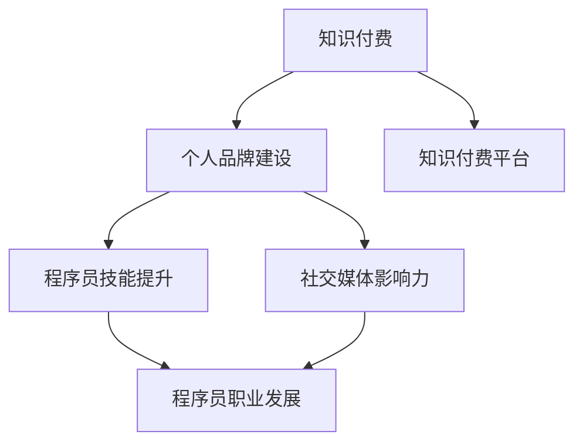

                 

### 《知识付费与个人品牌建设：程序员指南》

#### 核心关键词

- 知识付费
- 个人品牌建设
- 程序员
- 技能提升
- 职业发展
- 社交媒体

#### 摘要

在当今快速发展的技术时代，知识付费和个人品牌建设已成为程序员提升技能、实现职业发展的关键途径。本文旨在为程序员提供一份全面的指南，探讨知识付费的兴起与发展、个人品牌建设的概念与价值、程序员如何利用知识付费提升技能和个人品牌建设实践，以及程序员在这一领域中的综合应用。通过深入分析和实例分享，本文将帮助程序员更好地理解和利用知识付费与个人品牌建设，实现个人职业发展的新突破。

### 目录大纲

#### 第一部分：知识付费概述

- **第1章：知识付费的兴起与发展**
  - **1.1 知识付费的概念与背景**
  - **1.2 知识付费的商业模式**
  - **1.3 知识付费平台的类型与特点**
  - **1.4 知识付费的趋势与挑战**

#### 第二部分：个人品牌建设

- **第2章：个人品牌建设的概念与价值**
  - **2.1 个人品牌的定义与构成**
  - **2.2 建设个人品牌的步骤与方法**
  - **2.3 个人品牌与职业发展的关系**
  - **2.4 建立个人品牌的案例分析**

#### 第三部分：程序员在知识付费与个人品牌建设中的实践

- **第3章：程序员如何利用知识付费提升技能**
  - **3.1 程序员所需的核心技能**
  - **3.2 知识付费平台的选择与应用**
  - **3.3 利用知识付费进行技能进阶**
  - **3.4 案例分析：程序员通过知识付费提升技能的成功经验**

- **第4章：程序员个人品牌建设实践**
  - **4.1 个人品牌建设的基础工作**
  - **4.2 程序员如何打造专业形象**
  - **4.3 利用社交媒体提升个人品牌影响力**
  - **4.4 个人品牌建设中的常见问题与解决方法**

#### 第四部分：程序员知识付费与个人品牌建设的综合应用

- **第5章：程序员在知识付费平台上的创业**
  - **5.1 知识付费平台的创业模式**
  - **5.2 创业前的准备工作**
  - **5.3 创业过程中的挑战与应对**
  - **5.4 成功创业案例分享**

- **第6章：程序员知识付费与个人品牌建设的案例分析**
  - **6.1 案例分析：程序员个人品牌建设与知识付费的成功故事**
  - **6.2 案例分析：程序员利用知识付费平台实现职业飞跃**
  - **6.3 案例分析：程序员通过个人品牌建设打造影响力**

#### 第五部分：总结与展望

- **第7章：知识付费与个人品牌建设的未来发展**
  - **7.1 知识付费与个人品牌建设的发展趋势**
  - **7.2 程序员在这一领域的未来角色与机遇**
  - **7.3 知识付费与个人品牌建设对程序员职业发展的影响**

#### 附录

- **附录A：知识付费与个人品牌建设相关资源推荐**
  - **A.1 书籍推荐**
  - **A.2 网络资源**
  - **A.3 行业报告**

### 核心概念与联系 Mermaid 流程图



### 核心算法原理讲解（伪代码）

```python
class PersonalBrand:
    def __init__(self, expertise, network, reputation):
        self.expertise = expertise
        self.network = network
        self.reputation = reputation
    
    def build_brand(self):
        # 提升专业技能
        self.expertise.level_up()
        # 扩大社交网络
        self.network.expand()
        # 建立良好声誉
        self.reputation.build()
    
    def measure_impact(self):
        # 测量个人品牌影响力
        return self.expertise.score * self.network.size * self.reputation.stars

# 个人品牌影响力评分模型
I = E \* N \* R
```

### 数学模型和数学公式 & 详细讲解 & 举例说明

**个人品牌影响力评分模型：**

$$
I = E \times N \times R
$$

其中：
- \(I\)：个人品牌影响力（Impact Score）
- \(E\)：专业技能水平（Expertise Level）
- \(N\)：社交网络规模（Network Size）
- \(R\)：声誉等级（Reputation Rating）

**详细讲解：**

个人品牌影响力评分模型是一个综合衡量个人品牌影响力的数学模型。专业技能水平（\(E\)）代表了程序员的技能水平，通常由学习、工作和项目经验决定。社交网络规模（\(N\)）代表了程序员的社交网络规模，即他们能够影响的人数。声誉等级（\(R\)）代表了程序员的声誉，通常由口碑、推荐和评价决定。

**举例说明：**

假设一个程序员的专业技能水平为90分，社交网络规模为500人，声誉等级为9分。那么，他的个人品牌影响力评分为：

$$
I = 90 \times 500 \times 9 = 405,000
$$

这个评分表明了该程序员的个人品牌影响力非常高，他具有强大的专业技能、广泛的社交网络和良好的声誉。

### 项目实战

**实战案例：利用知识付费平台提升个人品牌影响力**

#### 环境搭建

1. 安装开发环境，如 Python、Jupyter Notebook 等。
2. 在知识付费平台上注册账号，选择合适的课程进行学习。

#### 代码实现

1. 编写学习进度跟踪脚本，记录每日学习时间和学习内容。
2. 编写影响力评估脚本，计算个人品牌影响力评分。

#### 详细解释说明

1. 学习进度跟踪脚本可以帮助程序员跟踪自己的学习进度，包括每日学习时间和学习内容。这有助于他们更好地规划学习计划，确保持续提升技能。
2. 影响力评估脚本可以帮助程序员实时了解自己的个人品牌影响力，从而有针对性地进行提升。例如，如果发现社交网络规模较小，可以积极参加行业活动，扩大人脉。

#### 代码解读与分析

```python
# 学习进度跟踪脚本示例
def track_learning_progress(daily_hours, topics_covered):
    progress = {'daily_hours': daily_hours, 'topics_covered': topics_covered}
    return progress

# 个人品牌影响力评估脚本示例
def calculate_brand_impact(expertise_level, network_size, reputation_rating):
    impact_score = expertise_level * network_size * reputation_rating
    return impact_score

# 实际应用示例
progress = track_learning_progress(2, ['Python基础', '数据结构'])
impact_score = calculate_brand_impact(90, 500, 9)
print(f"当前个人品牌影响力评分：{impact_score}")
```

该代码分为两个部分：学习进度跟踪和影响力评估。学习进度跟踪脚本记录了每日学习时间和学习内容，而影响力评估脚本则根据程序员的专业技能水平、社交网络规模和声誉等级计算个人品牌影响力评分。

通过以上实战案例和代码，程序员可以更好地利用知识付费平台提升个人品牌影响力，实现职业发展的新突破。

### 总结

本文通过对知识付费和个人品牌建设的深入探讨，为程序员提供了一份全面的指南。知识付费已成为提升技能和实现职业发展的重要途径，而个人品牌建设则有助于程序员在竞争激烈的职场中脱颖而出。通过本文的案例分析和实战指导，程序员可以更好地利用知识付费平台和个人品牌建设策略，实现个人职业发展的新突破。

### 附录

#### 附录A：知识付费与个人品牌建设相关资源推荐

- **A.1 书籍推荐**
  - 《程序员修炼之道》
  - 《人人都是产品经理》
  - 《代码大全》

- **A.2 网络资源**
  - Coursera
  - edX
  - Udemy

- **A.3 行业报告**
  - 《2022年中国知识付费行业报告》
  - 《程序员职业发展白皮书》
  - 《社交媒体营销策略》

作者：AI天才研究院/AI Genius Institute & 禅与计算机程序设计艺术 /Zen And The Art of Computer Programming

通过本文的深入探讨和实战指导，希望程序员能够更好地理解知识付费和个人品牌建设的重要性，并在实践中取得成功。不断学习和提升技能，建立强大的个人品牌，将助力程序员在职业发展中取得更大的成就。同时，也期待更多的程序员能够参与到知识付费和个人品牌建设中，共同推动技术行业的进步和发展。

