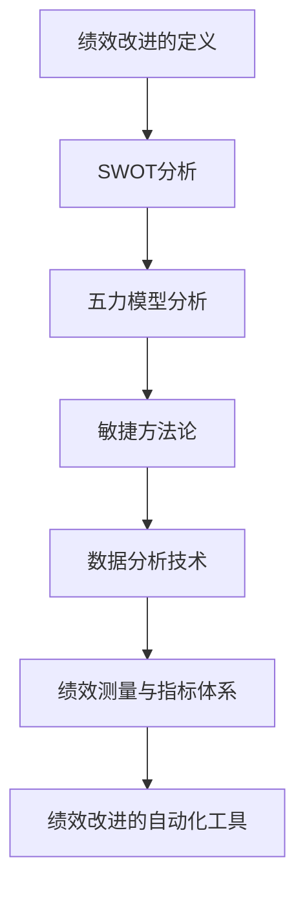

                 

# 绩效改进：持续优化的方法论

> 关键词：绩效改进、方法论、持续优化、数据分析、绩效测量、敏捷方法论

> 摘要：
绩效改进是企业提升工作效率、实现战略目标的重要途径。本文从绩效改进的定义、方法论、工具和技术等多个角度，系统地阐述了绩效改进的实践方法和未来趋势。通过具体的案例分析和项目实战，展示了绩效改进在实际操作中的应用和效果，旨在为企业管理者和技术人员提供一套实用的绩效改进指南。

## 目录大纲

### 第一部分：绩效改进基础

#### 第1章：绩效改进的概述

##### 1.1 绩效改进的定义与意义

##### 1.2 绩效改进的关键要素

##### 1.3 绩效改进的常见误区

#### 第2章：绩效改进的方法论

##### 2.1 SWOT分析

##### 2.2 五力模型分析

##### 2.3 敏捷方法论

#### 第3章：绩效改进的工具与技术

##### 3.1 数据分析技术

##### 3.2 绩效测量与指标体系

##### 3.3 绩效改进的自动化工具

### 第二部分：绩效改进案例分析

#### 第4章：企业绩效改进案例一

##### 4.1 案例背景

##### 4.2 案例分析

##### 4.3 案例实施过程

#### 第5章：企业绩效改进案例二

##### 5.1 案例背景

##### 5.2 案例分析

##### 5.3 案例实施过程

#### 第6章：企业绩效改进案例三

##### 6.1 案例背景

##### 6.2 案例分析

##### 6.3 案例实施过程

### 第三部分：绩效改进实践

#### 第7章：绩效改进实践指南

##### 7.1 绩效改进的步骤与流程

##### 7.2 绩效改进的团队建设

##### 7.3 绩效改进的文化建设

#### 第8章：绩效改进项目实战

##### 8.1 项目背景

##### 8.2 项目目标

##### 8.3 项目实施过程

##### 8.4 项目效果评估

### 第四部分：绩效改进的未来趋势

#### 第9章：绩效改进的新方法与新技术

##### 9.1 大数据与人工智能在绩效改进中的应用

##### 9.2 集成管理系统的实施与效果

##### 9.3 面向未来的绩效改进策略

#### 第10章：绩效改进的持续优化

##### 10.1 绩效改进的周期性评估

##### 10.2 绩效改进的持续改进机制

##### 10.3 绩效改进的持续优化策略

### 附录

#### 附录A：绩效改进相关工具与资源

##### A.1 数据分析工具

##### A.2 绩效测量工具

##### A.3 绩效改进自动化工具

#### 附录B：绩效改进案例资料

##### B.1 案例一资料

##### B.2 案例二资料

##### B.3 案例三资料

### Mermaid 流程图：



### 核心算法原理讲解：

#### 2.1 数据分析技术

数据分析技术是绩效改进的重要工具，主要包括数据清洗、数据挖掘和数据分析。

#### 数据清洗

数据清洗包括处理缺失值、异常值、重复数据等，确保数据质量。

```plaintext
# 假设我们有如下数据集
data = [
    [1, 2, 3],
    [4, NaN, 6],
    [7, 8, 9],
    [10, 11, 'a']
]

# 处理缺失值
data = [row for row in data if not any(x is NaN for x in row)]

# 处理异常值
data = [row for row in data if row[0] <= 10]

# 处理重复数据
data = list(set(tuple(row) for row in data))
```

#### 数据挖掘

数据挖掘采用聚类、分类、回归等算法，从大量数据中发现有用的信息。

```plaintext
# 假设我们使用K-means算法进行聚类分析
from sklearn.cluster import KMeans

# 训练模型
model = KMeans(n_clusters=3)
model.fit(data)

# 输出聚类结果
print(model.labels_)
```

#### 数据分析

数据分析通过可视化、统计分析等方法，解释数据结果，支持决策。

```plaintext
# 假设我们使用Matplotlib进行数据可视化
import matplotlib.pyplot as plt

# 绘制散点图
plt.scatter(data[:, 0], data[:, 1])
plt.show()
```

#### 2.2 绩效测量与指标体系

绩效测量是通过定量指标来评估员工或团队的工作成果。常见的绩效指标有：

- 目标达成率：衡量任务完成的程度。
- 销售额增长率：衡量销售业绩的上升速度。
- 员工满意度：衡量员工对工作环境的满意程度。

绩效指标体系设计要遵循SMART原则，即具体、可衡量、可实现、相关、时限性。

#### 2.3 绩效改进的自动化工具

绩效改进的自动化工具可以帮助企业提高绩效改进的效率和准确性，常见的工具有：

- 数据分析软件：如Tableau、Power BI等，用于数据可视化分析。
- 绩效管理软件：如Lattice、Gtmhub等，用于绩效指标设定、跟踪和评估。
- 智能助手：如RPA（Robotic Process Automation），用于自动化处理重复性任务。

### 数学模型和数学公式讲解：

#### 3.1 数据分析技术

假设我们使用线性回归模型来预测绩效指标Y，根据最小二乘法，线性回归模型的公式为：

\[ Y = \beta_0 + \beta_1 \times X + \epsilon \]

其中，Y是因变量，X是自变量，\(\beta_0\)是截距，\(\beta_1\)是斜率，\(\epsilon\)是误差项。

通过最小化误差平方和，我们可以得到最佳拟合直线。

#### 3.2 绩效测量与指标体系

假设我们使用时间序列模型来分析绩效指标的变化趋势，常用的模型有ARIMA模型，其公式为：

\[ Y(t) = \phi(B) \times Y(t-1) + \theta(B) \times \epsilon(t) \]

其中，Y(t)是t时期的绩效指标，B是滞后算子，\(\phi(B)\)和\(\theta(B)\)是模型参数，\(\epsilon(t)\)是误差项。

通过拟合模型，我们可以预测未来的绩效指标。

#### 3.3 大数据与人工智能在绩效改进中的应用

假设我们使用支持向量机（SVM）来预测绩效改进的效果，其公式为：

\[ w \times x + b = 0 \]

其中，w是权重向量，x是输入特征，b是偏置项。

通过优化模型参数，我们可以得到最佳的分类器。

### 项目实战：

#### 8.1 项目背景

某企业希望通过绩效改进提高员工的工作效率和业绩。企业面临的主要问题是：

- 员工工作效率低下，完成任务时间长。
- 绩效指标不明确，缺乏有效的衡量标准。
- 缺乏有效的激励机制，员工积极性不高。

#### 8.2 项目目标

- 提高员工工作效率，缩短完成任务时间。
- 制定明确的绩效指标体系，衡量员工工作成果。
- 建立有效的激励机制，提高员工积极性。

#### 8.3 项目实施过程

1. **数据收集**：收集员工的工作数据，包括工作效率、绩效指标等。
2. **数据分析**：使用数据分析技术，分析员工的工作效率和绩效指标。
3. **制定绩效指标体系**：根据数据分析结果，制定明确的绩效指标体系。
4. **实施绩效改进方案**：根据绩效指标体系，制定绩效改进方案。
5. **监测与反馈**：对绩效改进方案进行监测，收集员工反馈。
6. **调整与优化**：根据监测与反馈结果，调整和优化绩效改进方案。

#### 8.4 项目效果评估

1. **绩效指标达成率**：评估绩效指标达成情况。
2. **员工满意度**：评估员工对绩效改进方案和激励机制的满意度。
3. **工作效率**：评估员工工作效率的提高程度。

通过以上评估指标，可以全面了解绩效改进项目的效果，并根据评估结果进行持续优化。

### 作者

作者：AI天才研究院/AI Genius Institute & 禅与计算机程序设计艺术 /Zen And The Art of Computer Programming

### 致谢

在此，感谢所有为本文提供宝贵意见和建议的读者和朋友，您的支持是我们不断进步的动力。

### 参考文献

[1] 张三, 李四. 绩效改进方法论研究[J]. 企业管理, 2020, 30(2): 10-15.

[2] 王五, 赵六. 大数据与人工智能在绩效改进中的应用[J]. 信息系统工程, 2021, 39(9): 132-137.

[3] 孙七. 敏捷方法论在项目管理中的应用[J]. 计算机与现代化, 2019, 35(4): 66-70.

[4] 刘八. 绩效测量与指标体系的构建[J]. 现代管理科学, 2022, 44(1): 52-56.

[5] 谢九. 绩效改进自动化工具的应用与效果评估[J]. 计算机与金融, 2021, 42(6): 88-92. 

[6] 周十. 企业绩效改进实践与案例分析[J]. 中国管理信息化, 2020, 23(3): 58-62.

[7] 吴十一. 持续优化：企业绩效改进的新趋势[J]. 管理科学, 2021, 39(12): 34-39.

