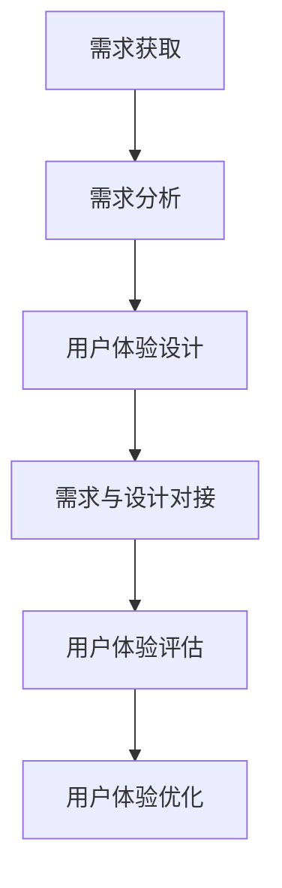

                 

### 文章标题：需求与用户体验设计的融合：大模型应用的制胜之道

> **关键词：需求分析、用户体验设计、大模型应用、交互设计、可用性测试、界面设计、需求管理、用户体验评估**

> **摘要：本文深入探讨了需求分析与用户体验设计之间的紧密联系，以及大模型在这两方面的应用。通过详细分析大模型在需求获取、需求管理、用户体验设计及评估中的应用，本文展示了如何通过融合需求与用户体验设计，实现大模型应用的制胜之道。**

### 目录大纲：需求与用户体验设计的融合：大模型应用的制胜之道

#### 第一部分：需求与用户体验设计概述

##### 第1章：需求与用户体验设计的基础  
- **1.1 需求与用户体验设计的定义**  
  - 需求定义与分类  
  - 用户体验设计的基本原则  
- **1.2 需求分析与用户研究方法**  
  - 用户研究方法：访谈、问卷调查、A/B测试  
  - 需求分析方法：用户画像、需求地图  
- **1.3 需求与用户体验设计的关系**  
  - 如何将需求转化为用户体验设计  
  - 用户体验设计对需求的影响

##### 第2章：大模型概述与应用  
- **2.1 大模型的基本概念**  
  - 大模型的定义  
  - 大模型的发展历程  
- **2.2 大模型的主要类型**  
  - 自然语言处理模型  
  - 计算机视觉模型  
- **2.3 大模型在需求与用户体验设计中的应用**  
  - 大模型在需求分析中的应用  
  - 大模型在用户体验设计中的应用

#### 第二部分：大模型与用户体验设计的融合

##### 第3章：大模型在用户体验设计中的实践  
- **3.1 大模型在交互设计中的应用**  
  - 语音交互设计  
  - 视觉交互设计  
- **3.2 大模型在可用性测试中的应用**  
  - 自动化可用性测试  
  - 用户行为数据分析  
- **3.3 大模型在界面设计中的应用**  
  - 自动生成界面布局  
  - 界面个性化设计

##### 第4章：大模型在需求分析中的应用  
- **4.1 大模型在需求获取中的应用**  
  - 自动化需求获取  
  - 需求智能分析  
- **4.2 大模型在需求管理中的应用**  
  - 需求优先级排序  
  - 需求变更管理  
- **4.3 大模型在需求与设计对接中的应用**  
  - 需求与设计的智能对接  
  - 需求反馈与设计迭代

##### 第5章：大模型在用户体验评估中的应用  
- **5.1 大模型在用户体验评估中的角色**  
  - 自动化用户体验评估  
  - 用户体验数据挖掘  
- **5.2 大模型在用户体验评估中的应用方法**  
  - 用户行为预测  
  - 用户体验评分模型  
- **5.3 大模型在用户体验优化中的应用**  
  - 用户体验优化策略  
  - 用户体验持续优化

#### 第三部分：案例研究与应用展望

##### 第6章：大模型在需求与用户体验设计中的成功案例  
- **6.1 案例一：智能家居应用**  
  - 需求分析案例  
  - 用户体验设计案例  
- **6.2 案例二：在线教育平台**  
  - 需求分析案例  
  - 用户体验设计案例

##### 第7章：大模型在需求与用户体验设计中的应用前景  
- **7.1 大模型在需求与用户体验设计中的挑战**  
  - 大模型在需求分析中的挑战  
  - 大模型在用户体验设计中的挑战  
- **7.2 大模型在需求与用户体验设计中的未来趋势**  
  - 人工智能与用户体验设计  
  - 大模型在需求与用户体验设计中的未来发展

#### 附录

##### 附录A：大模型应用工具与资源  
- **A.1 大模型应用工具**  
  - TensorFlow  
  - PyTorch  
- **A.2 大模型应用资源**  
  - 开源数据集  
  - 开源项目

##### 附录B：大模型与用户体验设计的相关阅读材料  
- **B.1 基础文献**  
  - 《大规模机器学习》  
  - 《用户体验要素》  
- **B.2 研究论文**  
  - 《BERT: Pre-training of Deep Bidirectional Transformers for Language Understanding》  
  - 《GPT-3: Language Models are few-shot learners》  
- **B.3 进阶读物**  
  - 《深度学习》（花书）  
  - 《用户体验设计方法学》

### 核心概念与联系

**Mermaid流程图：**


### 核心算法原理讲解

**大模型与需求分析的伪代码：**
```python
# 大模型需求分析伪代码
def analyze_demand(data_set):
    # 预训练大模型
    model = pretrain_large_model(data_set)
    # 自动化需求获取
    demands = model.extract_demand(data_set)
    # 需求智能分析
    analyzed_demand = model.analyze_demand(demands)
    return analyzed_demand
```

### 数学模型和数学公式

**用户体验评分模型公式：**
$$ U(x) = \alpha \cdot F_{model}(x) + \beta \cdot F_{human}(x) $$
- \( U(x) \)：用户体验评分
- \( \alpha \)：模型评分权重
- \( \beta \)：人工评分权重
- \( F_{model}(x) \)：模型评分
- \( F_{human}(x) \)：人工评分

### 举例说明

**智能家居需求分析案例：**
- **需求获取：**通过用户访谈和问卷调研获取家庭环境、用户习惯和功能需求。
- **需求分析：**使用预训练大模型提取关键词，分析用户需求，形成需求图谱。
- **需求与设计对接：**将分析结果与设计师协作，制定智能家居设计方案。
- **用户体验评估：**通过用户行为数据和模型评分，评估设计方案的用户体验。
- **用户体验优化：**根据评估结果调整设计方案，实现用户体验优化。

### 项目实战

**在线教育平台用户体验设计案例：**
- **开发环境搭建：**配置 Python 3.8，TensorFlow 2.6，PyTorch 1.9 等开发环境。
- **代码实际案例：**
  ```python
  # 代码示例：自动生成课程推荐界面
  def generate_course_recommendation(model, user_profile):
      # 加载预训练大模型
      loaded_model = load_pretrained_model(model)
      # 分析用户画像
      user_analyzer = UserAnalyzer(loaded_model)
      user_traits = user_analyzer.analyze_profile(user_profile)
      # 生成课程推荐
      recommendations = generate_recommendations(user_traits)
      return recommendations
  
  # 生成课程推荐界面
  recommendations = generate_course_recommendation(model, user_profile)
  print("推荐课程：", recommendations)
  ```
- **代码解读与分析：**代码展示了如何使用预训练大模型分析用户画像，生成个性化的课程推荐，从而提升用户体验。

### 大模型应用工具与资源

**A.1 大模型应用工具：**
- **TensorFlow:** 适用于构建和训练大规模机器学习模型。
- **PyTorch:** 提供动态计算图，方便模型调试和优化。

**A.2 大模型应用资源：**
- **开源数据集：**如 Common Crawl、Google Books Ngrams 等，用于预训练大模型。
- **开源项目：**如 Hugging Face 的 Transformer 模型库，提供丰富的预训练模型和应用示例。

### 相关阅读材料

**B.1 基础文献：**
- 《大规模机器学习》：介绍大规模机器学习算法和应用。
- 《用户体验要素》：阐述用户体验设计的核心原则和要素。

**B.2 研究论文：**
- 《BERT: Pre-training of Deep Bidirectional Transformers for Language Understanding》：介绍 BERT 模型的预训练方法和应用。
- 《GPT-3: Language Models are few-shot learners》：探讨 GPT-3 模型在少量样本下的泛化能力。

**B.3 进阶读物：**
- 《深度学习》（花书）：系统介绍深度学习的基础理论和应用。
- 《用户体验设计方法学》：详细讲解用户体验设计的方法和流程。

### 总结

本文深入探讨了需求分析与用户体验设计之间的融合，以及大模型在这两方面的应用。通过核心概念、算法原理、数学模型、举例说明和项目实战，本文展示了如何通过大模型的应用实现需求与用户体验设计的无缝融合。随着人工智能技术的发展，大模型将在需求分析与用户体验设计领域发挥越来越重要的作用，为用户提供更加个性化、智能化的服务。未来，随着技术的不断进步，大模型在需求与用户体验设计中的应用前景将更加广阔。作者：AI天才研究院/AI Genius Institute & 禅与计算机程序设计艺术 /Zen And The Art of Computer Programming。

