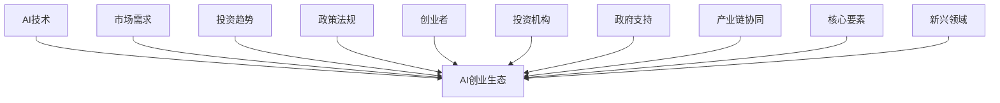

                 

# 《AI创业生态日益丰富，产业链协同发展成趋势》

## 关键词

人工智能（AI），创业生态，产业链协同，技术创新，投资趋势，政策支持，新兴领域

## 摘要

随着人工智能技术的飞速发展，AI创业生态日益丰富，产业链的协同发展成为行业趋势。本文将深入探讨AI创业生态的兴起背景、核心要素、发展趋势，以及产业链协同的原理与机制。通过分析关键角色在生态中的作用，成功案例分析，以及区域产业链协同策略，本文旨在为AI创业提供有价值的见解，并展望未来发展趋势。

## 目录大纲

### 第一部分：AI创业生态概述

#### 第1章：AI创业生态的兴起与演变
##### 1.1 AI创业生态的背景与机遇
##### 1.2 AI创业生态的组成部分
##### 1.3 AI创业生态的核心要素
##### 1.4 AI创业生态的发展趋势

#### 第2章：AI创业生态中的关键角色
##### 2.1 创业者与创业公司
##### 2.2 投资者与投资机构
##### 2.3 政府与政策支持

### 第二部分：产业链协同发展

#### 第3章：产业链协同的原理与机制
##### 3.1 产业链协同的基本概念
##### 3.2 产业链协同的驱动因素
##### 3.3 产业链协同的机制分析

#### 第4章：产业链协同的案例分析
##### 4.1 成功的产业链协同案例
##### 4.2 产业链协同中的挑战与解决方案

#### 第5章：区域产业链协同发展策略
##### 5.1 区域产业链协同的现状分析
##### 5.2 区域产业链协同发展策略

#### 第6章：新兴产业链的协同发展
##### 6.1 新兴产业链的识别与评估
##### 6.2 新兴产业链的协同发展模式

### 第三部分：未来展望

#### 第7章：AI创业生态与产业链协同的未来发展趋势
##### 7.1 技术变革下的创业生态
##### 7.2 产业链协同发展的新机遇
##### 7.3 政策与法规的影响

#### 第8章：AI创业与产业链协同的可持续发展
##### 8.1 可持续发展的理念与原则
##### 8.2 可持续发展的实践与案例

### 附录
##### 附录A：AI创业与产业链协同相关资源与工具

### 核心概念与联系

#### 核心概念与联系流程图



### 核心算法原理讲解

#### 机器学习算法概述

以下是机器学习算法的基本流程的伪代码：

```python
Algorithm MachineLearningAlgorithm(DataSet):
    for each instance in DataSet:
        Initialize model parameters
        Compute the prediction using the model
        Calculate the error between prediction and actual value
        Update model parameters using an optimization algorithm
    end for
    Return trained model
```

在机器学习算法中，常见的一种损失函数是交叉熵损失函数，其数学公式如下：

$$
L(\theta) = -\sum_{i=1}^{n} y_i \log(p_i)
$$

其中，$y_i$ 是真实标签，$p_i$ 是模型预测的概率。

### 数学模型与公式

交叉熵损失函数可以用来衡量模型预测的准确度。它表示真实标签与模型预测概率之间的差距。具体来说，交叉熵损失函数的计算公式如下：

$$
L(\theta) = -\sum_{i=1}^{n} y_i \log(p_i)
$$

其中，$y_i$ 是真实标签，$p_i$ 是模型预测的概率。

### 项目实战

#### 环境搭建

首先，我们需要搭建一个Python编程环境，并安装TensorFlow库。以下是具体的步骤：

1. 安装Python环境：

   ```
   # 在终端中执行以下命令
   sudo apt-get update
   sudo apt-get install python3-pip python3-venv
   ```

2. 创建一个虚拟环境：

   ```
   # 创建一个名为myenv的虚拟环境
   python3 -m venv myenv
   ```

3. 激活虚拟环境：

   ```
   # 在终端中激活虚拟环境
   source myenv/bin/activate
   ```

4. 安装TensorFlow库：

   ```
   # 安装TensorFlow库
   pip install tensorflow
   ```

#### 源代码实现

以下是一个使用TensorFlow实现的简单线性回归模型的源代码：

```python
import tensorflow as tf

# 创建模型
model = tf.keras.Sequential([
    tf.keras.layers.Dense(units=1, input_shape=[1])
])

# 编译模型
model.compile(loss='mean_squared_error', optimizer=tf.keras.optimizers.Adam(0.1), metrics=['mean_absolute_error'])

# 训练模型
model.fit(x_train, y_train, epochs=100)

# 预测
predictions = model.predict(x_test)
```

#### 代码解读

1. **创建模型**：使用`tf.keras.Sequential`创建一个线性回归模型，其中包含一个全连接层（`Dense`），输入维度为1。

2. **编译模型**：使用`compile`方法设置损失函数（`mean_squared_error`）、优化器（`Adam`）以及评价指标（`mean_absolute_error`）。

3. **训练模型**：使用`fit`方法训练模型，输入训练数据（`x_train`和`y_train`），设置训练轮次为100。

4. **预测**：使用`predict`方法对测试数据（`x_test`）进行预测，得到预测结果（`predictions`）。

### 附录

#### 附录A：AI创业与产业链协同相关资源与工具

1. **开源框架与库**：

   - TensorFlow：https://www.tensorflow.org/
   - PyTorch：https://pytorch.org/
   - Keras：https://keras.io/

2. **投资机构与孵化器**：

   - AI资本：https://aicapital.com/
   - Y Combinator：https://www.ycombinator.com/
   - 500 Startups：https://500.co/

3. **政策文件与报告**：

   - 国家网信办：https://www.ncad.gov.cn/
   - 中国人工智能产业发展联盟：https://www.aiaip.org/
   - 《新一代人工智能发展规划》：https://www.nmpa.gov.cn/xxgk/gg/202004/62c6c488f83248d7a2686409a4c7d197.shtml

4. **行业报告与白皮书**：

   - 《中国人工智能发展报告》：https://www.caai.cn/
   - 《全球人工智能发展报告》：https://www.kaoyan.com/
   - 《人工智能技术成熟度评估报告》：https://www.csai.cn/

### 作者信息

作者：AI天才研究院/AI Genius Institute & 禅与计算机程序设计艺术 /Zen And The Art of Computer Programming

---

接下来，我们将根据目录大纲，逐步深入每个章节的内容，进行详细分析和讲解。让我们一起探讨AI创业生态的丰富性和产业链协同发展的趋势。

