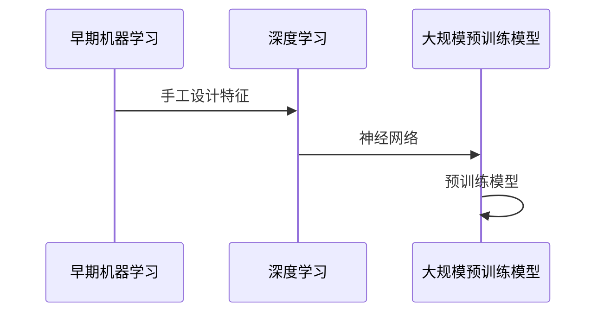
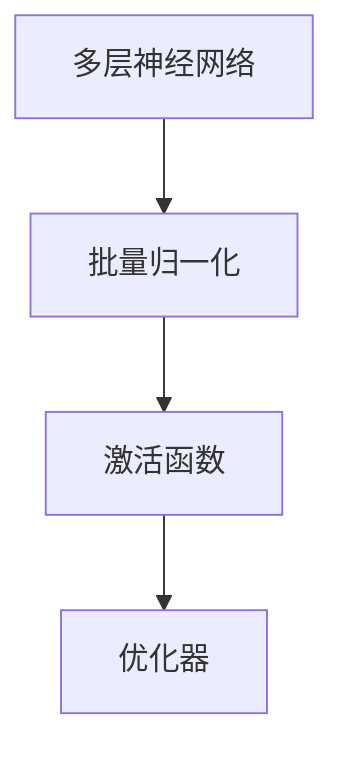
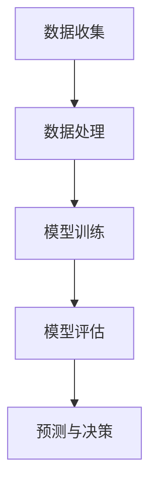
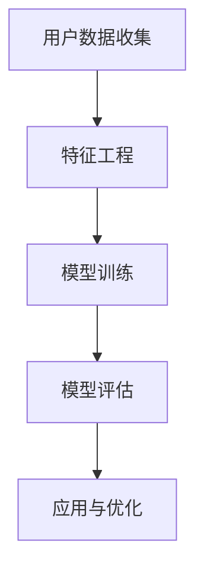
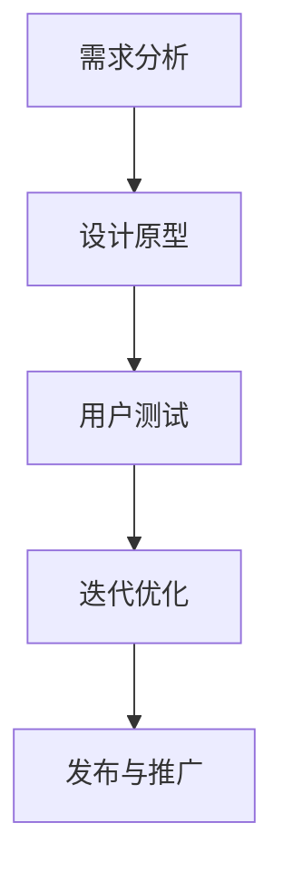
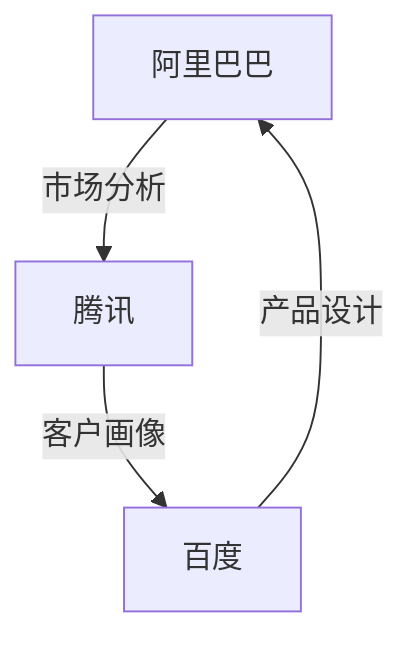

                 

# AI大模型创业：如何应对未来价格战？

> **关键词**：AI大模型、创业、价格战、市场分析、客户画像、产品设计

> **摘要**：本文将探讨AI大模型在创业中的应用，分析如何通过AI大模型提升竞争力，并应对未来可能出现的价格战。文章分为五个部分，首先概述AI大模型的基本概念和发展历程，然后深入解析其核心架构，接着分析AI大模型在创业中的应用场景，最后提出应对价格战的策略和建议。

<|assistant|>### 第1章: AI大模型概述

#### 1.1 AI大模型基本概念

AI大模型（Large-scale AI Model），又称大型预训练模型，是指那些使用海量数据进行训练，具有高度复杂性和强大能力的人工智能模型。这些模型能够在各种任务上实现高性能，如自然语言处理、图像识别、语音识别等。

**AI大模型的定义**：AI大模型是指使用大规模数据进行训练，能够处理大规模数据，并在特定任务上达到或超过人类水平的人工智能模型。例如，GPT-3、BERT、Turing等。

**AI大模型的特点**：

1. **高维度**：AI大模型处理的数据维度非常高，能够捕捉复杂的模式。
2. **自适应性**：AI大模型能够通过自我学习和优化，不断适应新数据和新任务。
3. **高效性**：AI大模型通过并行计算和分布式训练，能够高效处理大规模数据。

#### 1.2 AI大模型的发展历程

AI大模型的发展历程可以分为三个阶段：

1. **初期阶段**：以手工设计特征的机器学习算法为主。例如，SVM、KNN等。
2. **中间阶段**：引入了深度学习，神经网络开始应用于图像识别和语音识别等任务。例如，LeNet、AlexNet等。
3. **现阶段**：大规模预训练模型的出现，使AI大模型的能力得到了极大的提升。例如，GPT、BERT、Turing等。

**发展历程图解**：

#### 1.3 AI大模型的核心架构

AI大模型的核心架构主要包括多层神经网络、批量归一化、激活函数和优化器。

1. **多层神经网络**：多层神经网络（Multilayer Neural Network）是AI大模型的基础，通过堆叠多个神经网络层，可以捕捉数据中的复杂特征。

2. **批量归一化（Batch Normalization）**：批量归一化是一种用于加速训练过程并提高模型泛化能力的技巧。它通过标准化每个神经网络的输出，使得梯度在训练过程中更加稳定。

3. **激活函数**：激活函数（Activation Function）用于引入非线性变换，使得神经网络能够学习复杂的关系。常用的激活函数包括ReLU、Sigmoid和Tanh等。

4. **优化器**：优化器（Optimizer）用于优化模型的参数。常见的优化器包括Adam、SGD等，它们通过迭代优化模型参数，使得模型在训练过程中能够更快收敛。

**核心架构图解**：

#### 1.4 AI大模型在创业中的应用

AI大模型在创业中的应用非常广泛，主要包括市场分析、客户画像和产品设计。

##### 1.4.1 市场分析

市场分析是创业过程中至关重要的一环，AI大模型可以显著提升市场分析的效果。

1. **数据收集**：通过社交媒体、电商平台、搜索引擎等渠道收集市场数据。
2. **数据处理**：对收集到的数据进行清洗、归一化等处理。
3. **模型训练**：使用处理后的数据训练市场分析模型。
4. **模型评估**：使用测试数据评估模型的效果。
5. **预测与决策**：根据模型预测结果，制定市场策略和决策。

**市场分析流程图解**：

##### 1.4.2 客户画像

客户画像是了解客户需求、提高营销效果的重要手段，AI大模型可以大大提升客户画像的准确性。

1. **用户数据收集**：收集用户的浏览记录、购买行为、反馈等数据。
2. **特征工程**：对数据进行特征提取，如用户年龄、性别、兴趣爱好等。
3. **模型训练**：使用训练数据训练客户画像模型。
4. **模型评估**：使用测试数据评估模型的效果。
5. **应用与优化**：根据模型预测结果，为精准营销提供支持，并根据反馈优化模型。

**客户画像流程图解**：

##### 1.4.3 产品设计

产品设计是创业过程中的重要环节，AI大模型可以帮助优化产品设计，提高用户满意度。

1. **需求分析**：通过用户反馈和数据分析，确定产品的需求。
2. **设计原型**：根据需求分析，设计产品原型。
3. **用户测试**：邀请用户测试产品原型，收集反馈。
4. **迭代优化**：根据用户反馈，对产品原型进行迭代优化。
5. **发布与推广**：将优化后的产品发布，并通过营销手段进行推广。

**产品设计流程图解**：

#### 1.5 AI大模型在创业中的应用案例分析

**案例1：阿里巴巴的AI大模型应用**

阿里巴巴在电商领域广泛应用AI大模型，例如：

- **市场分析**：通过AI大模型分析消费者行为，预测市场趋势，制定营销策略。
- **客户画像**：通过AI大模型分析用户数据，构建客户画像，为精准营销提供支持。
- **产品设计**：通过AI大模型分析用户反馈，优化产品设计，提高用户满意度。

**案例2：腾讯的AI大模型应用**

腾讯在社交媒体领域广泛应用AI大模型，例如：

- **市场分析**：通过AI大模型分析用户行为，预测市场趋势，制定营销策略。
- **客户画像**：通过AI大模型分析用户数据，构建客户画像，为精准营销提供支持。
- **产品设计**：通过AI大模型分析用户反馈，优化产品设计，提高用户满意度。

**案例3：百度的AI大模型应用**

百度在搜索领域广泛应用AI大模型，例如：

- **市场分析**：通过AI大模型分析用户搜索行为，预测市场趋势，制定营销策略。
- **客户画像**：通过AI大模型分析用户数据，构建客户画像，为精准营销提供支持。
- **产品设计**：通过AI大模型分析用户反馈，优化产品设计，提高用户满意度。

**1.5.1 案例分析图解**

### 总结

AI大模型在创业中的应用前景广阔，通过市场分析、客户画像和产品设计，AI大模型可以帮助创业企业提高竞争力，应对未来的价格战。然而，AI大模型的发展和应用也面临挑战，如数据隐私、算法透明度等。因此，创业企业在应用AI大模型时，需要充分考虑这些因素，确保合法合规，同时不断优化模型，提高其性能和可靠性。|>

