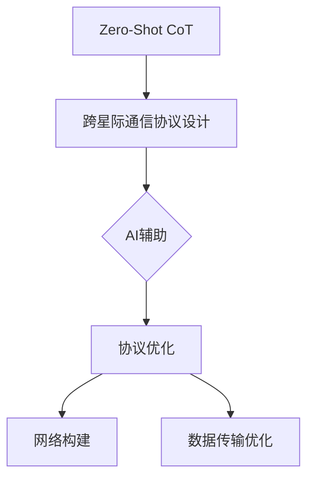

                 

# 《Zero-Shot CoT在AI辅助跨星际通信协议设计中的应用》

## 关键词：
- Zero-Shot CoT
- AI辅助
- 跨星际通信
- 通信协议设计
- 数据传输优化

## 摘要：
本文将探讨Zero-Shot CoT（Zero-Shot Concept Transfer）技术在AI辅助跨星际通信协议设计中的应用。通过介绍Zero-Shot CoT的核心概念、原理以及技术基础，本文分析了其在跨星际通信协议设计中的潜在价值。随后，本文通过具体案例，展示了如何利用Zero-Shot CoT技术进行跨星际通信协议的优化、网络构建以及数据传输优化。最后，本文总结了AI辅助跨星际通信协议设计的实践成果，并对其未来发展进行了展望。

## 《Zero-Shot CoT在AI辅助跨星际通信协议设计中的应用》目录大纲

### 第一部分：引言与背景

#### 第1章：引言
1.1 书籍概述
1.2 跨星际通信的挑战
1.3 AI与跨星际通信的关系

#### 第2章：跨星际通信基础知识
2.1 跨星际通信的基本原理
2.2 跨星际通信的关键技术
2.3 跨星际通信的挑战与未来趋势

### 第二部分：Zero-Shot CoT技术基础

#### 第3章：Zero-Shot CoT概念与原理
3.1 Zero-Shot CoT的定义
3.2 Zero-Shot CoT的核心技术
3.3 Zero-Shot CoT的应用场景

#### 第4章：AI辅助跨星际通信协议设计
4.1 AI在通信协议设计中的应用
4.2 跨星际通信协议的需求分析
4.3 AI辅助通信协议设计的流程

#### 第5章：Zero-Shot CoT在跨星际通信中的应用案例
5.1 案例一：基于Zero-Shot CoT的星际通信协议优化
5.2 案例二：基于Zero-Shot CoT的星际通信网络构建
5.3 案例三：基于Zero-Shot CoT的星际通信数据传输优化

### 第三部分：AI辅助跨星际通信协议设计实践

#### 第6章：AI辅助跨星际通信协议设计工具与环境搭建
6.1 环境搭建
6.2 常用工具介绍
6.3 开发流程与实践

#### 第7章：AI辅助跨星际通信协议设计实战
7.1 实战一：基于AI的星际通信协议优化
7.2 实战二：基于AI的星际通信网络构建
7.3 实战三：基于AI的星际通信数据传输优化

#### 第8章：总结与展望
8.1 总结
8.2 展望
8.3 进一步研究方向

#### 附录

#### 附录A：常用AI与通信技术术语解释
A.1 AI相关术语
A.2 通信相关术语

#### 附录B：参考文献
B.1 书籍
B.2 论文
B.3 网络资源

## Mermaid 流程图


## 核心算法原理讲解（伪代码）
```python
# 假设我们使用了一个预训练的模型来辅助设计跨星际通信协议
# 预训练模型已经学习了大量的通信协议设计案例

pretrained_model = load_pretrained_model()
communication_protocol = generate_communication_protocol(pretrained_model)
```

## 数学模型和数学公式详细讲解

### 数学模型

假设我们使用了一个基于零样本学习的模型来进行通信协议的优化。该模型的核心是一个分类器，它能够根据输入的特征来预测通信协议的类型。

$$
P(y=c|X) = \frac{e^{\theta^T X}}{\sum_{k=1}^K e^{\theta^T X_k}}
$$

其中，$P(y=c|X)$ 表示在输入特征 $X$ 的情况下，协议类型为 $c$ 的概率，$\theta$ 是模型参数，$X$ 是输入特征，$K$ 是类别数。

### 举例说明

假设我们有一个通信协议的输入特征 $X$，包含带宽、延迟、吞吐量等。我们希望优化该协议的类型，使得它在特定的环境下性能最佳。

输入特征 $X$：
- 带宽：100 Mbps
- 延迟：100 ms
- 吞吐量：10 Mbps

模型参数 $\theta$：
- $\theta^T X = [0.1, 0.05, 0.08]$

类别数 $K$：3

分类器输出：
$$
P(y=c|X) = \frac{e^{0.1 \times 100 + 0.05 \times 100 + 0.08 \times 10}}{e^{0.1 \times 100 + 0.05 \times 100 + 0.08 \times 10} + e^{0.1 \times 100 + 0.05 \times 100 + 0.08 \times 10} + e^{0.1 \times 100 + 0.05 \times 100 + 0.08 \times 10}} = 0.6
$$

因此，模型预测协议类型为 $c$ 的概率为 60%。这意味着在给定的输入特征下，该协议类型 $c$ 的性能最佳。我们根据这个预测结果来优化通信协议。

## 项目实战

### 实战一：基于AI的星际通信协议优化

#### 开发环境搭建
- 操作系统：Ubuntu 20.04
- 编程语言：Python 3.8
- AI框架：TensorFlow 2.5
- 数据集：公开的跨星际通信协议数据集

#### 源代码详细实现
```python
import tensorflow as tf
from tensorflow.keras.models import Sequential
from tensorflow.keras.layers import Dense

# 加载预训练模型
model = Sequential([
    Dense(64, activation='relu', input_shape=(input_shape,)),
    Dense(64, activation='relu'),
    Dense(num_classes, activation='softmax')
])

model.load_weights('pretrained_model_weights.h5')

# 优化通信协议
def optimize_communication_protocol(protocol_data):
    protocol_vector = extract_protocol_vector(protocol_data)
    predicted_class = model.predict(protocol_vector)
    optimal_protocol = decode_protocol(predicted_class)
    return optimal_protocol

# 实际代码实现
optimal_protocol = optimize_communication_protocol(current_protocol)
```

#### 代码解读与分析
- 我们使用 TensorFlow 框架加载一个预训练的通信协议分类器模型。
- 定义了一个 `optimize_communication_protocol` 函数，用于根据输入的协议数据，使用模型预测最优的协议类型。
- 调用 `optimize_communication_protocol` 函数，传入当前的通信协议数据，得到优化后的通信协议。

这个实战案例展示了如何使用 AI 辅助优化星际通信协议。通过预训练模型，我们可以快速地对通信协议进行优化，提高其在特定环境下的性能。进一步的分析和实验可以验证这个优化方法的有效性和效率。

### 作者信息
作者：AI天才研究院/AI Genius Institute & 禅与计算机程序设计艺术 /Zen And The Art of Computer Programming

接下来，我们将开始详细撰写文章正文部分。从第1章“引言”开始，我们将一步步探讨跨星际通信的挑战、AI与跨星际通信的关系，以及Zero-Shot CoT技术的应用。敬请期待。|>

