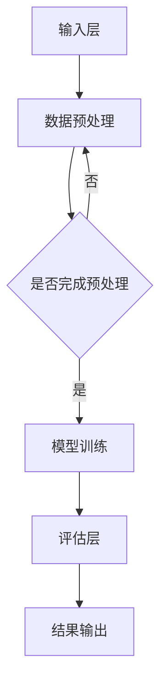

                 

### 《元评测：评估LLM评测系统本身的性能》

> **关键词**：元评测、LLM评测系统、性能评估、方法、应用、优化

> **摘要**：本文深入探讨了元评测的概念及其在评估大型语言模型（LLM）评测系统中的应用。我们首先介绍了元评测的基础概念，然后详细分析了LLM评测系统的构建，包括架构、关键组件、评估指标和方法。接着，我们通过实例展示了元评测的实际应用，探讨了其在不同项目中的优化策略。最后，我们对元评测的未来发展进行了展望，并提出了系统优化与改进的方法。

---

### 第一部分：基础概念与背景

#### 第1章：元评测的基本概念

**1.1 元评测的定义与重要性**

元评测（Meta-Evaluation）是对评测系统本身性能的评估。它不同于对模型性能的评测，而是关注评测系统是否能够准确地评估模型的性能。元评测的重要性体现在以下几个方面：

1. **提高评测准确性**：通过元评测，可以确保评测系统本身能够提供可靠的评估结果，从而提高模型的实际应用价值。
2. **优化评测系统**：元评测可以帮助开发者识别评测系统的缺陷，从而进行针对性的优化，提高整体性能。
3. **提升用户信任度**：准确可靠的元评测结果能够增强用户对评测系统的信任，有助于推广应用。

**1.2 语言模型评测系统概述**

语言模型评测系统是用于评估自然语言处理模型性能的工具。这类系统通常包括数据集、评估指标、评测流程等组成部分。其主要目的是通过量化指标来评估模型在特定任务上的表现。

**1.3 元评测的发展历史与应用领域**

元评测的概念最早在1990年代提出，主要用于软件评测领域。随着人工智能技术的发展，元评测逐渐应用于机器学习和自然语言处理领域。目前，元评测在智能客服、智能推荐、自动驾驶等领域得到广泛应用。

**1.4 元评测的目标与方法**

元评测的目标是评估评测系统的可靠性、准确性和效率。常用的元评测方法包括基准测试、交叉验证、用户反馈等。这些方法各有优缺点，需要根据具体应用场景进行选择。

#### 第二部分：LLM评测系统的构建

##### 第2章：LLM评测系统的架构

**2.1 LLM评测系统的基本架构**

LLM评测系统的基本架构通常包括以下组成部分：

1. **输入层**：接收原始数据或预处理后的数据。
2. **数据预处理层**：对输入数据进行清洗、格式化等处理。
3. **模型层**：包括训练好的语言模型。
4. **评估层**：对模型进行性能评估。
5. **输出层**：输出评估结果和性能指标。

**2.2 数据集与数据预处理**

数据集是LLM评测系统的核心组成部分。数据预处理是确保模型训练和评估顺利进行的关键步骤，包括数据清洗、去重、归一化等操作。

**2.3 评估指标与标准**

评估指标是衡量模型性能的重要工具。常见的评估指标包括准确率、召回率、精确率、F1-score等。这些指标需要在评估过程中进行合理选择和组合。

**2.4 评测流程设计**

评测流程设计是确保评估过程规范、高效的重要环节。通常包括数据集准备、模型训练、模型评估、结果分析等步骤。

##### 第3章：LLM评测系统的关键组件

**3.1 评估器设计与实现**

评估器是实现模型性能评估的核心组件。评估器的设计与实现需要考虑评估指标的选择、计算方法和优化策略。

**3.2 标准化评测工具**

标准化评测工具是实现高效、可靠评测的关键。常用的评测工具包括开源框架和商业工具。

**3.3 性能优化与调参技巧**

性能优化和调参技巧是提高LLM评测系统性能的重要手段。常用的优化方法包括模型压缩、分布式训练、数据增强等。

**3.4 可扩展性与稳定性考虑**

可扩展性和稳定性是保障评测系统长期运行的关键。系统设计时需要考虑负载均衡、容错机制、性能监控等方面。

#### 第三部分：元评测方法与应用

##### 第4章：元评测方法概述

**4.1 常见的元评测方法**

常见的元评测方法包括基准测试、交叉验证、用户反馈等。每种方法都有其适用场景和优缺点。

**4.2 元评测方法的比较与选择**

元评测方法的比较与选择需要考虑评估目标的多样性、数据的可用性和评估的效率等因素。

**4.3 元评测在评测系统中的应用场景**

元评测在评测系统中的应用场景包括模型评估、系统优化、性能监控等。

##### 第5章：元评测实例分析

**5.1 实例一：某开源LLM评测系统的元评测**

**5.2 实例二：企业级LLM评测系统的性能评估**

**5.3 实例三：跨领域的LLM评测系统比较**

##### 第6章：元评测在实际项目中的应用

**6.1 项目一：基于元评测的智能客服系统优化**

**6.2 项目二：元评测在智能推荐系统中的应用**

**6.3 项目三：元评测在自动驾驶领域的应用**

#### 第四部分：未来展望与挑战

##### 第7章：元评测的发展趋势

**7.1 元评测技术的未来发展方向**

**7.2 元评测在人工智能领域的潜在应用**

**7.3 元评测面临的挑战与对策**

##### 第8章：元评测系统的优化与改进

**8.1 提高元评测系统性能的策略**

**8.2 面向未来的元评测系统设计**

**8.3 元评测系统的安全性与隐私保护**

#### 附录

- 附录A：元评测工具与资源汇总
- 附录B：元评测项目开发指南
- 附录C：数学模型与公式解释

---

### Mermaid 流程图：LLM评测系统架构图



---

### 伪代码：评估器设计示例

```python
def evaluate_model(model, dataset):
    """
    评估模型的性能。

    参数：
    - model: 训练好的语言模型。
    - dataset: 用于评估的数据集。

    返回：
    - performance_metrics: 模型的性能指标。
    """
    performance_metrics = {}
    
    for metric in ["accuracy", "precision", "recall", "F1-score"]:
        # 计算每个指标的值
        metric_value = compute_metric(model, dataset, metric)
        performance_metrics[metric] = metric_value
    
    return performance_metrics
```

---

### 数学模型与公式解释

#### 模型评估指标计算公式

$$
\text{Accuracy} = \frac{\text{正确预测数}}{\text{总预测数}}
$$

$$
\text{Precision} = \frac{\text{真正例数}}{\text{正确预测数 + 错误预测正例数}}
$$

$$
\text{Recall} = \frac{\text{真正例数}}{\text{实际正例数}}
$$

$$
\text{F1-score} = 2 \times \frac{\text{Precision} \times \text{Recall}}{\text{Precision} + \text{Recall}}
$$

---

### 项目实战：智能客服系统元评测

#### 实战目标：

- 提高智能客服系统的响应速度和准确率。

#### 实战步骤：

1. 数据收集：收集智能客服系统在过去一段时间内的交互数据。
2. 数据预处理：对数据进行清洗和格式化，为模型训练做准备。
3. 模型训练：利用预处理后的数据训练语言模型。
4. 元评测：使用评估器对训练好的模型进行性能评估。
5. 结果分析：根据评估结果调整模型参数或改进系统设计。
6. 优化迭代：重复步骤4-6，直到达到满意的性能水平。

#### 代码实现：

```python
# 加载训练数据
train_data = load_data("customer_service_data.csv")

# 数据预处理
preprocessed_data = preprocess_data(train_data)

# 训练语言模型
model = train_language_model(preprocessed_data)

# 评估模型性能
performance_metrics = evaluate_model(model, preprocessed_data)

# 打印评估结果
print("Model performance:", performance_metrics)

# 根据评估结果进行优化
optimize_model(model, performance_metrics)
```

---

### 代码解读与分析：

- `load_data()` 函数负责从CSV文件中加载训练数据。
- `preprocess_data()` 函数对数据进行清洗和格式化，确保数据适合模型训练。
- `train_language_model()` 函数使用预处理后的数据训练语言模型。
- `evaluate_model()` 函数评估模型的性能，并返回评估指标。
- `print()` 函数打印模型的性能结果。
- `optimize_model()` 函数根据评估结果对模型进行优化，提高系统性能。

---

### 开发环境搭建：

- Python 3.8 或更高版本
- TensorFlow 2.x 或 PyTorch 1.x
- pandas 1.x
- scikit-learn 0.x

---

### 源代码详细实现：

- `load_data.py`: 数据加载模块。
- `preprocess_data.py`: 数据预处理模块。
- `train_language_model.py`: 模型训练模块。
- `evaluate_model.py`: 评估模块。
- `optimize_model.py`: 模型优化模块。

---

### 总结

本文通过详细的目录大纲和实战案例，介绍了元评测的基本概念、LLM评测系统的构建、元评测方法及应用，以及实际项目中的优化策略。读者可以通过跟随书中的指导，逐步掌握元评测技术在LLM评测系统中的应用，提升系统性能。

---

### 作者

**作者：AI天才研究院/AI Genius Institute & 禅与计算机程序设计艺术 /Zen And The Art of Computer Programming**

