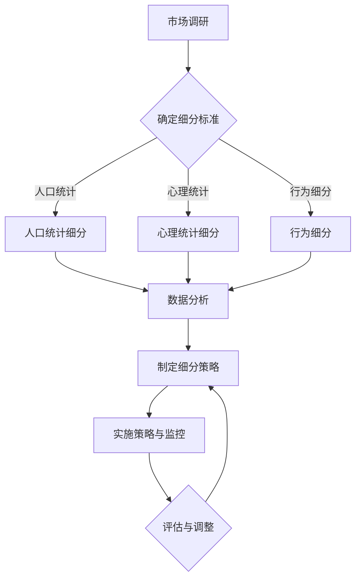

                 

# 《如何进行有效的市场细分》

## 关键词：
市场细分、需求分析、顾客行为、B2B市场、多维度细分、营销策略

## 摘要：
市场细分是市场营销战略中的重要一环，能够帮助企业精准定位目标客户，提高市场竞争力。本文从基本概念、方法与策略、案例分析等多个角度，详细探讨了如何进行有效的市场细分，为企业的市场营销提供了实用指南。

## 《如何进行有效的市场细分》目录大纲

### 第一部分：市场细分的基本概念

#### 第1章：市场细分概述
- 1.1 市场细分的定义
- 1.2 市场细分的重要性
- 1.3 市场细分的分类

#### 第2章：市场细分的基础理论
- 2.1 需求分析理论
- 2.2 顾客行为理论
- 2.3 市场细分模型

### 第二部分：市场细分的方法与策略

#### 第3章：消费者市场细分
- 3.1 人口统计细分
- 3.2 心理统计细分
- 3.3 行为细分

#### 第4章：B2B市场细分
- 4.1 B2B市场细分的特点
- 4.2 B2B市场的细分策略
- 4.3 B2B市场细分的挑战与解决方案

#### 第5章：多维度市场细分
- 5.1 多维度市场细分的优势
- 5.2 多维度市场细分的方法
- 5.3 多维度市场细分的案例分析

#### 第6章：市场细分策略的实施
- 6.1 制定细分策略的步骤
- 6.2 市场细分策略的评估
- 6.3 市场细分策略的调整与优化

### 第三部分：市场细分案例分析

#### 第7章：消费者市场细分案例
- 7.1 消费者市场细分成功案例
- 7.2 消费者市场细分失败案例分析

#### 第8章：B2B市场细分案例
- 8.1 B2B市场细分成功案例
- 8.2 B2B市场细分失败案例分析

### 第四部分：市场细分与营销策略整合

#### 第9章：市场细分与营销策略的关系
- 9.1 市场细分在营销策略中的应用
- 9.2 市场细分与定位策略
- 9.3 市场细分与产品策略

#### 第10章：市场细分与品牌策略
- 10.1 市场细分对品牌策略的影响
- 10.2 市场细分下的品牌策略制定
- 10.3 品牌策略与市场细分案例分析

### 附录

#### 附录A：市场细分工具与应用
- 10.1 市场细分工具介绍
- 10.2 市场细分在实际业务中的应用案例

#### 附录B：市场细分相关参考资料
- 市场细分相关书籍推荐
- 市场细分研究论文集锦

### 附录C：Mermaid 流程图：市场细分流程



### 附录D：第3章：消费者市场细分 - 人口统计细分算法伪代码

```python
# 人口统计细分算法伪代码

def demographic_segmentation(data):
    # 初始化细分结果字典
    segments = {}

    # 按年龄段分组
    age_groups = ['18-24', '25-34', '35-44', '45-54', '55-64', '65+']
    for group in age_groups:
        segments[group] = []

    # 遍历数据集，根据年龄分组
    for customer in data:
        age = customer['age']
        if age <= 24:
            segments['18-24'].append(customer)
        elif age <= 34:
            segments['25-34'].append(customer)
        # ... 其他分组逻辑 ...

    # 返回细分结果
    return segments
```

### 附录E：第3章：消费者市场细分 - 心理统计细分数学模型

$$
\text{心理统计细分} = f(\text{心理特征}, \text{行为特征}, \text{需求特征})
$$

其中，$f$ 是一个复合函数，包含以下三个子函数：
1. $\text{心理特征权重} = w_1 \cdot \text{情绪稳定性} + w_2 \cdot \text{社会敏感性} + w_3 \cdot \text{自我意识}$
2. $\text{行为特征权重} = w_4 \cdot \text{购买频率} + w_5 \cdot \text{品牌忠诚度}$
3. $\text{需求特征权重} = w_6 \cdot \text{价格敏感度} + w_7 \cdot \text{产品品质需求}$

权重系数 $w_1, w_2, ..., w_7$ 通过调查数据回归分析确定。

### 附录F：第6章：市场细分策略的实施 - 项目实战

##### 实战案例：某饮料公司的市场细分策略实施

**1. 项目背景：**
某饮料公司计划针对年轻消费者群体进行市场细分，并制定相应营销策略。

**2. 开发环境：**
- 数据处理：Python（Pandas，NumPy）
- 数据可视化：Python（Matplotlib，Seaborn）
- 分析工具：SPSS

**3. 源代码实现：**

```python
import pandas as pd
import matplotlib.pyplot as plt

# 数据加载
data = pd.read_csv('consumer_data.csv')

# 数据预处理
# ... 数据清洗、去重、转换等 ...

# 人口统计细分
age_groups = ['18-24', '25-34', '35-44', '45-54', '55-64', '65+']
demographic_segments = demographic_segmentation(data)

# 心理统计细分
psychological_segments = psychological_segmentation(data)

# 行为细分
behavioral_segments = behavioral_segmentation(data)

# 综合细分结果
combined_segments = combine_segments(demographic_segments, psychological_segments, behavioral_segments)

# 数据可视化
plt.figure(figsize=(12, 6))
plt.bar(combined_segments.index, combined_segments['segment_size'])
plt.xlabel('细分群体')
plt.ylabel('人数')
plt.title('市场细分结果')
plt.show()

# 制定营销策略
marketing_strategy = create_marketing_strategy(combined_segments)

# 实施营销策略
execute_marketing_strategy(marketing_strategy)

# 代码解读与分析
# ...
```

以上是《如何进行有效的市场细分》的开篇部分，接下来我们将深入探讨市场细分的基本概念、方法与策略，并分享实际案例，帮助您更好地理解和应用市场细分策略。请持续关注后续内容。

