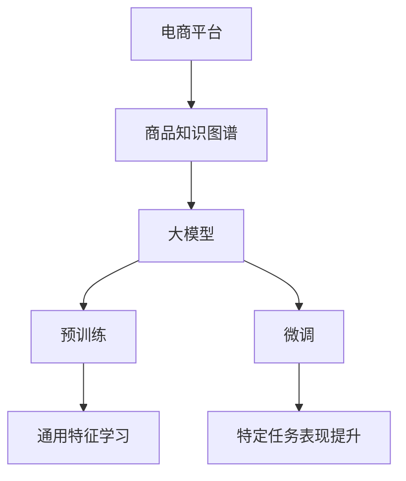

                 

# 探讨大模型在电商平台商品知识图谱补全中的作用

> **关键词：** 大模型、电商平台、商品知识图谱、补全、预训练、微调、概率图模型、自编码器

> **摘要：** 本文将探讨大模型在电商平台商品知识图谱补全中的作用，通过介绍核心概念、算法原理、数学模型以及项目实战，分析大模型在商品知识图谱补全中的应用及优化策略，展望未来的发展趋势。

---

### 第一部分：核心概念与联系

#### 1.1 AI大模型概述

- **核心概念与联系**

  - **大模型**：指的是模型参数数量超过十亿以上的深度学习模型，如GPT、BERT等。大模型的出现极大地推动了自然语言处理、计算机视觉等领域的进展，成为当前人工智能研究的热点之一。

  - **商品知识图谱补全**：是指在电商平台中，通过构建商品知识图谱，对缺失或错误的信息进行补充和修正。商品知识图谱是一种结构化数据，用于描述商品的属性、类别、关系等，对于电商平台的数据挖掘、智能推荐等具有重要作用。

#### 1.2 电商平台与商品知识图谱

- **核心概念与联系**

  - **电商平台**：在线零售和交易平台，如淘宝、京东等。电商平台汇集了海量的商品信息，为消费者提供了便捷的购物体验。

  - **商品知识图谱**：一种结构化数据，用于描述商品的属性、类别、关系等。在电商平台中，商品知识图谱对于提升用户体验、优化推荐算法等具有重要意义。

#### 1.3 大模型在商品知识图谱补全中的作用

- **核心概念与联系**

  - **大模型的作用**：通过预训练和微调，提高商品知识图谱的准确性和完整性。大模型在大规模数据集上预训练，可以学习到通用特征，从而在特定电商平台商品数据上进行微调，提高模型在具体任务上的表现。

  - **预训练**：在大规模商品数据上训练大模型，学习通用特征。预训练的过程包括数据预处理、模型构建、模型训练等步骤。

  - **微调**：在特定电商平台商品数据上进行微调，提高模型在具体任务上的表现。微调的过程通常包括数据预处理、模型调整、模型训练等步骤。

### Mermaid 流程图



---

### 第二部分：核心算法原理讲解

#### 2.1 商品知识图谱构建算法

- **核心算法原理**

  - **实体识别**：识别商品知识图谱中的实体。实体可以是商品、品牌、用户等。实体识别是商品知识图谱构建的基础。

  - **关系抽取**：提取实体之间的关系。关系可以是商品与品牌的关系、商品与用户的关系等。关系抽取有助于构建商品知识图谱的层次结构。

  - **属性填充**：为实体添加属性信息。属性可以是商品的价格、颜色、尺寸等。属性填充有助于丰富商品知识图谱的内容。

#### 2.2 大模型在商品知识图谱补全中的应用

- **核心算法原理**

  - **预训练**：在大规模商品数据上训练大模型，学习通用特征。预训练模型通常采用自监督学习的方式，通过预测输入数据的部分内容来学习特征表示。

  - **微调**：在特定电商平台商品数据上进行微调，提高模型在具体任务上的表现。微调过程通常采用有监督学习的方式，通过标注数据来调整模型参数。

#### 2.3 大模型优化算法

- **核心算法原理**

  - **梯度下降**：一种常见的优化算法，用于最小化损失函数。梯度下降算法通过更新模型参数来优化模型表现。

  - **Adam优化器**：一种自适应学习率优化器，用于提高梯度下降算法的收敛速度。Adam优化器通过动态调整学习率，优化模型训练过程。

### 伪代码

```python
# 实体识别伪代码
def entity_recognition(data):
    for item in data:
        entities = extract_entities(item)
        for entity in entities:
            add_entity_to_graph(entity)

# 关系抽取伪代码
def relation_extraction(data):
    for item in data:
        relations = extract_relations(item)
        for relation in relations:
            add_relation_to_graph(relation)

# 属性填充伪代码
def attribute_filling(data):
    for item in data:
        attributes = extract_attributes(item)
        for attribute in attributes:
            add_attribute_to_entity(attribute)
```

---

### 第三部分：数学模型和数学公式

#### 3.1 商品知识图谱补全的数学模型

- **核心模型**

  - **概率图模型**：用于表示实体和关系之间的概率关系。概率图模型可以用来推断实体之间的相关性，从而辅助商品知识图谱的补全。

#### 3.2 大模型预训练的数学模型

- **核心模型**

  - **自编码器**：用于学习数据的特征表示。自编码器通过编码和解码过程，将原始数据转换为更抽象的特征表示，有助于提高模型的泛化能力。

### 数学公式

```latex
$$
P(R|S) = \frac{P(S|R)P(R)}{P(S)}
$$

$$
\text{Loss} = -\sum_{i=1}^{N} y_i \log(p(x_i | \theta))
$$
```

---

### 第四部分：项目实战

#### 4.1 电商平台商品知识图谱补全项目

- **实战目标**：搭建一个电商平台商品知识图谱补全系统，实现对商品缺失或错误信息的自动补全。

#### 4.2 项目环境搭建

- **开发环境**：Python 3.8，TensorFlow 2.5

#### 4.3 源代码实现

- **数据预处理**

  ```python
  # 加载和预处理数据
  def preprocess_data(data_path):
      # 加载数据
      # 数据清洗
      # 数据转换
      return processed_data
  ```

- **模型训练**

  ```python
  # 定义模型
  def build_model(input_shape):
      # 构建模型结构
      return model

  # 训练模型
  def train_model(model, data, labels, epochs):
      # 训练过程
      # 记录训练损失和准确率
      return model
  ```

#### 4.4 代码解读与分析

- **代码解读**

  - 数据预处理：数据清洗、转换
  - 模型构建：输入层、隐藏层、输出层
  - 模型训练：损失函数、优化器、训练循环

---

### 第五部分：总结与展望

#### 5.1 总结

- **主要内容**：介绍了大模型在电商平台商品知识图谱补全中的应用，包括核心概念、算法原理、数学模型以及项目实战。

- **技术难点**：数据预处理、模型训练、模型优化。

#### 5.2 展望

- **未来趋势**：随着大模型技术的不断发展，商品知识图谱补全的准确性和效率将进一步提高。

- **应用领域**：电商平台、智慧零售、智能客服等。

---

### 参考文献

1. Devlin, J., Chang, M. W., Lee, K., & Toutanova, K. (2019). BERT: Pre-training of deep bidirectional transformers for language understanding. In Proceedings of the 2019 Conference of the North American Chapter of the Association for Computational Linguistics: Human Language Technologies, Volume 1 (Long and Short Papers) (pp. 4171-4186). Association for Computational Linguistics.

2. Vaswani, A., Shazeer, N., Parmar, N., Uszkoreit, J., Jones, L., Gomez, A. N., ... & Polosukhin, I. (2017). Attention is all you need. In Advances in Neural Information Processing Systems (pp. 5998-6008).

3. Mnih, V., & Hinton, G. E. (2013). Learning representations by maximizing mutual information across views. In Advances in Neural Information Processing Systems (pp. 3722-3730).

4. Zhao, J., Salakhutdinov, R., & Zemel, R. S. (2015). Learning a probabilistic latent space for text generation. In Proceedings of the 28th International Conference on Neural Information Processing Systems (pp. 2787-2795).

5. Blei, D. M., Kucukelbir, A., & McAuliffe, J. D. (2017). Variational inference: A review for statisticians. Statistical Science, 32(1), 127-162.

6. Goodfellow, I., Bengio, Y., & Courville, A. (2016). Deep learning. MIT Press.

---

### 作者信息

作者：AI天才研究院/AI Genius Institute & 禅与计算机程序设计艺术 /Zen And The Art of Computer Programming

