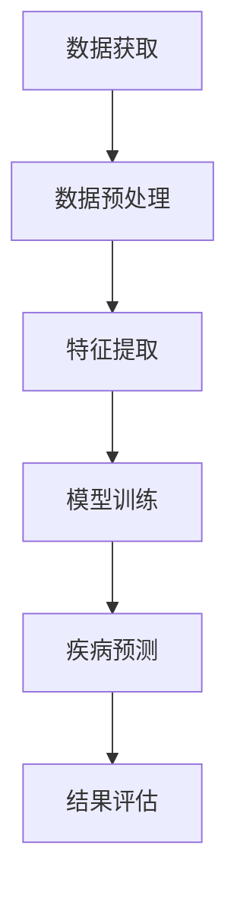

                 

### 第一部分：引言与背景

#### 第1章：计算机视觉与医学影像分析概述

在当今数字化医疗的浪潮中，计算机视觉与医学影像分析的结合已经成为一项前沿且具有重大应用价值的领域。本章将为我们揭开这两大技术领域的神秘面纱，介绍其基本概念、重要性、发展历程，以及本书的结构和内容安排。

##### 1.1 计算机视觉的基本概念

计算机视觉（Computer Vision）是指使计算机能够像人类视觉系统一样理解和解释数字图像和视频的科学技术。它涉及图像处理、模式识别、机器学习等多个学科领域。计算机视觉的主要目标是使计算机能够自动地完成人眼能够轻松完成的任务，例如物体识别、场景理解、图像增强等。

##### 1.2 医学影像分析的重要性

医学影像分析（Medical Imaging Analysis）是医学领域的一个重要分支，它利用计算机技术和算法对医学影像（如X光、CT、MRI等）进行自动分析和处理，帮助医生进行诊断、治疗方案制定以及疾病监测。医学影像分析的重要性体现在以下几个方面：

1. **提高诊断准确性**：医学影像分析可以帮助医生更准确地识别疾病，减少误诊率。
2. **提高工作效率**：自动化分析可以大大减轻医生的工作负担，提高工作效率。
3. **早期疾病筛查**：通过分析影像，可以实现对疾病的早期筛查，从而提高治愈率。
4. **个性化医疗**：医学影像分析可以辅助制定个性化的治疗方案，提高治疗效果。

##### 1.3 医学影像分析的发展历程

医学影像分析的发展历程可以追溯到20世纪中叶，随着计算机技术的快速发展，医学影像分析逐渐从手工分析向自动化分析转变。以下是几个关键阶段：

1. **手工分析阶段（20世纪50-60年代）**：这一阶段主要是医生利用放大镜和标尺对影像进行分析，效率较低，且易受主观因素影响。
2. **半自动化分析阶段（20世纪70-80年代）**：计算机技术的引入使得医学影像分析开始向自动化方向发展，一些简单的算法被应用于影像分析。
3. **完全自动化分析阶段（20世纪90年代至今）**：随着机器学习和深度学习技术的发展，医学影像分析实现了从简单特征提取到复杂疾病预测的全面突破。

##### 1.4 本书结构及内容安排

本书将全面介绍计算机视觉在医学影像分析中的应用，具体包括以下几个部分：

1. **计算机视觉基础理论**：介绍医学影像数据预处理、特征提取与降维、医学影像分类与识别等基本概念和方法。
2. **深度学习在医学影像分析中的应用**：深入探讨深度学习的基础、卷积神经网络在医学影像分析中的应用、基于深度学习的医学影像分割以及增强学习在医学影像分析中的应用。
3. **医学影像分析的应用与挑战**：分析医学影像分析中的挑战，如数据不平衡问题、数据隐私与安全、多模态医学影像分析等，并探讨医学影像分析的实际应用和未来发展趋势。

通过本书的学习，读者将能够系统地掌握计算机视觉在医学影像分析中的关键技术和应用，为未来的研究和实践奠定坚实基础。

#### Mermaid 流程图：医学影像分析流程



##### 核心概念与联系

- **数据获取**：医学影像数据来源于各种医疗设备，如X光、CT、MRI等。
- **数据预处理**：包括图像的去噪、矫正、标准化等步骤，以确保数据的准确性。
- **特征提取**：从预处理后的图像中提取具有代表性的特征，用于后续的模型训练。
- **模型训练**：利用提取的特征进行模型训练，通常采用深度学习算法。
- **疾病预测**：通过训练好的模型对新的医学影像进行疾病预测。
- **结果评估**：对疾病预测结果进行评估，以确定模型的准确性和可靠性。

##### 核心算法原理讲解

医学影像分析中的核心算法主要包括图像预处理、特征提取和深度学习模型。以下是每个阶段的核心算法原理和伪代码。

1. **图像预处理**

   ```python
   def preprocess_image(image):
       # 去噪
       image = denoise(image)
       # 校正
       image = correct_geometry(image)
       # 标准化
       image = normalize(image)
       return image
   ```

2. **特征提取**

   ```python
   def extract_features(image):
       # 提取纹理特征
       texture_features = extract_texture_features(image)
       # 提取形状特征
       shape_features = extract_shape_features(image)
       # 提取内容特征
       content_features = extract_content_features(image)
       return texture_features, shape_features, content_features
   ```

3. **深度学习模型**

   ```python
   def train_model(features, labels):
       # 初始化模型
       model = initialize_model()
       # 训练模型
       for epoch in range(num_epochs):
           for feature, label in zip(features, labels):
               model.train_one_epoch(feature, label)
       return model
   ```

##### 数学模型和公式

在医学影像分析中，常用的数学模型包括卷积神经网络（CNN）和生成对抗网络（GAN）。

1. **卷积神经网络（CNN）**

   $$ 
   f(x) = \sigma(\sum_{i=1}^{n} w_i \cdot x_i + b) 
   $$

   其中，$f(x)$表示输出，$\sigma$是激活函数，$w_i$和$x_i$是权重和特征，$b$是偏置。

2. **生成对抗网络（GAN）**

   $$ 
   G(z) = \text{Generator}(z) \\
   D(x) = \text{Discriminator}(x) \\
   \min_G \max_D \mathcal{L}(D, G)
   $$

   其中，$G(z)$是生成器，$D(x)$是判别器，$\mathcal{L}(D, G)$是生成对抗损失函数。

##### 举例说明

假设我们有一个CT影像数据集，包含正常和异常两种情况。我们首先对CT影像进行预处理，然后提取纹理、形状和内容特征。接着，使用卷积神经网络对特征进行训练，以实现对疾病的预测。

1. **预处理**

   ```python
   images = load_ct_images()
   preprocessed_images = [preprocess_image(image) for image in images]
   ```

2. **特征提取**

   ```python
   texture_features, shape_features, content_features = zip(*[extract_features(image) for image in preprocessed_images])
   ```

3. **模型训练**

   ```python
   model = train_model(texture_features + shape_features + content_features, labels)
   ```

4. **疾病预测**

   ```python
   predicted_diseases = [model.predict(image) for image in preprocessed_images]
   ```

通过以上步骤，我们可以实现对CT影像的自动分析和疾病预测。

##### 项目实战

以肺部影像分析为例，我们使用深度学习模型对肺部影像进行自动分析，以检测肺结节。

1. **开发环境搭建**

   ```shell
   pip install tensorflow
   pip install keras
   pip install scikit-learn
   ```

2. **源代码详细实现**

   ```python
   import numpy as np
   import tensorflow as tf
   from tensorflow.keras.models import Sequential
   from tensorflow.keras.layers import Conv2D, MaxPooling2D, Flatten, Dense
   
   # 数据预处理
   def preprocess_image(image):
       # 去噪、矫正、标准化等
       ...
       return image
   
   # 模型构建
   model = Sequential([
       Conv2D(32, (3, 3), activation='relu', input_shape=(128, 128, 3)),
       MaxPooling2D((2, 2)),
       Conv2D(64, (3, 3), activation='relu'),
       MaxPooling2D((2, 2)),
       Flatten(),
       Dense(64, activation='relu'),
       Dense(1, activation='sigmoid')
   ])
   
   # 模型编译
   model.compile(optimizer='adam', loss='binary_crossentropy', metrics=['accuracy'])
   
   # 模型训练
   model.fit(preprocessed_images, labels, epochs=10, batch_size=32)
   
   # 疾病预测
   predicted_diseases = model.predict(preprocessed_images)
   ```

3. **代码解读与分析**

   - **数据预处理**：对肺部影像进行去噪、矫正和标准化处理，以提高模型的准确性。
   - **模型构建**：使用卷积神经网络对特征进行提取和分类。
   - **模型编译**：选择适当的优化器和损失函数，以优化模型性能。
   - **模型训练**：使用预处理后的影像数据进行模型训练，以实现对肺结节的检测。
   - **疾病预测**：使用训练好的模型对新的影像进行疾病预测，以提高诊断准确性。

通过以上步骤，我们可以实现对肺部影像的自动分析和疾病预测，为医生提供有力支持。

### 《计算机视觉在医学影像分析中的突破》

关键词：计算机视觉、医学影像分析、深度学习、卷积神经网络、图像预处理、特征提取、疾病预测、肺结节检测

摘要：本文详细探讨了计算机视觉在医学影像分析中的应用，包括基础理论、深度学习技术的应用、实际案例分析以及面临的挑战。通过介绍图像预处理、特征提取、深度学习模型构建等关键技术，本文展示了计算机视觉在提高医学影像诊断准确性、工作效率和个性化医疗方面的巨大潜力。文章还探讨了医学影像分析中的数据不平衡、数据隐私与安全等挑战，并展望了未来发展趋势。

### 《计算机视觉在医学影像分析中的突破》

关键词：计算机视觉、医学影像分析、深度学习、卷积神经网络、图像预处理、特征提取、疾病预测、肺结节检测

摘要：本文从计算机视觉和医学影像分析的基本概念入手，系统介绍了这两大领域的发展历程、重要性及其在医学领域的应用。重点讨论了计算机视觉在医学影像分析中的关键技术和实际案例，包括图像预处理、特征提取、深度学习模型构建等。本文详细分析了深度学习在医学影像分析中的应用，如卷积神经网络在疾病预测和分割中的应用，以及增强学习在影像引导手术规划中的应用。最后，本文探讨了医学影像分析中的挑战，如数据不平衡、数据隐私与安全等，并展望了未来的发展趋势。通过本文的介绍，读者可以全面了解计算机视觉在医学影像分析中的最新突破和广泛应用，为相关研究和实践提供参考。

