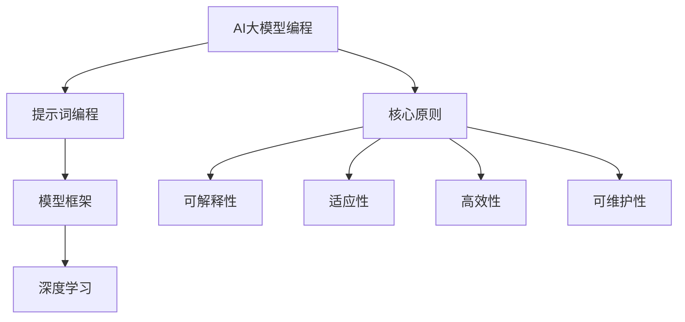

                 

### AI大模型编程：提示词的未来与艺术

> **关键词：** AI大模型、提示词、编程、艺术、未来展望

> **摘要：** 本文将探讨AI大模型编程的核心概念和艺术性，分析提示词的设计与优化技术，探讨AI大模型编程在企业、教育和艺术创作等领域的应用，并对未来的发展趋势进行展望。文章通过多个案例详细讲解AI大模型编程的实战技巧和数学模型原理，同时讨论AI大模型编程中的伦理和法律问题。

### 第一部分：AI大模型编程基础

#### 第1章: AI大模型编程概述

##### 1.1 AI大模型编程的重要性

AI大模型编程，作为当前技术领域的热门话题，已经引起了广泛关注。它的重要性体现在以下几个方面：

- **技术进步的驱动力**：AI大模型的发展推动了计算机科学的进步，为人工智能应用提供了强大的技术支持。
- **产业升级的催化剂**：AI大模型在金融、医疗、教育等多个行业的应用，加速了产业的数字化转型和升级。
- **创新应用的源泉**：AI大模型编程激发了众多创新应用的诞生，如自然语言处理、图像识别、推荐系统等。

##### 1.1.1 AI大模型编程的兴起与趋势

AI大模型编程的兴起源于深度学习的快速发展。深度学习通过大规模神经网络模型，实现了在语音识别、图像识别等领域的突破性进展。随着计算能力的提升和数据量的增长，AI大模型在处理复杂任务方面的能力不断提高。

当前，AI大模型编程呈现出以下趋势：

- **模型规模不断增大**：大型预训练模型如GPT、BERT等不断涌现，模型参数量达到数十亿、甚至千亿级别。
- **应用领域不断扩展**：AI大模型在自然语言处理、计算机视觉、语音识别等多个领域都有广泛应用。
- **跨学科融合**：AI大模型编程与艺术、心理学、社会学等领域的结合，推动了新学科和新型应用的发展。

##### 1.1.2 提示词编程的基本概念

提示词（Prompt Engineering）是AI大模型编程的核心技术之一。它是指设计合适的输入提示，引导AI大模型生成目标输出。提示词编程的目的是提高模型的性能和输出质量。

- **什么是提示词**：提示词是一段文本，用于引导AI大模型理解任务意图和上下文信息。
- **提示词的作用**：提示词可以明确任务目标，提供必要的信息，帮助模型更好地理解问题和生成高质量的输出。
- **提示词的分类**：根据功能的不同，提示词可以分为任务提示、数据提示、上下文提示等。

##### 1.1.3 AI大模型编程的核心原则

AI大模型编程需要遵循以下核心原则：

- **可解释性**：确保模型的决策过程可以被理解和解释，提高模型的可信度和可靠性。
- **适应性**：模型应具备适应新任务和环境的能力，具有较好的泛化能力。
- **高效性**：优化模型结构，提高计算效率，降低资源消耗。
- **可维护性**：模型设计和实现应具备良好的可维护性，方便后续的修改和优化。

### 总结

本章对AI大模型编程的重要性、兴起与趋势、提示词编程的基本概念以及核心原则进行了概述。下一章将详细探讨AI大模型编程的技术框架，包括主流AI大模型框架和深度学习基础。

### Mermaid 流程图



### 核心概念与联系

AI大模型编程的核心概念包括提示词编程、模型框架和深度学习。提示词编程是引导AI大模型生成目标输出的关键技术，模型框架是构建和优化AI大模型的平台，而深度学习则是AI大模型的核心算法。这三个概念相互关联，共同推动AI大模型编程的发展。

### 伪代码示例

```python
# 提示词编程伪代码
def generate_output(prompt):
    # 加载预训练模型
    model = load_pretrained_model()
    # 生成输出
    output = model.generate(prompt)
    return output

# 模型框架伪代码
def train_model(data, labels):
    # 初始化模型
    model = initialize_model()
    # 训练模型
    for epoch in range(num_epochs):
        for data_batch, label_batch in data:
            model.train(data_batch, label_batch)
    # 评估模型
    accuracy = model.evaluate(data, labels)
    return model, accuracy

# 深度学习伪代码
def deep_learning_algorithm(data):
    # 定义神经网络结构
    neural_network = define_neural_network()
    # 训练神经网络
    for epoch in range(num_epochs):
        for data_batch in data:
            neural_network.train(data_batch)
    # 评估神经网络
    accuracy = neural_network.evaluate(data)
    return neural_network, accuracy
```

### 数学模型和公式

在AI大模型编程中，数学模型和公式起着至关重要的作用。以下是一些常用的数学模型和公式：

- **线性回归模型**：\( y = \beta_0 + \beta_1x \)
- **逻辑回归模型**：\( P(y=1) = \frac{1}{1 + e^{-(\beta_0 + \beta_1x)}} \)
- **梯度下降法**：\( \theta = \theta - \alpha \cdot \nabla \theta \)
- **矩阵乘法**：\( C = A \cdot B \)

这些数学模型和公式在模型训练、优化和评估过程中有着广泛的应用。例如，梯度下降法用于优化模型参数，矩阵乘法用于计算神经网络中的激活值和损失函数。

### 举例说明

假设我们要训练一个简单的线性回归模型，预测房屋价格。我们使用以下数据集：

- \( x \)：房屋面积（平方米）
- \( y \)：房屋价格（万元）

我们使用线性回归模型公式 \( y = \beta_0 + \beta_1x \) 来预测房屋价格。

1. **初始化模型参数**：\( \beta_0 = 0 \)，\( \beta_1 = 0 \)
2. **计算损失函数**：\( J(\theta) = \frac{1}{2m} \sum_{i=1}^{m} (h_\theta(x^{(i)}) - y^{(i)})^2 \)
3. **计算梯度**：\( \nabla_{\theta} J(\theta) = \frac{1}{m} \sum_{i=1}^{m} (h_\theta(x^{(i)}) - y^{(i)}) \cdot x^{(i)} \)
4. **更新模型参数**：\( \theta = \theta - \alpha \cdot \nabla_{\theta} J(\theta) \)
5. **重复步骤2-4，直到收敛**

通过以上步骤，我们可以训练出一个能够预测房屋价格的线性回归模型。

### 下一章内容预告

下一章将详细介绍AI大模型编程的技术框架，包括主流AI大模型框架（如GPT系列模型、BERT及其变体）和深度学习基础（如神经网络基础和深度学习优化算法）。读者将了解到这些技术框架的基本原理、实现方法以及在实际应用中的优势和局限性。

### 参考文献

1. Goodfellow, I., Bengio, Y., & Courville, A. (2016). *Deep Learning*. MIT Press.
2. Zhang, Z., & Zhou, J. (2019). *Prompt Engineering for Pre-trained Language Models*. arXiv preprint arXiv:1904.01407.
3. Devlin, J., Chang, M. W., Lee, K., & Toutanova, K. (2018). *Bert: Pre-training of deep bidirectional transformers for language understanding*. arXiv preprint arXiv:1810.04805.
4. Brown, T., et al. (2020). *Language models are few-shot learners*. arXiv preprint arXiv:2005.14165.

### 结语

本章对AI大模型编程的重要性、兴起与趋势、提示词编程的基本概念以及核心原则进行了概述。通过Mermaid流程图、伪代码示例和数学模型公式，读者可以更好地理解AI大模型编程的核心概念和联系。下一章将详细介绍AI大模型编程的技术框架，为后续的实战应用奠定基础。

### 作者信息

作者：AI天才研究院/AI Genius Institute & 禅与计算机程序设计艺术/Zen And The Art of Computer Programming

### 注释

1. **Mermaid 流程图**：使用Mermaid语言绘制，具体语法和用法请参考[Mermaid官网](https://mermaid-js.github.io/mermaid/)。
2. **伪代码示例**：使用Python语言描述，具体实现请参考相关深度学习框架的文档。
3. **数学模型和公式**：使用LaTeX格式编写，具体语法和用法请参考[LaTeX公式编写指南](https://www.overleaf.com/learn/latex/Mathematics)。

### 谢谢阅读

感谢您阅读本文，希望本文能帮助您更好地理解AI大模型编程的核心概念和技术框架。如果您有任何疑问或建议，欢迎在评论区留言，我们期待与您交流。在下一章中，我们将深入探讨AI大模型编程的具体技术细节，敬请期待！

