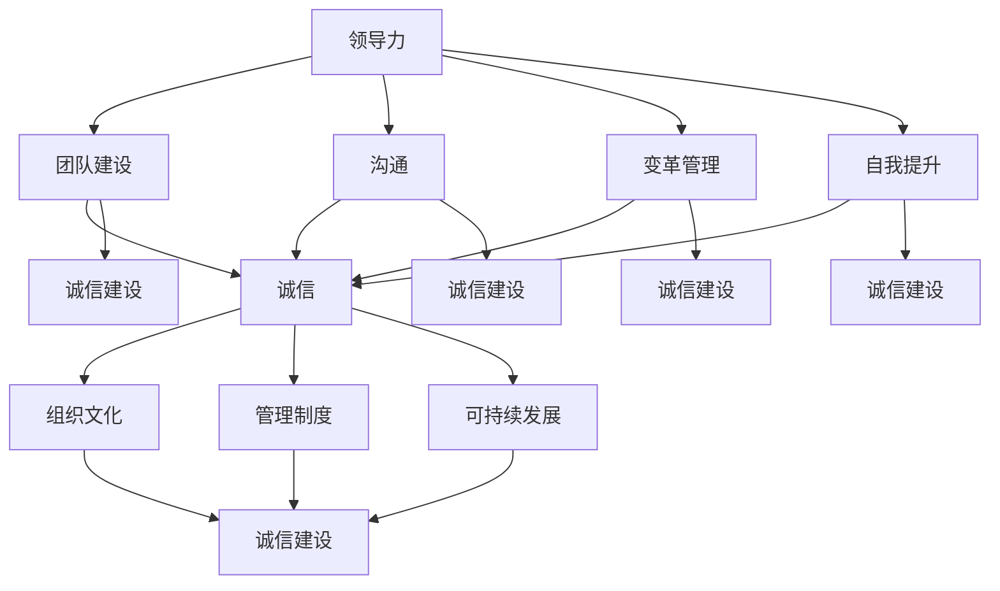

                 

## 引言

在现代商业环境中，领导力与诚信成为企业成功的两大关键因素。本文旨在探讨如何通过领导力与诚信的结合，建立可信赖的领导形象，从而推动组织的可持续发展。

首先，领导力不仅仅是一种职位赋予的权力，更是一种影响和激励他人的能力。优秀的领导者能够激发团队的潜能，实现组织的共同目标。而诚信，则是领导力的核心组成部分，是建立信任的基础。

本文将首先介绍领导力的定义和重要性，探讨优秀领导者的特质。接着，我们将深入探讨诚信的概念及其在领导力中的作用，分析诚信与道德伦理的关系。随后，本文将详细阐述如何建立可信赖的领导形象，包括可信赖领导者的特征、建立信任的策略以及维护诚信的重要性。

在领导力实践的篇章中，我们将探讨领导力与团队建设、沟通、变革管理以及自我提升的关系。通过具体案例分析，我们将展示成功领导者如何建立信任，以及失败领导者如何失去信任。同时，我们将探讨领导者在变革中的角色，以及如何进行自我反思和持续成长。

最后，本文将讨论诚信建设与组织文化、诚信管理与制度建设，以及诚信建设对组织可持续发展的影响。通过这一系列探讨，我们希望能够为领导者提供实用的指导，帮助他们建立可信赖的领导形象，推动组织的成功。

### 关键词

- 领导力
- 诚信
- 可信赖的领导形象
- 团队建设
- 沟通
- 变革管理
- 自我提升
- 组织文化
- 诚信管理
- 可持续发展

### 摘要

本文从领导力与诚信的角度，探讨了如何建立可信赖的领导形象。首先，我们介绍了领导力的定义、重要性以及优秀领导者的特质。接着，深入分析了诚信的概念及其在领导力中的作用，探讨了诚信与道德伦理的关系。随后，本文详细阐述了建立可信赖领导形象的具体策略，包括信任的建立和维护。在领导力实践的篇章中，我们探讨了领导力与团队建设、沟通、变革管理以及自我提升的关系。最后，本文讨论了诚信建设与组织文化、诚信管理与制度建设，以及诚信建设对组织可持续发展的影响。通过这一系列探讨，我们希望能够为领导者提供实用的指导，帮助他们建立可信赖的领导形象，推动组织的成功。

### 目录大纲

#### 第一部分：领导力基础

#### 第1章：领导力概述

##### 1.1 领导力的定义与重要性

##### 1.2 领导力的三大核心要素

##### 1.3 优秀领导者的特质

#### 第2章：诚信的重要性

##### 2.1 诚信的定义与内涵

##### 2.2 诚信在领导力中的作用

##### 2.3 诚信与道德伦理

#### 第3章：建立可信赖的领导形象

##### 3.1 可信赖领导者的特征

##### 3.2 建立信任的策略

##### 3.3 维护诚信的重要性

#### 第二部分：领导力实践

#### 第4章：领导力与团队建设

##### 4.1 团队建设的原则

##### 4.2 团队成员的激励与激励策略

##### 4.3 解决团队冲突的策略

#### 第5章：领导力与沟通

##### 5.1 沟通的重要性

##### 5.2 有效沟通的技巧

##### 5.3 领导者如何倾听

#### 第6章：领导力与变革管理

##### 6.1 变革管理的定义与原则

##### 6.2 变革管理的策略

##### 6.3 领导者在变革中的角色

#### 第7章：领导力与自我提升

##### 7.1 领导者如何进行自我反思

##### 7.2 自我提升的策略与方法

##### 7.3 领导者的持续成长

#### 第8章：领导力案例分析

##### 8.1 案例分析一：成功领导者如何建立信任

##### 8.2 案例分析二：失败领导者如何失去信任

##### 8.3 案例分析三：领导者如何在变革中保持诚信

#### 第三部分：诚信建设

#### 第9章：诚信建设与组织文化

##### 9.1 组织文化对诚信建设的影响

##### 9.2 建设诚信文化的策略

##### 9.3 诚信文化的评估与改进

#### 第10章：诚信管理与制度建设

##### 10.1 诚信管理的原则

##### 10.2 诚信管理的制度设计

##### 10.3 诚信管理的实践

#### 第11章：诚信建设与可持续发展

##### 11.1 诚信建设对组织可持续发展的影响

##### 11.2 诚信建设与社会责任

##### 11.3 诚信建设的未来展望

### Mermaid 流程图：领导力与诚信的关系



### 核心算法原理讲解

在本文中，我们将探讨一种基于数据和机器学习的诚信评估算法原理。诚信评估算法用于评估个人或组织的诚信水平，从而帮助领导者和管理者了解和改善组织的诚信状况。

#### 诚信评估算法原理

诚信评估算法的核心思想是通过收集与诚信相关的数据，提取关键特征，并利用机器学习模型进行训练和预测。以下是诚信评估算法的基本步骤：

1. **数据收集**：收集与个人或组织的诚信相关的数据。这些数据可以包括财务报告、合同履行记录、员工反馈、社区反馈等。数据来源可以是内部数据库、外部数据库或第三方报告。

2. **特征提取**：从收集到的数据中提取关键特征。这些特征可能包括合同履行率、财务报告准确性、员工满意度、社区评价等。特征提取的目的是将原始数据转化为适合机器学习模型处理的形式。

3. **模型训练**：使用监督学习算法（如决策树、随机森林、支持向量机等）对特征进行训练，构建诚信评估模型。模型训练的目的是学习数据中的规律，从而能够对新的数据做出准确的预测。

4. **模型评估**：使用交叉验证等方法评估模型的准确性、召回率、F1分数等指标。模型评估的目的是确保模型具有良好的性能，能够准确预测诚信水平。

5. **模型应用**：将训练好的模型应用于新的数据，预测个人或组织的诚信水平。模型应用可以帮助领导者和管理者了解组织的诚信状况，从而采取相应的措施进行改进。

#### 伪代码

以下是诚信评估算法的伪代码：

```python
# 数据收集
data = 收集数据()

# 特征提取
features = 提取特征(data)

# 模型训练
模型 = 训练模型(features)

# 模型评估
评估指标 = 评估模型(模型)

# 模型应用
预测 = 应用模型(模型，新数据)
```

### 数学模型和数学公式

在诚信评估算法中，我们可以使用数学模型和公式来计算诚信度。诚信度是一个介于0到1之间的数值，用于表示个人或组织的诚信水平。

假设我们有多个特征，每个特征都有对应的权重和实际值。我们可以使用以下公式计算诚信度：

$$
C = \frac{1}{N} \sum_{i=1}^{N} w_i \cdot c_i
$$

其中：

- \(C\) 表示总的诚信度。
- \(N\) 表示特征的数量。
- \(w_i\) 表示第 \(i\) 个特征的权重。
- \(c_i\) 表示第 \(i\) 个特征的实际值。

#### 详细讲解与举例说明

假设我们有两个特征：合同履行率和财务报告准确性。它们的权重分别为0.6和0.4。合同履行率为90%，财务报告准确率为95%。

根据上述公式，我们可以计算诚信度：

$$
C = \frac{1}{2} \cdot (0.6 \cdot 0.9 + 0.4 \cdot 0.95) = 0.88
$$

因此，该组织的诚信度为0.88，表示其具有很高的诚信水平。

### 项目实战

在本节中，我们将通过一个实战项目来展示如何使用Python和机器学习库实现一个简化的诚信评估系统。

#### 开发环境搭建

1. **硬件环境**：选择具有较高性能的服务器，配置不低于4核CPU和8GB内存。
2. **软件环境**：安装Python 3.8及以上版本，并安装相关的机器学习库，如Scikit-learn、Pandas、Numpy等。

#### 源代码详细实现

以下是一个简化的诚信评估系统的Python代码实现：

```python
import pandas as pd
from sklearn.model_selection import train_test_split
from sklearn.ensemble import RandomForestClassifier
from sklearn.metrics import accuracy_score, recall_score, f1_score

# 数据收集
data = pd.read_csv('data.csv')

# 特征提取
features = data[['contract_performance', 'financial_report_accuracy']]

# 标签
labels = data['credibility']

# 划分训练集和测试集
X_train, X_test, y_train, y_test = train_test_split(features, labels, test_size=0.2, random_state=42)

# 模型训练
model = RandomForestClassifier(n_estimators=100)
model.fit(X_train, y_train)

# 模型评估
predictions = model.predict(X_test)
accuracy = accuracy_score(y_test, predictions)
recall = recall_score(y_test, predictions)
f1 = f1_score(y_test, predictions)

print("Accuracy:", accuracy)
print("Recall:", recall)
print("F1 Score:", f1)

# 模型应用
new_data = pd.read_csv('new_data.csv')
new_predictions = model.predict(new_data)
print("New Predictions:", new_predictions)
```

#### 代码解读与分析

1. **数据收集**：使用Pandas库读取CSV文件，获取包含合同履行率和财务报告准确性的数据。
2. **特征提取**：从数据中提取与诚信评估相关的特征。
3. **标签**：提取诚信度的标签数据。
4. **模型训练**：使用随机森林算法对特征进行训练。
5. **模型评估**：使用训练集对模型进行评估，并计算准确率、召回率和F1分数。
6. **模型应用**：将训练好的模型应用于新的数据，预测新的数据的诚信度。

#### 项目实战小结

本实战项目展示了如何使用Python和Scikit-learn库实现一个简化的诚信评估系统。在实际应用中，可能需要考虑更多的数据预处理、特征工程和模型调优等步骤，以提高模型的准确性和可靠性。同时，还需要考虑如何在实际场景中部署和运行该系统，以及如何与现有的业务系统进行集成。

#### 附录

#### 附录 A：领导力与诚信的书籍推荐

- 《领导力》(彼得·德鲁克)
- 《诚信》(查尔斯·M·古德哈特)
- 《非暴力沟通》(马歇尔·卢森堡)
- 《成功的领导力》(约翰·梅耶)

#### 附录 B：领导力与诚信的在线课程推荐

- Coursera上的“领导力基础”课程
- edX上的“诚信与社会责任”课程
- LinkedIn Learning上的“领导力技巧”课程

#### 附录 C：领导力与诚信的学术论文推荐

- “领导力与诚信：理论与实践的结合”(Journal of Leadership Studies)
- “诚信领导力的关键要素”(Leadership Quarterly)
- “领导力与组织诚信：案例分析”(Business Ethics Quarterly)

### 结尾

本文从领导力与诚信的角度，探讨了如何建立可信赖的领导形象，推动组织的可持续发展。通过深入分析领导力的定义、重要性以及优秀领导者的特质，我们了解了领导力不仅是职位的赋予，更是一种影响和激励他人的能力。诚信作为领导力的核心组成部分，是建立信任的基础，对组织的成功至关重要。

在领导力实践的篇章中，我们探讨了领导力与团队建设、沟通、变革管理以及自我提升的关系。通过具体案例分析，我们展示了成功领导者如何建立信任，以及失败领导者如何失去信任。在诚信建设的篇章中，我们讨论了诚信建设与组织文化、诚信管理与制度建设，以及诚信建设对组织可持续发展的影响。

最后，本文通过一个实战项目展示了如何使用Python和机器学习库实现一个简化的诚信评估系统。这不仅为领导者提供了实用的工具，也展示了技术在实际管理中的应用。

通过本文的探讨，我们希望能够为领导者提供有价值的指导，帮助他们建立可信赖的领导形象，推动组织的成功。让我们共同努力，成为值得信赖的领导者，为组织的可持续发展贡献力量。作者：AI天才研究院/AI Genius Institute & 禅与计算机程序设计艺术 /Zen And The Art of Computer Programming。

