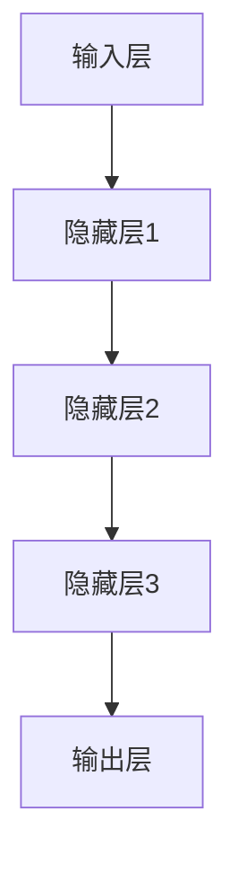
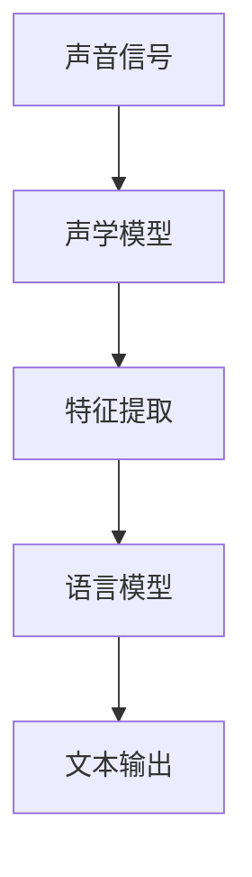
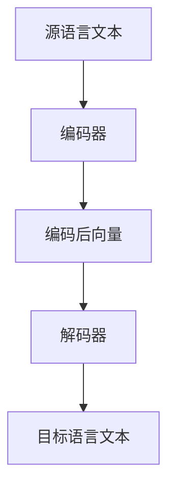
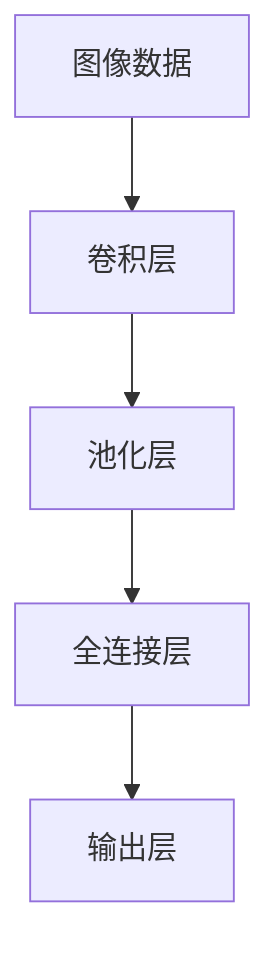

                 

# 文章标题: AI大模型创业：如何实现未来盈利？

> 关键词：AI大模型，创业，盈利模式，技术路线，市场分析，挑战与应对

> 摘要：本文将探讨AI大模型创业的盈利模式，从技术路线、市场分析、创业挑战和未来展望等多个角度，为创业者提供有价值的参考和指导。

## 第1章: AI大模型概述

### 1.1 AI大模型的概念与特点

AI大模型是指使用深度神经网络结构，在庞大的数据集上训练出来的具有强大表征能力的模型。其核心在于大规模数据的输入和训练，从而形成高度复杂的非线性特征表示能力。AI大模型的特点如下：

- **高维度**：AI大模型通常处理高维数据，如图像、文本、音频等，能够捕捉数据中的复杂关系。
- **非线性**：深度神经网络通过多层非线性变换，实现数据的降维和特征提取。
- **强大的表征能力**：AI大模型能够对数据中的复杂特征进行表征，从而实现分类、回归、生成等多种任务。
- **跨领域迁移能力**：AI大模型在训练阶段就已经对数据进行了高层次的表征，因此具有较强的跨领域迁移能力。

### 1.2 AI大模型的架构

AI大模型的架构主要包括输入层、隐藏层和输出层。以下是一个简单的AI大模型架构Mermaid流程图：



### 1.3 AI大模型的发展历程

AI大模型的发展历程可以分为以下几个阶段：

- **早期**：人工神经网络、支持向量机等传统机器学习算法。
- **中期**：深度学习兴起，如卷积神经网络（CNN）、循环神经网络（RNN）等。
- **近期**：大规模预训练模型，如GPT、BERT等。

## 第2章: AI大模型的核心算法

### 2.1 深度学习基础

深度学习的基础是反向传播算法。以下是一个简单的反向传播算法伪代码：

```python
def backpropagation(network, input_data, expected_output):
    # 计算误差
    error = expected_output - output
    # 反向传播计算梯度
    for layer in reversed(network.layers):
        layer.calculate_gradient(error)
    # 更新权重
    for layer in network.layers:
        layer.update_weights()
```

### 2.2 自然语言处理算法

自然语言处理（NLP）中的词嵌入是关键步骤。以下是一个简单的词嵌入伪代码：

```python
def word_embedding(vocab_size, embedding_size):
    embedding_matrix = np.zeros((vocab_size, embedding_size))
    for i, word in enumerate(vocab):
        embedding_vector = calculate_embedding_vector(word)
        embedding_matrix[i] = embedding_vector
    return embedding_matrix
```

### 2.3 预训练与微调

预训练与微调是AI大模型的重要环节。以下是一个简单的预训练和微调伪代码：

```python
def pretrain(model, pretrained_data, num_epochs):
    model.train(pretrained_data, num_epochs=num_epochs)

def fine_tune(model, fine_tune_data, num_epochs):
    model.load_weights(pretrained_weights_path)
    model.train(fine_tune_data, num_epochs=num_epochs)
```

## 第3章: AI大模型应用场景

### 3.1 语音识别

语音识别是AI大模型的重要应用场景之一。其技术原理包括声学模型和语言模型。以下是一个简单的语音识别流程图：



### 3.2 机器翻译

机器翻译是另一个重要的AI大模型应用场景。其技术原理包括编码器和解码器。以下是一个简单的机器翻译流程图：



### 3.3 图像识别

图像识别是AI大模型的经典应用场景。其技术原理主要是卷积神经网络（CNN）。以下是一个简单的图像识别流程图：



## 第4章: AI大模型创业案例分析

### 4.1 案例分析1：创业公司A

创业公司A的业务模式是提供AI大模型服务。其成功因素包括：

- **技术优势**：公司拥有一支技术团队，在AI大模型领域有深厚的积累。
- **市场定位**：公司瞄准了人工智能领域中的特定细分市场，如自然语言处理、图像识别等。
- **团队实力**：公司团队成员具备丰富的行业经验和创新精神，能够快速响应市场需求。

### 4.2 案例分析2：创业公司B

创业公司B的业务模式是利用AI大模型进行产品创新。其成功因素包括：

- **创新思维**：公司注重技术创新，能够不断推出具有市场竞争力的产品。
- **快速迭代**：公司能够快速响应市场需求，进行产品迭代和优化。
- **用户反馈**：公司重视用户反馈，通过用户调研和数据分析，不断改进产品。

## 第5章: AI大模型创业策略

### 5.1 市场分析

创业者在进行AI大模型创业时，需要进行详细的市场分析，包括：

- **目标市场**：明确潜在用户群体和市场规模。
- **竞争对手**：分析现有竞争对手的优势和劣势。
- **市场趋势**：关注行业发展趋势和潜在机会。

### 5.2 技术路线

创业者在选择技术路线时，需要考虑：

- **AI大模型架构**：选择合适的深度学习架构，如CNN、RNN、Transformer等。
- **算法优化**：针对特定应用场景，进行算法优化和调参。
- **数据集选择**：选择高质量的数据集，确保模型训练效果。

### 5.3 营销策略

创业者在制定营销策略时，需要考虑：

- **品牌推广**：通过线上线下活动，提高品牌知名度。
- **渠道拓展**：建立多种销售渠道，如线上平台、线下展会等。
- **客户关系管理**：建立良好的客户关系，提供优质的服务。

## 第6章: AI大模型创业挑战与应对

### 6.1 挑战1：数据隐私与伦理问题

创业者在面对数据隐私和伦理问题时，需要采取以下措施：

- **加密技术**：使用加密技术保护用户数据。
- **隐私保护算法**：采用隐私保护算法，如差分隐私、同态加密等。
- **伦理规范**：建立伦理规范，确保数据使用符合伦理标准。

### 6.2 挑战2：技术更新与人才短缺

创业者在面对技术更新和人才短缺问题时，需要采取以下措施：

- **持续投入研发**：保持对技术的持续投入，跟踪最新技术动态。
- **培养人才**：建立人才培养机制，吸引和培养高水平人才。
- **合作与交流**：与其他企业和研究机构建立合作关系，进行技术交流和合作。

## 第7章: 未来展望

### 7.1 AI大模型的发展趋势

未来AI大模型的发展趋势包括：

- **模型多样化**：AI大模型将更加多样化，适应更多应用场景。
- **与云计算、大数据等技术的深度融合**：AI大模型将更好地与云计算、大数据等技术相结合，提供更强大的计算能力和数据处理能力。

### 7.2 创业机会与风险

创业者在面对AI大模型创业机会时，需要关注：

- **技术创新**：抓住技术发展趋势，不断创新。
- **市场扩张**：抓住市场机遇，积极开拓新市场。

同时，创业者还需要关注风险，如技术竞争、政策监管等。

## 第8章: 总结与展望

本文从多个角度探讨了AI大模型创业的盈利模式，包括技术路线、市场分析、创业挑战和未来展望等。对于创业者来说，AI大模型创业是一个充满机会和挑战的领域。只有深入了解市场和技术，制定合适的创业策略，才能在激烈的市场竞争中脱颖而出。

未来，随着AI大模型技术的不断进步，创业者将有更多的机会和挑战。我们期待看到更多的创业者在这个领域取得成功，为人类社会带来更多的价值。

## 附录

### 附录A: AI大模型开发工具与资源

- **工具1**：TensorFlow
- **工具2**：PyTorch
- **资源1**：AI开源社区
- **资源2**：专业期刊与会议

作者：AI天才研究院/AI Genius Institute & 禅与计算机程序设计艺术 /Zen And The Art of Computer Programming


