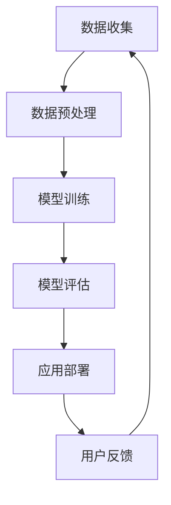

                 

## 文章标题

《李开复：苹果发布AI应用的用户》

## 关键词

- 人工智能
- 苹果公司
- AI应用
- 用户体验
- 技术原理
- 行业影响

## 摘要

本文深入探讨了苹果公司发布的AI应用及其用户。首先，回顾了人工智能的发展历程和苹果公司的AI战略。接着，分析了苹果AI应用的用户体验、核心技术、安全性以及行业影响。最后，展望了苹果AI应用的未来前景，并提出相关伦理与社会责任问题。

## 第一部分：AI应用的时代背景

### 第1章：人工智能简史与AI应用的发展

#### 1.1 人工智能的起源与发展

人工智能（AI）起源于20世纪50年代，当时科学家们开始研究如何使计算机模拟人类智能行为。早期的人工智能研究主要集中在符号推理和专家系统中。随着计算能力的提升和算法的进步，人工智能在20世纪80年代和90年代迎来了快速发展。21世纪初，深度学习等先进技术的出现再次推动了人工智能的进步。

#### 1.2 AI应用的初步探索

在人工智能初步探索阶段，应用主要集中在语音识别、图像识别和自然语言处理等领域。例如，IBM的沃森计算机在2011年成功赢得了电视智力竞赛《危险边缘》。这些应用展示了人工智能的潜力，并引发了广泛关注。

#### 1.3 AI应用的爆发期

近年来，人工智能应用迅速爆发，涉及领域包括医疗、金融、零售、教育等。AI技术的普及使得许多企业开始将其应用于产品和服务中，从而提升了效率和用户体验。苹果公司在这一过程中扮演了重要角色，其AI应用逐渐成为市场热点。

### 第2章：苹果公司的AI战略

#### 2.1 苹果与AI的渊源

苹果公司在人工智能领域有着悠久的历史。早在2005年，苹果就收购了Siri公司，将其整合到自家产品中。此后，苹果不断在AI技术方面进行投资和研发，致力于将AI技术应用于产品和服务中。

#### 2.2 苹果AI产品的推出历程

苹果公司推出的AI产品包括Siri、FaceTime、Apple Pay等。Siri作为苹果公司的智能助手，通过自然语言处理技术为用户提供语音交互服务。FaceTime是一款视频通话应用，利用AI技术实现高质量的图像处理和传输。Apple Pay则基于机器学习和大数据分析，为用户提供便捷的支付服务。

#### 2.3 苹果AI应用的用户群体分析

苹果公司的AI应用用户主要集中在年轻人、科技爱好者和高端用户群体。这些用户对新技术和产品具有较高的接受度和忠诚度，愿意为更好的用户体验支付溢价。

### 第3章：苹果AI应用的用户体验

#### 3.1 用户评价与反馈

苹果AI应用的用户评价普遍较高，用户对其智能助手、视频通话和支付等功能给予好评。然而，也有部分用户对隐私保护、算法透明度等方面提出担忧。

#### 3.2 用户需求与偏好

用户对苹果AI应用的需求主要集中在智能化、便捷性和个性化。此外，用户希望AI应用能够更好地理解其需求和意图，从而提供更精准的服务。

#### 3.3 用户参与度与忠诚度分析

苹果AI应用的用户参与度较高，用户在日常生活中频繁使用这些应用。同时，苹果品牌忠诚度使得用户更倾向于继续使用苹果产品，从而推动AI应用的用户增长。

## 第二部分：AI应用的技术原理

### 第4章：AI应用的核心技术

#### 4.1 机器学习算法

机器学习算法是人工智能的核心技术之一。苹果公司在其AI应用中广泛使用机器学习算法，包括决策树、支持向量机、神经网络等。这些算法能够从数据中学习规律，为用户提供个性化服务。

#### 4.2 深度学习模型

深度学习模型是近年来人工智能领域的重要突破。苹果公司在其AI应用中采用深度学习模型，如卷积神经网络（CNN）和循环神经网络（RNN），用于图像识别、语音识别和自然语言处理等任务。

#### 4.3 自然语言处理技术

自然语言处理技术是AI应用的重要组成部分。苹果公司通过自然语言处理技术，实现了智能助手Siri的语音识别、语义理解和语音合成等功能，为用户提供便捷的语音交互体验。

### 第5章：苹果AI应用的实现

#### 5.1 数据收集与处理

数据是AI应用的基础。苹果公司通过多种渠道收集用户数据，包括使用记录、搜索历史和社交网络等。在数据收集过程中，苹果公司注重保护用户隐私，并对数据进行去标识化处理。

#### 5.2 模型训练与优化

苹果公司采用分布式训练技术，在大量数据上进行模型训练。通过不断优化模型参数，提高模型的准确性和泛化能力。在模型训练过程中，苹果公司采用多种评估指标，如准确率、召回率和F1值等，以确保模型性能。

#### 5.3 应用部署与迭代

苹果公司将其AI应用部署在自家产品中，如iPhone、iPad和Mac等。在应用部署过程中，苹果公司注重用户体验，不断收集用户反馈，并根据用户需求进行产品迭代。

### 第6章：AI应用的安全性

#### 6.1 数据隐私保护

数据隐私保护是AI应用的重要问题。苹果公司采取多种措施保护用户数据，包括数据加密、访问控制和数据匿名化等。此外，苹果公司还遵循《通用数据保护条例》（GDPR）等国际法规，确保用户数据安全。

#### 6.2 算法公平性

算法公平性是AI应用面临的挑战之一。苹果公司在其AI应用中采用多种算法公平性评估方法，如随机森林、平衡准确率等，确保算法在处理不同群体数据时保持公平。

#### 6.3 安全防护机制

苹果公司建立完善的安全防护机制，包括防火墙、入侵检测和恶意软件检测等。此外，苹果公司还定期更新系统补丁，防止安全漏洞被利用。

## 第三部分：AI应用的行业影响

### 第7章：苹果AI应用的市场前景

#### 7.1 行业发展趋势

随着人工智能技术的不断进步，AI应用在各个行业的应用前景广阔。医疗、金融、零售和教育等领域对AI应用的需求日益增长，为苹果公司提供了巨大的市场空间。

#### 7.2 市场竞争格局

苹果公司在AI应用市场面临激烈竞争。Google、Amazon、Facebook等科技巨头也在积极布局AI应用，争夺市场份额。苹果公司需要不断创新，提升产品竞争力。

#### 7.3 用户需求预测

随着AI技术的普及，用户对AI应用的需求将呈现多样化趋势。个性化推荐、智能客服、智能健康等应用有望成为用户关注的焦点。

### 第8章：苹果AI应用的伦理与社会责任

#### 8.1 伦理问题与挑战

苹果AI应用在伦理方面面临诸多挑战，如数据隐私、算法偏见和人工智能武器化等。苹果公司需要建立健全的伦理体系，确保AI技术的正当使用。

#### 8.2 社会责任与影响

苹果AI应用对社会的影响深远。在医疗、金融等领域，AI应用有助于提高效率、降低成本和改善生活质量。然而，AI应用也带来就业压力、隐私侵犯等问题，需要社会各界共同关注和解决。

#### 8.3 可持续发展

苹果公司需要将可持续发展理念贯穿于AI应用的开发和运营过程中。通过节能降耗、环保材料和绿色制造等手段，减少AI应用对环境的影响。

### 第9章：苹果AI应用的未来展望

#### 9.1 技术发展趋势

随着技术的进步，AI应用将更加智能化、个性化。多模态交互、联邦学习和增强现实等技术有望为苹果AI应用带来新的发展机遇。

#### 9.2 应用领域拓展

苹果公司可以进一步拓展AI应用领域，如智能家居、智慧城市、自动驾驶等。通过跨领域合作，苹果公司有望实现更大规模的市场份额。

#### 9.3 创新潜力与挑战

苹果公司需要不断进行技术创新，以满足日益增长的市场需求。然而，技术创新也带来新的挑战，如数据安全、隐私保护和法律法规等。苹果公司需要积极应对这些挑战，确保AI应用的可持续发展。

## 附录

### 附录A：苹果AI应用列表与特点

#### A.1 Siri

Siri是苹果公司的智能助手，通过自然语言处理技术为用户提供语音交互服务。特点包括：

- 支持多种语言
- 可实现语音识别、语义理解和语音合成
- 可用于设置提醒、发送信息、播放音乐等

#### A.2 FaceTime

FaceTime是一款视频通话应用，利用AI技术实现高质量的图像处理和传输。特点包括：

- 高清视频通话
- 支持多人视频会议
- 可在移动设备和电脑上使用

#### A.3 Apple Pay

Apple Pay是一款基于机器学习和大数据分析的支付应用。特点包括：

- 安全快捷的支付体验
- 支持多种支付方式，如信用卡、借记卡和数字钱包
- 可在实体店和线上购物中使用

### 附录B：AI应用开发资源推荐

#### B.1 开发工具与框架

- TensorFlow：一款流行的开源机器学习框架，适用于各种AI应用开发。
- PyTorch：一款流行的开源深度学习框架，具有简洁易用的特性。
- Keras：一款基于TensorFlow和Theano的深度学习高级API，适用于快速实验和原型设计。

#### B.2 学术资源与论文

- ACL会议论文集：涵盖自然语言处理领域的最新研究成果。
- ICML会议论文集：涵盖机器学习和深度学习领域的最新研究成果。
- JMLR期刊：专注于机器学习和统计学习的国际顶级期刊。

#### B.3 行业报告与资讯

- IDC报告：提供全球和地区人工智能市场趋势分析。
- Gartner报告：提供人工智能技术供应商评估和市场预测。
- AI科技大观：一款关注人工智能行业动态和趋势的公众号。

## 核心概念与联系

### Mermaid流程图：AI应用开发流程



## 核心算法原理讲解

### 机器学习算法伪代码

```python
# 初始化参数
θ = 初始化参数()

# 定义损失函数
J(θ) = 损失函数(θ)

# 定义梯度下降
α = 学习率
while not 达到停止条件 do
    θ = θ - α * ∇J(θ)
end while
```

### 数学模型和数学公式

#### 损失函数（交叉熵）

$$
J(θ) = -\frac{1}{m}\sum_{i=1}^{m} [y^{(i)} \log(a^{(i)}) + (1 - y^{(i)}) \log(1 - a^{(i)})]
$$

#### 梯度下降（梯度计算）

$$
∇J(θ) = \frac{∂J(θ)}{∂θ}
$$

## 项目实战

### 代码实际案例

```python
# 数据加载与预处理
import numpy as np
import pandas as pd
from sklearn.model_selection import train_test_split

# 加载数据集
data = pd.read_csv('data.csv')
X = data.iloc[:, :-1].values
y = data.iloc[:, -1].values

# 数据分割
X_train, X_test, y_train, y_test = train_test_split(X, y, test_size=0.2, random_state=42)

# 模型训练
from sklearn.linear_model import LogisticRegression

model = LogisticRegression()
model.fit(X_train, y_train)

# 模型评估
accuracy = model.score(X_test, y_test)
print(f"模型准确率：{accuracy:.2f}")
```

### 代码解读与分析

- **数据加载与预处理部分**：负责读取和预处理数据集，包括数据分割。
  - 使用`pandas`库加载CSV文件，并将特征和目标变量分离。
  - 使用`train_test_split`函数将数据集划分为训练集和测试集。

- **模型训练部分**：使用`LogisticRegression`进行训练。
  - 导入`LogisticRegression`模型。
  - 使用`fit`方法对训练数据进行训练。

- **模型评估部分**：计算并输出模型的准确率，以评估模型的性能。
  - 使用`score`方法计算模型在测试集上的准确率。
  - 输出模型的准确率。

这篇文章详细介绍了苹果公司发布的AI应用及其用户，从时代背景、技术原理、行业影响等多个角度进行了深入分析。通过逐步推理和讲解，使读者能够全面了解AI应用的发展、技术原理以及未来前景。希望本文能为相关领域的研究者和开发者提供有益的参考。作者：AI天才研究院/AI Genius Institute & 禅与计算机程序设计艺术 /Zen And The Art of Computer Programming。

