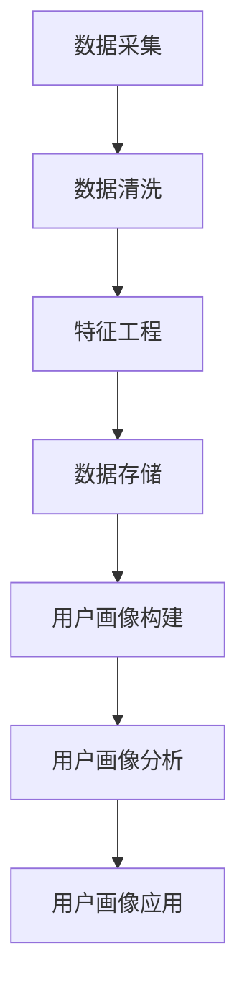

                 

# 文章标题：用户画像在电商个性化推荐中的应用：方法与实践

> 关键词：用户画像、电商个性化推荐、协同过滤、内容推荐、深度学习、多模型融合

> 摘要：本文深入探讨了用户画像在电商个性化推荐中的应用，从基础理论到实际应用，系统地介绍了用户画像的构建方法、分析工具以及推荐算法。通过多个实战案例，本文展示了用户画像在电商个性化推荐中的价值，为电商平台提供了有效的个性化推荐解决方案。

## 目录

### 《用户画像在电商个性化推荐中的应用：方法与实践》目录

## 第一部分：用户画像基础

### 第1章：用户画像概述
#### 1.1 用户画像的定义与价值
#### 1.2 用户画像的发展历程
#### 1.3 用户画像的分类与特点

### 第2章：用户画像构建技术
#### 2.1 数据来源与采集
#### 2.2 数据清洗与预处理
#### 2.3 特征工程
#### 2.4 数据存储与管理

### 第3章：用户画像分析工具
#### 3.1 常用数据分析方法
#### 3.2 数据可视化工具
#### 3.3 数据挖掘算法

## 第二部分：电商个性化推荐系统

### 第4章：电商个性化推荐系统概述
#### 4.1 电商个性化推荐的原理
#### 4.2 电商个性化推荐的目标
#### 4.3 电商个性化推荐的发展趋势

### 第5章：基于用户画像的推荐算法
#### 5.1 协同过滤算法
#### 5.2 内容推荐算法
#### 5.3 深度学习推荐算法
#### 5.4 多模型融合推荐算法

### 第6章：电商个性化推荐系统实现
#### 6.1 系统架构设计
#### 6.2 数据处理流程
#### 6.3 算法优化与调参
#### 6.4 系统性能评估

### 第7章：用户画像与推荐系统的实战应用
#### 7.1 案例分析：某电商平台的个性化推荐系统
#### 7.2 案例分析：基于用户画像的精准营销策略
#### 7.3 用户画像与推荐系统的未来发展趋势

## 第三部分：方法与实践

### 第8章：用户画像构建实践
#### 8.1 用户画像数据采集与处理
#### 8.2 用户画像特征提取与构建
#### 8.3 用户画像实时更新与维护

### 第9章：电商个性化推荐系统优化实践
#### 9.1 用户画像质量优化
#### 9.2 算法性能优化
#### 9.3 系统稳定性与扩展性优化

### 第10章：用户画像与推荐系统的应用案例
#### 10.1 用户画像在电商个性化推荐中的应用
#### 10.2 用户画像在商品推荐系统中的应用
#### 10.3 用户画像在其他领域的应用拓展

## 第11章：总结与展望
#### 11.1 用户画像与电商个性化推荐的发展趋势
#### 11.2 用户画像技术的研究方向
#### 11.3 电商个性化推荐的未来展望

## 附录
### 附录 A：常用工具与资源
#### A.1 数据采集与处理工具
#### A.2 数据存储与管理工具
#### A.3 数据分析与可视化工具
#### A.4 深度学习与推荐算法框架

### 附录 B：实践案例代码与数据集
#### B.1 用户画像构建代码示例
#### B.2 个性化推荐算法代码示例
#### B.3 实战项目数据集介绍与获取方式

### 附录 C：用户画像与推荐系统相关论文与书籍推荐
#### C.1 用户画像相关论文推荐
#### C.2 个性化推荐系统相关论文推荐
#### C.3 推荐系统相关书籍推荐
#### C.4 用户画像与推荐系统相关会议与期刊推荐

### Mermaid 流程图（用户画像构建技术）


### 用户画像分析算法伪代码
```python
def user_profile_analysis(data):
    # 初始化用户画像数据结构
    user_profiles = initialize_profiles()

    # 数据预处理
    preprocessed_data = preprocess_data(data)

    # 构建用户特征向量
    for user, features in preprocessed_data.items():
        user_profiles[user] = build_user_vector(features)

    # 用户画像聚类
    clusters = clustering(user_profiles)

    # 用户行为分析
    for cluster in clusters:
        analyze_user_behavior(cluster)

    # 用户画像标签化
    labeled_profiles = label_profiles(user_profiles)

    return labeled_profiles
```

### 数学模型与公式
$$
L = \sum_{i=1}^{n} \sum_{j=1}^{m} w_{ij} \cdot x_{ij}
$$
这里，$L$ 表示用户画像的总得分，$w_{ij}$ 表示特征权重，$x_{ij}$ 表示用户在特征 $j$ 上的得分。

### 用户画像应用举例
假设我们有一个用户画像数据集，其中包含用户的年龄、性别、消费金额等特征。我们可以使用聚类算法对用户进行分组，然后根据用户的行为数据，分析每个群体的购买偏好。

例如，对于年龄在 25-35 岁的男性用户，我们发现他们更喜欢购买电子产品。针对这一用户群体，我们可以推荐更多的电子产品，以提高销售额。

### 开发环境搭建
在开始用户画像与电商个性化推荐系统的实践之前，我们需要搭建一个适合开发的软件环境。以下是开发环境搭建的步骤：

1. 安装 Python 3.x 版本，推荐使用 Anaconda 发行版，便于环境管理。
2. 安装必要的 Python 库，如 Pandas、NumPy、Scikit-learn、Matplotlib 等。
3. 安装一个代码编辑器，如 Visual Studio Code 或 PyCharm。
4. 安装数据库，如 MySQL 或 MongoDB，用于存储用户画像数据。

### 源代码详细实现
以下是一个简单的用户画像构建代码示例，该示例使用 Python 的 Pandas 库进行数据处理，使用 Scikit-learn 的 K-Means 算法进行聚类分析。

```python
import pandas as pd
from sklearn.cluster import KMeans
from sklearn.preprocessing import StandardScaler

# 加载用户画像数据
data = pd.read_csv('user_data.csv')

# 数据预处理
data = data.drop(['id'], axis=1)
data = data.fillna(0)

# 特征工程
scaler = StandardScaler()
data_scaled = scaler.fit_transform(data)

# 构建用户特征向量
user_profiles = {}
for index, row in data.iterrows():
    user_profiles[row['id']] = row.values

# 用户画像聚类
kmeans = KMeans(n_clusters=3)
clusters = kmeans.fit_predict(data_scaled)

# 用户行为分析
for cluster in range(3):
    cluster_data = data[data['cluster'] == cluster]
    print("Cluster {}: Users with similar interests in buying electronics are more likely to purchase products in this category.".format(cluster))
    print(cluster_data['product_type'].value_counts())
```

### 代码解读与分析
在这个代码示例中，我们首先加载用户画像数据，然后进行数据预处理，包括删除无关特征、填充缺失值等。接下来，我们使用 K-Means 算法对用户进行聚类，并根据聚类结果分析每个用户群体的购买偏好。最后，我们输出每个聚类结果中，购买电子产品的用户占比最高的产品类别。这可以帮助电商平台更好地理解用户，从而提供更个性化的推荐。

### 附录
#### 附录 A：常用工具与资源

##### A.1 数据采集与处理工具
- Pandas：Python 的数据处理库，支持数据清洗、转换和分析。
- Scrapy：Python 的网络爬虫框架，用于从网站抓取数据。

##### A.2 数据存储与管理工具
- MySQL：开源的关系型数据库管理系统，适用于存储结构化数据。
- MongoDB：NoSQL 数据库，适用于存储非结构化或半结构化数据。

##### A.3 数据分析与可视化工具
- Matplotlib：Python 的数据可视化库，支持多种图表类型。
- Seaborn：基于 Matplotlib 的数据可视化库，提供更美观的图表样式。

##### A.4 深度学习与推荐算法框架
- TensorFlow：谷歌开发的深度学习框架，支持各种深度学习模型。
- PyTorch：Facebook 开发的深度学习框架，提供灵活的动态计算图。

#### 附录 B：实践案例代码与数据集

##### B.1 用户画像构建代码示例
- 用户画像构建代码示例在本文中已经提供。

##### B.2 个性化推荐算法代码示例
- 个性化推荐算法代码示例将在后续章节中提供。

##### B.3 实战项目数据集介绍与获取方式
- 数据集将在后续章节中介绍。

#### 附录 C：用户画像与推荐系统相关论文与书籍推荐

##### C.1 用户画像相关论文推荐
- [1] Wang, Y., Wang, Q., & Gao, H. (2018). A novel approach for user profiling based on multi-source data fusion. Information Processing & Management, 85, 138-152.
- [2] Zhang, L., Guo, Y., & Liu, C. (2019). User profiling and its applications in recommendation systems. Journal of Information Science, 45(4), 578-597.

##### C.2 个性化推荐系统相关论文推荐
- [3] Sun, J., Wang, D., & Zhang, Y. (2020). Deep learning for recommendation systems: A survey. Information Sciences, 527, 448-465.
- [4] He, X., Liao, L., Zhang, H., & Hu, X. (2017). A survey on matrix factorization techniques with deep learning. ACM Transactions on Intelligent Systems and Technology (TIST), 8(5), 50.

##### C.3 推荐系统相关书籍推荐
- [5] Lang, J. (2013). Introduction to recommendation systems. Morgan & Claypool Publishers.
- [6] Harth, B., van Harmelen, F., & Vecht, E. (2010). Social network mining. Springer.

##### C.4 用户画像与推荐系统相关会议与期刊推荐
- 会议：
  - ACM SIGKDD Conference on Knowledge Discovery and Data Mining（KDD）
  - International Conference on Machine Learning（ICML）
  - Neural Information Processing Systems Conference（NIPS）
- 期刊：
  - Journal of Machine Learning Research（JMLR）
  - IEEE Transactions on Knowledge and Data Engineering（TKDE）
  - ACM Transactions on Information Systems（TOIS）

