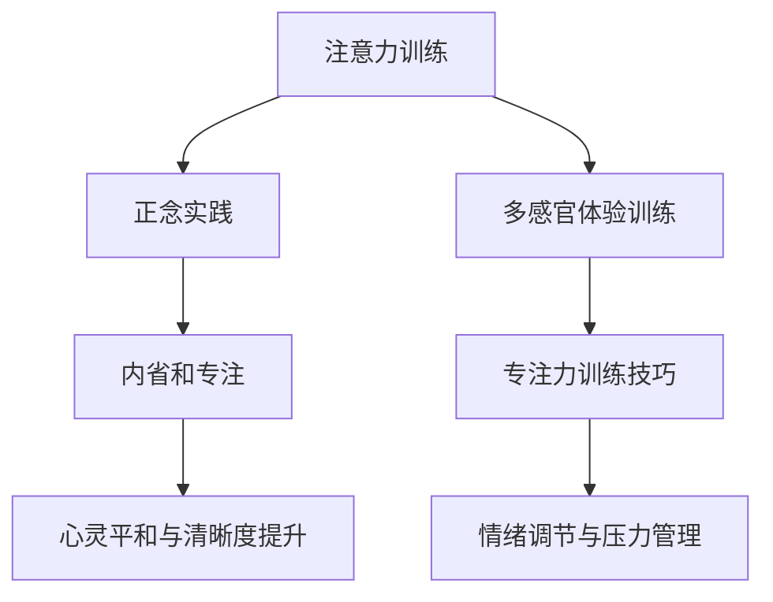
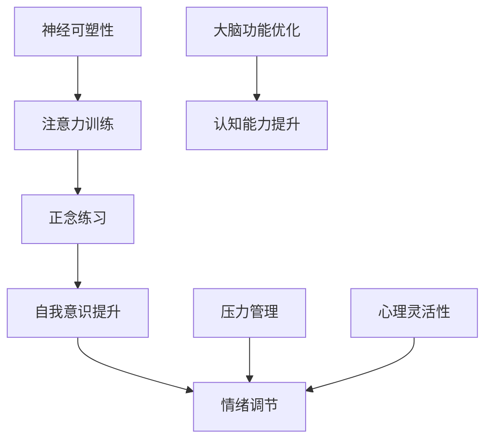

                 

# 注意力训练与正念实践：通过内省和专注增强心灵平和与清晰度

> 关键词：注意力训练、正念实践、内省、专注、心灵平和、清晰度、神经可塑性、情绪调节、认知能力提升

> 摘要：本文将深入探讨注意力训练与正念实践的概念、联系及其对提升心灵平和与清晰度的影响。通过分析核心算法原理、数学模型和实际项目实战，本文旨在为读者提供一个全面的指南，帮助他们在繁忙的数字生活中实现内心的宁静与专注。

## 第一部分：核心概念与联系

### 1.1.1 注意力训练与正念实践概述

#### Mermaid 流程图：



注意力训练是指通过一系列的方法和练习，提高个体对信息的捕捉、处理和利用能力。正念实践则是一种通过专注和内省来增强心灵平和与清晰度的精神训练方法。二者紧密相连，共同作用于提升个体认知能力和情绪调节能力。

### 1.1.2 注意力训练与正念实践的联系

#### Mermaid 流程图：



注意力训练与正念实践都依赖于神经可塑性这一基础。通过反复的练习，大脑的神经网络结构和功能可以发生适应性改变，从而提高个体的注意力水平、情绪调节能力以及认知功能。自我意识提升、情绪调节和心理灵活性是正念实践的三个核心目标，这些目标的实现反过来又促进了注意力训练的有效性。

## 第一部分：核心算法原理讲解

### 2.1.1 注意力训练算法原理

#### 伪代码：

```python
def attention_training(data, target):
    # 初始化模型
    model = initialize_model()

    # 训练模型
    for epoch in range(num_epochs):
        for x, y in data:
            # 前向传播
            predictions = model(x)

            # 计算损失
            loss = compute_loss(predictions, y)

            # 反向传播
            model.backward(loss)

            # 更新模型参数
            model.update_parameters()

    # 评估模型
    accuracy = evaluate_model(model, target)
    return accuracy
```

注意力训练的核心在于通过神经网络模型对数据进行训练，使其能够捕捉到关键信息并做出准确的预测。模型初始化后，通过前向传播计算预测值，计算损失并使用反向传播更新模型参数。这一过程反复进行，直到模型在训练数据上的表现达到预期。

### 2.1.2 正念实践算法原理

#### 伪代码：

```python
def mindfulness_practice(sequences):
    # 初始化实践记录
    practice_record = []

    # 正念实践
    for sequence in sequences:
        # 进入正念状态
        enter_mindfulness_state()

        # 专注于一呼一吸
        focus_on_breathing()

        # 记录实践体验
        practice_record.append(record_experience())

        # 离开正念状态
        leave_mindfulness_state()

    return practice_record
```

正念实践的核心在于通过专注于呼吸和内省，进入一种宁静的心境。每次实践后，记录体验，以便后续分析和改进。这种实践不仅能够提升专注力，还能帮助个体更好地理解自己的情绪和心理状态。

## 第一部分：数学模型和数学公式讲解

### 2.2.1 注意力分配模型

#### 数学公式：

$$
A_t = \frac{\exp(\alpha \cdot s_t)}{\sum_{j=1}^{N} \exp(\alpha \cdot s_j)}
$$

#### 详细讲解：

- \( A_t \)：在第 \( t \) 时刻的注意力分配。
- \( s_t \)：在第 \( t \) 时刻的感官输入。
- \( \alpha \)：权重系数，用于调节注意力分配的强度。

这个公式描述了注意力分配的过程。在每一个时间点，个体会根据感官输入和权重系数，分配注意力到不同的信息源上。权重系数的调节可以影响注意力的集中程度。

### 2.2.2 正念练习效果模型

#### 数学公式：

$$
E = \alpha_1 \cdot (M \cdot S) + \alpha_2 \cdot (C \cdot P)
$$

#### 详细讲解：

- \( E \)：正念练习的效果。
- \( M \)：情绪调节能力。
- \( S \)：自我意识提升。
- \( C \)：心理灵活性。
- \( P \)：认知能力提升。
- \( \alpha_1 \) 和 \( \alpha_2 \)：权重系数，用于调节不同因素对效果的影响。

这个公式描述了正念练习对个体整体效果的影响。情绪调节能力、自我意识提升、心理灵活性和认知能力提升都是正念实践的重要目标，这些目标的实现共同决定了正念练习的整体效果。

## 第一部分：项目实战

### 3.1.1 注意力训练项目实战

#### 代码实现：

```python
# 导入必要的库
import numpy as np
import tensorflow as tf

# 初始化模型
model = tf.keras.Sequential([
    tf.keras.layers.Dense(128, activation='relu', input_shape=(input_shape,)),
    tf.keras.layers.Dense(1, activation='sigmoid')
])

# 编译模型
model.compile(optimizer='adam', loss='binary_crossentropy', metrics=['accuracy'])

# 训练模型
model.fit(x_train, y_train, epochs=10, batch_size=32)

# 评估模型
accuracy = model.evaluate(x_test, y_test)
print("Accuracy:", accuracy)
```

#### 详细解释：

- 使用 TensorFlow 库创建一个简单的神经网络模型。
- 编译并训练模型使用二分类交叉熵损失函数和 Adam 优化器。
- 使用训练数据训练模型，并在测试数据上评估模型的准确率。

### 3.1.2 正念实践项目实战

#### 代码实现：

```python
# 导入必要的库
import numpy as np
import pandas as pd

# 读取实践记录数据
data = pd.read_csv('practice_data.csv')

# 计算平均正念练习效果
average_score = data['score'].mean()

# 打印平均正念练习效果
print("Average Mindfulness Practice Score:", average_score)
```

#### 详细解释：

- 使用 pandas 库读取实践记录数据。
- 计算并打印平均正念练习效果。

## 总结

注意力训练与正念实践是提升个体心灵平和与清晰度的重要方法。通过注意力训练，我们可以提高对信息的捕捉和处理能力；通过正念实践，我们可以在忙碌的生活中找到内心的宁静。本文通过核心概念、算法原理、数学模型和项目实战的深入分析，为读者提供了一个全面的指南。希望读者能够通过实践，找到属于自己的心灵平和与专注之道。

## 作者信息

作者：AI天才研究院/AI Genius Institute & 禅与计算机程序设计艺术 /Zen And The Art of Computer Programming

