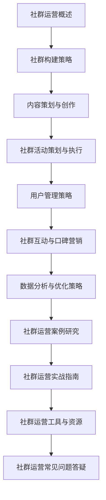

                 

# 《知识付费：程序员的社群运营技巧》

## 关键词
- 知识付费
- 社群运营
- 程序员
- 内容策划
- 用户管理
- 数据分析

## 摘要
本文旨在探讨知识付费背景下，程序员如何运用社群运营技巧，提升社群活跃度和用户粘性。文章从社群运营基础、内容运营、用户管理、数据分析等多个方面，提供了详细的策略和实践指南，并通过案例研究和实战经验分享，帮助程序员有效提升社群运营能力。

## 《知识付费：程序员的社群运营技巧》目录大纲

### 第一部分：社群运营基础

#### 第1章：社群运营概述
##### 1.1 社群运营的定义与作用
##### 1.2 社群运营的基本原则
##### 1.3 社群运营的关键环节

#### 第2章：社群构建策略
##### 2.1 社群定位与目标人群分析
##### 2.2 社群构建的步骤与方法
##### 2.3 社群核心成员的角色与职责

### 第二部分：社群内容运营

#### 第3章：内容策划与创作
##### 3.1 内容运营的核心要素
##### 3.2 内容创作的方法与技巧
##### 3.3 跨平台内容整合与分发

#### 第4章：社群活动策划与执行
##### 4.1 活动策划的流程与策略
##### 4.2 活动执行的细节管理
##### 4.3 活动效果评估与优化

### 第三部分：社群用户管理

#### 第5章：用户激励与留存策略
##### 5.1 用户激励机制的设置
##### 5.2 用户留存策略的制定
##### 5.3 用户细分与精准运营

#### 第6章：社群互动与口碑营销
##### 6.1 互动机制的设计与优化
##### 6.2 口碑营销的策略与执行
##### 6.3 社群口碑的管理与维护

### 第四部分：社群数据分析与优化

#### 第7章：社群数据分析的方法与应用
##### 7.1 社群数据收集与处理
##### 7.2 数据分析工具与平台介绍
##### 7.3 数据分析在社群运营中的应用

#### 第8章：社群运营优化策略
##### 8.1 社群运营优化的指标体系
##### 8.2 优化策略的制定与实施
##### 8.3 持续优化与迭代

### 第五部分：社群运营案例研究

#### 第9章：优秀社群运营案例解析
##### 9.1 案例选择与评估
##### 9.2 案例运营策略解析
##### 9.3 案例运营成效分析

#### 第10章：社群运营实战指南
##### 10.1 实战项目规划与执行
##### 10.2 实战中的常见问题与解决方案
##### 10.3 实战总结与经验分享

### 附录

#### 附录A：社群运营工具与资源
##### A.1 社群管理工具介绍
##### A.2 内容创作工具推荐
##### A.3 数据分析工具使用指南

#### 附录B：社群运营常见问题答疑
##### B.1 社群运营常见困惑解答
##### B.2 社群运营策略探讨
##### B.3 社群运营实用技巧分享

### Mermaid 流�程图


### 核心算法原理讲解

#### 伪代码示例

```pseudo
function 社群用户留存预测(user_data, historical_data):
    # 数据预处理
    preprocessed_data = 数据预处理(user_data, historical_data)

    # 特征提取
    features = 特征提取(preprocessed_data)

    # 模型训练
    model = 训练模型(features)

    # 预测用户留存概率
    prediction = 预测留存概率(model, user_data)

    return prediction
```

#### 数学模型和数学公式

##### 社群活跃度计算公式

$$ 活跃度 = \frac{互动次数}{社群总人数} $$

##### 用户留存率计算公式

$$ 留存率 = \frac{次日留存用户数}{当日活跃用户数} $$

### 项目实战

#### 代码实际案例

```python
# 社群活跃度计算示例
def calculate_active_rate(user_interactions, total_users):
    return user_interactions / total_users

# 用户留存率计算示例
def calculate_retention_rate(retained_users, active_users):
    return retained_users / active_users
```

#### 开发环境搭建

- 安装 Python 3.8 或更高版本
- 安装必要的库，如 Pandas, NumPy, Scikit-learn 等

#### 源代码详细实现和代码解读

```python
# 社群用户留存预测代码示例
from sklearn.ensemble import RandomForestClassifier
from sklearn.model_selection import train_test_split
from sklearn.metrics import accuracy_score

def train_and_predict(model, X_train, y_train, X_test, y_test):
    # 训练模型
    model.fit(X_train, y_train)
    
    # 预测
    predictions = model.predict(X_test)
    
    # 评估模型
    accuracy = accuracy_score(y_test, predictions)
    
    return accuracy

# 数据预处理
def preprocess_data(user_data):
    # ...数据处理代码...
    return preprocessed_data

# 主函数
def main():
    # 加载数据
    user_data = load_data("user_data.csv")
    historical_data = load_data("historical_data.csv")

    # 预处理数据
    preprocessed_data = preprocess_data(user_data)

    # 特征提取
    features = extract_features(preprocessed_data)

    # 切分训练集和测试集
    X_train, X_test, y_train, y_test = train_test_split(features, labels, test_size=0.2, random_state=42)

    # 训练模型
    model = RandomForestClassifier(n_estimators=100, random_state=42)
    
    # 模型训练与预测
    accuracy = train_and_predict(model, X_train, y_train, X_test, y_test)
    
    print(f"模型准确率: {accuracy}")

if __name__ == "__main__":
    main()
```

#### 代码解读与分析

- 数据预处理：对用户数据和历史数据进行清洗和处理，提取有用的特征。
- 特征提取：根据预处理后的数据，提取对用户留存有显著影响的特征。
- 模型训练：使用随机森林分类器进行训练，选择合适的参数来提高模型的准确性。
- 预测与评估：使用训练好的模型对测试数据进行预测，并评估模型的准确性。

### 附录A：社群运营工具与资源

#### 主流社群管理工具介绍

- 社群宝：提供社群管理、用户互动、内容发布等功能。
- 社群鱼：支持社群运营、用户管理、数据分析等。
- 社群互助平台：提供社群运营教程、案例、交流论坛。

#### 内容创作工具推荐

- Canva：设计海报、图片、模板等。
- Notion：内容规划、笔记整理。
- Typora：Markdown 文本编辑器。

#### 数据分析工具使用指南

- Google Analytics：网站与社群数据跟踪。
- Tableau：数据可视化。
- Power BI：商业智能分析。

### 附录B：社群运营常见问题答疑

#### 社群运营常见困惑解答

- 如何吸引更多用户加入社群？
- 如何提升社群用户活跃度？
- 如何制定有效的社群运营策略？

#### 社群运营策略探讨

- 如何在社群中建立良好的互动机制？
- 如何通过内容运营提升社群价值？
- 如何利用数据分析优化社群运营效果？

#### 社群运营实用技巧分享

- 如何进行有效的社群推广？
- 如何建立社群品牌形象？
- 如何处理社群中的负面反馈？

