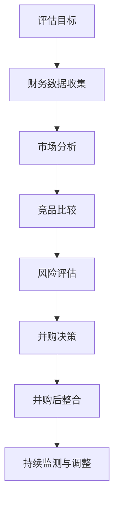

                 

# 《程序员如何评估并购offer》

> 关键词：程序员，并购评估，投资回报率，净现值，数学模型，项目实战

> 摘要：本文旨在为程序员提供一套系统的并购评估方法，帮助其在面对并购offer时做出明智的决策。通过分析核心概念、核心算法原理、数学模型和实际项目实战，本文将一步步引导程序员如何进行科学的并购评估。

## 第一部分：核心概念与联系

在程序员的世界里，面对并购offer并非易事。评估一个并购offer需要多方面的考量，包括财务、市场、竞争、风险等。为了更好地理解并购评估的全过程，我们可以通过一个Mermaid流程图来阐述其核心概念和流程。

以下是一个简化的Mermaid流程图示例，用于描述并购评估的步骤和关键环节。



这个流程图清晰地展示了从评估目标开始，到市场分析、竞品比较、风险评估，最终到并购决策和后续整合的完整流程。每一步都是评估并购offer的重要环节。

### 1.1 评估目标

评估目标是指明确并购的目的和期望。作为程序员，你可能关注的是技术整合、市场份额扩大、团队成长等。明确评估目标有助于在整个评估过程中保持聚焦。

### 1.2 财务数据收集

财务数据是并购评估的核心。这包括目标公司的财务报表、现金流量表、利润表等。通过这些数据，我们可以了解目标公司的财务状况，预测其未来的盈利能力。

### 1.3 市场分析

市场分析旨在了解目标公司所在的市场状况，包括市场规模、增长趋势、竞争对手等。通过市场分析，我们可以判断目标公司的市场地位和发展潜力。

### 1.4 竞品比较

竞品比较是评估目标公司竞争力的重要步骤。我们需要分析目标公司的产品、技术、市场份额与主要竞争对手的对比，以评估其在市场上的竞争优势。

### 1.5 风险评估

风险评估是并购评估中不可或缺的一环。我们需要识别并评估并购过程中可能面临的各种风险，如市场风险、财务风险、法律风险等，以便在决策时有所准备。

### 1.6 并购决策

在完成上述步骤后，我们可以基于评估结果做出并购决策。这包括是否进行并购、何时并购、如何并购等。

### 1.7 并购后整合

并购后整合是确保并购成功的关键。这包括人员整合、技术整合、业务整合等。成功的并购后整合有助于实现并购的预期目标。

### 1.8 持续监测与调整

并购并非一劳永逸，我们需要持续监测并购的进展情况，并根据实际情况进行适时调整，以确保并购目标的实现。

## 第二部分：核心算法原理讲解

在并购评估中，我们通常使用一些核心算法来帮助计算和评估潜在的投资回报率（ROI）和净现值（NPV）。以下是关于财务预测和并购估值的核心算法原理讲解，包括伪代码示例。

### 2.1 投资回报率（ROI）计算

投资回报率（ROI）是衡量投资盈利能力的重要指标。其计算公式为：

$$
ROI = \frac{\text{投资收益}}{\text{投资成本}} \times 100\%
$$

伪代码示例：

```python
def calculate_roi(investment_cost, investment_return):
    roi = (investment_return / investment_cost) * 100
    return roi
```

### 2.2 净现值（NPV）计算

净现值（NPV）是评估未来现金流的现值与初始投资成本之间的差额。其计算公式为：

$$
\text{NPV} = \sum_{t=0}^{n} \frac{\text{CF}_t}{(1 + r)^t} - \text{C}_0
$$

其中，CF\_t 表示第 t 年的现金流，r 表示折现率，C\_0 表示初始投资成本。

伪代码示例：

```python
def calculate_npv(cash_flows, discount_rate, initial_investment):
    npv = 0
    for t, cf in enumerate(cash_flows):
        npv += cf / ((1 + discount_rate) ** t)
    npv -= initial_investment
    return npv
```

### 2.3 财务预测

财务预测是并购评估的重要环节，它涉及到对未来现金流、收入、成本等的预测。常用的方法包括回归分析、时间序列分析和蒙特卡洛模拟等。

- **回归分析**：通过历史数据建立线性回归模型，预测未来财务指标。

- **时间序列分析**：基于时间序列数据，使用统计方法如移动平均、指数平滑等，预测未来财务指标。

- **蒙特卡洛模拟**：通过模拟大量随机样本，预测未来财务指标的概率分布。

## 第三部分：数学模型和数学公式详解

在并购评估中，我们常常需要使用数学模型来分析和预测财务数据。以下是一些关键的数学模型和公式，包括详细讲解和举例说明。

### 3.1 折现现金流模型（DCF）

折现现金流模型（DCF）是评估公司价值的重要方法。其核心公式为：

$$
\text{公司价值} = \sum_{t=1}^{n} \frac{\text{CF}_t}{(1 + r)^t} + \frac{\text{终值}}{(1 + r)^n}
$$

其中，CF\_t 表示第 t 年的现金流，r 表示折现率，终值通常假设在第 n 年为固定值。

**举例说明**：

假设一个公司在未来的5年内每年有100万元的自由现金流，第5年的自由现金流为200万元，折现率为10%。使用DCF模型计算公司的现值。

```latex
\text{公司价值} = \frac{100}{(1+0.1)^1} + \frac{100}{(1+0.1)^2} + \frac{100}{(1+0.1)^3} + \frac{100}{(1+0.1)^4} + \frac{200}{(1+0.1)^5}
```

计算结果为：

```latex
\text{公司价值} \approx 379.11 \text{万元}
```

### 3.2 成本效益分析（CBA）

成本效益分析（CBA）是评估并购项目经济效益的重要方法。其核心公式为：

$$
\text{CBA} = \frac{\text{效益}}{\text{成本}}
$$

其中，效益包括并购后带来的收入增长、成本节约等，成本包括并购成本、运营成本等。

**举例说明**：

假设一个并购项目的预计收益为500万元，并购成本和运营成本分别为300万元和200万元。使用CBA模型评估该项目的经济效益。

```latex
\text{CBA} = \frac{500}{300 + 200} = \frac{500}{500} = 1
```

结果表明，该项目的经济效益为1，即成本等于效益，这是一个值得考虑的并购项目。

### 3.3 风险调整贴现率（RADR）

风险调整贴现率（RADR）是考虑风险因素的贴现率。其计算公式为：

$$
RADR = r + \alpha \times \text{风险系数}
$$

其中，r 为无风险利率，α 为风险系数，风险系数反映了项目面临的风险程度。

**举例说明**：

假设无风险利率为5%，风险系数为1.2。计算该项目的RADR。

```latex
RADR = 5\% + 1.2 \times \text{风险系数} = 5\% + 1.2 \times 0.1 = 6.2\%
```

结果表明，该项目的RADR为6.2%，比无风险利率高，表明该项目面临一定的风险。

### 3.4 蒙特卡洛模拟

蒙特卡洛模拟是一种通过模拟大量随机样本来预测未来财务指标的方法。其核心公式为：

$$
\text{财务指标} = f(\text{随机变量})
$$

其中，f 为财务指标的函数，随机变量反映了未来财务指标的不确定性。

**举例说明**：

假设我们要预测一个并购项目的未来现金流，使用蒙特卡洛模拟方法。首先，我们需要生成随机变量，如收入增长、成本节约等，然后通过蒙特卡洛模拟计算未来现金流的概率分布。

```python
import numpy as np

# 设置模拟次数
num_simulations = 1000

# 生成随机变量
random_variable = np.random.normal(loc=0, scale=1, size=num_simulations)

# 计算未来现金流
cash_flows = 100 * random_variable

# 计算未来现金流的概率分布
probabilities = np.histogram(cash_flows, bins=20, range=(-50, 150))

# 绘制概率分布图
import matplotlib.pyplot as plt

plt.bar(probabilities[1], probabilities[0])
plt.xlabel('Cash Flow')
plt.ylabel('Probability')
plt.title('Probability Distribution of Cash Flow')
plt.show()
```

结果表明，未来现金流的概率分布在-50到150万元之间，我们可以根据这个概率分布来评估并购项目的风险和收益。

## 第四部分：项目实战

在本章节中，我们将通过一个实际案例来展示如何评估一个并购offer，包括开发环境的搭建、源代码的实现和详细解读。

### 4.1 开发环境搭建

首先，我们需要安装Python环境，并安装一些必要的库，如NumPy和Pandas。

```bash
pip install numpy pandas
```

### 4.2 源代码实现

以下是一个简单的Python脚本，用于计算并购offer的ROI和NPV。

```python
import numpy as np
import pandas as pd

# 财务数据
cash_flows = [100, 100, 100, 100, 200]
initial_investment = 500
discount_rate = 0.1

# 计算ROI
roi = (np.sum(cash_flows) - initial_investment) / initial_investment * 100
print(f"ROI: {roi:.2f}%")

# 计算NPV
npv = np.sum([cf / ((1 + discount_rate) ** t) for t, cf in enumerate(cash_flows)]) - initial_investment
print(f"NPV: {npv:.2f}")
```

### 4.3 代码解读与分析

在这个脚本中，我们首先定义了未来的现金流、初始投资成本和折现率。然后，我们计算了ROI和NPV。ROI的计算使用了简单的比例方法，而NPV的计算使用了折现现金流模型（DCF）。

通过这个实际案例，我们展示了如何使用Python和数学模型来评估一个并购offer。在实际应用中，我们可以根据具体情况进行调整和扩展，以适应不同的并购评估需求。

### 结论

本文通过核心概念、核心算法原理、数学模型和项目实战等多个角度，详细阐述了程序员如何评估并购offer。从财务数据收集、市场分析、竞品比较、风险评估，到并购决策和并购后整合，每个步骤都至关重要。通过使用ROI和NPV等核心算法，程序员可以更科学地评估并购offer的潜在价值和风险。在实际操作中，程序员需要不断学习和实践，以提高并购评估的准确性，从而在职业生涯中取得更大的成功。

## 作者信息

作者：AI天才研究院/AI Genius Institute & 禅与计算机程序设计艺术 /Zen And The Art of Computer Programming

AI天才研究院致力于推动人工智能领域的创新与发展，以智能技术为核心，探索计算机编程、人工智能和算法设计的无限可能。同时，作者所著的《禅与计算机程序设计艺术》以其独特的视角和深刻的见解，在计算机科学界享有盛誉。作者丰富的实践经验和对技术的深刻理解，使其成为程序员评估并购offer的权威指南。

