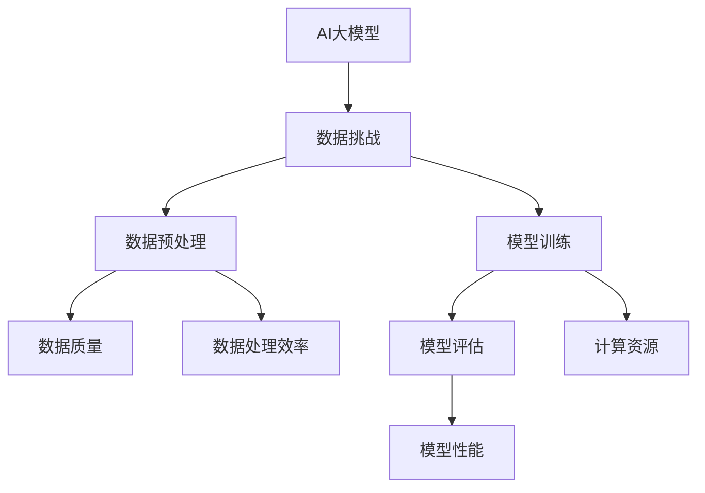
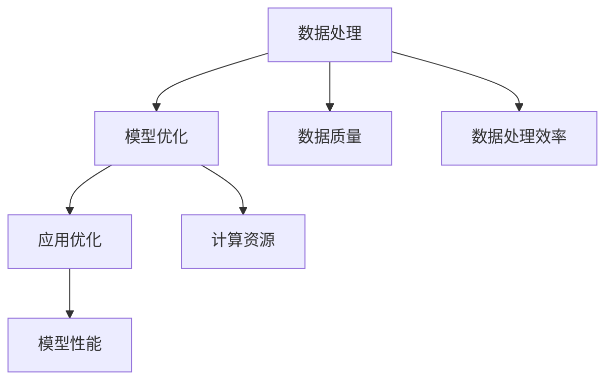

                 

# AI大模型创业：如何应对未来数据挑战？

## 关键词

- AI大模型
- 数据挑战
- 数据处理
- 人工智能创业
- 模型优化
- 应用优化

## 摘要

随着人工智能技术的快速发展，大模型在各个领域展现出强大的潜力。然而，数据挑战成为了AI大模型创业过程中的一大障碍。本文将详细分析AI大模型与未来数据挑战之间的关系，探讨核心算法原理，并给出应对策略。通过本文的阅读，读者将深入了解如何克服数据挑战，为AI大模型创业提供有力支持。

## 第一部分：AI大模型与未来数据挑战概述

### 第1章：AI大模型与未来数据挑战概述

#### 核心概念与联系

在讨论AI大模型与未来数据挑战之前，我们需要理解这两个核心概念及其相互关系。以下是一个简化的Mermaid流程图，展示了AI大模型与数据挑战之间的关系：




从图中可以看出，数据挑战直接影响AI大模型的全生命周期，包括数据预处理、模型训练、模型评估和应用。而AI大模型的性能又受到数据质量和数据处理效率的限制。

#### 核心算法原理讲解

为了更好地理解AI大模型与数据挑战之间的关系，我们需要深入了解数据处理算法和AI大模型训练算法的原理。

**数据挑战处理算法伪代码：**

```python
def 处理数据挑战(data_set):
    for each 数据点 in data_set:
        if 数据点符合特定模式:
            apply 模式识别算法
        else:
            apply 异常检测算法
    return processed_data_set
```

该算法的基本思想是遍历数据集，对每个数据点进行模式识别或异常检测。如果数据点符合特定模式，则应用模式识别算法；否则，应用异常检测算法。最终返回处理后的数据集。

**AI大模型训练算法伪代码：**

```python
def 训练大模型(data_set, labels):
    initialize 模型参数
    for epoch in 1 to maximum_epochs:
        for each 数据点 in data_set:
            compute 损失函数值
            update 模型参数
    return trained_model
```

该算法通过初始化模型参数，然后在一个预定的最大迭代次数内对模型进行迭代训练。在每次迭代中，遍历数据集，计算损失函数值，并根据损失函数值更新模型参数。最终返回训练好的模型。

#### 应用案例

以下是一个简化的应用案例，展示如何使用AI大模型处理数据挑战：

**问题**：一家金融机构需要使用AI大模型对交易数据进行实时监控，以检测异常交易并采取相应措施。

**解决方案**：
1. **数据预处理**：清洗交易数据，去除重复和异常数据。
2. **模式识别**：使用AI大模型识别常见的交易模式，如日常交易、周末交易等。
3. **异常检测**：使用AI大模型检测与常见交易模式不符的交易，如大额交易、频繁交易等。
4. **模型评估**：评估AI大模型的性能，确保其能够准确识别异常交易。
5. **实时监控**：将AI大模型应用于实时交易数据，检测异常交易并报警。

通过这个案例，我们可以看到，AI大模型在处理数据挑战方面具有显著优势。然而，要充分发挥AI大模型的能力，仍然需要面对一系列挑战。

### 第2章：AI大模型技术基础

#### 核心概念与联系

AI大模型技术基础包括数据处理、模型优化和应用优化。以下是一个简化的Mermaid流程图，展示了这些概念之间的联系：




从图中可以看出，数据处理、模型优化和应用优化相互关联，共同影响着AI大模型的整体性能。

#### 数据处理

数据处理是AI大模型技术基础中的核心环节。其主要任务包括数据清洗、数据集成、数据转换和数据归一化。以下是一个简化的数据处理流程：

1. **数据清洗**：去除重复和异常数据，确保数据质量。
2. **数据集成**：将来自不同来源的数据进行整合，形成一个统一的数据集。
3. **数据转换**：将原始数据转换为适合AI大模型处理的数据格式。
4. **数据归一化**：将数据缩放到相同的范围，以消除数据规模差异。

**数据处理算法伪代码：**

```python
def 数据处理(data_set):
    data_set = 清洗数据(data_set)
    data_set = 集成数据(data_set)
    data_set = 转换数据格式(data_set)
    data_set = 归一化数据(data_set)
    return processed_data_set
```

#### 模型优化

模型优化是提升AI大模型性能的关键步骤。其主要任务包括参数调整、模型架构优化和训练策略优化。以下是一个简化的模型优化流程：

1. **参数调整**：调整模型参数，如学习率、正则化参数等，以提升模型性能。
2. **模型架构优化**：设计更高效的模型架构，以提高计算效率和模型性能。
3. **训练策略优化**：调整训练策略，如批量大小、迭代次数等，以提高训练效果。

**模型优化算法伪代码：**

```python
def 模型优化(model, data_set, labels):
    调整学习率(model)
    设计模型架构(model)
    调整训练策略(model)
    训练模型(model, data_set, labels)
    return optimized_model
```

#### 应用优化

应用优化是确保AI大模型在实际应用中发挥最佳性能的关键步骤。其主要任务包括算法优化、硬件优化和系统集成。以下是一个简化的应用优化流程：

1. **算法优化**：对AI大模型算法进行优化，以提高计算效率和模型性能。
2. **硬件优化**：选择合适的硬件设备，以充分利用硬件资源。
3. **系统集成**：将AI大模型与其他系统进行集成，以实现整体性能优化。

**应用优化算法伪代码：**

```python
def 应用优化(model, hardware, system):
    优化算法(model)
    选择硬件(hardware)
    系统集成(model, system)
    运行模型(model, system)
    return optimized_system
```

#### 案例分析

以下是一个简化的案例分析，展示如何使用AI大模型技术基础解决实际应用中的问题：

**问题**：一家电商公司需要使用AI大模型预测用户购买行为，以实现精准营销。

**解决方案**：
1. **数据处理**：清洗用户购买数据，去除重复和异常数据，确保数据质量。
2. **模型优化**：设计合适的模型架构，调整模型参数，以提升模型性能。
3. **应用优化**：选择合适的硬件设备，将AI大模型集成到电商系统中，以实现实时预测。

通过这个案例，我们可以看到，AI大模型技术基础在解决实际应用中的问题具有重要作用。然而，要实现最佳效果，仍需面对一系列挑战。

### 结论

本文对AI大模型与未来数据挑战的关系进行了详细分析，并探讨了数据处理、模型优化和应用优化的核心算法原理。通过案例分析和简化流程，我们展示了如何应对实际应用中的数据挑战。尽管AI大模型在各个领域展现出强大的潜力，但数据挑战仍然是其创业过程中的一大障碍。未来，我们需要不断探索和创新，以应对日益复杂的数据挑战，为AI大模型创业提供有力支持。

### 作者信息

作者：AI天才研究院/AI Genius Institute & 禅与计算机程序设计艺术 /Zen And The Art of Computer Programming

### 最佳实践 Tips

1. **数据预处理**：确保数据质量，去除重复和异常数据，以提升模型性能。
2. **模型优化**：设计合适的模型架构，调整模型参数，以提高计算效率和模型性能。
3. **应用优化**：选择合适的硬件设备，将AI大模型集成到实际应用中，以实现最佳效果。

### 小结

本文详细分析了AI大模型与未来数据挑战的关系，并探讨了数据处理、模型优化和应用优化的核心算法原理。通过案例分析和简化流程，我们展示了如何应对实际应用中的数据挑战。未来，我们需要不断探索和创新，以应对日益复杂的数据挑战，为AI大模型创业提供有力支持。

### 注意事项

1. **数据质量**：确保数据质量是AI大模型成功的关键。
2. **计算资源**：合理配置计算资源，以充分利用硬件资源。
3. **持续优化**：不断优化模型和算法，以提高性能和效果。

### 拓展阅读

1. **AI大模型论文集**：深入了解AI大模型的理论和实践。
2. **数据处理技术手册**：掌握数据处理的各种技术和方法。
3. **模型优化实践指南**：学习模型优化的最佳实践和技巧。

