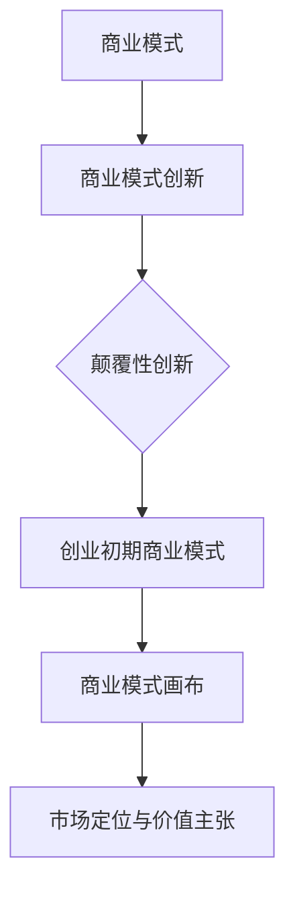

                 

## 文章标题

# 创业路上的商业模式创新：颠覆传统行业的思维方式

## 关键词

- 商业模式
- 商业模式创新
- 颠覆性创新
- 创业初期
- 商业模式画布
- 客户终身价值

## 摘要

在快速变化的商业环境中，创业公司要想脱颖而出，商业模式创新是至关重要的。本文将探讨商业模式的概念与分类，创新的理论基础与实际方法，以及如何将颠覆性创新应用于创业初期。通过具体的案例分析，我们将理解商业模式画布的应用，并学习如何设计、评估和持续优化商业模式，最终实现创业公司的持续成功。

## 目录大纲设计

### 第一部分：商业模式概述

#### 第1章：商业模式的定义与分类

##### 1.1 商业模式的基本概念
- 商业模式的基本定义
- 商业模式与业务模型的区别

##### 1.2 商业模式的分类
- 传统商业模式
- 新型商业模式
- 创业项目常见的商业模式

### 第二部分：商业模式创新的理论基础

#### 第2章：商业模式创新的原理与方法

##### 2.1 商业模式创新的原理
- 创新思维的培养
- 商业模式创新的动力与阻力

##### 2.2 商业模式创新的方法
- 传统方法
- 现代方法
- 结合案例探讨

### 第三部分：商业模式创新的实践应用

#### 第3章：颠覆性创新与商业模式

##### 3.1 颠覆性创新的概念
- 颠覆性创新的定义
- 颠覆性创新的特征

##### 3.2 颠覆性创新案例分析
- 苹果公司
- 特斯拉汽车
- 其他行业案例

### 第四部分：创业中的商业模式创新

#### 第4章：创业初期的商业模式设计

##### 4.1 创业初期的挑战
- 资金不足
- 市场不成熟
- 团队建设

##### 4.2 创业初期的商业模式设计
- 概念验证
- 市场调研
- 业务模式构思

### 第五部分：商业模式创新的实战技巧

#### 第5章：商业模式创新的实战技巧

##### 5.1 商业模式画布
- 商业模式画布的应用
- 画布的构建方法

##### 5.2 商业模式创新案例解析
- 成功案例分享
- 失败案例分析

### 第六部分：商业模式创新的策略与实施

#### 第6章：商业模式创新的策略

##### 6.1 市场定位与价值主张
- 市场定位的方法
- 价值主张的设计

##### 6.2 产品与服务设计
- 产品设计原则
- 服务设计策略

### 第七部分：商业模式创新的持续优化

#### 第7章：商业模式创新的持续优化

##### 7.1 市场变化与商业模式调整
- 市场趋势分析
- 商业模式调整策略

##### 7.2 商业模式创新的评估与改进
- 创新效果评估方法
- 改进措施与实践

### 附录

#### 附录A：商业模式创新工具与资源

##### A.1 商业模式创新工具介绍
- 工具功能
- 使用方法

##### A.2 商业模式创新资源推荐
- 经典书籍
- 研究报告
- 网络资源

### 核心概念与联系

**Mermaid 流�程图**



### 核心算法原理讲解

**商业模式画布伪代码**

```plaintext
function 商业模式画布(产品，客户，价值主张，渠道，客户关系，收入来源，关键资源，关键活动，关键合作伙伴) {
  // 初始化商业模式画布
  初始化画布(产品，客户，价值主张，渠道，客户关系，收入来源，关键资源，关键活动，关键合作伙伴)

  // 分析市场趋势
  市场趋势分析()

  // 确定商业模式创新方向
  创新方向 = 确定创新方向(市场趋势分析结果)

  // 设计商业模式
  设计商业模式(产品，客户，价值主张，渠道，客户关系，收入来源，关键资源，关键活动，关键合作伙伴，创新方向)

  // 评估商业模式
  评估商业模式()

  // 持续优化
  持续优化商业模式(评估结果)
}
```

### 数学模型和数学公式

**客户终身价值公式**

$$
LTV = CAC \times CLV
$$

$$
CLV = (P \times n) / ((1 + r)^t - 1)
$$

- CAC = 客户获取成本
- CLV = 客户终身价值
- P = 每次购买的平均价值
- n = 平均购买次数
- r = 客户流失率
- t = 客户生命周期

### 项目实战

**案例实战：电商平台的商业模式创新**

**开发环境搭建**

- 操作系统：Ubuntu 20.04
- 开发环境：Docker

**源代码详细实现和代码解读**

- 代码结构说明
- 关键函数和模块的功能解读

**代码应用解读与分析**

- 代码在实际项目中的应用
- 代码性能优化分析

**实际案例分析和详细讲解剖析**

- 案例背景介绍
- 案例实现过程解析
- 案例成功经验总结

**项目小结**

- 项目成果总结
- 项目反思与建议

**最佳实践 tips**

- 创新思维的重要性
- 数据驱动决策
- 团队合作与沟通

**小结**

- 商业模式创新在创业成功中的关键作用
- 不同阶段的商业模式设计要点
- 持续优化商业模式的策略与方法

**注意事项**

- 理解市场需求是创新的基础
- 保护知识产权
- 风险管理

**拓展阅读**

- 《商业模式新生代》
- 《创新者的窘境》
- 《精益创业》

通过这样的大纲设计和内容规划，我们将系统地探讨商业模式创新的各种方面，帮助读者全面理解和应用商业模式创新的理论和实践方法。每一部分都将深入分析，确保读者能够掌握关键概念和实际操作技能。接下来，我们将逐步深入探讨每个章节的具体内容。

