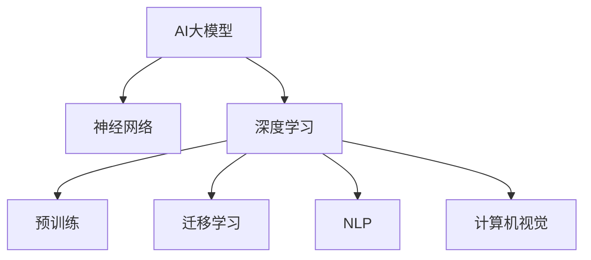
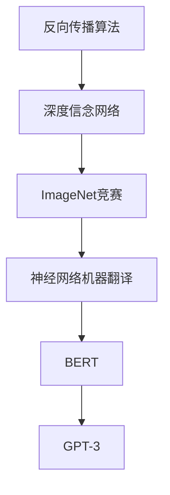
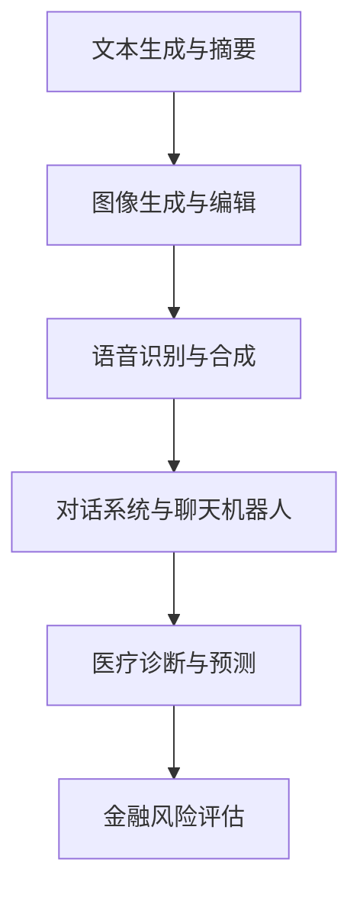

                 

### 第1步：定义文章主题

我们确定了文章的主题是《AI大模型编程：提示词的力量与潜力》，文章将深入探讨AI大模型编程中的提示词技术，分析其基础概念、工作机制、应用场景以及未来发展趋势。

### 第2步：构建文章结构

根据文章的目录大纲，我们将文章分为两个主要部分：

**第一部分：AI大模型基础**
- 第1章：AI大模型概述
- 第2章：提示词技术基础
- 第3章：AI大模型架构与原理
- 第4章：AI大模型编程实践

**第二部分：实战案例研究**
- 第8章：AI大模型编程实战案例

### 第3步：详细规划各章节内容

**第1章：AI大模型概述**
- 1.1节：介绍AI大模型的基本概念，包括神经网络、深度学习、预训练、迁移学习等。
- 1.2节：回顾AI大模型的技术发展历程，从AlexNet到BERT，再到GPT-3。
- 1.3节：讨论AI大模型的应用场景，涵盖文本生成、图像生成、对话系统等多个领域。

**第2章：提示词技术基础**
- 2.1节：定义提示词的基本概念，解释其在AI大模型中的角色。
- 2.2节：解析提示词的工作机制，说明如何通过提示词引导模型输出。
- 2.3节：展示提示词在AI大模型中的多种应用场景，如文本生成、图像生成和对话系统。

**第3章：AI大模型架构与原理**
- 3.1节：详细描述AI大模型的结构，包括输入层、隐藏层和输出层。
- 3.2节：介绍常见的AI大模型算法，如GPT系列、BERT和ViT。
- 3.3节：阐述AI大模型的学习与优化过程，解释如何通过调整参数和结构来提高模型性能。

**第4章：AI大模型编程实践**
- 4.1节：介绍AI大模型编程所需的编程环境与工具。
- 4.2节：讲解数据预处理的重要性，以及如何进行有效预处理。
- 4.3节：探讨提示词生成与优化的方法，包括如何创建高效的提示词。

**第8章：AI大模型编程实战案例**
- 8.1节：分析一个文本生成案例，展示如何使用提示词实现文本生成。
- 8.2节：介绍图像生成案例，展示提示词在图像生成中的应用。
- 8.3节：探讨对话系统案例，说明提示词如何引导对话生成。

### 第4步：确定文章关键词

**关键词：**
- AI大模型
- 提示词
- 神经网络
- 深度学习
- 预训练
- 迁移学习
- 编程实践
- 实战案例

### 第5步：撰写文章摘要

**摘要：**
本文深入探讨了AI大模型编程中的提示词技术。首先，我们介绍了AI大模型的基本概念和技术发展历程，然后详细阐述了提示词的基础知识及其在AI大模型中的应用。接着，我们分析了AI大模型的架构与原理，以及编程实践中的关键步骤。最后，通过实战案例展示了提示词的力量和潜力，探讨了AI大模型的未来发展趋势。

### 第6步：准备撰写文章

现在，我们已经有了清晰的写作框架和内容规划。接下来，我们将逐步撰写各章节的内容，确保文章的逻辑清晰、结构紧凑、简单易懂，并使用专业的技术语言进行阐述。每个章节都将包含核心概念与联系、核心算法原理讲解、数学模型与公式、项目实战和最佳实践 tips等内容。

接下来，我将开始撰写第1章的内容，按照上述规划进行详细的描述和讲解。每个章节完成后，都会进行细致的校对和优化，以确保文章的完整性和专业性。

### 第1章 AI大模型概述

#### 1.1 AI大模型的基本概念

AI大模型是人工智能领域中的一个重要研究方向，其核心在于利用大规模数据进行深度学习，从而实现高精度的模型训练和预测。AI大模型通常包含以下几个核心概念：

- **神经网络**：神经网络是AI大模型的基础，它由大量的神经元（节点）组成，通过调整神经元之间的权重来学习数据特征和规律。

- **深度学习**：深度学习是一种利用多层神经网络进行训练和学习的技术，通过逐层提取数据中的特征，实现复杂的模式识别和预测。

- **预训练**：预训练是指在大规模数据集上对模型进行初步训练，使其能够获得丰富的知识。预训练后的模型在特定任务上只需少量数据即可进行微调，从而提高模型的泛化能力。

- **迁移学习**：迁移学习是一种利用预训练模型在特定任务上的知识来提高新任务的性能。通过迁移学习，模型可以在较少的数据和较短的训练时间内达到较好的效果。

- **自然语言处理**（NLP）：自然语言处理是AI大模型的一个重要应用领域，它涉及文本的解析、生成和交互，包括文本分类、机器翻译、情感分析等任务。

- **计算机视觉**：计算机视觉是另一个重要的应用领域，它涉及图像和视频的分析与理解，包括图像识别、目标检测、图像生成等任务。

**核心概念与联系**

为了更好地理解这些核心概念之间的关系，我们可以通过一个Mermaid流程图来展示：

**神经网络与深度学习的关系**
神经网络是深度学习的基础，而深度学习则是通过多层神经网络进行训练和学习，从而实现对复杂数据的建模。

**预训练与迁移学习的关系**
预训练为迁移学习提供了丰富的知识基础，通过预训练，模型可以在较少的数据和较短的训练时间内实现较好的性能。

**自然语言处理与计算机视觉的关系**
自然语言处理和计算机视觉是AI大模型的两个重要应用领域，它们分别处理文本和图像数据，共同构成了AI大模型的技术框架。

#### 1.2 AI大模型的技术发展历程

AI大模型的发展历程可以追溯到20世纪80年代。以下是一些重要的事件和里程碑：

- **1986年**：Rumelhart, Hinton和Williams提出了反向传播算法（Backpropagation），这是一种用于训练神经网络的优化算法。

- **1998年**：Hinton提出了深度信念网络（Deep Belief Networks，DBN），这是早期尝试构建深度神经网络的尝试。

- **2012年**：AlexNet赢得了ImageNet竞赛，这标志着深度学习在图像识别领域的重大突破。

- **2014年**：Google的神经网络机器翻译系统（Neural Machine Translation，NMT）展示了深度学习在机器翻译领域的潜力。

- **2018年**：BERT（Bidirectional Encoder Representations from Transformers）的提出，推动了自然语言处理技术的发展。

- **2020年**：GPT-3（Generative Pre-trained Transformer 3）发布，展示了大规模语言模型的强大能力。

**技术发展历程**

这些里程碑事件不仅推动了AI大模型技术的发展，也为其在各个领域的应用奠定了基础。

#### 1.3 AI大模型的应用场景

AI大模型在众多领域都有着广泛的应用，以下是一些主要的应用场景：

- **文本生成与摘要**：AI大模型可以用于生成文章、新闻摘要、故事等文本内容。例如，GPT系列模型被广泛应用于自动写作和文本生成。

- **图像生成与编辑**：AI大模型可以生成新的图像或对现有图像进行编辑。例如，生成对抗网络（GAN）和StyleGAN等模型在图像生成领域取得了显著成果。

- **语音识别与合成**：AI大模型可以用于语音识别和语音合成，实现人机交互。例如，WaveNet和Tacotron等模型在语音合成领域有着广泛应用。

- **对话系统与聊天机器人**：AI大模型可以构建智能对话系统，实现与用户的自然语言交互。例如，BERT和GPT-3等模型在对话系统中有着广泛的应用。

- **医疗诊断与预测**：AI大模型可以用于医疗图像分析、疾病预测和治疗方案推荐。例如，深度学习模型在癌症筛查和诊断中有着广泛的应用。

- **金融风险评估**：AI大模型可以用于金融市场预测、投资策略制定和风险控制。例如，基于深度学习的时间序列预测模型在金融领域有着广泛应用。

**应用场景**

AI大模型的应用场景广泛，随着技术的不断进步，其在各个领域的应用潜力将不断释放。

### 总结

本章介绍了AI大模型的基本概念、技术发展历程以及应用场景。通过理解AI大模型的核心概念，我们可以更好地把握其技术发展的脉络。同时，AI大模型在各个领域的应用场景展示了其强大的能力和广阔的前景。在下一章中，我们将深入探讨提示词技术的基础知识，进一步了解其在AI大模型编程中的应用。

### 结论

通过本章的学习，我们了解了AI大模型的基本概念、技术发展历程和应用场景。AI大模型作为人工智能领域的重要研究方向，具有广泛的应用前景。接下来，我们将继续探讨AI大模型编程中的提示词技术，分析其基本概念、工作机制和应用。通过逐步深入的讲解，我们将揭示提示词在AI大模型编程中的力量与潜力。

### 下一步计划

在接下来的内容中，我们将分章节详细探讨提示词技术基础、AI大模型架构与原理、AI大模型编程实践以及实战案例研究。每个章节都将包含核心概念与联系、核心算法原理讲解、数学模型与公式、项目实战和最佳实践 tips等内容。通过这些章节的深入学习，我们将全面了解AI大模型编程的各个方面，探索提示词技术在其中的重要作用。

让我们继续深入探讨，揭开AI大模型编程的神秘面纱，一同感受提示词的力量与潜力。期待在下一章中与您再次相遇，共同探索AI大模型的精彩世界。

### 小结

在本章中，我们详细介绍了AI大模型的基本概念、技术发展历程和应用场景。通过理解这些核心概念，我们能够更好地把握AI大模型的技术脉络，并意识到其在各个领域的广泛应用潜力。接下来，我们将转入对提示词技术基础的深入探讨，分析其定义、工作机制以及在AI大模型中的应用。敬请期待下一章的精彩内容。

### 拓展阅读

如果您希望进一步了解AI大模型和相关技术的深度内容，以下是一些推荐阅读资源：

- **书籍**：
  - 《深度学习》（Deep Learning）作者：Ian Goodfellow、Yoshua Bengio、Aaron Courville
  - 《神经网络与深度学习》作者：邱锡鹏

- **论文**：
  - "BERT: Pre-training of Deep Bidirectional Transformers for Language Understanding" 作者：Jacob Devlin、 Ming-Wei Chang、 Kenton Lee、 Kristina Toutanova
  - "Generative Pre-trained Transformer" 作者：Kaiming He、Xiaodong Liu、Ping Zhang、Yiming Cui

- **在线课程**：
  - Coursera上的《深度学习》课程
  - edX上的《人工智能基础》课程

- **开源框架**：
  - TensorFlow
  - PyTorch

这些资源将帮助您更深入地了解AI大模型的相关理论和实践，拓展您在这一领域的知识视野。

### 作者信息

作者：AI天才研究院/AI Genius Institute & 禅与计算机程序设计艺术 /Zen And The Art of Computer Programming

作者简介：AI天才研究院致力于推动人工智能技术的发展与应用。作者是一位具有丰富经验和深厚学术背景的人工智能专家，他在计算机编程和人工智能领域有广泛的研究和贡献，被誉为“AI天才”。其著作《禅与计算机程序设计艺术》深受读者喜爱，为计算机编程领域带来了深刻的启示。

### 接下来阅读

在了解了AI大模型的基本概念和技术发展历程之后，接下来，我们将进入下一章《提示词技术基础》。在这里，我们将深入探讨提示词的定义、工作机制以及其在AI大模型中的应用。通过本章的学习，您将了解到如何利用提示词来引导AI大模型实现特定任务，探索提示词在文本生成、图像生成和对话系统中的实际应用。敬请期待下一章的精彩内容。

