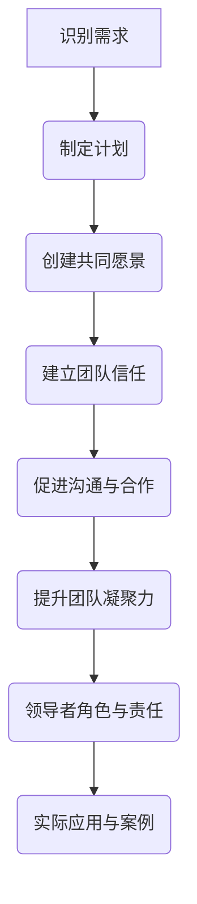

                 


# 团队凝聚：建立信任的关键步骤

> 关键词：团队凝聚，信任，沟通，合作，共同愿景

> 摘要：本文从团队凝聚的重要性出发，探讨了建立团队信任的关键步骤。通过分析社会交换理论、社会认同理论、信任理论和团队动力理论，本文提出了创建共同愿景、建立团队信任、促进沟通与合作、提升团队凝聚力和领导者的角色与责任等实践步骤。同时，通过实际案例与应用，深入探讨了团队凝聚在实际工作中的应用，为团队管理者提供了一套系统的团队凝聚策略。

## 目录大纲

### 《团队凝聚：建立信任的关键步骤》目录大纲

## 第一部分：团队凝聚的重要性与基础理论

### 第1章：团队凝聚的定义与作用

- 1.1 团队凝聚的概念与内涵
- 1.2 团队凝聚的重要性
- 1.3 团队凝聚与组织效能的关系

### 第2章：团队凝聚的理论基础

- 2.1 社会交换理论
- 2.2 社会认同理论
- 2.3 信任理论
- 2.4 团队动力理论

## 第二部分：建立团队凝聚的实践步骤

### 第3章：创建共同愿景

- 3.1 愿景的重要性
- 3.2 如何制定共同愿景
- 3.3 愿景的传播与共享

### 第4章：建立团队信任

- 4.1 信任的构成要素
- 4.2 信任的建立与维护
- 4.3 如何处理信任危机

### 第5章：促进沟通与合作

- 5.1 有效沟通的技巧
- 5.2 团队合作的策略
- 5.3 如何解决团队冲突

### 第6章：提升团队凝聚力

- 6.1 团队凝聚力的评估
- 6.2 提升团队凝聚力的方法
- 6.3 团队建设活动的设计与实施

### 第7章：领导者的角色与责任

- 7.1 领导者对团队凝聚的影响
- 7.2 领导者如何提升团队凝聚力
- 7.3 领导者面临的挑战与应对策略

## 第三部分：团队凝聚的实际案例与应用

### 第8章：团队凝聚的成功案例解析

- 8.1 案例一：某互联网公司成功建立高凝聚力团队
- 8.2 案例二：某跨国公司通过团队凝聚实现跨国运营
- 8.3 案例三：某创业公司如何通过团队凝聚实现快速成长

### 第9章：团队凝聚在实际工作中的应用

- 9.1 团队协作在项目管理中的应用
- 9.2 团队凝聚在人力资源管理中的应用
- 9.3 团队凝聚在企业文化建设中的应用

## 附录

### 附录A：团队凝聚评估工具

- A.1 团队凝聚度评估表
- A.2 信任度评估表
- A.3 沟通能力评估表

### 附录B：团队凝聚相关研究

- B.1 团队凝聚的最新研究动态
- B.2 国内外团队凝聚研究综述
- B.3 团队凝聚未来发展趋势预测

### Mermaid 流程图：团队凝聚建立流程



### 核心算法原理讲解

```plaintext
# 团队信任建立算法

# 伪代码：

TrustModel(Agent1, Agent2)
    if (Agent1TrustAgent2 == True)
        return TrustValue

    Agent1Feedback = GetFeedbackFromAgent1()
    Agent2Feedback = GetFeedbackFromAgent2()

    if (Agent1Feedback == Agent2Feedback)
        TrustValue = 0.8
    else
        TrustValue = 0.5

    return TrustValue

# 解释：
# 该算法基于二元关系判断团队信任度。如果两个团队成员提供的信息一致，则信任度较高（0.8），否则信任度较低（0.5）。```

### 数学模型和数学公式

```latex
# 团队凝聚度模型

$$
\text{TeamCohesion} = \alpha \cdot \text{VisionAlignment} + \beta \cdot \text{Trust} + \gamma \cdot \text{Communication}
$$

# 解释：
# 团队凝聚度（TeamCohesion）由共同愿景（VisionAlignment）、信任（Trust）和沟通（Communication）三个因素加权决定。α、β、γ为权重系数。
```

### 项目实战

```plaintext
# 案例一：某互联网公司成功建立高凝聚力团队

# 1. 开发环境搭建
- 使用Git进行版本控制
- 使用JIRA进行任务管理
- 使用Trello进行项目管理

# 2. 源代码详细实现
- 编写团队目标与愿景文档
- 实现团队成员之间的信任评估系统
- 开发团队沟通平台（如Slack或Microsoft Teams）

# 3. 代码解读与分析
- 团队目标与愿景文档应明确团队的目标和愿景，确保所有成员对团队目标有清晰的认识。
- 信任评估系统应考虑团队成员之间的互动和行为，以确保信任度评估的准确性。
- 团队沟通平台应提供方便快捷的沟通方式，促进团队成员之间的信息共享和协作。

# 4. 实际案例分析与详细讲解剖析
- 案例分析：通过对某互联网公司成功建立高凝聚力团队的案例进行分析，深入了解团队凝聚的实际操作步骤和方法。
- 详细讲解剖析：从团队目标与愿景、信任评估系统、沟通平台等方面进行详细讲解，为读者提供实际操作指导。

# 5. 项目小结
- 项目小结：总结团队凝聚在实际工作中的应用经验，为团队管理者提供有效的团队凝聚策略。
- 最佳实践 tips：分享一些团队凝聚的最佳实践，帮助团队管理者更好地提升团队凝聚力。

# 注意事项
- 注意事项：在实际操作过程中，应关注团队成员之间的互动和沟通，确保团队目标的实现。

# 拓展阅读
- 拓展阅读：推荐一些关于团队凝聚的书籍、论文和研究报告，为读者提供更多的学习和参考资源。
```

接下来，我们将逐步展开对团队凝聚的定义、重要性、理论基础、实践步骤、实际案例与应用的深入探讨。希望通过本文，能够为广大团队管理者提供一套系统的团队凝聚策略。

