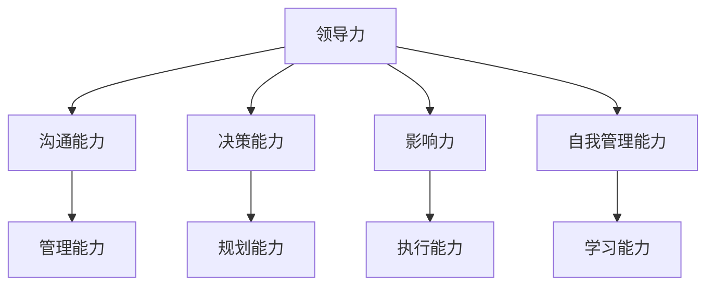
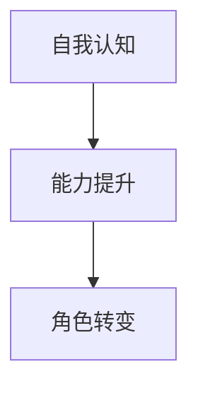
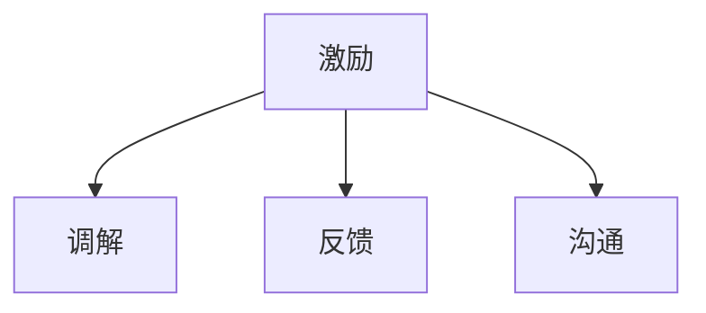
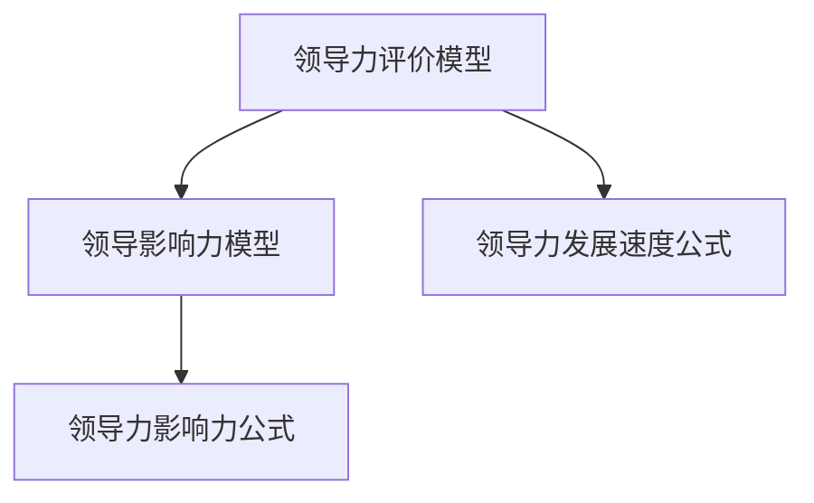
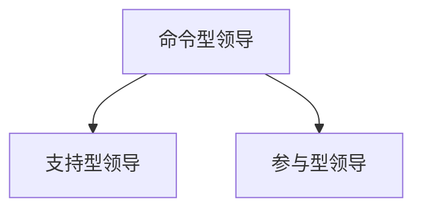

                 

### 文章标题：如何培养下一代领导者

> 关键词：领导力培养、下一代领导者、核心概念、算法原理、实践案例

> 摘要：本文旨在探讨如何培养下一代领导者。通过详细解析领导力的核心概念、算法原理以及实践案例，文章为读者提供了系统且实用的培养策略，帮助培养出具备卓越领导能力的新时代领导者。

### 引言

在当今快速变化的社会环境中，领导者扮演着至关重要的角色。他们不仅影响着组织的战略决策，还决定着团队的凝聚力和创新能力。随着科技的发展和企业形态的变革，领导者的角色也在不断演变。因此，培养下一代领导者成为了一项紧迫且重要的任务。

本文将从以下几个方面展开讨论：

1. 领导力核心概念与基础
2. 领导力核心算法原理
3. 实战篇：领导力项目案例
4. 代码实际案例
5. 领导力培养的实践建议
6. 附录：领导力开发工具与资源

通过逐步深入的分析和探讨，本文希望为读者提供一套完整的培养下一代领导者的方法论，帮助他们在未来的职业发展中脱颖而出。

### 第一部分：领导力核心概念与基础

#### 第1章：领导力概述

**1.1 领导力的定义与类型**

领导力是一种激励、引导和影响他人达成目标的能力。它可以分为多种类型，如变革型领导、事务型领导、变革型领导等。每种类型的领导力都有其独特的特点和应用场景。

**1.2 领导力的要素**

领导力的核心要素包括沟通能力、决策能力、影响力、自我管理能力等。这些要素共同构成了一个领导者所需的核心素质。

**1.3 领导力在组织中的重要性**

领导力是组织成功的关键因素。一个优秀的领导者能够有效激发团队的潜力，推动组织的创新和发展。同时，领导力也是组织文化的重要组成部分，直接影响着组织的氛围和氛围。

#### 第2章：领导者角色与责任

**2.1 领导者角色模型**

领导者角色模型描述了领导者应具备的不同角色，如战略规划者、资源调配者、团队激励者等。这些角色共同构成了领导者的全方位职责。

**2.2 领导者责任解析**

领导者的责任包括确保团队目标的实现、提高团队成员的能力、维护组织的稳定和增长等。这些责任的履行对领导者的能力和素质提出了高要求。

**2.3 领导者如何影响组织文化**

领导者通过自身的行为和决策对组织文化产生深远影响。他们需要树立正确的价值观和行为规范，引导组织走向健康发展的道路。

#### 第3章：核心概念与联系

**3.1 领导力与管理的区别与联系**

领导力和管理虽然密切相关，但有着本质的区别。领导力更注重影响和激励，而管理则更注重规划和执行。

**3.2 领导力与心理学的关系**

领导力心理学研究领导者的心理特征、行为模式和心理需求，为培养领导者提供了科学依据。

**3.3 领导力与领导者的个人成长**

领导力培养是一个持续的过程，需要领导者不断自我反思和成长。个人成长是领导力提升的重要保障。

**图 3.1 领导力核心概念关系架构**



#### 第4章：领导者能力模型

**4.1 沟通能力**

沟通能力是领导者最重要的能力之一。有效的沟通能够帮助领导者传达愿景、激发团队潜力、解决问题。

**4.2 决策能力**

决策能力是领导者必须具备的核心能力。优秀的领导者能够在复杂环境中做出明智的决策。

**4.3 领导力发展路径**

领导力发展路径包括自我认知、能力提升、角色转变等阶段。每个阶段都有其独特的挑战和机遇。

**图 4.1 领导者能力模型**



#### 第5章：领导力与团队发展

**5.1 团队领导的艺术**

团队领导不仅是管理团队，更是激励和培养团队成员。领导者需要运用多种领导力技巧，如激励、反馈、冲突管理等。

**5.2 激励团队**

激励是领导力的核心要素之一。领导者需要了解团队成员的需求，运用适当的激励手段，激发团队活力。

**5.3 领导力在团队冲突管理中的应用**

团队冲突是不可避免的现象。领导者需要运用领导力技巧，如调解、协商、沟通等，有效管理团队冲突。

**图 5.1 团队领导力模型**



### 第二部分：领导力核心算法原理

#### 第6章：领导力心理学原理

**6.1 自我认识与自我效能感**

自我认识和自我效能感是领导力心理学的重要概念。领导者需要深入了解自己，树立正确的自我形象，并相信自己能够应对各种挑战。

**6.2 领导者的心理素质**

领导者的心理素质包括情绪管理能力、抗压能力、决策能力等。良好的心理素质是领导者成功的关键。

**6.3 领导风格与心理效应**

领导风格对团队成员的心理状态和组织文化有重要影响。不同的领导风格会产生不同的心理效应，领导者需要根据实际情况选择合适的领导风格。

#### 第7章：领导力数学模型

**7.1 领导力评价模型**

领导力评价模型用于衡量领导者的能力和发展水平。常见的评价模型包括 360 度评估、行为事件访谈等。

**7.2 领导影响力模型**

领导影响力模型描述了领导者如何通过行为和决策影响团队成员和组织。该模型有助于领导者更好地理解自己的影响力。

**7.3 领导力发展的数学公式与应用**

领导力发展可以通过数学公式进行量化分析。常见的公式包括领导力发展速度公式、领导力影响力公式等。

**图 7.1 领导力数学模型**



#### 第8章：核心算法原理讲解

**8.1 权变领导理论**

权变领导理论认为，领导者的领导风格应根据不同情境灵活调整。该理论提供了多种领导风格，如命令型、支持型、参与型等。

**8.2 领导替代理论**

领导替代理论认为，领导者的领导能力可以通过其他方式替代。例如，通过提供适当的资源和环境，团队可以自我管理。

**8.3 领导力发展模型**

领导力发展模型描述了领导者从新手到专家的成长过程。该模型包括自我认知、能力提升、角色转变等阶段。

**图 8.1 权变领导理论**



#### 第9章：领导力数学公式与详细讲解

**9.1 领导力公式$F=\frac{L}{D}$**

领导力公式$F=\frac{L}{D}$表示领导力（F）是领导能力（L）与团队需求（D）的比值。该公式说明了领导力的关键在于满足团队需求。

**9.2 领导影响力公式$Influence = R \times E$**

领导影响力公式$Influence = R \times E$表示领导影响力（Influence）是领导能力（R）与团队成员期望（E）的乘积。该公式强调了领导影响力取决于领导能力和团队成员的期望。

**9.3 领导力发展公式$Growth = P + S + A$**

领导力发展公式$Growth = P + S + A$表示领导力发展（Growth）是个人成长（P）、社会支持（S）和自主学习（A）的总和。该公式说明了领导力发展是多方面因素共同作用的结果。

**图 9.1 领导力数学公式**

```mermaid
graph TD
A[领导力公式$F=\frac{L}{D}$] --> B[领导影响力公式$Influence = R \times E$]
A --> C[领导力发展公式$Growth = P + S + A$]
```

### 第三部分：实战篇：领导力项目案例

#### 第10章：领导力项目实战

**10.1 项目背景介绍**

本案例以某互联网公司为例，探讨如何通过领导力培养项目提升团队绩效。

**10.2 项目目标与规划**

项目目标包括提高团队领导力、增强团队凝聚力、提升团队创新能力等。项目规划包括制定详细的项目计划、确定关键里程碑等。

**10.3 项目实施与跟踪**

项目实施过程中，采用多种领导力培养方法，如领导力培训、团队建设活动、领导力教练等。项目跟踪包括定期评估项目进展、收集团队成员反馈等。

#### 第11章：代码实际案例

**11.1 代码案例介绍**

本节通过一个实际代码案例，探讨如何通过编程实践提升领导力。

**11.2 开发环境搭建**

介绍开发环境搭建步骤，包括软件安装、配置等。

**11.3 源代码详细实现**

详细解析源代码实现过程，包括关键代码段和算法原理。

**11.4 代码解读与分析**

对代码进行解读和分析，探讨代码中的领导力元素和关键决策。

#### 第12章：领导力培养的实践建议

**12.1 个人成长计划**

领导者需要制定个人成长计划，包括学习目标、实践计划等。

**12.2 领导力培训与培养**

组织领导力培训课程，帮助领导者提升核心能力。

**12.3 领导力在组织中的应用与推广**

将领导力理念融入组织文化，推广领导力实践，营造良好的领导力氛围。

### 附录

**附录 A：领导力开发工具与资源**

提供一系列领导力开发工具和资源，包括领导力评估工具、培训资源、研究机构等。

### 总结

本文系统地介绍了如何培养下一代领导者。通过深入探讨领导力的核心概念、算法原理和实践案例，本文为读者提供了全面且实用的培养策略。希望本文能够为培养出更多具备卓越领导能力的新时代领导者做出贡献。

### 作者信息

作者：AI天才研究院/AI Genius Institute & 禅与计算机程序设计艺术 /Zen And The Art of Computer Programming

### 最佳实践 Tips、小结、注意事项、拓展阅读

1. **最佳实践 Tips：** 领导者应注重持续学习，不断提升自己的能力。定期进行自我反思和团队反馈，是提升领导力的重要途径。

2. **小结：** 领导力培养是一个系统工程，需要从多个维度进行思考和行动。通过本文的介绍，读者应能更好地理解领导力的本质和实践方法。

3. **注意事项：** 领导者应避免过度依赖某种领导风格，应根据不同情境灵活调整。同时，要注重团队成员的多样性和差异性，实现多元化领导。

4. **拓展阅读：** 可进一步阅读相关领导力书籍和学术论文，如《领导力五要素》、《变革型领导》等，以深入理解和实践领导力。

### 结束语

领导力的培养是一个长期且持续的过程，需要领导者不断学习、实践和反思。本文旨在为读者提供一套系统且实用的培养策略，帮助他们在未来的职业发展中脱颖而出。希望本文能够为培养下一代领导者做出贡献，推动组织的持续发展和进步。愿每位领导者都能成为引领未来的卓越领导者！

