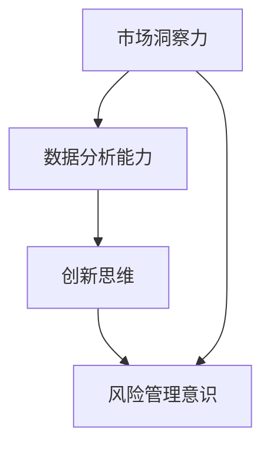

                 


### 如何培养团队的商业敏锐度

#### 引言

在当今快速变化和高度竞争的商业环境中，团队的商业敏锐度成为决定企业成败的关键因素。商业敏锐度不仅关乎市场洞察力，还包括对数据的深度分析、创新思维和风险管理能力。本文将详细探讨如何培养团队的商业敏锐度，帮助企业在激烈的市场竞争中立于不败之地。

#### 第一部分：商业敏锐度概述

### 1. 商业敏锐度的定义与重要性

#### 1.1 商业敏锐度的定义

商业敏锐度是指团队在复杂商业环境中，能够快速识别市场机会、评估风险、并做出有效决策的能力。它不仅包括对市场动态的敏锐感知，还涉及对数据的深入分析、创新思维和风险管理的综合运用。

#### 1.2 商业敏锐度对团队的重要性

- **提升竞争力**：具备高商业敏锐度的团队能够迅速响应市场变化，抓住商机，从而提升企业的市场竞争力。
- **优化决策**：商业敏锐度有助于团队在决策过程中更全面地考虑各种因素，减少风险，提高决策质量。
- **推动创新**：商业敏锐度激发团队能够持续创新，适应市场变化，保持竞争优势。

### 2. 商业敏锐度的核心要素

#### 2.1 市场洞察力

- **定义**：市场洞察力是指对市场动态的敏锐感知和理解能力。
- **重要性**：市场洞察力有助于团队准确把握市场需求，预测市场趋势，为产品开发、市场营销等提供有力支持。

#### 2.2 数据分析能力

- **定义**：数据分析能力是指运用数据进行分析，以发现有价值信息的能力。
- **重要性**：数据分析能力帮助团队从海量数据中提取关键信息，为决策提供数据支持。

#### 2.3 创新思维

- **定义**：创新思维是指能够从不同角度思考问题，提出新颖解决方案的能力。
- **重要性**：创新思维有助于团队在激烈的市场竞争中脱颖而出，不断推陈出新。

#### 2.4 风险管理意识

- **定义**：风险管理意识是指对潜在风险的识别、评估和管理能力。
- **重要性**：风险管理意识帮助团队预见并应对各种风险，确保企业稳定发展。

### 3. Mermaid流程图：商业敏锐度要素关系图



#### 第二部分：培养商业敏锐度的方法

### 4. 个人能力提升

#### 4.1 数据分析能力

##### 4.1.1 数据分析工具介绍

- **Python**：Python 是一种广泛使用的编程语言，具有丰富的数据分析库，如Pandas、NumPy等。
- **R**：R 是一种专门为统计和数据科学设计的语言，拥有强大的数据处理和分析功能。
- **Tableau**：Tableau 是一种数据可视化工具，能够帮助团队将数据转化为易于理解的图表和报告。

##### 4.1.2 数据分析方法讲解

- **描述性分析**：描述性分析是对数据的基本描述，如平均值、中位数、标准差等。
- **趋势分析**：趋势分析是研究数据随时间变化的情况，如时间序列分析。
- **相关性分析**：相关性分析研究两个或多个变量之间的关系。
- **回归分析**：回归分析用于预测一个或多个变量与另一个变量之间的关系。

##### 4.1.3 伪代码示例：数据分析流程

```python
# 数据预处理
data = preprocess_data(raw_data)

# 描述性分析
description = describe_data(data)

# 趋势分析
trend = analyze_trends(data)

# 相关性分析
correlation = analyze_correlations(data)

# 回归分析
regression = perform_regression(data)
```

#### 4.2 市场洞察力

##### 4.2.1 市场研究方法

- **宏观经济分析**：研究整体经济环境，如GDP、通货膨胀率等。
- **行业研究**：分析特定行业的发展趋势、竞争格局等。
- **市场细分**：将市场划分为不同的细分市场，以更好地满足不同客户的需求。

##### 4.2.2 市场分析技巧

- **情报收集**：通过多种渠道收集市场信息，如市场报告、竞争对手分析等。
- **竞争对手分析**：分析竞争对手的产品、市场策略等。
- **消费者行为研究**：研究消费者的购买行为、偏好等。

##### 4.2.3 市场趋势预测模型讲解

- **时间序列分析**：用于预测未来的时间序列数据，如销量、股价等。
- **机器学习预测模型**：利用机器学习算法预测未来的市场趋势。

#### 4.3 创新思维

##### 4.3.1 创新方法论

- **头脑风暴**：通过集体讨论，激发创意的产生。
- **思维导图**：将思维过程可视化，帮助团队更好地梳理创意。
- **TRIZ**：一种系统化的创新方法论，用于解决复杂问题。

##### 4.3.2 创新思维训练

- **问题解决训练**：通过解决问题，提升团队的创新能力。
- **思维拓展训练**：通过不同的训练方法，拓宽团队的思维视野。
- **团队协作训练**：通过团队合作，激发创新潜能。

##### 4.3.3 伪代码示例：创新思维过程

```python
# 头脑风暴
ideas = brainstorming(topic)

# 思维导图
mindmap = create_mindmap(ideas)

# TRIZ分析
solutions = analyze_triz(problem)
```

#### 4.4 风险管理意识

##### 4.4.1 风险管理策略

- **风险评估**：对潜在风险进行评估，确定风险的严重程度。
- **风险规避**：通过调整策略，避免高风险的出现。
- **风险转移**：将风险转移给第三方，如购买保险。

##### 4.4.2 风险评估方法

- **定性评估**：基于经验和直觉评估风险。
- **定量评估**：使用数学模型评估风险。

##### 4.4.3 伪代码示例：风险评估流程

```python
# 定性评估
qualitative_risk = qualitative评估(risks)

# 定量评估
quantitative_risk = quantitative评估(risks)

# 综合评估
total_risk = qualitative_risk + quantitative_risk
```

### 5. 团队建设与协作

#### 5.1 团队文化建设

- **价值观**：建立共同的价值观，提高团队的凝聚力。
- **沟通**：建立良好的沟通机制，促进团队成员之间的信息共享。
- **协作**：鼓励团队成员协作，共同完成任务。

#### 5.2 协作机制

- **协作工具**：选择合适的协作工具，如Slack、Trello等。
- **协作流程**：设计合理的协作流程，提高团队工作效率。

#### 5.3 伪代码示例：协作流程

```python
# 选择协作工具
tool = choose协作工具()

# 设计协作流程
流程 = design协作流程()

# 执行协作流程
执行流程(流程)
```

#### 第三部分：实战演练

### 6. 项目实战：商业敏锐度提升计划

#### 6.1 项目背景

- **项目目标**：提升团队的商业敏锐度，提高企业的市场竞争力。
- **项目范围**：涵盖数据分析、市场洞察力、创新思维和风险管理等方面。

#### 6.2 实施步骤

##### 6.2.1 需求调研与评估

- **调研方法**：问卷调查、访谈、市场研究等。
- **评估标准**：团队当前商业敏锐度水平、市场需求、竞争环境等。

##### 6.2.2 计划制定与执行

- **计划制定**：根据需求调研结果，制定具体的提升计划。
- **执行策略**：实施培训、项目实战、团队建设等活动。

##### 6.2.3 效果评估与反馈

- **评估方法**：定期评估团队的商业敏锐度水平，收集反馈意见。
- **反馈机制**：及时调整计划，优化培训内容和方式。

#### 6.3 代码实现与解读

```python
# 数据分析实战
data = load_data("sales_data.csv")
analysis = analyze_data(data)
plot_results(analysis)

# 市场洞察力实战
market_data = load_data("market_report.xlsx")
insights = analyze_market(market_data)
print_insights(insights)

# 创新思维实战
problem = "提高客户满意度"
solutions = brainstorming(problem)
print_solutions(solutions)

# 风险管理实战
risks = identify_risks()
assessment = assess_risks(risks)
print_assessment(assessment)
```

#### 6.4 实战总结与经验分享

- **挑战与解决方案**：在实施过程中遇到的挑战及解决方法。
- **经验总结**：成功的经验和教训，为后续项目提供借鉴。

#### 附录

### 7. 参考资料与拓展阅读

- **商业敏锐度相关书籍推荐**：
  - 《商业洞察力》
  - 《数据分析实战》
  - 《创新思维》

- **商业敏锐度在线课程推荐**：
  - Coursera：商业分析
  - edX：数据科学

- **商业敏锐度相关研究论文推荐**：
  - "The Importance of Business Analytics in Decision Making"
  - "Developing Business Acumen in Organizations"

作者：AI天才研究院/AI Genius Institute & 禅与计算机程序设计艺术 /Zen And The Art of Computer Programming

---

#### 结语

培养团队的商业敏锐度是企业持续发展的关键。通过提升个人能力、加强团队建设与协作，企业可以更好地应对市场变化，抓住机遇，实现长远发展。本文提供了详细的培养方法和实战案例，希望对读者有所启发。在商业世界中，敏锐度决定成败，让我们携手共进，提升团队的商业敏锐度，共创美好未来。

