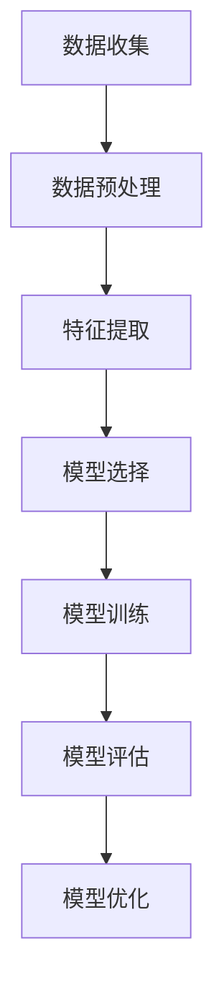
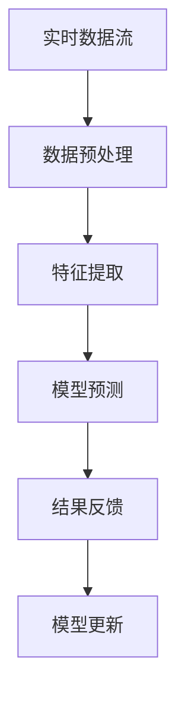

                 

### 文章标题

《机器学习在网络流量分类中的实时应用》

### 关键词

- 机器学习
- 网络流量分类
- 实时应用
- 特征提取
- 模型选择与优化

### 摘要

本文探讨了机器学习在网络流量分类中的实时应用。首先，介绍了机器学习的基础概念及其在数据预处理、特征工程、模型选择与评估中的应用。然后，详细阐述了网络流量的定义与分类，以及网络流量特征提取的方法。接着，讨论了实时应用的定义与分类，并重点分析了实时网络流量分类系统的架构设计、算法实现与优化策略。最后，通过一个实际项目实战，展示了如何应用机器学习技术进行实时网络流量分类，并对项目进行了总结和展望。

---

# 目录

## 第一部分：机器学习基础

### 第1章：机器学习概述

#### 1.1 机器学习的定义与分类

- **机器学习的定义**：介绍机器学习的基本概念，包括学习过程、目标和学习方法。
- **监督学习、无监督学习和强化学习**：分析这三种机器学习方法的定义、特点和应用场景。

#### 1.2 机器学习的发展历史

- **早期机器学习的发展**：回顾早期机器学习的研究进展，如符号逻辑、专家系统和神经网络等。
- **现代机器学习的发展**：探讨深度学习、增强学习等现代机器学习技术的兴起与发展。

#### 1.3 机器学习应用场景

- **数据预处理**：讲解数据清洗、归一化、缺失值处理等数据预处理技术。
- **特征工程**：介绍如何从原始数据中提取有效特征，以及特征选择和特征变换的方法。
- **模型选择与评估**：讨论不同类型的机器学习模型，以及如何选择和评估模型性能。

## 第二部分：网络流量分类

### 第2章：网络流量分类概述

#### 2.1 网络流量的定义与分类

- **网络流量的定义**：解释网络流量的概念，包括流量类型和数据格式。
- **网络流量的分类**：分析不同类型的网络流量，如合法流量、恶意流量、异常流量等。

#### 2.2 网络流量分类的重要性

- **安全性**：阐述网络流量分类在网络安全防护中的作用。
- **效率**：解释网络流量分类如何提高网络资源的利用效率。

### 第3章：网络流量特征提取

#### 3.1 时序特征提取

- **时序特征提取的方法**：介绍时间序列分析方法，如自相关、滑动窗口等。
- **实例分析**：通过实例展示时序特征提取的具体实现。

#### 3.2 空间特征提取

- **空间特征提取的方法**：讨论空间特征提取的技术，如网络拓扑结构、流量分布等。
- **实例分析**：通过实例说明空间特征提取的应用。

## 第三部分：实时应用

### 第4章：实时应用概述

#### 4.1 实时应用的定义与分类

- **实时应用的定义**：解释实时系统的概念，以及实时应用的特点。
- **实时应用的分类**：分析不同类型的实时应用，如在线交易、实时语音识别等。

#### 4.2 实时应用中的机器学习

- **实时机器学习的挑战**：探讨实时应用中的机器学习面临的挑战。
- **实时机器学习的解决方案**：介绍解决实时机器学习问题的方法和技术。

### 第5章：实时网络流量分类系统

#### 5.1 系统架构设计

- **系统架构的设计原则**：阐述设计实时网络流量分类系统的基本原则。
- **系统架构的详细设计**：详细描述系统的架构设计，包括数据流、处理模块和反馈机制。

#### 5.2 算法实现与优化

- **算法的选择与实现**：介绍实时网络流量分类算法的选择和实现。
- **算法的优化策略**：讨论如何优化算法性能，包括并行处理、缓存技术等。

#### 5.3 系统部署与性能评估

- **系统的部署**：说明实时网络流量分类系统的部署过程。
- **系统的性能评估**：评估系统在实际应用中的性能，包括吞吐量、延迟和准确率等指标。

## 第四部分：项目实战

### 第6章：实时网络流量分类项目实战

#### 6.1 项目背景与目标

- **项目背景**：介绍项目的起源和发展背景。
- **项目目标**：明确项目的目标和预期成果。

#### 6.2 数据收集与预处理

- **数据来源**：说明数据收集的渠道和方法。
- **数据预处理方法**：描述数据清洗、归一化和特征提取等预处理步骤。

#### 6.3 模型选择与训练

- **模型选择**：讨论选择何种机器学习模型进行网络流量分类。
- **模型训练过程**：详细说明模型训练的过程，包括数据集划分、训练策略等。

#### 6.4 模型评估与优化

- **模型评估方法**：介绍评估模型性能的方法和指标。
- **模型优化策略**：阐述如何对模型进行优化，包括超参数调整、模型融合等。

### 第7章：项目总结与展望

#### 7.1 项目总结

- **项目成果**：总结项目的主要成果和收获。
- **项目经验**：分享项目过程中积累的经验和教训。

#### 7.2 展望未来

- **未来发展趋势**：预测实时网络流量分类领域的发展趋势。
- **潜在应用领域**：探讨实时网络流量分类技术的潜在应用场景。

## 附录

### 附录 A：实用工具与资源

#### A.1 机器学习工具

- **scikit-learn**：介绍scikit-learn的基本功能和使用方法。
- **TensorFlow**：讨论TensorFlow的架构和优点。
- **PyTorch**：分析PyTorch的特点和应用场景。

#### A.2 数据集

- **KDD Cup**：介绍KDD Cup数据集的特点和用途。
- **NSL-KDD**：说明NSL-KDD数据集的来源和内容。
- **CICIDS2017**：分析CICIDS2017数据集的挑战和应用。

### 附录 B：Mermaid 流程图

#### B.1 机器学习流程图



#### B.2 实时应用流程图



### 附录 C：算法伪代码

#### C.1 k-均值聚类算法

```python
def k_means(data, k):
    # 初始化聚类中心
    centers = initialize_centers(data, k)
    
    while not convergence(centers):
        # 为每个数据点分配最近的聚类中心
        for data_point in data:
            closest_center = find_closest_center(data_point, centers)
            assign_to_cluster(data_point, closest_center)
        
        # 更新聚类中心
        new_centers = update_centers(centers, data)
        
        # 判断是否收敛
        if is_converged(centers, new_centers):
            break
    
    return centers
```

#### C.2 决策树算法

```python
def build_decision_tree(data):
    # 如果数据集已经纯净，则返回分类结果
    if is_pure(data):
        return most_common_label(data)
    
    # 找到最佳特征
    best_feature = find_best_feature(data)
    
    # 根据最佳特征划分数据集
    yes_data, no_data = split_data(data, best_feature)
    
    # 递归构建子树
    left_tree = build_decision_tree(yes_data)
    right_tree = build_decision_tree(no_data)
    
    # 创建决策树节点
    node = Node(best_feature, left_tree, right_tree)
    
    return node
```

---

接下来，我们将按照目录结构，逐一介绍每个章节的内容。首先，从机器学习的基础概念开始。在接下来的章节中，我们将深入探讨网络流量分类的相关知识，最后讨论机器学习在网络流量分类中的实时应用。通过这些内容的逐步讲解，希望能够帮助读者理解这一复杂但极具应用价值的技术领域。

