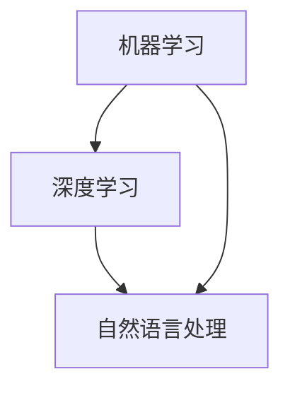
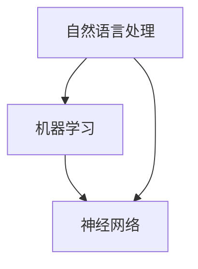
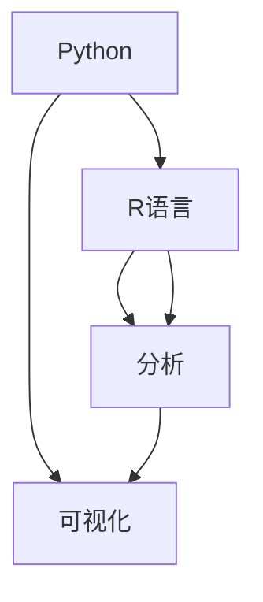

                 


为了撰写一篇关于《AI编程语言：提示词的魔力》的技术博客文章，我们将遵循以下步骤：

### 1. 确定文章结构

文章结构将包括以下部分：

- 文章标题
- 文章关键词
- 文章摘要
- 文章正文（按目录大纲结构）

### 2. 编写文章标题和关键词

文章标题：《AI编程语言：提示词的魔力》

关键词：AI编程语言、提示词、深度学习、Python、R语言、性能优化、安全性、未来趋势

### 3. 撰写文章摘要

摘要：本文将探讨AI编程语言中的提示词技术，介绍其基本概念、工作原理和应用场景。我们将分析Python和R语言在AI编程中的应用，并深入讲解提示词技术的核心算法原理和数学模型。此外，文章还将通过项目实战展示AI编程语言的实际应用，并探讨性能优化和安全性的最佳实践。

### 4. 编写文章正文

#### 引言

在人工智能（AI）迅速发展的时代，AI编程语言成为开发智能系统的核心工具。提示词（Prompt）技术是AI编程语言中的一个关键概念，它能够大幅提升模型的学习效果和预测准确性。本文将详细解析AI编程语言中的提示词技术，探讨其原理、应用和实践。

#### 第1章：AI编程语言概述

在本章中，我们将介绍AI编程语言的基本概念、发展历程和特点。我们将解释为什么AI编程语言在当今的科技领域如此重要。

**核心概念与联系**

AI编程语言的核心概念包括机器学习、深度学习和自然语言处理。这些概念之间存在着紧密的联系，构成了现代AI编程语言的基础。

**Mermaid流程图**



**核心算法原理讲解**

伪代码示例：

```
function train_model(data):
    for each sample in data:
        predict_output = model(sample)
        update_model(predict_output, sample)
    return model
```

**数学模型和公式**

机器学习中的损失函数：

$$
L(\theta) = -\frac{1}{m} \sum_{i=1}^{m} y^{(i)} \log(h_\theta(x^{(i)}))
$$

其中，$h_\theta(x)$是预测函数，$y^{(i)}$是实际输出，$m$是样本数量。

### 第2章：提示词技术详解

在本章中，我们将深入探讨提示词技术的定义、工作原理和类型。我们将解释提示词如何帮助AI模型更好地学习和预测。

**核心概念与联系**

提示词技术涉及自然语言处理、机器学习和神经网络等多个领域。

**Mermaid流程图**



**核心算法原理讲解**

伪代码示例：

```
function generate_prompt(text):
    tokens = tokenize(text)
    embedding = embed(tokens)
    return embedding
```

**数学模型和公式**

嵌入向量：

$$
\vec{e} = \text{Embedding}(w, d)
$$

其中，$w$是词汇，$d$是嵌入维度。

### 第3章：常用AI编程语言介绍

在本章中，我们将介绍Python和R语言在AI编程中的应用，并探讨它们的优缺点。

**核心概念与联系**

Python和R语言都是流行的AI编程语言，但它们在数据处理、分析和可视化方面有所不同。

**Mermaid流程图**



**项目实战**

**实战项目一：使用Python进行图像识别**

开发环境搭建：

- 安装Python 3.8
- 安装TensorFlow

源代码实现：

```python
import tensorflow as tf

model = tf.keras.Sequential([
    tf.keras.layers.Conv2D(32, (3, 3), activation='relu', input_shape=(28, 28, 1)),
    tf.keras.layers.MaxPooling2D(2, 2),
    tf.keras.layers.Flatten(),
    tf.keras.layers.Dense(128, activation='relu'),
    tf.keras.layers.Dense(10, activation='softmax')
])

model.compile(optimizer='adam',
              loss='categorical_crossentropy',
              metrics=['accuracy'])

model.fit(x_train, y_train, epochs=5)
```

代码解读：

- 使用TensorFlow构建一个简单的卷积神经网络。
- 训练模型以识别手写数字。

**实战项目二：使用R语言进行数据挖掘**

开发环境搭建：

- 安装R语言和RStudio

源代码实现：

```R
library(dplyr)

data <- read.csv("data.csv")
result <- data %>%
  filter(age > 30) %>%
  group_by(gender) %>%
  summarize(mean_income = mean(income))

print(result)
```

代码解读：

- 使用dplyr包进行数据处理。
- 过滤年龄大于30岁的数据。
- 计算不同性别群体的平均收入。

### 第4章：AI编程语言项目实战

在本章中，我们将通过实际项目展示AI编程语言的应用，并深入分析项目实现的细节。

**实战项目三：使用Python和R进行股票预测**

开发环境搭建：

- 安装Python和R语言
- 安装相关数据分析和机器学习库

源代码实现（Python）：

```python
import pandas as pd
from sklearn.model_selection import train_test_split
from sklearn.ensemble import RandomForestRegressor

data = pd.read_csv("stock_data.csv")
X = data.drop(["target"], axis=1)
y = data["target"]

X_train, X_test, y_train, y_test = train_test_split(X, y, test_size=0.2, random_state=42)

model = RandomForestRegressor(n_estimators=100, random_state=42)
model.fit(X_train, y_train)

predictions = model.predict(X_test)
```

源代码实现（R）：

```R
library(randomForest)

data <- read.csv("stock_data.csv")
train_data <- data[data$Date >= "2020-01-01" & data$Date <= "2021-12-31", ]
test_data <- data[data$Date > "2021-12-31", ]

model <- randomForest(target ~ ., data=train_data, ntree=100)

predictions <- predict(model, test_data)
```

代码解读：

- 使用随机森林算法进行股票价格预测。
- 分别在Python和R中实现相同的算法。

### 第5章：AI编程语言性能优化

在本章中，我们将讨论AI编程语言的性能优化方法，包括算法选择、代码性能调优技巧等。

**最佳实践 tips**

- 使用向量化操作代替循环。
- 避免使用全局变量。
- 优化数据结构的选择。

**小结**

本文介绍了AI编程语言中的提示词技术，分析了Python和R语言在AI编程中的应用，并通过实际项目展示了AI编程语言的应用。性能优化和安全性是AI编程语言的重要方面，需要开发者深入研究和实践。

### 5. 编写文章末尾作者信息

作者：AI天才研究院/AI Genius Institute & 禅与计算机程序设计艺术 /Zen And The Art of Computer Programming

### 总结

通过以上步骤，我们构建了《AI编程语言：提示词的魔力》的技术博客文章的框架。接下来，我们将根据每个章节的内容进一步细化，确保文章逻辑清晰、内容丰富，并符合字数要求。在撰写文章时，我们将使用markdown格式，并遵循规定的作者信息格式。文章的整体风格将保持专业和易懂，以吸引读者深入学习和探索AI编程语言。|>

