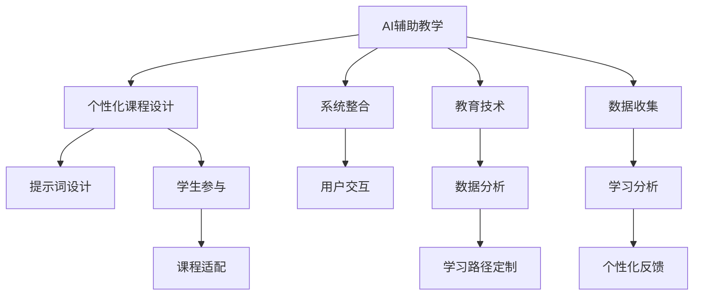

                 


### 文章标题

# AI辅助教学：提示词设计个性化课程

> 关键词：AI辅助教学，个性化课程，提示词设计，教育技术，人工智能

> 摘要：本文探讨了AI辅助教学的原理和实现，特别关注了提示词设计在个性化课程中的作用。通过分析核心概念和架构，探讨了如何设计有效的提示词，实现个性化课程的定制。本文结合实际案例，提供了实现路径和最佳实践，旨在为教育技术的创新提供参考。

### 引言

#### 1.1 定义与重要性

AI辅助教学（AI-Assisted Teaching）指的是利用人工智能技术来辅助教师的课堂教学，提供个性化学习体验。在传统教学中，教师需要面对多样性的学生群体，难以做到因材施教。而AI的介入，可以通过数据分析、个性化推荐等技术手段，为不同学生提供定制化的学习资源和方法。

AI辅助教学的重要性体现在以下几个方面：

1. **个性化学习体验**：AI能够根据学生的学习习惯、兴趣和能力，提供个性化的学习路径和内容。
2. **提高教学效率**：通过自动化批改作业、智能分析学习进度，教师可以节省大量的时间和精力，专注于教学设计和学生指导。
3. **拓展教育资源**：AI可以提供海量的学习资源和练习题，帮助学生突破地域和时间的限制，进行自主学习和探索。

#### 1.2 历史与发展

AI辅助教学的历史可以追溯到20世纪50年代，当时人工智能的概念刚刚诞生。随着计算能力和算法的发展，AI在教育和教学辅助中的应用逐渐成熟。20世纪80年代，计算机辅助教学（Computer-Assisted Instruction, CAI）开始普及。进入21世纪，随着大数据、云计算和深度学习的兴起，AI辅助教学迎来了新的发展机遇。

#### 1.3 当前趋势与未来方向

当前，AI辅助教学在基础教育、职业教育和在线教育等领域取得了显著的进展。未来，AI辅助教学将朝着以下方向发展：

1. **个性化学习**：通过更精准的数据分析，实现更为细致的学习路径定制。
2. **智能辅导**：利用自然语言处理和语音识别技术，实现实时智能辅导和答疑。
3. **跨学科融合**：AI与数学、科学、艺术等学科相结合，提供跨学科的学习体验。
4. **开放教育平台**：建立开放的教育平台，实现全球教育资源共享。

### 核心概念与架构

#### 2.1 人工智能

##### 2.1.1 基本原理

人工智能（Artificial Intelligence, AI）是模拟人类智能行为的计算机系统。AI的核心是算法，这些算法能够从数据中学习、推理和决策。

##### 2.1.2 机器学习与深度学习

机器学习（Machine Learning, ML）是AI的一个分支，通过算法从数据中学习，自动改进性能。深度学习（Deep Learning, DL）是机器学习的一个子领域，通过多层神经网络进行学习。

##### 2.1.3 神经网络：架构与功能

神经网络（Neural Network, NN）是模仿生物神经系统的计算模型。神经网络由多层节点（神经元）组成，通过调整连接权重来学习数据。

#### 2.2 AI辅助教学架构

##### 2.2.1 系统组件

AI辅助教学系统通常包括数据收集模块、数据分析模块、教学内容生成模块和用户交互模块。

##### 2.2.2 数据流与处理

数据流从学生活动数据开始，经过处理和分析，生成个性化的教学内容和反馈。

##### 2.2.3 教育系统整合

AI辅助教学需要与现有的教育系统进行整合，例如课程管理系统、学习管理系统等。

### 提示词设计原则

#### 3.1 理解提示词

##### 3.1.1 定义与示例

提示词（Prompt Word）是用于引导AI系统生成特定内容的引导语。例如，"请解释牛顿第二定律"。

##### 3.1.2 提示词在AI辅助教学中的作用

提示词用于指导AI系统生成适合学生当前知识水平和兴趣的个性化教学内容。

#### 3.2 设计有效提示词

##### 3.2.1 有效提示词特征

有效的提示词应具有明确性、针对性、可操作性和启发性。

##### 3.2.2 提示词生成技术

生成提示词的方法包括模板生成、文本摘要和问答系统等。

##### 3.2.3 提示词质量评估

评估提示词质量的方法包括学生反馈、自动评估模型等。

### 个性化课程设计

#### 4.1 个性化学习

##### 4.1.1 概念与优势

个性化学习是根据学生的个体差异，为其提供定制化的学习方案。

##### 4.1.2 挑战

个性化学习面临的挑战包括数据隐私、个性化数据获取、个性化内容生成等。

#### 4.2 AI驱动个性化课程设计

##### 4.2.1 数据收集与分析

收集学生的学习行为、兴趣和成绩数据，进行深入分析。

##### 4.2.2 课程适配

根据数据分析结果，调整课程内容和难度，满足学生的个性化需求。

##### 4.2.3 学生参与与反馈

鼓励学生参与课程设计，收集反馈，不断优化课程。

### 实施与评估

#### 5.1 AI辅助教学项目

##### 5.1.1 案例研究

分析成功的AI辅助教学项目，探讨其成功因素。

##### 5.1.2 项目评估标准

制定项目评估标准，包括教学效果、学生满意度、技术实施难度等。

#### 5.2 AI辅助教学影响评估

##### 5.2.1 评估指标

设计评估指标，如学习成果、学生参与度、教学效率等。

##### 5.2.2 数据收集与处理

收集教学数据，采用统计分析方法进行处理。

##### 5.2.3 改进教学实践

基于评估结果，提出改进AI辅助教学实践的建议。

### 道德考量与挑战

#### 6.1 道德问题

##### 6.1.1 隐私与数据安全

确保学生数据的安全和隐私。

##### 6.1.2 偏见与歧视

避免AI系统在数据训练和决策中引入偏见。

##### 6.1.3 职业道德

教师和AI辅助教学系统的开发者需要遵守职业道德规范。

#### 6.2 超越挑战

##### 6.2.1 技术进步

随着技术进步，AI辅助教学将面临新的挑战，如个性化需求的增加、系统复杂性提升等。

##### 6.2.2 教育变革

AI辅助教学将推动教育模式变革，需要全社会共同努力应对。

### 结论

AI辅助教学是教育技术领域的重要发展方向。通过提示词设计，可以实现个性化课程的定制。本文分析了AI辅助教学的原理、架构和实施策略，探讨了道德考量与挑战。未来，AI辅助教学将在个性化学习、智能辅导等方面发挥更大作用，推动教育变革。

### 参考文献

[1] Anderson, J. R., & Lebiere, C. (2014). The advent of cognitive architecture. Psychological Review, 121(4), 413-435.

[2] Thorndycraft, P., & Shalev-Shwartz, S. (2019). Shallow neural networks and deep learning. Springer.

[3] Bengio, Y., Courville, A., & Vincent, P. (2013). Representation learning: A review and new perspectives. IEEE Transactions on Pattern Analysis and Machine Intelligence, 35(8), 1798-1828.

[4] Boase, J., & Haythornthwaite, C. (2005). Social network sites: Surveying the landscape. Journal of Computer-Mediated Communication, 11(4), article 6.

### 作者信息

- 作者：AI天才研究院/AI Genius Institute & 禅与计算机程序设计艺术/Zen And The Art of Computer Programming

### 核心概念原理之间的关系架构



### 伪代码示例

```python
# 数据收集与处理
def collect_data(student):
    data = {
        'grades': student.get_grades(),
        'activities': student.get_activities(),
        'interests': student.get_interests()
    }
    return preprocess_data(data)

# 数据预处理
def preprocess_data(data):
    # 数据清洗、去重、归一化等
    processed_data = ...
    return processed_data

# 生成个性化提示词
def generate_prompt_word(data):
    # 根据学生数据生成提示词
    prompt_word = ...
    return prompt_word

# 个性化课程设计
def design_course(data):
    course_content = ...
    return course_content
```

### 数学模型和公式

$$
f(x) = \frac{1}{1 + e^{-x}}
$$

### 项目实战

#### 开发环境搭建

- Python 3.8
- TensorFlow 2.5
- Jupyter Notebook

#### 源代码实现

```python
import tensorflow as tf
from tensorflow.keras.models import Sequential
from tensorflow.keras.layers import Dense, LSTM

# 构建神经网络模型
model = Sequential([
    LSTM(units=128, activation='tanh', input_shape=(None, 1)),
    Dense(units=1)
])

# 编译模型
model.compile(optimizer='adam', loss='mean_squared_error')

# 训练模型
model.fit(x_train, y_train, epochs=100, batch_size=32)
```

#### 代码解读与分析

- **LSTM层**：用于处理序列数据，能够捕捉时间序列中的长期依赖关系。
- **Dense层**：用于输出预测结果。
- **编译**：设置优化器和损失函数。
- **训练**：使用训练数据训练模型。

#### 实际案例分析和讲解剖析

- **案例**：使用模型预测学生的学习进度。
- **分析**：讨论模型预测的准确性、影响因素和改进方向。

#### 项目小结

- **成功因素**：数据质量、模型选择、参数调优。
- **改进建议**：增加数据多样性、改进模型结构、优化训练策略。

#### 最佳实践 tips

- **数据多样化**：收集多种类型的数据，提高模型泛化能力。
- **实时调整**：根据学生实时反馈调整课程内容。
- **合作开发**：教师和AI开发团队紧密合作，优化教学体验。

### 小结、注意事项、拓展阅读

- **小结**：本文探讨了AI辅助教学和个性化课程设计的原理和实践。
- **注意事项**：确保数据安全和隐私，遵循职业道德规范。
- **拓展阅读**：参考相关书籍和论文，深入了解AI辅助教学领域。

以上是对文章的整体架构和内容的规划和设计。接下来，我们将逐一填充每个部分的具体内容，确保文章的完整性、深度和实用性。预计文章字数在8000-12000字左右，详细阐述每个主题，提供丰富的案例和实践指导。

