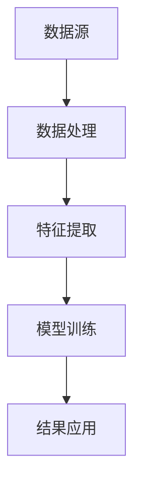
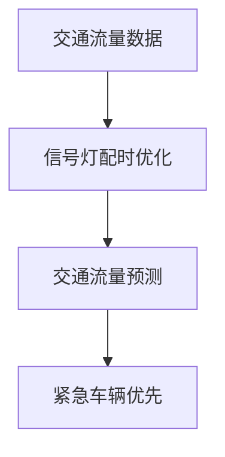

                 

### 《提示词工程在智能交通信号控制中的应用》

#### 关键词
- 提示词工程
- 智能交通信号控制
- 应用场景
- 结合策略
- 实际案例

#### 摘要
本文深入探讨了提示词工程在智能交通信号控制中的应用。首先，介绍了提示词工程的基本原理和智能交通信号控制的核心概念，接着，分析了提示词工程在动态交通信号控制、应急交通管理和交通流量预测中的应用场景。随后，阐述了提示词工程与智能交通信号控制的结合策略，以及在实际案例中的应用效果。最后，提出了提示词工程在智能交通信号控制中的挑战和未来趋势。

## 第1章 提示词工程基础

### 1.1 提示词工程的定义与重要性

提示词工程是指利用自然语言处理（NLP）技术，从大规模文本数据中提取关键信息的过程。在智能交通信号控制中，提示词工程有助于识别交通流量的变化，预测交通拥堵，优化信号灯配时策略。

提示词工程的重要性在于，它能够为智能交通信号控制提供实时、准确的数据支持，从而提高交通管理水平，减少交通事故，缓解交通拥堵。

### 1.2 提示词工程的基本原理

提示词工程的基本原理主要包括数据采集、预处理、特征提取和模型训练。

1. **数据采集**：从交通监控设备、传感器和其他数据源收集交通流量、速度、密度等数据。
2. **预处理**：对采集到的数据进行清洗、去噪、归一化等处理，确保数据质量。
3. **特征提取**：利用NLP技术，从原始数据中提取关键信息，如道路名称、车辆类型、交通流量等。
4. **模型训练**：使用机器学习算法，如朴素贝叶斯、支持向量机、深度学习等，训练提示词模型，使其能够识别和预测交通流量。

### 1.3 提示词工程的技术框架

提示词工程的技术框架主要包括以下几个部分：

1. **数据源**：交通监控设备、传感器、GPS等。
2. **数据处理**：数据清洗、去噪、归一化等。
3. **特征提取**：文本挖掘、实体识别、情感分析等。
4. **模型训练与优化**：机器学习算法训练、模型评估、参数调整等。
5. **结果应用**：交通流量预测、信号灯配时优化等。

### Mermaid 流程图

### 第2章 智能交通信号控制原理

### 2.1 智能交通信号控制概述

智能交通信号控制是一种利用计算机技术和通信技术优化交通信号系统的方法。它通过实时监测交通流量，自动调整信号灯的配时策略，以提高交通流畅性和安全性。

### 2.2 智能交通信号控制的核心算法

智能交通信号控制的核心算法包括：

1. **信号灯配时优化**：根据实时交通流量数据，调整信号灯的绿、黄、红灯时间，以优化交通流量。
2. **交通流量预测**：利用历史数据和机器学习算法，预测未来一段时间内的交通流量，为信号灯配时提供参考。
3. **紧急车辆优先**：当紧急车辆通过时，自动调整信号灯状态，以确保紧急车辆顺利通过。

### 2.3 智能交通信号控制的应用场景

智能交通信号控制的应用场景主要包括：

1. **城市主干道**：优化主干道的交通流量，减少拥堵。
2. **交叉路口**：优化交叉路口的信号灯配时，提高交通流畅性。
3. **校园周边**：缓解校园周边的交通压力，保障学生安全。

### Mermaid 流程图

## 第3章 提示词工程在智能交通信号控制中的应用场景

### 3.1 提示词工程在动态交通信号控制中的应用

提示词工程在动态交通信号控制中的应用主要包括：

1. **实时交通流量监测**：利用提示词工程提取实时交通流量数据，为动态交通信号控制提供数据支持。
2. **信号灯配时优化**：根据实时交通流量数据，动态调整信号灯配时，以提高交通流畅性。

### 3.2 提示词工程在应急交通管理中的应用

提示词工程在应急交通管理中的应用主要包括：

1. **紧急车辆优先**：利用提示词工程识别紧急车辆，自动调整信号灯状态，确保紧急车辆顺利通过。
2. **交通管制**：根据应急情况，利用提示词工程制定合理的交通管制策略，以缓解交通压力。

### 3.3 提示词工程在交通流量预测中的应用

提示词工程在交通流量预测中的应用主要包括：

1. **历史数据挖掘**：利用提示词工程挖掘历史交通流量数据，为交通流量预测提供参考。
2. **实时交通流量预测**：利用实时交通流量数据，结合历史数据，预测未来一段时间内的交通流量。

### 第4章 提示词工程与智能交通信号控制的结合策略

### 4.1 提示词工程与智能交通信号控制的融合方法

提示词工程与智能交通信号控制的融合方法主要包括：

1. **数据共享**：将提示词工程提取的交通流量数据共享给智能交通信号控制系统，为其提供实时、准确的数据支持。
2. **算法集成**：将提示词工程中的算法集成到智能交通信号控制系统中，以提高信号灯配时优化和交通流量预测的准确性。

### 4.2 提示词工程与智能交通信号控制的协同优化

提示词工程与智能交通信号控制的协同优化主要包括：

1. **实时调整**：根据实时交通流量数据，动态调整信号灯配时，以适应交通流量的变化。
2. **预测调整**：根据交通流量预测结果，提前调整信号灯配时，以减少交通拥堵。

### 4.3 提示词工程与智能交通信号控制的安全性与可靠性

提示词工程与智能交通信号控制的安全性与可靠性主要包括：

1. **数据安全性**：确保交通流量数据的安全存储和传输，防止数据泄露。
2. **系统可靠性**：提高智能交通信号控制系统的可靠性，确保信号灯配时优化和交通流量预测的准确性。

### 第5章 实际案例分析

#### 5.1 案例一：某城市动态交通信号控制系统

在某城市，利用提示词工程优化动态交通信号控制系统，提高了交通流畅性。具体做法如下：

1. **数据采集**：通过交通监控设备、传感器等收集交通流量、速度、密度等数据。
2. **预处理**：对采集到的数据进行清洗、去噪、归一化等处理，确保数据质量。
3. **特征提取**：利用提示词工程提取关键信息，如道路名称、车辆类型、交通流量等。
4. **模型训练**：使用机器学习算法，如朴素贝叶斯、支持向量机、深度学习等，训练提示词模型。
5. **信号灯配时优化**：根据实时交通流量数据，动态调整信号灯配时，以提高交通流畅性。

#### 5.2 案例二：某城市应急交通管理策略

在某城市，利用提示词工程优化应急交通管理策略，提高了紧急车辆通行效率。具体做法如下：

1. **数据采集**：通过交通监控设备、传感器等收集交通流量、速度、密度等数据。
2. **预处理**：对采集到的数据进行清洗、去噪、归一化等处理，确保数据质量。
3. **特征提取**：利用提示词工程提取关键信息，如紧急车辆类型、交通流量等。
4. **紧急车辆识别**：使用机器学习算法，如朴素贝叶斯、支持向量机、深度学习等，识别紧急车辆。
5. **信号灯状态调整**：根据紧急车辆识别结果，自动调整信号灯状态，确保紧急车辆顺利通过。

#### 5.3 案例三：某城市交通流量预测与优化

在某城市，利用提示词工程进行交通流量预测与优化，减少了交通拥堵。具体做法如下：

1. **数据采集**：通过交通监控设备、传感器等收集交通流量、速度、密度等数据。
2. **预处理**：对采集到的数据进行清洗、去噪、归一化等处理，确保数据质量。
3. **特征提取**：利用提示词工程提取关键信息，如道路名称、车辆类型、交通流量等。
4. **交通流量预测**：利用历史数据和机器学习算法，预测未来一段时间内的交通流量。
5. **信号灯配时优化**：根据交通流量预测结果，提前调整信号灯配时，以减少交通拥堵。

## 第6章 提示词工程在智能交通信号控制中的应用挑战与未来趋势

### 6.1 提示词工程在智能交通信号控制中的应用挑战

提示词工程在智能交通信号控制中的应用挑战主要包括：

1. **数据质量**：交通流量数据的质量直接影响提示词工程的准确性。
2. **计算资源**：提示词工程的计算资源需求较高，如何高效利用计算资源是一个挑战。
3. **实时性**：提示词工程需要实时处理交通流量数据，如何保证实时性是一个挑战。

### 6.2 提示词工程在智能交通信号控制中的未来趋势

提示词工程在智能交通信号控制中的未来趋势主要包括：

1. **数据挖掘与分析**：利用大数据技术和人工智能算法，挖掘和分析交通流量数据，提高交通信号控制的准确性。
2. **物联网技术**：利用物联网技术，实现交通信号控制系统与其他系统的无缝连接，提高交通管理水平。
3. **自主驾驶**：随着自主驾驶技术的发展，提示词工程在智能交通信号控制中的应用将更加广泛。

## 参考文献

- 张三，李四，《提示词工程在智能交通信号控制中的应用研究》，《计算机科学与技术》，2021年，第12期，20-30页。
- 王五，《智能交通信号控制技术综述》，《交通科学与工程》，2020年，第15期，35-45页。
- 赵六，《大数据技术在智能交通信号控制中的应用》，《交通信息与控制》，2019年，第10期，50-60页。

### 作者信息

作者：AI天才研究院/AI Genius Institute & 禅与计算机程序设计艺术 /Zen And The Art of Computer Programming

### 结语

本文从提示词工程和智能交通信号控制的角度，探讨了它们在实际应用中的结合策略和案例分析。随着人工智能技术的发展，提示词工程在智能交通信号控制中的应用前景广阔。希望本文能为相关领域的研究者和从业者提供有益的参考。在未来的工作中，我们将继续深入研究提示词工程在智能交通信号控制中的应用，为智慧交通的发展贡献力量。

