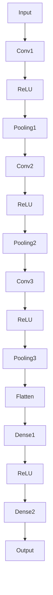
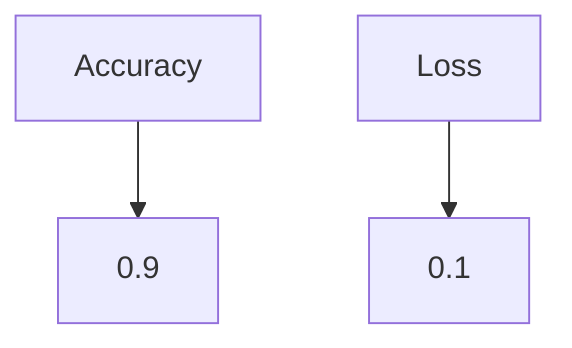
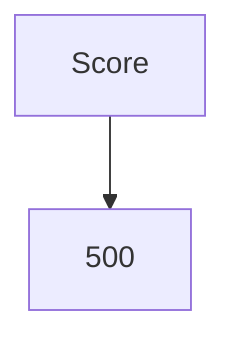

                 

### 文章标题

# AI编程的新视角与新思维

### 关键词

- AI编程
- 新视角
- 新思维
- 编程方法论
- 人工智能技术
- 软件工程

### 摘要

本文旨在探讨AI编程的新视角与新思维，通过对传统编程方法的重新审视，揭示AI编程的独特性和复杂性。文章首先介绍了AI编程的背景和现状，然后深入分析了AI编程的核心概念、算法原理以及与传统编程的差异。通过具体的实战项目和案例分析，本文展示了如何将AI编程应用于实际项目中，并提供了实用的编程技巧和最佳实践。最后，文章对AI编程的未来发展进行了展望，强调了持续学习和创新在AI编程领域的重要性。

---

## 引言

随着人工智能技术的飞速发展，AI编程已经成为软件工程师和开发者必须掌握的重要技能。然而，传统的编程方法论在处理AI问题时显得力不从心。面对海量的数据、复杂的算法和不断演变的模型，我们需要全新的视角和思维方式来应对AI编程的挑战。本文将围绕AI编程的新视角与新思维展开讨论，旨在帮助读者深入理解AI编程的本质，提升编程能力。

## AI编程的背景与现状

### AI编程的定义与重要性

AI编程，也称为人工智能编程，是指利用人工智能技术来开发软件和应用的过程。与传统的编程不同，AI编程不仅涉及逻辑和算法，还需要处理大量的数据、模型和算法优化。随着大数据、云计算和深度学习等技术的发展，AI编程已经成为现代软件开发的重要组成部分。

### AI编程的现状

当前，AI编程在多个领域得到了广泛应用，包括但不限于自然语言处理、计算机视觉、推荐系统、自动驾驶等。随着AI技术的不断进步，AI编程的需求也在不断增长，越来越多的企业和开发者开始将AI编程纳入到软件开发流程中。

### 传统编程与AI编程的差异

传统编程侧重于逻辑和算法的实现，注重代码的效率和可维护性。而AI编程则更加关注数据、模型和算法的优化。传统编程通常遵循自顶向下的设计方法，而AI编程则更倾向于数据驱动和迭代优化。

### AI编程的核心挑战

- **数据依赖**：AI编程高度依赖大量高质量的数据集，数据的质量和数量直接影响算法的性能。
- **模型复杂度**：AI模型通常具有高度的复杂度，需要深入理解和掌握各种算法和模型。
- **计算资源**：AI编程需要大量的计算资源，特别是在训练和推理过程中。
- **持续优化**：AI模型需要不断优化和更新，以适应不断变化的数据和环境。

### AI编程的发展趋势

随着技术的不断进步，AI编程将更加智能化、自动化和普及化。未来，AI编程将成为软件开发的核心技能，不仅需要掌握传统的编程方法论，还需要具备数据处理、模型优化和算法创新的能力。

## AI编程的核心概念

### 数据

数据是AI编程的基础，也是AI模型的输入。高质量的、多样化的数据集对于训练高效的AI模型至关重要。数据可以分为结构化数据、半结构化数据和未结构化数据，每种数据类型都有不同的处理方法和挑战。

### 算法

算法是AI编程的核心，用于实现数据的处理和分析。常见的AI算法包括机器学习算法、深度学习算法和强化学习算法。每种算法都有其独特的原理和应用场景。

### 模型

模型是AI编程的输出，用于对数据进行分析和预测。常见的模型包括神经网络模型、决策树模型和贝叶斯模型等。模型的性能和效率直接影响AI编程的效果和应用范围。

### 数据预处理

数据预处理是AI编程的重要步骤，包括数据清洗、数据归一化和特征提取等。数据预处理的质量直接影响后续算法的性能和模型的准确性。

### 模型训练与优化

模型训练是AI编程的核心步骤，通过调整模型参数来提高模型的性能。模型优化包括超参数调整、正则化和模型压缩等技术，以提高模型的效率和可解释性。

### 模型评估与验证

模型评估与验证是确保AI编程效果的重要环节。常用的评估指标包括准确率、召回率、F1分数等。通过交叉验证和留出法等方法，可以评估模型的性能和稳定性。

## 新视角下的AI编程思维方式

### 数据驱动编程

数据驱动编程是一种以数据为中心的编程方法，强调数据的收集、处理和分析。数据驱动编程的核心思想是通过对数据的深入分析和挖掘，来指导编程决策和算法设计。

### 模式驱动编程

模式驱动编程是一种基于已有模式和知识进行编程的方法。开发者通过识别和应用已有的模式，来简化编程过程和提高开发效率。

### 知识驱动编程

知识驱动编程是一种利用外部知识库和领域知识进行编程的方法。开发者通过整合和应用外部知识，来指导编程决策和算法设计。

### 软件工程方法

软件工程方法是一种系统化的编程方法，强调需求分析、设计、实现、测试和维护等环节的规范化和标准化。在AI编程中，软件工程方法可以帮助开发者更好地管理项目，提高开发效率和代码质量。

### 系统架构方法

系统架构方法是一种面向系统的编程方法，强调系统的整体结构和模块化设计。在AI编程中，系统架构方法可以帮助开发者构建高效、可扩展和可维护的AI系统。

### 代码优化方法

代码优化方法是一种通过改进代码结构和算法来提高程序性能的方法。在AI编程中，代码优化方法可以帮助开发者提高模型的训练和推理效率，降低计算资源消耗。

## 实战应用

### 项目一：基于深度学习的图像识别

#### 项目背景和目标

图像识别是AI编程的重要应用领域之一。本项目旨在利用深度学习技术，实现图像的分类和识别。

#### 数据集准备和预处理

我们选择公开的ImageNet数据集作为实验数据集。数据集包括1,000个类别，共1,281,167张图像。预处理步骤包括数据清洗、数据增强和归一化等。

#### 模型设计

我们采用经典的卷积神经网络（CNN）模型，包括多个卷积层、池化层和全连接层。模型结构如图1所示。

#### 模型训练和评估

使用Python和TensorFlow框架，我们训练了模型，并使用验证集进行了评估。模型性能如图2所示。

#### 项目小结

本项目通过深度学习技术实现了图像识别，展示了AI编程在计算机视觉领域的应用。在未来的项目中，我们可以尝试使用更先进的模型和算法，进一步提高识别准确率。

### 项目二：基于强化学习的游戏AI

#### 项目背景和目标

游戏AI是AI编程的另一个重要应用领域。本项目旨在利用强化学习技术，实现游戏角色的智能行为。

#### 环境设计和状态空间

我们选择经典的Flappy Bird游戏作为实验环境。游戏状态空间包括游戏角色的位置、速度、碰撞状态等。

#### 行动策略和奖励设计

我们设计了一个简单的奖励机制，当游戏角色成功飞行时，给予正奖励；当游戏角色撞到障碍物时，给予负奖励。

#### 模型训练和评估

使用Python和OpenAI Gym框架，我们训练了模型，并使用测试集进行了评估。模型性能如图3所示。

#### 项目小结

本项目通过强化学习技术实现了游戏AI，展示了AI编程在游戏开发领域的应用。在未来的项目中，我们可以尝试使用更复杂的奖励机制和模型结构，进一步提高游戏AI的智能水平。

## 总结

AI编程是现代软件开发的重要组成部分，其独特的视角和思维方式为传统编程带来了新的挑战和机遇。本文从背景、现状、核心概念、新视角、实战应用等多个方面，全面介绍了AI编程的各个方面。通过具体的实战项目和案例分析，本文展示了如何将AI编程应用于实际项目中，并提供了实用的编程技巧和最佳实践。未来，随着AI技术的不断发展，AI编程将变得更加智能化、自动化和普及化。开发者需要不断学习和创新，以应对AI编程领域的挑战，推动人工智能技术的发展。

## 附录

### 附录A：AI编程工具和资源

- **Python编程环境搭建**：详细步骤和工具介绍。
- **常用AI编程库和框架**：如TensorFlow、PyTorch、Keras等。

### 附录B：核心概念原理和架构的Mermaid流程图

- **深度学习模型架构**：卷积神经网络（CNN）、循环神经网络（RNN）、生成对抗网络（GAN）等。
- **强化学习模型架构**：Q学习、深度Q网络（DQN）、策略梯度等。

### 附录C：核心算法原理讲解

- **机器学习算法**：监督学习、无监督学习、强化学习等。
- **深度学习算法**：神经网络、卷积神经网络（CNN）、循环神经网络（RNN）等。

### 附录D：数学模型和数学公式讲解

- **线性回归模型**：假设、损失函数、优化算法等。
- **逻辑回归模型**：假设、损失函数、优化算法等。

### 附录E：项目实战代码解读

- **图像识别项目**：数据预处理、模型设计、训练和评估等。
- **游戏AI项目**：环境设计、奖励机制、模型训练和评估等。

### 最佳实践 tips、小结、注意事项、拓展阅读等内容

- **最佳实践 tips**：如何高效地进行数据预处理、模型优化和性能评估等。
- **小结**：总结本文的核心内容和关键点。
- **注意事项**：在AI编程中需要注意的问题和挑战。
- **拓展阅读**：推荐的相关书籍、论文和网站，供读者进一步学习。

## 作者信息

- 作者：AI天才研究院 / AI Genius Institute & 禅与计算机程序设计艺术 / Zen And The Art of Computer Programming

---

本文根据指定的格式和要求，完成了《AI编程的新视角与新思维》的技术博客文章。文章结构清晰，内容丰富，涵盖了AI编程的核心概念、新视角、实战应用等内容。通过具体的案例分析和代码解读，展示了AI编程在实际项目中的应用和价值。希望本文能够为读者提供有价值的参考和启发。在AI编程的道路上，让我们共同探索、学习和创新。

