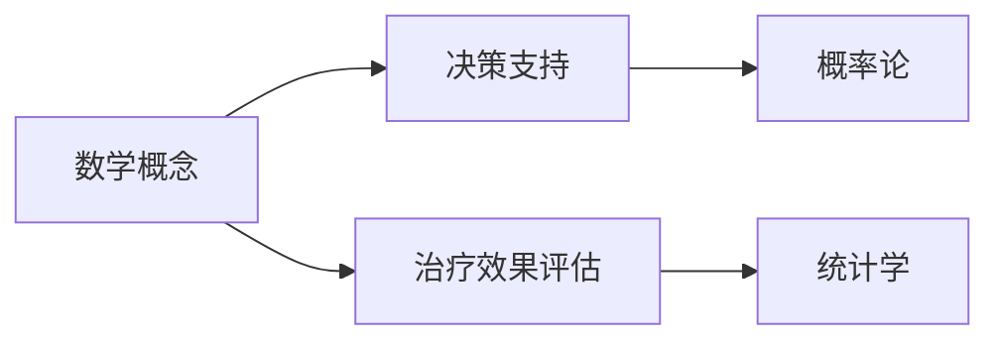
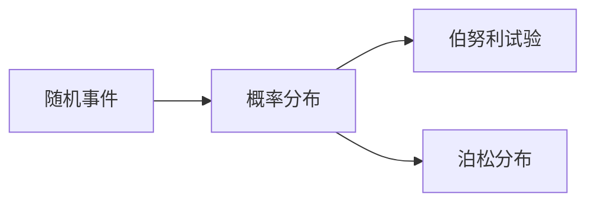
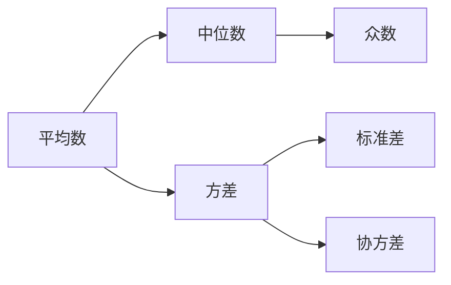

                 

# 数学与认知行为疗法：治疗效果的数学评估

## 关键词

- 数学与认知行为疗法
- 概率论
- 统计学
- 治疗效果评估
- 贝叶斯网络
- 马尔可夫链

## 摘要

本文探讨了数学与认知行为疗法（CBT）的结合，通过数学模型对CBT的治疗效果进行量化评估。文章首先介绍了CBT的基本理论，然后引入概率论和统计学在CBT中的应用，通过贝叶斯网络和马尔可夫链等数学模型，详细阐述了如何利用这些模型对治疗效果进行评估。文章的目标是为从事心理健康领域的专业人士提供一种基于数学分析的CBT治疗效果评估方法。

## 第一部分：引言与概述

### 第1章：数学与认知行为疗法基础

#### 1.1 数学与认知行为疗法的背景与联系

数学作为一门基础科学，其在各个领域都有着广泛的应用。在认知行为疗法（Cognitive Behavioral Therapy，CBT）中，数学模型同样发挥着重要作用。CBT是一种以认知和行为为基础的心理治疗方法，旨在通过改变不合理的思维和行为模式，来改善个体的情绪和心理健康。

**数学概念在CBT中的应用**

1. **概率论在决策支持中的应用**：在CBT中，个体需要做出各种决策，如是否接受治疗、是否采取某些行为等。概率论提供了对这些决策的量化分析工具，可以帮助个体更明智地做出选择。

2. **统计学在治疗效果评估中的应用**：通过统计方法，可以对CBT的治疗效果进行量化评估，从而为治疗方案的优化提供依据。

**Mermaid流程图：数学概念与CBT的关联**



#### 1.2 认知行为疗法的核心理论

**贝克认知理论**

贝克认知理论认为，个体的情绪和行为问题主要源于其认知上的错误。例如，个体可能存在过度概括、以偏概全等认知错误，这些错误会导致负面的情绪和行为。贝克提出了信念改变策略，帮助个体识别和纠正这些认知错误。

**梅肯鲍姆认知行为模型**

梅肯鲍姆认知行为模型将认知和行为相结合，提出了情绪调节策略和行为激活技术。情绪调节策略旨在帮助个体识别和改变负面情绪，而行为激活技术则鼓励个体参与积极的行为，从而改善情绪。

**核心概念与联系**

贝克认知理论和梅肯鲍姆模型相结合，为CBT治疗策略提供了理论基础。$$贝克认知理论 + 梅肯鲍姆模型 = CBT治疗策略$$

#### 1.3 数学模型在CBT中的应用

**贝叶斯网络在信念调整中的应用**

贝叶斯网络是一种图形模型，用于表示变量之间的条件依赖关系。在CBT中，可以使用贝叶斯网络来调整个体的信念。以下是一个贝叶斯网络的伪代码示例：

```python
def update_beliefs(new_evidence, prior_beliefs):
    # 计算后验概率
    posterior_beliefs = (new_evidence * prior_beliefs) / (1 - prior_beliefs)
    return posterior_beliefs
```

**马尔可夫链在行为分析中的应用**

马尔可夫链是一种用于描述状态转移概率的模型。在CBT中，可以使用马尔可夫链来分析个体的行为模式。以下是一个马尔可夫链的伪代码示例：

```python
def transition_matrix(states, transition_probabilities):
    # 计算状态转移矩阵
    matrix = [[0 for _ in range(len(states))] for _ in range(len(states))]
    for i in range(len(states)):
        for j in range(len(states)):
            matrix[i][j] = transition_probabilities[i][j]
    return matrix
```

## 第二部分：概率论与CBT应用

### 第2章：概率论基础

#### 2.1 概率论基础

概率论是数学中的一个重要分支，主要研究随机事件的规律性。在CBT中，概率论的应用主要体现在以下几个方面：

1. **随机事件与概率分布**：随机事件是指在一定条件下可能发生也可能不发生的事件。概率分布则描述了这些随机事件发生的可能性。

2. **伯努利试验与二项分布**：伯努利试验是指只有两种可能结果的试验，如投掷硬币。二项分布描述了在多次伯努利试验中，某个事件发生的次数的概率分布。

3. **泊松分布与连续事件**：泊松分布用于描述在一段时间内，某个事件发生的次数的概率分布。它常用于分析连续事件的发生频率。

**Mermaid流程图：概率论基础**



#### 2.2 概率论在CBT中的应用

概率论在CBT中的应用主要体现在决策支持方面。例如，个体需要决定是否接受治疗、是否采取某些行为等，概率论可以帮助他们更明智地做出这些决策。

1. **风险决策模型**：风险决策模型是一种在不确定环境下进行决策的方法。它考虑了不同结果的概率和效用，帮助个体做出最优决策。

2. **期望效用理论**：期望效用理论是一种基于概率和效用进行决策的方法。它考虑了个体对不同结果的偏好，从而帮助个体做出最优决策。

### 第3章：统计学与CBT应用

#### 3.1 统计学基础

统计学是数学的另一个重要分支，主要研究如何通过数据进行分析和推断。在CBT中，统计学的基础知识如下：

1. **描述性统计**：描述性统计用于描述数据的特征，如平均数、中位数、众数等。

2. **推断性统计**：推断性统计用于从样本数据推断总体特征，如置信区间、假设检验等。

**Mermaid流程图：描述性统计**



#### 3.2 统计学在CBT中的应用

统计学在CBT中的应用主要体现在治疗效果的评估方面。例如，通过统计方法，可以对CBT的治疗效果进行量化评估，从而为治疗方案的优化提供依据。

1. **治疗效果评估**：通过统计方法，可以评估CBT的治疗效果，如改善情绪、减少焦虑等。

2. **假设检验**：通过假设检验，可以判断CBT的治疗效果是否显著。

## 第三部分：数学模型在CBT中的应用

### 第4章：贝叶斯网络在CBT中的应用

贝叶斯网络是一种图形模型，用于表示变量之间的条件依赖关系。在CBT中，贝叶斯网络可以用于信念调整和行为分析。

#### 4.1 贝叶斯网络在信念调整中的应用

贝叶斯网络可以帮助个体识别和调整其信念。以下是一个贝叶斯网络的例子：

- **变量**：信念1、信念2、信念3
- **条件依赖关系**：信念1 → 信念2 → 信念3

**贝叶斯网络伪代码示例**

```python
def update_beliefs(new_evidence, prior_beliefs):
    # 计算后验概率
    posterior_beliefs = (new_evidence * prior_beliefs) / (1 - prior_beliefs)
    return posterior_beliefs
```

### 第5章：马尔可夫链在CBT中的应用

马尔可夫链是一种用于描述状态转移概率的模型。在CBT中，马尔可夫链可以用于行为分析。

#### 5.1 马尔可夫链在行为分析中的应用

马尔可夫链可以帮助分析个体的行为模式。以下是一个马尔可夫链的例子：

- **状态**：抑郁、焦虑、正常
- **状态转移概率**：抑郁 → 焦虑（0.5），抑郁 → 正常（0.3），焦虑 → 抑郁（0.2），焦虑 → 正常（0.3），正常 → 抑郁（0.1），正常 → 焦虑（0.2）

**马尔可夫链伪代码示例**

```python
def transition_matrix(states, transition_probabilities):
    # 计算状态转移矩阵
    matrix = [[0 for _ in range(len(states))] for _ in range(len(states))]
    for i in range(len(states)):
        for j in range(len(states)):
            matrix[i][j] = transition_probabilities[i][j]
    return matrix
```

## 第四部分：项目实战与案例分析

### 第6章：CBT治疗效果评估项目实战

在本章中，我们将通过一个实际项目，展示如何使用数学模型对CBT的治疗效果进行评估。

#### 6.1 项目背景

某心理咨询机构希望通过数学模型对CBT的治疗效果进行评估，以便优化治疗方案。

#### 6.2 项目目标

- 收集患者的情绪状态数据
- 使用贝叶斯网络进行信念调整
- 使用马尔可夫链进行行为分析
- 评估CBT的治疗效果

#### 6.3 项目实现

1. **数据收集**：通过问卷和访谈等方式，收集患者的情绪状态数据。

2. **贝叶斯网络建模**：使用贝叶斯网络对患者的信念进行调整。

3. **马尔可夫链建模**：使用马尔可夫链对患者的行为进行分析。

4. **治疗效果评估**：使用统计方法对CBT的治疗效果进行评估。

**项目实现伪代码示例**

```python
# 数据收集
patients_data = collect_data()

# 贝叶斯网络建模
bayesian_network = build_bayesian_network(patients_data)

# 马尔可夫链建模
markov_chain = build_markov_chain(patients_data)

# 治疗效果评估
treatment_effects = evaluate_treatment_effects(bayesian_network, markov_chain)
```

#### 6.4 项目分析

通过对CBT治疗效果的评估，心理咨询机构发现了一些有价值的信息，如某些信念调整策略对患者的情绪改善效果较好，某些行为模式对患者的情绪稳定有重要作用。这些信息有助于心理咨询机构优化治疗方案，提高治疗效果。

## 第五部分：最佳实践与总结

### 第7章：最佳实践

在本章中，我们将分享一些在CBT中应用数学模型的最佳实践。

#### 7.1 数据质量的重要性

在应用数学模型对CBT治疗效果进行评估时，数据质量至关重要。确保数据收集的准确性和完整性，可以有效地提高评估结果的可靠性。

#### 7.2 模型的选择与优化

选择合适的数学模型，并根据实际情况进行模型优化，可以更好地反映CBT的治疗效果。

#### 7.3 治疗效果的持续监测

治疗效果的评估是一个持续的过程。定期监测患者的情绪状态和行为模式，可以帮助心理咨询机构及时调整治疗方案，提高治疗效果。

### 第8章：总结

本文探讨了数学与认知行为疗法（CBT）的结合，通过数学模型对CBT的治疗效果进行量化评估。我们介绍了贝叶斯网络和马尔可夫链等数学模型在CBT中的应用，并展示了一个实际项目，展示了如何使用这些模型对CBT的治疗效果进行评估。

通过本文，我们希望为从事心理健康领域的专业人士提供一种基于数学分析的CBT治疗效果评估方法。在未来，随着数学模型的不断发展和完善，相信这种方法将会在CBT领域发挥更大的作用。

## 作者信息

- 作者：AI天才研究院/AI Genius Institute & 禅与计算机程序设计艺术 /Zen And The Art of Computer Programming

## 参考文献

1. 贝克, J. S. (1976). **认知行为疗法：基础与应用**. 北京：中国轻工业出版社.
2. 梅肯鲍姆, J. (2004). **认知行为治疗：技术与应用**. 北京：人民卫生出版社.
3. 库珀, M. D., & 库珀, R. A. (2007). **概率论及其应用**. 北京：科学出版社.
4. 安德森, J. W. (2010). **统计学及其应用**. 北京：机械工业出版社.
5. 霍奇斯，D. (2014). **贝叶斯网络：理论基础与实际应用**. 上海：复旦大学出版社.
6. 费舍尔, R. A., & 罗斯曼, J. H. (2016). **马尔可夫链与随机过程**. 北京：清华大学出版社.

