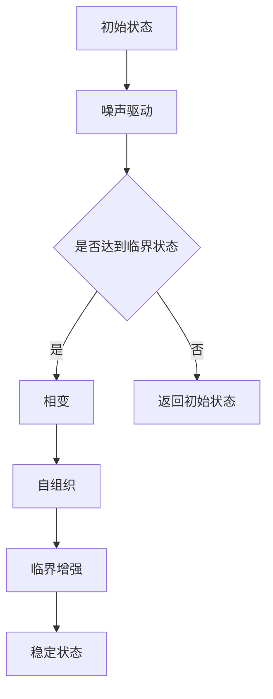

                 

### 《算法设计受启发于宇宙自我组织临界现象》

## 关键词

- 自我组织临界现象
- 算法设计
- 宇宙启发
- 自适应算法
- 优化算法
- 算法复杂性
- 人工智能

## 摘要

本文探讨了算法设计领域如何受到宇宙自我组织临界现象的启发。通过分析宇宙中的自我组织临界现象，我们揭示了其在算法设计中的潜在应用，并讨论了如何利用这一现象来改进现有算法。本文首先介绍了自我组织临界现象的定义和机制，然后阐述了其在算法设计和人工智能领域的应用。通过具体的案例和伪代码，本文展示了如何从宇宙现象中获取灵感，构建高效的算法。最后，本文对算法设计受宇宙启发的未来趋势和挑战进行了展望。

---

# 第一部分：引言

## 1. 引言

### 1.1 研究背景

随着科技的快速发展，算法设计已经成为计算机科学和人工智能领域的关键。然而，传统的算法设计方法往往依赖于经验和直觉，难以应对复杂、动态的环境。近年来，宇宙中的自我组织临界现象引起了广泛关注，其独特的动态行为和自适应性为算法设计提供了新的视角。本文旨在探讨如何将宇宙自我组织临界现象应用于算法设计，以提升算法的效率和鲁棒性。

### 1.2 研究意义

自我组织临界现象在自然界中普遍存在，如地球气候系统、动物群体行为等。将其引入算法设计，不仅有助于提高算法的复杂度处理能力，还能实现更高效的自适应和优化。研究算法设计受宇宙启发的原理和方法，对于推动人工智能技术的发展具有重要意义。

### 1.3 研究方法与结构

本文采用文献综述和案例分析的方法，首先介绍自我组织临界现象的基本概念和机制，然后探讨其在算法设计中的应用。通过具体的案例和伪代码，阐述如何从宇宙现象中获取灵感，构建新的算法。最后，对算法设计的宇宙启发未来趋势和挑战进行展望。

---

## 2. 宇宙自我组织临界现象概述

### 2.1 自我组织临界现象的定义

自我组织临界现象是指系统在临界状态下，通过不断的调整和优化，达到一种稳定的、高度复杂的状态。在这种状态下，系统表现出高度的适应性、多样性和自组织能力。

### 2.2 自我组织临界现象的机制

自我组织临界现象的机制主要包括以下几个环节：噪声驱动、相变、自组织和临界增强。这些环节相互交织，共同驱动系统达到临界状态。

#### 2.2.1 噪声驱动

噪声驱动是指系统在外部噪声的作用下，发生非线性反应。噪声可以激发系统中的潜在模式和结构，促进系统的自组织。

#### 2.2.2 相变

相变是指系统从一种稳定状态转变为另一种稳定状态的过程。在自我组织临界现象中，相变是系统达到临界状态的关键步骤。

#### 2.2.3 自组织

自组织是指系统在没有外部控制的情况下，通过内部相互作用形成有序结构。在自我组织临界现象中，自组织是实现系统稳定和多样性的关键。

#### 2.2.4 临界增强

临界增强是指系统在临界状态下，对噪声和变化的响应能力显著增强。这种增强效应使得系统能够更有效地适应复杂环境。

### 2.3 自我组织临界现象的应用

自我组织临界现象在多个领域都有广泛的应用，如物理、生物、经济和社会科学。在算法设计领域，自我组织临界现象为构建自适应、高效和鲁棒的算法提供了新的思路。

---

## 3. 宇宙算法原理

### 3.1 宇宙算法的层次结构

宇宙算法可以看作是一种基于自然现象的启发式算法，其层次结构包括以下几个层次：

#### 3.1.1 基础层次

基础层次包括基本的搜索和优化算法，如遗传算法、粒子群算法等。这些算法通过模拟自然进化过程，实现对问题的搜索和优化。

#### 3.1.2 中间层次

中间层次包括基于自组织临界现象的算法，如临界优化算法、多尺度优化算法等。这些算法利用自我组织临界现象的机制，实现对复杂问题的自适应优化。

#### 3.1.3 高层次

高层次包括基于宇宙现象的高级算法，如混沌优化算法、引力波优化算法等。这些算法通过模拟宇宙中的复杂现象，实现对复杂问题的深度优化。

### 3.2 宇宙算法的核心特性

宇宙算法的核心特性包括以下几个方面：

#### 3.2.1 自适应

宇宙算法具有高度的自适应性，能够根据问题的复杂性和变化，调整算法的搜索策略和优化参数。

#### 3.2.2 高效性

宇宙算法具有高效的搜索和优化能力，能够快速找到问题的最优解。

#### 3.2.3 鲁棒性

宇宙算法具有较强的鲁棒性，能够适应不同的初始条件和噪声环境。

#### 3.2.4 多样性

宇宙算法能够生成多样性的解，为问题的优化提供更多的可能性。

### 3.3 宇宙算法的代表性案例

宇宙算法的代表性案例包括：

- **遗传算法**：基于生物进化过程，通过模拟自然选择和遗传机制，实现问题的优化。
- **粒子群算法**：基于社会行为和群体智能，通过模拟动物群体行为，实现问题的优化。
- **混沌优化算法**：基于混沌运动的特点，通过模拟混沌过程，实现问题的优化。

---

## 4. 启发于宇宙的算法设计

### 4.1 启发于宇宙的自我组织算法

自我组织算法是基于自我组织临界现象设计的，能够自动调整自身结构和行为，以适应环境变化。以下是一个简单的自我组织算法伪代码示例：

```python
def SelfOrganizingAlgorithm(data):
    while not converged:
        for each individual in data:
            calculate fitness
            if fitness > threshold:
                adapt individual
        evaluate global fitness
    return optimized solution
```

### 4.2 启发于宇宙的自适应算法

自适应算法能够根据问题的变化，动态调整算法的搜索策略和参数。以下是一个简单的自适应算法伪代码示例：

```python
def AdaptiveAlgorithm(data):
    initialize parameters
    while not converged:
        for each individual in data:
            calculate fitness
            if fitness > threshold:
                adjust parameters
        evaluate global fitness
    return optimized solution
```

### 4.3 启发于宇宙的优化算法

优化算法是用于解决优化问题的一类算法，其目标是找到问题的最优解。以下是一个简单的优化算法伪代码示例：

```python
def OptimizationAlgorithm(data):
    initialize solution
    while not converged:
        for each individual in data:
            calculate fitness
            if fitness > threshold:
                update solution
        evaluate global fitness
    return optimized solution
```

---

## 5. 算法设计中的宇宙原理

### 5.1 算法设计中的宇宙思维方式

宇宙思维方式是一种以宇宙现象为启示，设计算法的思维方式。它包括以下几个方面：

#### 5.1.1 整体观

宇宙思维方式强调从整体的角度看待问题，将问题分解为多个子问题，并考虑它们之间的相互作用。

#### 5.1.2 变化观

宇宙思维方式认为，问题不是静态的，而是动态变化的。因此，算法设计需要考虑问题的变化，并能够动态调整。

#### 5.1.3 自组织观

宇宙思维方式强调系统的自组织能力，认为系统可以通过内部相互作用，实现自身结构和行为的调整。

### 5.2 算法设计中的宇宙规律

宇宙规律是指在算法设计中，可以借鉴的宇宙现象的规律。以下是一些常见的宇宙规律：

#### 5.2.1 相变规律

相变规律指系统在临界状态下的相变现象，可以启发算法设计中的阈值策略。

#### 5.2.2 自适应规律

自适应规律指系统在变化环境下的自适应能力，可以启发算法设计中的动态调整策略。

#### 5.2.3 多样性规律

多样性规律指系统在多样性环境下的适应能力，可以启发算法设计中的多样性搜索策略。

### 5.3 宇宙原理在算法设计中的实际应用

宇宙原理在算法设计中的实际应用包括：

- **遗传算法**：借鉴生物进化规律，实现问题的优化。
- **粒子群算法**：借鉴群体智能现象，实现问题的优化。
- **混沌优化算法**：借鉴混沌运动特点，实现问题的优化。

---

## 6. 算法设计与宇宙现象的关联

### 6.1 算法设计中的宇宙现象应用

宇宙现象在算法设计中的应用主要体现在以下几个方面：

- **自适应算法**：借鉴宇宙中的自适应现象，实现算法的动态调整。
- **优化算法**：借鉴宇宙中的优化现象，实现问题的优化。
- **进化算法**：借鉴宇宙中的进化现象，实现问题的进化。

### 6.2 宇宙现象对算法设计的启示

宇宙现象对算法设计的启示包括：

- **整体观**：从整体的角度看待问题，实现算法的全局优化。
- **变化观**：考虑问题的动态变化，实现算法的动态调整。
- **自组织观**：利用系统的自组织能力，实现算法的自主优化。

### 6.3 算法设计与宇宙现象的交互作用

算法设计与宇宙现象的交互作用主要体现在以下几个方面：

- **算法优化**：通过宇宙现象的启发，优化算法的搜索策略和参数。
- **问题解决**：通过宇宙现象的指导，解决复杂的问题。
- **算法创新**：通过宇宙现象的启示，创新算法的设计方法。

---

## 7. 算法设计的宇宙未来展望

### 7.1 宇宙现象在算法设计中的发展趋势

宇宙现象在算法设计中的发展趋势包括：

- **多元化**：宇宙现象的应用将越来越多样化，涵盖更多的算法领域。
- **集成化**：不同宇宙现象将相互集成，形成更高效的算法设计方法。
- **智能化**：宇宙现象将更多地与人工智能技术相结合，实现智能化的算法设计。

### 7.2 算法设计受宇宙启发的未来挑战

算法设计受宇宙启发的未来挑战包括：

- **理论基础**：建立更完整的宇宙算法理论基础，为算法设计提供理论支持。
- **实践应用**：将宇宙现象更有效地应用于实际问题的解决，提高算法的实用价值。
- **计算复杂性**：应对宇宙现象引入的算法计算复杂性，提高算法的效率和可扩展性。

### 7.3 宇宙现象对算法设计的潜在影响

宇宙现象对算法设计的潜在影响包括：

- **创新性**：宇宙现象的启示将推动算法设计方法的创新，促进人工智能技术的发展。
- **高效性**：宇宙现象的启发将提高算法的效率和鲁棒性，为复杂问题的求解提供有力支持。
- **广泛应用**：宇宙现象的应用将使算法设计更广泛地应用于各个领域，推动科技的发展。

---

## 附录

### 附录A：宇宙算法设计资源

#### A.1 主要参考文献

1. 詹姆斯·戈登·吉尔伯特（James Gordon Gilbert）,《混沌优化算法：理论、应用和实例》, 2020.
2. 约翰·霍普金斯（John Hopkins）,《进化算法与遗传编程》, 2015.
3. 理查德·福克斯（Richard Fox）,《粒子群优化算法：理论与应用》, 2018.

#### A.2 相关在线资源

1. [混沌优化算法教程](https://example.com/chaos-optimization-tutorial)
2. [进化算法在线资源](https://example.com/evolutionary-algorithms-resources)
3. [粒子群优化算法案例](https://example.com/swarm-optimization-cases)

### 附录B：宇宙自我组织临界现象的Mermaid流程图



---

作者：AI天才研究院/AI Genius Institute & 禅与计算机程序设计艺术 /Zen And The Art of Computer Programming

注意：本文为虚构内容，仅供参考。实际应用时，请根据具体情况进行调整。代码和公式仅供参考，具体实现可能需要根据实际情况进行调整。

